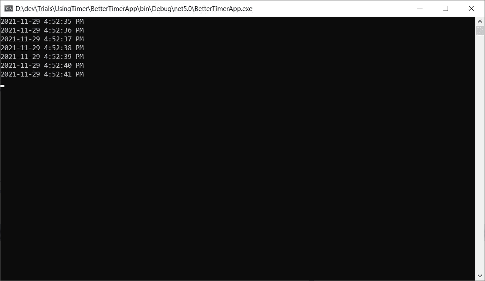
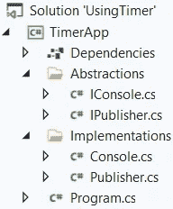
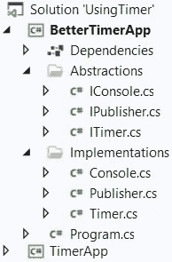
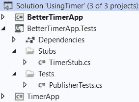
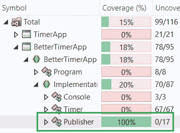

# 中使用计时器的最佳实践。NET C#

> 原文：<https://levelup.gitconnected.com/best-practice-for-using-system-timers-timer-in-net-c-867ab6b5027>

## 最佳实践

## 如何完全控制计时器，并且能够用单元测试达到 100%的覆盖率。

由 [Unsplash](https://unsplash.com/?utm_source=unsplash&utm_medium=referral&utm_content=creditCopyText) 上的[agrêBarros](https://unsplash.com/@agebarros?utm_source=unsplash&utm_medium=referral&utm_content=creditCopyText)拍摄，由 [Ahmed Tarek](https://medium.com/@eng_ahmed.tarek) 调整

使用**系统时。定时器。定时器**在你的**里。NET** **C#** 应用程序，你可能会面临抽象它和用单元测试覆盖你的模块的问题。

在本文中，我们将讨论如何克服这些挑战的**最佳实践**，最终您将能够实现 100%覆盖您的模块。

 [## 🔥订阅艾哈迈德的时事通讯🔥

### 订阅艾哈迈德的时事通讯📰直接获得最佳实践、教程、提示、技巧和许多其他很酷的东西…

medium.com](https://medium.com/subscribe/@eng_ahmed.tarek) 

# 方法

这是我们解决方案的方式:

1.  想出一个非常简单的例子。
2.  从简单的坏解开始。
3.  不断尝试增强它，直到我们达到最终格式。
4.  总结我们旅途中的经验教训。

# 这个例子

在我们的例子中，我们将构建一个简单的**控制台应用程序**，它将只做一件简单的事情，**使用一个系统。Timers.Timer** 每一秒向控制台**写入**和**的日期和时间**。

最后，您应该以此结束:

图片由[艾哈迈德·塔里克](https://medium.com/@eng_ahmed.tarek)拍摄

正如你所看到的，这是简单的要求，没有什么花哨。

由 [Mikael Seegen](https://unsplash.com/@mikael_seegen?utm_source=unsplash&utm_medium=referral&utm_content=creditCopyText) 在 [Unsplash](https://unsplash.com/?utm_source=unsplash&utm_medium=referral&utm_content=creditCopyText) 上拍摄，由 [Ahmed Tarek](https://medium.com/@eng_ahmed.tarek) 调整

# 放弃

1.  一些最佳实践可能会被忽略/放弃，以便将主要焦点转移到本文中针对的其他最佳实践上。
2.  在本文中，我们将重点介绍使用**系统的模块。带有单元测试的定时器**。然而，解决方案的其余部分不会包含在单元测试中。如果你想了解更多这方面的内容，可以查看文章 [**如何全面覆盖。NET C#控制台应用程序与单元测试**](https://itnext.io/how-to-fully-cover-net-c-console-application-with-unit-tests-446927a4a793?sk=63c75b56de78903f09f0d0116df5fe3a) 。
3.  有一些第三方库可以用来实现几乎类似的结果。然而，只要有可能，我宁愿遵循原生的简单设计，而不是依赖于一个庞大的第三方库。

由[玛利亚·特内娃](https://unsplash.com/@miteneva?utm_source=unsplash&utm_medium=referral&utm_content=creditCopyText)在 [Unsplash](https://unsplash.com/?utm_source=unsplash&utm_medium=referral&utm_content=creditCopyText) 上拍摄，由[艾哈迈德·塔雷克](https://medium.com/@eng_ahmed.tarek)调整

# 糟糕的解决方案

在这个解决方案中，我们将直接使用**系统。Timers.Timer** 没有提供抽象层。

解决方案的结构应该如下所示:

图片由[艾哈迈德·塔里克](https://medium.com/@eng_ahmed.tarek)拍摄

这是一个**使用定时器**的解决方案，只有一个**控制台定时器应用**项目。

我有意投入一些时间和精力将`System.Console`抽象成`IConsole`,以证明这不会解决我们的计时器问题。

在我们的例子中，我们只需要使用`System.Console.WriteLine`，这就是为什么这是唯一的抽象方法。

我们在`IPublisher`接口上只有两个方法；`StartPublishing`和`StopPublishing`。

现在，为了实现。

`Console`只是`System.Console`的一个薄薄的包装。

`Publisher`是`IPublisher`的简单实现。它正在使用一个`System.Timers.Timer`并且正在配置它。

它将`IConsole`定义为一个依赖项。从我的角度来看，这不是最佳做法。如果你想明白我的意思，你可以查看文章 [**什么时候不要在。NET C#**](https://betterprogramming.pub/when-not-to-use-di-ioc-and-ioc-containers-f95881d0fe0?sk=b2aa002a72db4258756feb9cf1daa2a9) 。然而，仅仅为了简单起见，我们只是将它作为一个依赖项注入到构造函数中。

我们还将计时器间隔设置为 1000 毫秒(1 秒)，并设置处理程序将计时器`SignalTime`写入控制台。

在`Program`课堂上，我们做得不多。我们只是创建了一个`Publisher`类的实例并开始发布。

运行这段代码的结果应该是这样的:

图片由[艾哈迈德·塔里克](https://medium.com/@eng_ahmed.tarek)拍摄

现在的问题是，如果你要为`Publisher`类编写一个单元测试，你能做什么？

可惜答案会是: ***不太多*** 。

首先，您没有将计时器本身作为依赖项注入。这意味着您在`Publisher`类中隐藏了依赖关系。因此，我们不能嘲笑或 stub 计时器。

其次，假设我们修改了代码，现在计时器被注入到构造函数中，问题仍然是，如何编写一个单元测试并用一个 mock 或 stub 替换计时器？

我听到有人在喊，让我们把计时器包装成一个抽象，注入它而不是计时器。

是的，没错，但是，事情没那么简单。我将在下一节解释一些技巧。

由[卡森·马斯特森](https://unsplash.com/@carsonmasterson?utm_source=unsplash&utm_medium=referral&utm_content=creditCopyText)在 [Unsplash](https://unsplash.com/?utm_source=unsplash&utm_medium=referral&utm_content=creditCopyText) 上拍摄，由[艾哈迈德·塔雷克](https://medium.com/@eng_ahmed.tarek)调整

# 好办法

这是解决问题的时候了。让我们看看我们能做些什么。

解决方案的结构应该如下所示:

图片由[艾哈迈德·塔里克](https://medium.com/@eng_ahmed.tarek)拍摄

这是相同的**使用定时器**的解决方案，带有一个新的**控制台 BetterTimerApp** 项目。

`IConsole`、`IPublisher`和`Console`将是相同的。

## 伊蒂默

我们在这里可以注意到:

1.  我们定义了新的代表`TimerIntervalElapsedEventHandler`。该代表代表由我们的`ITimer`提出的事件。
2.  你可能会说我们不需要这个新的委托，因为我们已经有了原生的`ElapsedEventHandler`，它已经被`System.Timers.Timer`使用了。
3.  是的，这是真的。然而，您会注意到`ElapsedEventHandler`事件提供了`ElapsedEventArgs`作为事件参数。这个`ElapsedEventArgs`有一个私有构造函数，你不能创建自己的实例。此外，`ElapsedEventArgs`类中定义的`SignalTime`属性是只读的。因此，您将无法在子类中重写它。
4.  有一个为微软打开的变更请求标签来更新这个类，但是直到写这篇文章的时候还没有应用任何变更。
5.  另外，请注意`ITimer`延伸了`IDisposable`。

## 出版者

除了小改动，和老款`Publisher`差不多。现在我们将`ITimer`定义为通过构造函数注入的依赖项。代码的其余部分是相同的。

## 计时器

几乎所有的奇迹都发生在这里。

我们在这里可以注意到:

1.  在内部，我们使用`System.Timers.Timer`。
2.  我们应用了 IDisposable 设计模式。所以才能看到`private bool m_IsDisposed`、`public void Dispose()`、`protected virtual void Dispose(bool disposing)`、`~Timer()`。
3.  在构造函数中，我们正在初始化一个新的`System.Timers.Timer`实例。在余下的步骤中，我们称之为**内部定时器**。
4.  对于`public bool Enabled`、`public double Interval`、`public void Start()`和`public void Stop()`，我们只是将实现委托给内部定时器。
5.  对于`public event TimerIntervalElapsedEventHandler TimerIntervalElapsed`，这是最重要的部分，所以让我们一步步来分析。
6.  我们需要对这个事件做的是，当有人从外部订阅/取消订阅它时进行处理。在这种情况下，我们希望将其镜像到内部定时器。
7.  换句话说，如果来自外部的某个人正在拥有我们的`ITimer`的一个实例，他应该能够做这样的事情`t.TimerIntervalElapsed += (sender, dateTime) => { //do something }`。
8.  此时此刻，我们应该做的是在内部做一些类似`m_Timer.Elapsed += (sender, elapsedEventArgs) => { //do something }`的事情。
9.  然而，我们需要记住，这两个处理程序并不相同，因为它们实际上是不同的类型；`TimerIntervalElapsedEventHandler`和`ElapsedEventHandler`。
10.  因此，我们需要做的是将传入的`TimerIntervalElapsedEventHandler`包装成一个新的内部`ElapsedEventHandler`。这是我们可以做到的。
11.  然而，我们还需要记住，在某些时候，有人可能需要取消处理程序对`TimerIntervalElapsedEventHandler`事件的订阅。
12.  这意味着此时，我们需要知道哪个`ElapsedEventHandler`处理程序对应于那个`TimerIntervalElapsedEventHandler`处理程序，这样我们就可以从内部定时器中取消订阅。
13.  实现这一点的唯一方法是通过在字典中跟踪每个`TimerIntervalElapsedEventHandler`处理程序和新创建的`ElapsedEventHandler`处理程序。这样，通过知道传入的`TimerIntervalElapsedEventHandler`处理程序，我们就可以知道相应的`ElapsedEventHandler`处理程序。
14.  然而，我们还需要记住，从外部来看，有人可能不止一次地订阅同一个`TimerIntervalElapsedEventHandler`处理程序。
15.  是的，这不符合逻辑，但仍然是可行的。因此，为了完整起见，对于每个`TimerIntervalElapsedEventHandler`处理程序，我们将保留一个`ElapsedEventHandler`处理程序的列表。
16.  在大多数情况下，该列表只有一个条目，除非出现重复订阅。
17.  这就是为什么你能看到这个`private Dictionary<TimerIntervalElapsedEventHandler, List<ElapsedEventHandler>> m_Handlers = new();`。

在`add`中，我们正在创建一个新的`ElapsedEventHandler`，在`m_Handlers`字典中添加一个记录，将它映射到`TimerIntervalElapsedEventHandler`，最后订阅内部计时器。

在`remove`中，我们正在获取相应的`ElapsedEventHandler`处理程序列表，选择最后一个处理程序，将其从内部定时器中取消订阅，将其从列表中删除，如果列表为空，则删除整个条目。

另外，值得一提的是,`Dispose`的实现。

我们从内部计时器中取消订阅所有剩余的处理程序，释放内部计时器，并清除`m_Handlers`字典。

## 程序

在这方面，我们仍然做得不多。它几乎与旧的解决方案相同。

运行这段代码的结果应该是这样的:

图片由[艾哈迈德·塔里克](https://medium.com/@eng_ahmed.tarek)拍摄

由 [Testalize.me](https://unsplash.com/@testalizeme?utm_source=unsplash&utm_medium=referral&utm_content=creditCopyText) 在 [Unsplash](https://unsplash.com/?utm_source=unsplash&utm_medium=referral&utm_content=creditCopyText) 上拍摄，由 [Ahmed Tarek](https://medium.com/@eng_ahmed.tarek) 调整

# **考验的时候到了，考验的时刻到了**

现在，我们有了最终的设计。然而，我们需要看看这个设计是否真的能帮助我们用单元测试覆盖我们的`Publisher`模块。

解决方案的结构应该如下所示:

图片由[艾哈迈德·塔里克](https://medium.com/@eng_ahmed.tarek)拍摄

我正在使用 **NUnit** 和 **Moq** 进行测试。你当然可以使用你喜欢的库。

## TimerStub

我们在这里可以注意到:

1.  我们定义了在记录通过计时器存根执行的操作时使用的`Action`枚举。这将在以后用于断言所执行的内部操作。
2.  此外，我们定义了用于日志记录的`ActionLog`类。
3.  我们将`TimerStub`类定义为`ITimer`的存根。我们将在测试`Publisher`模块时使用这个存根。
4.  实现很简单。值得一提的是，我们添加了一个额外的`public void TriggerTimerIntervalElapsed(DateTime dateTime)`方法，这样我们可以在单元测试中手动触发存根。
5.  我们还可以传入`dateTime`的期望值，这样我们就有了一个已知的值来断言。

## 出版商测试

现在正如你所看到的，我们有了完全的控制权，我们可以轻松地用单元测试覆盖我们的`Publisher`模块。

如果我们计算覆盖率，我们应该得到这个:

图片由 [Ahmed Tarek](https://medium.com/@eng_ahmed.tarek)

如你所见，`Publisher`模块被 100%覆盖。至于其他的，这超出了本文的范围，但是如果你按照文章 [**中的方法去做，你就可以简单地覆盖它。NET C#控制台应用程序与单元测试**](https://itnext.io/how-to-fully-cover-net-c-console-application-with-unit-tests-446927a4a793?sk=63c75b56de78903f09f0d0116df5fe3a) 。

照片由[陈京达](https://unsplash.com/@jingdachen?utm_source=unsplash&utm_medium=referral&utm_content=creditCopyText)在 [Unsplash](https://unsplash.com/?utm_source=unsplash&utm_medium=referral&utm_content=creditCopyText) 上拍摄，由 [Ahmed Tarek](https://medium.com/@eng_ahmed.tarek) 调整

# 最后的话

你能做到的。这只是将大模块分割成小模块，定义你的抽象概念，对棘手的部分进行创新，然后你就完成了。

如果你想更多地训练自己，你可以查看我关于一些最佳实践的其他文章。

# 希望这些内容对你有用。如果您想支持:

如果您还不是**媒介**会员，您可以使用 [**我的推荐链接**](https://medium.com/@eng_ahmed.tarek/membership) ，这样我就可以从**媒介**那里获得您的一部分费用，您无需支付任何额外费用。订阅 [**我的简讯**](https://medium.com/subscribe/@eng_ahmed.tarek) 将最佳实践、教程、提示、技巧和许多其他很酷的东西直接发送到您的收件箱。

# 其他资源

这些是你可能会发现有用的其他资源。

 [## 中的原型设计模式。NET C#

### 中了解原型设计模式。NET C#

levelup.gitconnected.com](/prototype-design-pattern-in-net-c-67db46c3d28f)  [## 如何全面覆盖。带有单元测试的. NET C#控制台应用程序

### 知道什么吗？又是怎么做到的？使用 TDD、DI 和 IoC 完全覆盖您的控制台应用程序。

itnext.io](https://itnext.io/how-to-fully-cover-net-c-console-application-with-unit-tests-446927a4a793)  [## 中的内存管理。网

### 中关于内存管理的所有内容。NET 和重要的相关主题。

levelup.gitconnected.com](/memory-management-in-net-740b03d01e24)  [## 编译器友好代码:在。NET C#

### Why & When Sealed 关键字可以提高。NET C#

levelup.gitconnected.com](/compiler-friendly-code-sealed-keyword-in-net-c-b363fbcd1e35) 