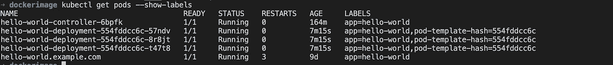

# 加速 Kubernetes 部署的最佳实践。

> 原文：<https://levelup.gitconnected.com/best-practices-for-accelerating-kubernetes-deployments-ece46ccd174c>


Jonathan Chng 在 [Unsplash](https://unsplash.com/s/photos/run?utm_source=unsplash&utm_medium=referral&utm_content=creditCopyText) 上的照片

**在本教程中，我们将了解用于加速 Kubernetes 部署的扩展单元、副本控制器和最佳实践。**

Kubernetes 部署是对吊舱理想状态的描述。您可以使用部署来推出新的应用程序或微服务，或者更新现有的应用程序或微服务。部署可以扩展副本单元的数量，以可控的方式部署更新的代码，或者在必要时回滚到早期的部署版本。

如果您的应用程序是无状态的，您可以水平扩展它。无状态应用程序意味着你的应用程序没有状态，它不写任何本地文件/保存本地会话数据。

如果你有两个 pod，其中一个要在本地写东西，那么这两个 pod 将会不同步。这意味着每个豆荚都有自己的状态，这就是为什么你不能杀死它。如果两个 pod 总是拥有相同的文件，它们就不会真正拥有自己的状态，并且对一个 pod 的请求将总是导致与从另一个 pod 发出请求相同的结果，那么这个 pod 很可能是无状态的。

*   **无状态:**你的应用程序没有**状态。它**不**写**任何本地文件/保持本地会话。
*   所有传统数据库(MYSQL、PostgreSQL)都是**有状态的。**他们的数据库文件不能在多个实例上拆分。

大多数 **web 应用**可以变成无状态的:

*   会话管理需要在容器之外完成。所以，如果你想在你的 web 应用上获得点击量，你想保存你的访问者的信息，那么你需要使用外部服务，你不能在你的容器中存储这种数据。您可以使用 Memcache、Redis 甚至数据库来存储您的会话。
*   任何需要保存的文件都不能保存在本地容器上，因为如果停止容器并重新启动，文件将会丢失。因此，您需要将任何想要存储在容器外部的文件保存在某个共享存储或外部服务(AWS)上。在 AWS 上，您可以将其保存在 S3 对象存储中。
*   那些有状态的应用程序不能横向扩展，但是你可以在一个容器中运行它们，并且纵向扩展(分配更多的 CPU/内存/磁盘)

## Kubernetes 中的缩放可以使用复制控制器来完成。

复制控制器将确保指定数量的 **pod 副本**将一直运行。例如，您可以指定五(5)个 pod 复制副本，它将运行同一个 pod，但运行 5 次。

*   用复制控制器创建的 pod 如果失败、被删除或被终止，将自动被替换。

例如，如果您告诉 Kubernetes 运行五(5)个 pod，但只有四个 pod 在运行，因为一个节点崩溃，那么 Kubernetes 将在另一个节点上启动该 pod 的另一个实例。

*   如果您只想确保 **1 pod** 始终运行，甚至在重启后，也建议**使用复制控制器**。然后，您可以只使用 **1 个副本运行复制控制器。这确保了即使当节点崩溃时，pod 也总是在运行。**

## 在下面的例子中，我们将应用程序复制了两次:

复制控制器也有一个规范。在这里，我们有 2 个副本，这是应用程序 hello world 的复制控制器，这就是为什么我们有选择器`app:helloworld`，它将选择带有`app:helloworld.`的标签

这样我们就有了一个 pod 定义的模板。pod 定义也有`metadata`我们也有标签，与您在选择器下看到的标签相同。

最后，我们有`pod specification.`,这里我们还有一个容器，名为`docker-demo`,图像和我们公开的端口`5000`

```
apiVersion: v1kind: ReplicationControllermetadata:name: hello-world-controllerspec: replicas: 2 selector: app: hello-world template: metadata: labels: app: hello-world spec: containers: - name: docker-demo image: tolatemitope/docker-demo ports: - containerPort: 5000
```

因此，复制控制器要做的是，它将运行模板中定义的 pod 两次。

*   完成文件配置后，您可以使用`kubectl create -f replicationcontroller.yaml`创建它
*   您可以使用`kubectl get replicationcontroller`确认检查您的复制控制器是否正在运行
*   通过这个，你可以看到我们是如何水平缩放 pod 的。我们有多个 pod 在运行，您也可以在它前面放置一个服务，如负载平衡器，使您的多个 pod 可以被其他软件或客户访问。如果您配置的一个 pod 崩溃，控制器将自动重新安排这些 pod。
*   如果您移除一个`pods,`，您会看到复制控制器将创建一个新的 pod。
*   您会看到 pod 已被终止，但一个新的 pod 正在创建。


*   您可以在下面看到，pod 被终止，但是一个新的 pod 被创建。从下图来看，自从我们删除了最后一个 pod 之后，又创建了一个新的 pod**43s**。


*   你总是可以缩放那些豆荚，你可以说`kubectl scale --replicas=4 -f (filename.yaml)`，你最终会看到你的控制器被缩放。
*   回到你的终端，检查你会看到它已经被创建`four pods`由于缩放操作。
*   另一种扩展方式是使用`kubectl get rc`获取复制控制器的名称，然后使用`kubectl scale --replicas=1 rc/helloworld-controller`进行扩展，然后它会再次进行扩展。
*   再次检查你的吊舱，你会看到一些已经被终止，只有其中一个正在运行。
*   正如我们前面讨论的，您可以看到，只有当您的 pod 处于无状态时，您才能进行扩展。如果您有有状态的 pod，那么您将无法做到这一点。
*   您可以使用`kubectl delete rc/helloworld-controller`删除您的`replication controller`，最后一个 pod 将被终止。
*   这些缩放操作都作为后端保存在 Kubernetes 中`etcd`，它保存所有这些设置，比如副本的数量。您并不总是需要在`yaml`文件中包含这些内容。

# Kubernetes 部署和复制集

*   **副本集**是下一代复制控制器。它支持一个新的选择器，可以根据一组**值基于过滤进行选择。**例如，对于您的复制集，环境可以是“开发”或“qa ”,您可以进行更复杂的匹配。
*   部署对象使用的是副本集，而不是复制控制器。

让我们来谈谈 Kubernetes 中的**部署**

*   部署是 Kubernetes 中的声明，允许您进行应用程序部署和更新。当使用部署对象时，您定义应用程序的**状态**。Kubernetes 将确保集群与您期望的状态相匹配。
*   仅使用**复制控制器**或**复制集**部署应用可能会**繁琐**。对于您来说，更新和回滚可能需要太多的手动工作。
*   **部署对象**更容易使用，并为您提供更多可能性。

那么这些可能性是什么:

*   **创建**部署(例如，部署应用程序)
*   **更新**部署(例如部署新版本)
*   进行**滚动更新**(零停机部署)
*   回滚到以前的版本。
*   **暂停/恢复**部署(例如，仅部署到某个百分比)

```
apiVersion: extensions/v1beta1kind: Deploymentmetadata:name: helloworld-deploymentspec: replicas: 3 template: metadata: labels: app: helloworld spec: containers: - name: docker-demo image: tolatemitope/docker-demo ports: - containerPort: 5000
```

对于我们上面的部署，我们给它起了一个名字`helloworld-deployment`和`3 replicas`。容器规范类似于我们之前用于复制集的规范。


所有副本都是最新的，并且运行我们要求它运行的最新的`docker-demo version`。

*   你也可以用`kubectl get rs`得到`replica set`


您不需要自己创建副本集，Kubernetes 会为您完成。

*   检查你的豆荚并得到它们。


*   展示您的豆荚上的标签。



*   使用`kubectl expose deployment hello-world-deployment — type=NordPort`展示您的部署


*   使用`kubectl get service`获取服务您将看到新创建的部署的服务。


*   使用`kubectl set image hello-world-deployment docker-demo=tolatemitope/docker-demo:2`设置新图像
*   使用`kubectl rollout status hello-world-deployment`获取卷展状态

## 用于 Kubernetes 部署的有用命令。

*   `kubectl get deployments` - >获取有关您当前部署的信息。
*   `kubectl get rs` - >获取关于副本集的信息。
*   `kubectl get pods --show-labels` - >拿到豆荚，还出示贴在豆荚上的标签。
*   `kubectl rollout status deployment/(name of deployment)` - >获取部署状态。
*   `kubectl set image deployment/helloworld-deployment docker-demo=docker-demo:2` - >使用新的图像标签版本 2 运行 docker-demo。
*   `kubectl edit deployment/helloworld-deployment` - >编辑部署对象。
*   `kubectl rollout status deployment/helloworld-deployment` - >获取卷展栏的状态。

如果您将映像更新到新版本，那么您可以使用卷展状态来查看部署进度。

*   `kubectl rollout history deployment/helloworld-deployment` - >获取首次展示历史。

如果您发布了一个新版本的应用程序，例如版本 3，并且您想要返回到版本 2，您可以使用:

*   `kubectl rollout undo deployment/helloworld-deployment` - >回滚到上一版本。

使用以下命令回滚到特定版本:

*   `kubectl rollout undo deployment/helloworld-deployment --to-revision=n` - >回滚到更具体的版本。

# 谢谢

喜欢阅读吗？在下面留下一些“掌声”,以便其他人可以找到这篇文章🙂