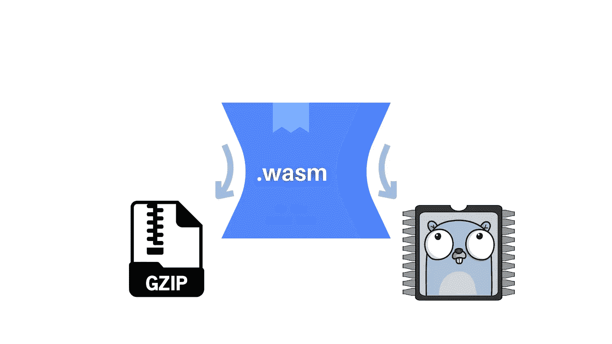

# 使用 GoLang (1.15+版)进行 WebAssembly 的最佳实践

> 原文：<https://levelup.gitconnected.com/best-practices-for-webassembly-using-golang-1-15-8dfa439827b8>

## 减小二进制文件的大小



与 [Canva](https://www.canva.com/) 合影。

[在我的上一篇文章](https://cesarwilliam.medium.com/how-to-run-golang-1-15-code-in-a-browser-using-webassembly-e755bc733e8d)中，我展示了如何通过 GoLang 配置、开发和生成 WASM 文件。在这篇文章中，我将向你展示**最佳实践**以及如何在一个真实的**现代网络项目**中使用这些策略。

# 为什么要减小二进制文件的大小

如果您已经使用 Go 生成了一个 web assembly 二进制文件，您可能已经注意到文件有多大了。当我们在网页上加载这个二进制文件时，它会影响页面上其他资源的加载。它也能影响交互时间(TTI)。TTI 测量了一个页面完全交互需要多长时间。较长的 TTI 会给用户带来令人沮丧的体验，比如，网站看起来已经准备好了，但当用户试图与之交互时，却什么也没发生。

我将向您展示两种生成较小二进制文件的策略。第一种(大多数情况下推荐)是使用 [gzip](https://www.gzip.org/) ，另一种是使用名为 [TinyGo](https://tinygo.org/) 的编译器。

# **使用 gzip(推荐)**

Gzip 是一种文件格式和软件应用程序，在 Unix 和类似 Unix 的系统上使用，用于在将 HTTP 内容提供给客户端之前对其进行压缩。我们将在编译 Go 文件后使用`gzip`命令。

我们将使用这个 Go 文件([来自我的上一篇文章](https://cesarwilliam.medium.com/how-to-run-golang-1-15-code-in-a-browser-using-webassembly-e755bc733e8d))作为例子:

## 编译我们的围棋代码

在我们全力以赴进行 gzip 压缩之前，我们可以做一些事情来使二进制文件变得更小:剥离它们。

我们可以**使用** [**-s 和-w 链接器标志**](https://golang.org/cmd/link/) 来剥离调试信息，如下所示:

```
GOOS=js GOARCH=wasm go build -ldflags="-s -w" -o main.wasm
```

在这个策略中，我们将使用我在上一篇关于 WebAssembly 的文章中生成的相同的 Wasm JavaScript 加载器:

```
$ cp “$(go env GOROOT)/misc/wasm/wasm_exec.js” .
```

## 压缩 Wasm 文件

为了 *gzip* 我们编译的文件`main.wasm`，我们将使用以下命令:

```
gzip -9 -v -c main.wasm > main.wasm.gz
```

## 创建 HTML 文件

为了在 HTML 文档中使用压缩的二进制文件，我们必须对 gzip 压缩文件进行解压缩(或 *ungzip* )。为此，我们可以使用 [Pako JS 库](https://github.com/nodeca/pako)，然后像往常一样实例化我们的 Go 程序。首先，我们将从 CDN 导入 Pako 库，然后使用`ungzip`函数来扩展我们的文件。

下面是一个完整的 HTML 文件的例子，它使用了 Wasm(编译自我们在上一篇文章中创建的 Go 文件),由 gzip 压缩:

# 使用 TinyGo

TinyGo 是一个为小地方开发的 Go 编译器。TinyGo 并不打算编译任何可能的围棋程序。编译器无需修改就能编译大多数 Go 程序。[支持的大多数语言特性](https://tinygo.org/lang-support/)，包括:*切片*、*接口*、*闭包*和*绑定方法*。

> TinyGo 是一个用于小地方的 Go 编译器。它重用了 [Go 语言工具](https://golang.org/pkg/go/)和 [LLVM](http://llvm.org/) 使用的库，提供了一种编译用 Go 编程语言编写的程序的替代方法。

## **安装 TinyGo**

上面的命令将使用 *brew* 在 macOS 上安装 TinyGo。在这里你可以找到 [Linux](https://tinygo.org/getting-started/linux) 、 [macOS](https://tinygo.org/getting-started/macos) 、 [Windows](https://tinygo.org/getting-started/windows) 和 [Docker](https://tinygo.org/getting-started/using-docker) 的使用说明。

```
$ brew tap tinygo-org/tools
$ brew install tinygo
```

## **生成 Wasm JavaScript 加载程序**

在我的上一篇文章中，我向你展示了当你使用默认的 Go 编译器时，如何生成 Wasm JavaScript loader。当您使用 TinyGo 时，您必须以这种方式生成加载程序:

```
cp $(tinygo env TINYGOROOT)/targets/wasm_exec.js .
```

## **编译您的 Go 代码**

```
tinygo build -o main.wasm -target wasm ./main.go
```

现在你可以像我们在我的上一篇文章中所做的那样，在你的 HTML 中加载`main.wasm`。

# 结论

在这篇文章中，我们学习了如何减少 Wasm 二进制文件来改善我们的应用程序的页面。我们看到了两种策略，应该根据您在 Go 程序中使用的功能来选择。下一次，我将向您展示如何通过 Webpack 在 React 应用程序中使用 Web 程序集文件。