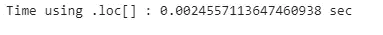
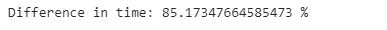

# 作为数据科学家高效使用熊猫的最佳实践

> 原文：<https://levelup.gitconnected.com/best-practices-to-use-pandas-efficiently-as-a-data-scientist-9198b3e7bb6d>

## 作为一个数据科学家如何高效利用熊猫？

作为一名数据科学家，使用正确的工具和技术来充分利用数据是非常重要的。Pandas 库是一个非常棒的数据操作、分析和可视化工具，也是任何数据科学家工具箱中必不可少的一部分。然而，有效地使用熊猫是一个挑战，这会导致时间和精力的浪费。幸运的是，有一些最佳实践可以帮助数据科学家充分利用他们的熊猫体验。从使用矢量化操作到利用内置函数，这些最佳实践将帮助数据科学家使用 Pandas 快速准确地分析和可视化数据。了解并应用这些最佳实践将有助于数据科学家提高工作效率和准确性，从而更快地做出更好的决策。

由[希德·巴拉钱德朗](https://unsplash.com/@itookthose?utm_source=medium&utm_medium=referral)在 [Unsplash](https://unsplash.com?utm_source=medium&utm_medium=referral) 上拍摄的照片

## 目录:

1.  为什么我们需要高效的编码？
2.  有效选择和替换值
    2.1。有效地选择行&列。iloc[] &。loc[]
    2.2。有效替换数据帧中的值
    2.3。选择和替换值的最佳实践摘要
3.  通过 Pandas DataFrame
    3.1 进行有效迭代。使用有效地循环。iterrows()
    3.2。使用有效循环。3.3 应用()
    。使用矢量化
    3.4 有效循环。循环遍历数据帧的最佳实践摘要
4.  使用有效地转换数据。groupby()
    4.1。与一起使用的常用函数。groupby()
    4.2。缺失值插补使用。groupby() &。4.3 转换()
    。使用进行数据过滤。groupby() &。过滤器()
5.  最佳实践总结

## 您可以在 GitHub 知识库中找到本文中使用的代码和数据集:

 [## GitHub-youssefHosni/面向数据科学家的高级 Python

### 此时您不能执行该操作。您已使用另一个标签页或窗口登录。您已在另一个选项卡中注销，或者…

github.com](https://github.com/youssefHosni/Advanced-Python-for-Data-Scientists) 

在本文中，我们将使用三个数据集:

*   [**扑克牌游戏数据集**](https://github.com/youssefHosni/Advanced-Python-for-Data-Scientists/blob/main/Datasets/poker_hand.csv)
*   [**流行宝宝名字**](https://github.com/youssefHosni/Advanced-Python-for-Data-Scientists/blob/main/Datasets/Popular_Baby_Names.csv)
*   [**餐厅数据集**](https://github.com/youssefHosni/Advanced-Python-for-Data-Scientists/blob/main/Datasets/restaurant_data.csv)

第一个数据集是 [**扑克牌游戏数据集**](https://github.com/youssefHosni/Advanced-Python-for-Data-Scientists/blob/main/Datasets/poker_hand.csv) ，如下所示。

在每一轮扑克游戏中，每个玩家手里都有五张牌，每张牌都有其符号和等级，符号可以是红心、方块、梅花或黑桃，等级从 1 到 13 不等。该数据集由一个人可能拥有的五张卡的所有可能组合组成。

*   Sn:第 n 张牌的符号，其中:1(红心)，2(方块)，3(梅花)，4(黑桃)
*   Rn:第 n 张牌的等级，其中:1(王牌)，2–10，11(杰克)，12(王后)，13(国王)

我们将使用的第二个数据集是 [**流行的婴儿名字**](https://github.com/youssefHosni/Advanced-Python-for-Data-Scientists/blob/main/Datasets/Popular_Baby_Names.csv) 数据集，其中包括 2011 年至 2016 年间最流行的新生儿名字。数据集已加载，如下所示:

该数据集包括按年份、性别和种族划分的美国最受欢迎的名字等信息。例如，2011 年，克洛伊这个名字在所有亚裔和太平洋岛民的新生儿中排名第二。

我们将使用的第三个数据集是 [**餐馆数据集**](https://github.com/youssefHosni/Advanced-Python-for-Data-Scientists/blob/main/Datasets/restaurant_data.csv) 。这个数据集是在餐馆吃饭的人的集合。数据集已加载，如下所示:

对于每个顾客，我们有各种各样的特征，包括支付的总金额，留给服务员的小费，星期几，一天中的时间。

如果你想免费学习数据科学和机器学习，看看这些资源:

*   免费互动路线图，自学数据科学和机器学习。从这里开始:[https://aigents.co/learn/roadmaps/intro](https://aigents.co/learn/roadmaps/intro)
*   数据科学学习资源搜索引擎(免费)。将你最喜欢的资源加入书签，将文章标记为完整，并添加学习笔记。[https://aigents.co/learn](https://aigents.co/learn)
*   想要在导师和学习社区的支持下从头开始学习数据科学吗？免费加入这个学习圈:[https://community.aigents.co/spaces/9010170/](https://community.aigents.co/spaces/9010170/)

**如果你想在数据科学&人工智能领域开始职业生涯，但不知道如何开始。我提供数据科学指导课程和长期职业指导:**

*   长期师徒:【https://lnkd.in/dtdUYBrM】T4
*   辅导课程:[https://lnkd.in/dXeg3KPW](https://lnkd.in/dXeg3KPW)

***加入*** [***中等会员***](https://youssefraafat57.medium.com/membership) ***计划继续无限制学习。如果你使用下面的链接，我会收到一小部分会员费，不需要你额外付费。***

 [## 加入我的介绍链接媒体-优素福胡斯尼

### 阅读 Youssef Hosni(以及媒体上成千上万的其他作家)的每一个故事。您的会员费直接支持…

youssefraafat57.medium.com](https://youssefraafat57.medium.com/membership) 

# 1.为什么我们需要高效的编码？

高效代码是指执行速度更快、计算内存更少的代码。在本文中，我们将使用 **time()** 函数来测量计算时间。这个函数测量当前时间，所以我们将在代码执行前和执行后把它赋给一个变量，然后计算差值，就知道代码的计算时间。下面的代码显示了一个简单的例子:

让我们看一些应用高效代码方法将如何提高代码运行时间和降低计算时间复杂性的例子:我们将计算从零到一百万的每个数字的平方。首先，我们将使用 list comprehension 来执行这个操作，然后使用 for 循环重复相同的过程。

第一次使用列表理解:

现在我们将使用 for 循环来执行相同的操作:

我们可以看到它们之间有很大的差异，我们可以用百分比来计算它们之间的差异:

这里有另一个例子来展示编写高效代码的效果。我们想计算从 1 到 100 万的所有连续数字的总和。有两种方法第一种是使用蛮力，我们将一个接一个地增加到一百万。

另一个更有效的方法是用公式来计算。当我们想计算从 1 到一个数的所有整数的和时，比如说 N，我们可以把 N 乘以 N+1，然后除以 2，这样就会得到我们想要的结果。这个问题实际上在 19 世纪就交给了德国的一些学生，一个名叫卡尔-弗里德里希·高斯的聪明学生设计了这个公式来在几秒钟内解决这个问题。

运行这两种方法后，我们实现了超过 160，000%的巨大改进，这清楚地表明了为什么我们需要高效和优化的代码，即使对于简单的任务也是如此。

# 2.有效选择和替换价值

让我们首先从两个最常见的任务开始，这两个任务是您通常会在数据框架上执行的，尤其是在数据科学项目的数据操作阶段。这两项任务是有效地选择特定和随机的行和列，以及使用 **replace()** 函数使用列表和字典替换一个或多个值

## 2.1.使用有效地选择行和列。iloc[] &。位置[]

在这一小节中，我们将介绍如何使用**从数据帧中有效地定位和选择行。iloc[]** & **。loc[]** 熊猫功能。我们将使用 **iloc[]** 作为索引号定位器，使用 **loc[]** 作为索引名定位器。

在下面的例子中，我们将选择扑克数据集的前 500 行。首先使用**。loc[]** 功能，然后通过使用**。iloc[]** 功能。

虽然这两种方法具有相同的语法，但是 **iloc[]** 的执行速度比 **loc[]** 快近 70%。**。iloc[]函数**利用了已经排序的索引的顺序，因此速度更快。

我们还可以用它们来选择列，而不仅仅是行。在下一个示例中，我们将使用两种方法选择前三列。

我们还可以看到，使用 **iloc[]** 的列索引仍然快了 80%。所以最好使用 **iloc[]** ，因为这样更快，除非使用 **loc[]** 更容易按名称选择某些列。

## 2.2.有效替换数据帧中的值

替换数据帧中的值是一项非常重要的任务，尤其是在数据清理阶段。因为您必须保持代表相同对象的所有值不变。

让我们来看看我们之前加载的流行婴儿名字数据集:

让我们仔细看看性别特征，看看它们的独特价值:

我们可以看到，女性用大写和小写两个值来表示。这在真实数据中很常见，一种简单的方法是用一个值替换另一个值，以使其在整个数据集中保持一致。有两种方法可以做到这一点第一种是简单地定义我们想要替换的值，然后我们想要用什么来替换它们。这显示在下面的代码中:

第二种方法是使用熊猫的内置功能**。replace()** 如下面的代码所示:

我们可以看到，内置函数**的时间复杂度比使用**快 157%** 。loc()** 方法找到行和列的索引值并替换它。

我们也可以使用列表替换多个值。我们的目标是将所有被归类为白人**非西班牙裔**或**白人非 HISP 裔**的种族改为 **WNH 裔**。使用**。loc[]** 函数，我们将使用‘or’语句(在 Python 中用管道符号表示)定位我们正在寻找的种族的婴儿。然后我们将分配新的值。和往常一样，我们也测量这个操作所需的 CPU 时间。

我们也可以使用**进行同样的操作。replace()** 熊猫内置函数如下:

使用**我们可以再次看到这一点。replace()** 方法比使用**要快得多。loc[]** 方法。为了更直观地了解速度有多快，让我们运行下面的代码:

的。replace()方法比使用**的**快 87%。loc[] 方法。如果你的数据很大，需要大量清理，这个技巧将减少数据清理的计算时间，使你的熊猫代码更快，因此更有效。

最后，我们还可以使用**字典**来替换数据帧中的单值和多值。如果您想在一个命令中使用多个替换功能，这将非常有用。

我们将使用字典将每个男性的性别替换为男孩，将每个女性的性别替换为女孩。

我们可以对列表做同样的事情，但是会更加冗长。如果我们比较这两种方法，我们可以看到字典运行大约快 22%。一般来说，与列表相比，在 Python 中使用字典是非常高效的:浏览列表需要传递列表中的每个元素，而查看字典则直接指向与条目匹配的键。这种比较有点不公平，因为两种结构服务于不同的目的。

使用**字典**允许你替换几个不同列上的相同值。在前面的所有示例中，我们指定了要替换的值来自的列。我们现在要用一个公共值替换同一列中的几个值。我们想把所有种族分为三大类:黑人、亚洲人和白人。语法也非常简单。我们在这里使用嵌套字典:外键是我们想要替换值的列。这个外键的值是另一个字典，其中的键是要替换的种族，以及新的种族(黑人、亚洲人或白人)的值。

## 2.3.选择和替换值的最佳实践摘要

*   使用可以更快地选择行和列。 **iloc[]** 功能。所以最好使用，除非使用**更容易或更方便。而且速度不是重点或者你只是做一次。**
*   使用内置的 **replace()** 函数比仅仅使用传统方法要快得多。
*   使用 python 字典替换多个值比使用列表更快。

# 3.有效地遍历熊猫数据框架

作为一名数据科学家，您将需要广泛地迭代您的数据框架，尤其是在数据准备和探索阶段，因此能够高效地完成这项工作非常重要，因为这将为您节省大量时间，并为更重要的工作留出空间。我们将通过三种方法让您的循环更快、更有效:

*   使用**循环。iterrows()** 函数
*   使用**循环。apply()** 函数
*   …向量化…

## 3.1.使用**有效循环。iterrows()**

在我们谈论如何使用**之前。iterrows()** 函数为了改善循环过程，让我们刷新一下生成器函数的概念。

**生成器**是创建迭代器的简单工具。在生成器主体内部，您将发现只有 **yield()** 语句，而不是 return 语句。可以只有一个，也可以有几个 **yield()** 语句。在这里，我们可以看到一个生成器， **city_name_generator()** ，它生成四个城市名。为简单起见，我们将生成器分配给变量 **city_names** 。

为了访问生成器生成的元素，我们可以使用 Python 的 **next()** 函数。每次使用 **next()** 命令时，生成器将生成下一个要生成的值，直到不再有要生成的值。我们这里有 4 个城市。让我们运行下一个命令四次，看看它会返回什么:

正如我们可以看到的，每次我们运行 **next()** 函数，它都会打印一个新的城市名。

让我们回到。 **iterrows()** 函数。**。iterrows()** 函数是每个熊猫 DataFrame 的属性。当被调用时，它产生一个包含两个元素的列表。我们将使用这个生成器来遍历我们的**扑克**数据帧的每一行。第一个元素是该行的索引，而第二个元素包含该行每个特征的熊猫系列:五张卡片中每张卡片的符号和等级。它非常类似于 **enumerate()** 函数的概念，当应用于列表时，返回每个元素及其索引。

遍历 Pandas 数据帧最直观的方法是使用 **range()** 函数，这通常被称为粗循环。下面的代码显示了这一点:

迭代熊猫数据框架的一个更聪明的方法是使用**。iterrows()** 函数，该函数针对此任务进行了优化。我们简单地用两个迭代器定义了“ **for** ”循环，一个用于每行的编号，另一个用于所有的值。

在循环内部， **next()** 命令指示循环移动到迭代器的下一个值，而不实际做任何事情。

比较这两个计算时间我们还可以注意到**的使用。iterrows()** 没有提高遍历 pandas 数据帧的速度。当我们需要一种更简洁的方式来使用每一行的值时，它是非常有用的。

## 3.2.使用**有效循环。apply()**

现在我们将使用**。apply()** 函数能够在遍历熊猫数据帧时执行特定的任务。**。apply()** 函数确实如它所说的那样；它对整个数据帧应用另一个函数。

**的语法。apply()** 函数很简单:我们创建一个映射，在本例中使用 lambda 函数，然后声明我们想要应用于每个单元格的函数。这里，我们将平方根函数应用于数据帧的每个单元格。就速度而言，它与在整个数据帧上只使用 NumPy **sqrt()** 函数的速度相当。

这是一个简单的例子，因为我们想将这个函数应用于数据帧。

但是，当目标函数接受多个单元格作为输入时，会发生什么情况呢？例如，如果我们想计算每手牌中所有牌的排名之和，该怎么办？在这种情况下，我们将使用。apply()函数和我们之前做的一样，但是我们需要在行尾添加 **'axis=1'** 来指定我们正在将函数应用到每一行。

然后，我们将使用**。iterrows()** 函数我们以前见过，并比较它们的效率。

使用**。apply()** 函数明显比**快。iterrows()** 函数，幅度约为 400 %,这是一个巨大的改进！

正如我们对行所做的那样，我们可以对列做完全相同的事情；对每列应用一个函数。通过将**轴=1** 替换为**轴=0** ，我们可以对每一列应用求和函数。

通过比较。 **apply()** 函数用原生熊猫的函数对多行求和，我们可以看到熊猫的原生**。sum()** 函数执行相同操作的速度更快。

**总之，我们观察到。当我们想要遍历 pandas 数据帧的所有行时，apply()函数执行得更快，但是当我们通过一列执行相同的操作时，它执行得更慢。**

## 3.3.使用矢量化有效循环

为了理解如何减少函数执行的迭代次数，回想一下 Pandas 的基本单元 DataFrames 和 Series 都是基于数组的。当对整个数组执行操作时，Pandas 的执行效率比对每个值单独或顺序执行更高。这可以通过**矢量化**来实现。**矢量化**是对整个数组执行操作的过程。

在下面的代码中，我们要计算每手牌中所有牌的等级之和。为此，我们对扑克数据集进行切片，只保留包含每张牌的等级的列。然后，我们称之为内置**。DataFrame 的 sum()** 属性，使用参数 axis = 1 来表示我们需要每行的总和。最后，我们打印前五行数据的总和。

我们之前看到了各种方法，这些方法执行应用于数据帧的函数比简单地遍历数据帧的所有行要快。我们的目标是找到执行这项任务的最有效的方法。

*   使用**。iterrows()** 循环遍历数据帧:

*   使用。apply()方法

使用**矢量化**和**比较每手牌中所有牌的等级相加所需的时间。iterrows()** 函数，以及**。apply()** 函数，我们可以看到矢量化方法的性能要好得多。

我们还可以使用另一种矢量化方法来有效地遍历数据帧，该方法使用 Numpy 数组对数据帧进行矢量化。

NumPy 库将自己定义为“Python 中科学计算的基础包”，它在优化的预编译 C 代码中执行操作。与 pandas 处理数组类似，NumPy 对名为 **ndarrays** 的数组进行操作。Series 和 ndarrays 之间的一个主要区别是 ndarrays 省略了许多操作，如索引、数据类型检查等。因此，在 NumPy 阵列上的操作比在 pandas 系列上的操作要快得多。当 pandas 系列提供的附加功能不重要时，NumPy 阵列可以用来代替 pandas 系列。

对于我们在本文中探索的问题，我们可以使用 NumPy ndarrays 来代替 pandas 系列。关键的问题是这是否会更有效率。

同样，我们将计算每手牌中所有牌的等级总和。我们简单地通过使用**将我们的 rank 数组从 pandas 系列转换成 NumPy 数组。熊猫系列的 values** 方法，该方法将熊猫系列作为 NumPy **ndarray** 返回。与对序列进行矢量化一样，将 NumPy 数组直接传递给函数将导致 pandas 将函数应用于整个矢量。

在这一点上，我们可以看到对 pandas 系列的矢量化实现了日常计算的绝大多数优化需求。然而，如果速度是最重要的，我们可以通过 **NumPy** Python 库的形式来寻求帮助。与之前最先进的 panda 优化方法相比，我们仍然在运行时间上有所改进。

## **3.4。**循环遍历数据帧的最佳实践总结

*   使用。 **iterrows()** 没有提高遍历数据帧的速度，但效率更高。
*   **。当我们想要遍历熊猫数据帧的所有行时，apply()** 函数执行得更快，但是当我们通过一列执行相同的操作时，执行得更慢。
*   对 pandas 系列进行矢量化处理可以满足日常计算的绝大多数优化需求。然而，如果速度是最重要的，我们可以以 **NumPy** Python 库的形式调用增援。

# 4.使用**有效转换数据。groupby()**

在文章的最后一部分，我们将介绍如何使用**。groupby()** 根据特定特性的值有效地对数据帧的条目进行分组。**。groupby()** 方法应用于数据帧，并根据特征对其进行分组。然后，我们可以对分组的对象应用一些简单或更复杂的函数。对于每个处理表格或结构化数据的数据科学家来说，这是一个非常重要的工具，因为它将帮助您以更有效的方式轻松操作数据。

## 4.1.与一起使用的常用函数。groupby()

应用于聚合组的最简单方法之一是**。计数()。**在下面的例子中，我们将把它应用于餐馆数据集。首先，我们根据顾客是否吸烟对餐馆数据进行分组。然后，我们应用**。**计数()方法。我们获得了吸烟者和不吸烟者的人数。

毫不奇怪，我们对所有特性都得到了与**相同的结果。count()** 方法统计每组在每个特征中出现的次数。因为我们的数据中没有缺失值，所以所有列中的结果应该是相同的。

根据特定特性的值对数据帧的条目进行分组后，我们可以应用我们感兴趣的任何类型的**变换**。这里，我们将应用 z 得分，这是一种归一化变换，即每个值与平均值之间的距离除以标准差。这是统计学中非常有用的变换，通常在标准化测试中与 z 测试一起使用。要将这种转换应用于分组对象，我们只需调用。transform()方法包含我们定义的 lambda 转换。

这次，我们将根据**餐**的类型分组:是晚餐还是午餐？由于 z 得分转换是与组相关的转换，因此生成的表只是原始表。对于每个元素，我们减去平均值，然后除以它所属组的标准偏差。我们还可以看到，数值变换只应用于数据帧的数值特征。

虽然 **transform()** 方法大大简化了事情，但它真的比使用原生 Python 代码更有效吗？正如我们之前所做的，我们首先对数据进行分组，这次是根据性别。然后，我们应用之前应用的 z 分数变换，测量其效率。我们在这里省略了测量每个操作时间的代码，因为您对此已经很熟悉了。我们可以看到，通过使用 transform()函数，我们实现了巨大的速度提升。除此之外，我们只使用一行代码来执行感兴趣的操作。

## 4.2.缺失值插补使用。groupby() &。转换()

既然我们已经看到了为什么以及如何在一个分组的熊猫对象上使用 **transform()** 函数，我们将处理一个非常具体的任务，即输入缺失值。

在我们实际了解如何使用**变换()**函数进行缺失值插补之前，我们将了解每组中我们感兴趣的变量中有多少缺失值。我们可以在下面看到每个“**时间”**特征的数据点数，它们是 176+68 = 244。

接下来，我们将创建一个 **restaurant_nan** 数据集，其中使用下面的代码将 10%随机观察的总账单设置为 **NaN** :

现在，让我们打印每个“**时间”**特征中的数据点数，我们可以看到它们现在是 155+62 = 217。由于我们拥有的总数据点是 244 个，那么丢失的数据点是 24 个，相当于 10%。

在统计了数据中缺失值的数量后，我们将展示如何用特定于组的函数来填充这些缺失值。最常见的选择是均值和中位数，选择与数据的偏斜度有关。正如我们之前所做的，我们使用 **fillna** ()函数定义了一个 **lambda** 转换，用它的组平均值替换每个缺失值。和以前一样，我们根据用餐时间对数据进行分组，然后通过应用预定义的转换来替换缺失的值。

正如我们所看到的，索引 0 和索引 4 处的观察值完全相同，这意味着它们的缺失值已被它们组的均值所取代。

此外，我们可以看到使用这种方法的计算时间是 0.007 秒。

让我们将其与传统方法进行比较:

我们可以看到使用**。transform()** 应用于分组对象的函数比执行此任务的原生 Python 代码执行速度更快。

## 4.3.使用进行数据过滤。groupby() &。过滤器()

现在我们将讨论如何在一个分组的熊猫对象上使用 **filter()** 函数。这允许我们根据一些特定的条件，只包括这些组的一个子集。

通常，在根据特定特征对数据帧的条目进行分组之后，我们感兴趣的是基于某些条件只包括那些组的子集。过滤条件的一些示例包括缺失值的数量、特定要素的平均值或组在数据集中的出现次数。

我们感兴趣的是在支付给服务员的平均金额超过 20 美元的日子里，找到给小费的平均金额。**。filter()** 函数接受对每个组的数据帧进行操作的**λ**函数。在本例中，lambda 函数选择“total_bill”并检查 **mean()** 是否大于 20。如果 lambda 函数返回真，则计算小费**平均值()**。如果我们比较提示的总平均值，我们可以看到两个值之间存在差异，这意味着过滤正确执行。

如果我们试图在不使用 **groupby()** 的情况下执行这个操作，我们最终会得到这个低效的代码。首先，我们使用 list comprehension 来提取数据帧中涉及平均膳食超过 20 美元的日期的条目，然后使用 for 循环将它们添加到一个列表中并计算平均值。这可能看起来非常直观，但正如我们所见，这也是非常低效的。

# 5.最佳实践总结

*   使用可以更快地选择行和列。 **iloc[]** 功能。所以除非更容易或者更方便使用**否则还是用起来比较好。而且速度不是重点或者你只是做一次。**
*   使用内置的 **replace()** 函数比仅仅使用传统方法要快得多。
*   使用 python 字典替换多个值比使用列表更快。
*   使用。 **iterrows()** 没有提高遍历数据帧的速度，但效率更高。
*   **。当我们想要遍历熊猫数据帧的所有行时，apply()** 函数执行得更快，但是当我们通过一列执行相同的操作时，执行得更慢。
*   对 pandas 系列进行矢量化处理可以满足日常计算的绝大多数优化需求。然而，如果速度是最重要的，我们可以通过 **NumPy** Python 库的形式来寻求帮助。
*   使用**。groupby()** 根据某个特征将其分组，然后使用其他函数将其应用于数据，比使用常规编码方法要快得多。

***感谢阅读！如果你喜欢这篇文章，请务必:***

*   **👏为这个故事鼓掌(50 次)并跟我来👉**
*   **📰查看我的媒体档案中的更多内容**
*   **🔔关注我:**[**LinkedIn**](https://www.linkedin.com/in/youssef-hosni-b2960b135/)**|**[**Medium**](https://medium.com/@youssefraafat57)**|**[**Twitter**](https://twitter.com/Youssef70125494)**|**[**GitHub**](https://github.com/youssefHosni)
*   *🚀👉* ***加入*** [***中等会员***](https://youssefraafat57.medium.com/membership) ***计划继续无限制学习。如果你使用下面的链接，我会收到一小部分会员费，不需要你额外付费。***

 [## 加入我的介绍链接媒体-优素福胡斯尼

### 阅读 Youssef Hosni(以及媒体上成千上万的其他作家)的每一个故事。您的会员费直接支持…

youssefraafat57.medium.com](https://youssefraafat57.medium.com/membership)