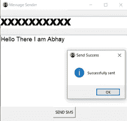
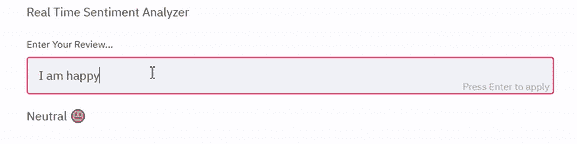

# 每个初学者都应该尝试的最佳 Python 项目的源代码

> 原文：<https://levelup.gitconnected.com/best-python-projects-every-beginner-should-try-with-source-code-fdb60f8e4c6f>

照片由[按下](https://www.freepik.com/pressfoto)上的 [Freepik](http://freepik.com/)

## Python 项目，开发，Python 初学者

## 帮助您建立坚实基础的项目

Python 是一种解释型高级通用编程语言。它有简单易学的语法，支持几乎所有编程的基本概念。作为一种通用语言，它在编程初学者中非常有名。

根据一项调查，大多数初学者更喜欢将 python 作为他们的第一语言。还有一项令人沮丧的调查显示，100 名学习者中只有 30–40%成为成功的 python 开发者。这些数字背后的原因是教程陷阱。

教程陷阱只不过是在没有任何实际知识的情况下遵循教程的循环。初学者不明白，学习一门编程语言最好的方法就是用它来构建项目。在这个博客中，我将分享一些我亲手挑选的最好的 Python 项目，每个初学者都应该尝试使用源代码。如果你不是初学者，你仍然可以尝试这些来更新你的技能。

# 1.带我去冒险

𝗗𝗶𝗳𝗳𝗶𝗰𝘂𝗹𝘁𝘆 — 𝗕𝗲𝗴𝗶𝗻𝗻𝗲𝗿 𝗟𝗲𝘃𝗲𝗹 𝗜

这个项目是我最喜欢的项目之一，很容易开发。它非常适合初学者，需要一点编程知识。这里的任务是创建一个程序，通过选择不同的路径或选项，带领用户进行一次惊人的冒险。

有多种场景你可以考虑，比如穿过丛林，你的武器丢失了，现在你必须生存 48 小时，直到任何帮助来了，或者一个测验和奖励为基础的冒险，在每一站都会有一个测验，如果你回答正确，你会得到奖励。这款游戏可以为开发者和玩家增加压力。

初学者必须尝试构建这个项目，以打开他们的动手代码，增加他们的思维能力。只需要一点点努力、时间和创新思维，谁知道你会想出下一个简单却非常好玩的大游戏。

您可以利用 python 基础知识、随机模块、字符串连接、循环和条件来构建这个项目。

下面是一个让你开始的基本程序—

这是另一个你可以参考的例子，作者是 [*德里克·席德*](https://www.derekshidler.com/how-to-create-a-text-based-adventure-and-quiz-game-in-python/) 。

## 膨胀

你的任务是尽可能地增加游戏。试着把多个故事结合起来，创造一个有趣的故事。比如，你正在穿越一片丛林，突然发现一包意大利面。

# 2.猜猜ᴴᵃⁿᵍᵐᵃⁿ这个词

𝗗𝗶𝗳𝗳𝗶𝗰𝘂𝗹𝘁𝘆 — 𝗕𝗲𝗴𝗶𝗻𝗻𝗲𝗿 𝗟𝗲𝘃𝗲𝗹 𝗜

根据维基百科，Hangman 是两个或更多玩家的猜谜游戏。一名玩家想到一个单词、短语或句子，另一名玩家通过在一定的猜测次数内建议字母来猜测。

这是一个既能建造又能玩的令人惊奇的游戏。我小时候玩过好几年。您可以在 python 条件、循环和随机模块的帮助下构建这个游戏。

创建一个秘密单词列表，并随机选择一个单词。现在将每个单词表示为`_`，如果用户猜对了，给用户猜单词的机会，然后用单词替换`_`。如果用户猜错了单词，则减少剩余猜测次数，并再次运行循环进行下一次猜测。

下面是该项目的源代码，在复制它之前，尝试自己构建它。

刽子手游戏代码由作者

## 膨胀

你可以尝试添加更多的密语。此外，尝试在 10 秒或更短的时间内显示所有的秘密单词，然后从终端中删除它们，并开始游戏。这样你的用户就能知道让游戏更有趣的单词了。或者你可以给每个单词添加一个小故事来帮助用户猜测，例如，medium words story 可以是一个著名的博客平台。

# 3.自动发送电子邮件

𝗗𝗶𝗳𝗳𝗶𝗰𝘂𝗹𝘁𝘆 — 𝗕𝗲𝗴𝗶𝗻𝗻𝗲𝗿 𝗟𝗲𝘃𝗲𝗹 𝗜

电子邮件是一种通过互联网交换信息和文件的方法。Gmail 是谷歌创建的最广泛、最常用的电子邮件发送平台。

这个自动化脚本将让您使用 python 发送电子邮件。它借助带有 smtplib 模块的电子邮件库在 python 和 Gmail 服务器之间建立连接。

下面是使用 python 发送简单电子邮件的代码—

## 膨胀

您可以扩展脚本来发送批量电子邮件、带文件的电子邮件和自定义 HTML 电子邮件。

# **4*。使用 GUI* 发送短信**

𝗗𝗶𝗳𝗳𝗶𝗰𝘂𝗹𝘁𝘆 — 𝗕𝗲𝗴𝗶𝗻𝗻𝗲𝗿 𝗟𝗲𝘃𝗲𝗹 𝗜𝗜

GUI 代表图形用户界面，这意味着为用户提供一个合适的图形界面，通过它他们可以访问你的应用程序。

在这个项目中，你的任务是建立一个 GUI，它可以在 API 的帮助下向不同的号码发送短信。这个项目的输入是接收者的电话号码和要发送的消息。

有很多免费的 API，像 Twillo，fast2sms 等，提供免费的短信服务。选择一个，去他们的文档，找到你的 API 密匙，尝试发送短信。一旦成功，连接你的脚本与图形用户界面。

下面是使用 fast2sms API 发送 SMS 的代码。

由[作者](https://medium.com/pythoneers/5-python-intermediate-project-that-everyone-should-build-with-codes-5039f13feadb#:~:text=2.%20Message%20Sender-,GUI,-%E2%80%9CImage%20By%20Author)编写的 SMS GUI 代码

上述代码的输出示例

## 膨胀

一旦你完成了构建一个有效的消息发送者 GUI，试着构建一个可以一键发送邮件的电子邮件发送 GUI。它的输入将是接收者的电子邮件、主题和电子邮件内容。首先尝试使用 python 正常发送电子邮件，然后结合你的 GUI 代码。后来，为了进一步扩展它，你可以添加功能[发送批量电子邮件](https://medium.com/pythoneers/10-handy-automation-scripts-you-should-try-using-python-fc9450116938#:~:text=5.-,Bulk%20Email%20Sender,-In%20My%20Previous)和[电子邮件与文件](https://medium.com/pythoneers/10-really-helpful-automation-scripts-you-need-to-try-using-python-7dda9408fa74#:~:text=Sending%20Emails%20With%20Attachment)。

> 用一个披萨的费用成为真正的中等会员。一个月也就 **5$** 而已。可以用 [***我的推荐链接***](https://abhayparashar31.medium.com/membership) 合二为一。 ***“不要只是读书，也要支持作家”***

# 5.生日快乐，我的朋友

𝗗𝗶𝗳𝗳𝗶𝗰𝘂𝗹𝘁𝘆 — 𝗕𝗲𝗴𝗶𝗻𝗻𝗲𝗿 𝗟𝗲𝘃𝗲𝗹 𝗜𝗜

这是一个给你最亲密的人发送生日祝福的机器人。它必须以这样的方式设计，它将自动运行在每天上午 12:00，检查任何生日，如果有一个自动发送生日祝福给他们。

通过构建这个项目，您将了解如何使用 python 与 excel 交互以及发送电子邮件。

这将需要一个 excel 或 CSV 文件，其中包含姓名、出生日期、自定义或常见消息等条目。

下面是这个项目的代码—

你可以参考这篇[文章](https://medium.com/pythoneers/python-script-that-sends-a-birthday-message-to-your-friends-c1aa1b52fe57)来了解更多关于该项目的详细信息。

## 膨胀

构建完成后的下一步是将它部署在类似云的[pythonanywhere.com](http://pythonanywhere.com)上，这是免费的，提供了一个初学者友好的用户界面。您可以通过添加自定义 HTML 来改进生日电子邮件。或者通过提供 SMS 自定义消息代码来消除电子邮件的概念。尝试将项目 3 和项目 4 结合起来，使其发挥作用。

# 6.刮刀

𝗗𝗶𝗳𝗳𝗶𝗰𝘂𝗹𝘁𝘆 — 𝗕𝗲𝗴𝗶𝗻𝗻𝗲𝗿 𝗟𝗲𝘃𝗲𝗹 𝗜𝗜𝗜

Web 抓取是以文本、链接、表格和图像的形式从互联网获取数据的过程。虽然从网站上抓取任何私人数据都是非法的，但你仍然可以抓取所有公开的数据，如价格或产品评论。

在这个项目中，你将建立一个网络刮刀，从亚马逊，阿里巴巴，易贝等网站上刮产品的价格。

要构建这个抓取，你需要一点 python 和它的 web 抓取库的知识，比如 Beautiful Soup、requests、Scrapy 等。首先，您将选择一个站点，然后选择一个产品，然后使用 CSS 选择器抓取它。

下面是亚马逊产品价格刮刀的代码—

## 膨胀

1.  尝试从其他网站刮同样的产品。
2.  结合所有的脚本比较价格，并返回最低价格的链接。通过比较不同网站的价格来找到 iPhone 13 的最低价格。

# 7.快乐，悲伤，或者中立，让我猜猜

𝗗𝗶𝗳𝗳𝗶𝗰𝘂𝗹𝘁𝘆 — 𝗕𝗲𝗴𝗶𝗻𝗻𝗲𝗿 𝗟𝗲𝘃𝗲𝗹 𝗜𝗜𝗜

情感分析是一种自然语言处理方法，用于确定给定输入是积极的、消极的还是中性的。这对于分析用户对不同产品和服务的评论非常有帮助。而自然语言处理是计算机和人类语言借助 AI 概念进行交互的过程。

在这个项目中，您需要构建一个 web 应用程序，它将一些文本作为输入，并返回该输入的情感。您可以构建自己的模型来预测它，也可以使用已经有预测模型的库。在这里，我们将使用专门设计的 vader_lexion 库来检测社交媒体上表达的情绪。

要创建 web 应用程序，您应该使用 streamlit，因为它是免费的，易于使用，并且包含多个内置功能来解决您的所有问题。

下面是可以根据一些文本检测情绪的 web 应用程序的代码—

将上述代码保存为 app.py，安装`nltk, streamlit`库，然后使用`streamlit run app.py`运行 web 应用程序

## 膨胀

尝试使用其他一些像`Textblob`一样的库来实现同样的功能。此外，尝试通过阅读库文档或使用其他 web 开发库(如 flask)来改进 web 应用程序。

# 结论

在这篇博客中，我向你介绍了 7 个项目的想法和一个基本的代码来帮助你开始。每个项目都有一个部分展开，展示了将项目展开得更好的想法。这些项目只是你可以用 python 做的乐趣的一部分，看看我的其他博客来获得一些想法和有趣的项目。

 [## 你应该尝试使用 Python 的 10 个方便的自动化脚本

### 必备脚本列表—第 2 部分

medium.com](https://medium.com/pythoneers/10-handy-automation-scripts-you-should-try-using-python-fc9450116938)  [## 21 个带代码的 Python 迷你项目

### 学习编程语言的最好方法是用它来构建项目

levelup.gitconnected.com](/21-python-mini-projects-with-codes-c4126e4131e4)  [## 你需要尝试使用 Python 的 10 个非常有用的自动化脚本

### Python 的第二个名字是自动化

medium.com](https://medium.com/pythoneers/10-really-helpful-automation-scripts-you-need-to-try-using-python-7dda9408fa74) 

了解一个新工具，比一些编程语言都有名。

 [## 朱庇特笔记本 101:你需要知道的一切

### 学习制作您可以自豪地分享的令人惊叹的笔记本

medium.com](https://medium.com/pythoneers/jupyter-notebook-101-everything-you-need-to-know-56cda3ea76ef) 

感谢你读到这里，如果你喜欢我的内容并想支持我，最好的方式是—

1.  跟我上 [***中***。](http://abhayparashar31.medium.com/)
2.  在 [*LinkedIn*](https://www.linkedin.com/in/abhay-parashar-328488185/) 上联系我。
3.  用 [***我的推荐链接***](https://abhayparashar31.medium.com/membership) 成为中等会员。你会费的一小部分会归我。