# 面向开发人员的最佳主题 Visual Studio 代码

> 原文：<https://levelup.gitconnected.com/best-themes-visual-studio-code-for-developers-9cc5f84df14f>

在本文中，我将向您介绍用于 web 开发的最佳 visual studio 代码主题。

# 夜猫子

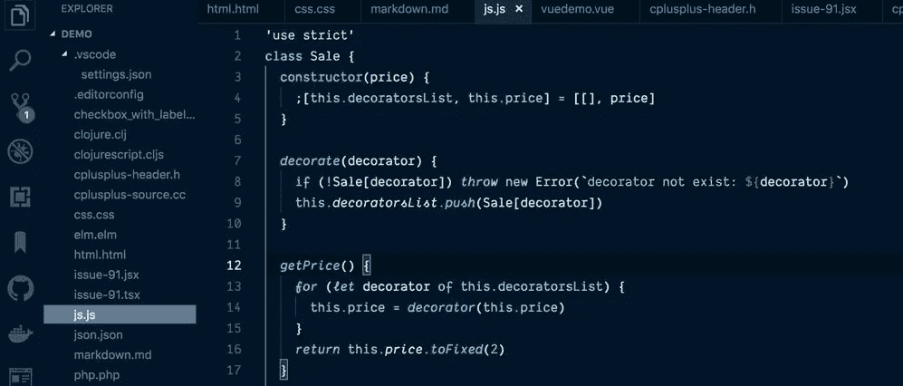

夜猫子

[链接](https://marketplace.visualstudio.com/items?itemName=sdras.night-owl&WT.mc_id=twitter-social-sdras)

# 材质灯光主题

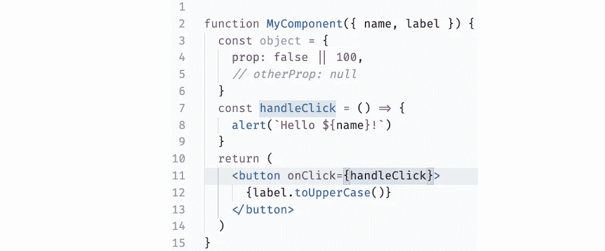

材质灯光主题

[链接](https://marketplace.visualstudio.com/items?itemName=JonaDuran.my-light-theme&ssr=false#overview)

# 官方德古拉主题

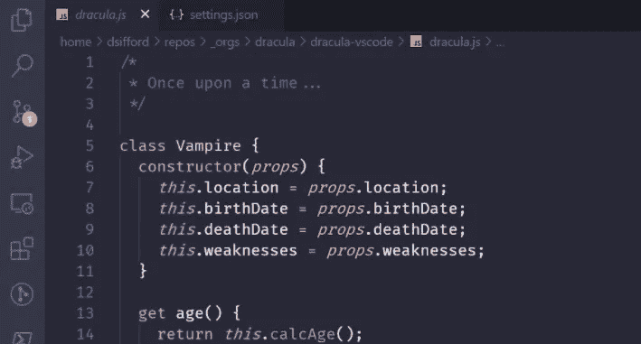

官方德古拉主题

[链接](https://marketplace.visualstudio.com/items?itemName=dracula-theme.theme-dracula)

# 阿玉

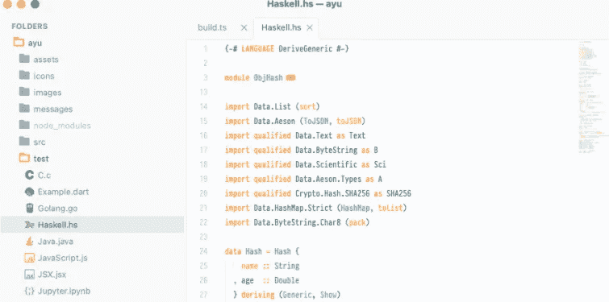

阿玉

[链接](https://marketplace.visualstudio.com/items?itemName=teabyii.ayu)

# 原子一黑暗主题

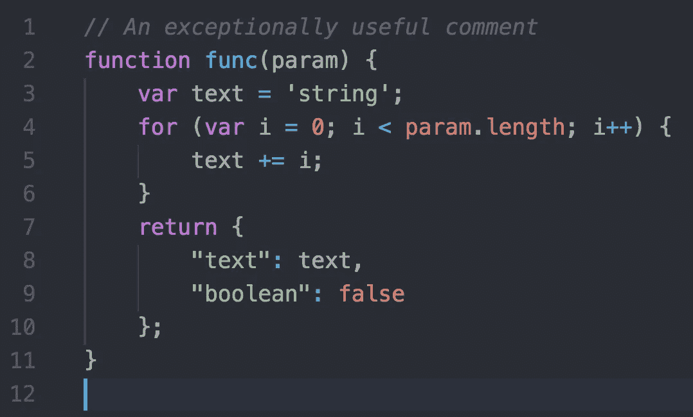

原子一黑暗主题

[链接](https://marketplace.visualstudio.com/items?itemName=akamud.vscode-theme-onedark)

# 84 年合成波

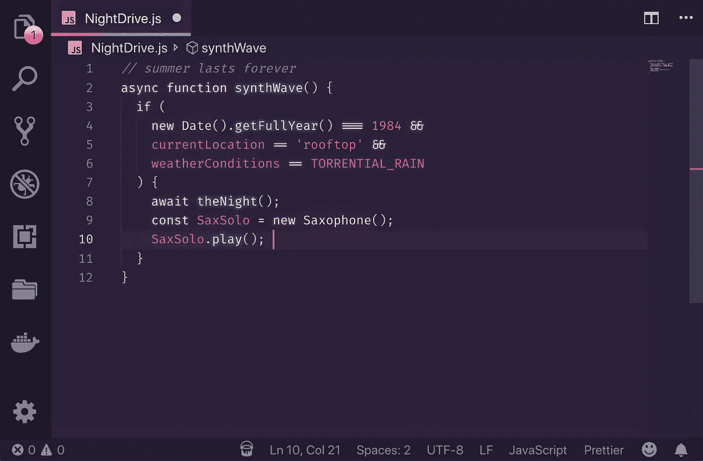

84 年合成波

[链接](https://marketplace.visualstudio.com/items?itemName=RobbOwen.synthwave-vscode)

# 冬天来了

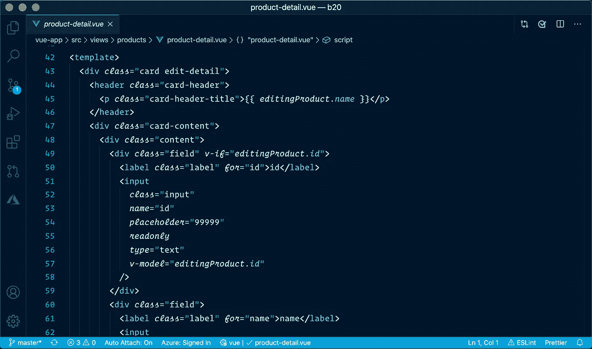

冬天来了

[链接](https://marketplace.visualstudio.com/items?itemName=johnpapa.winteriscoming)

# GitHub 主题

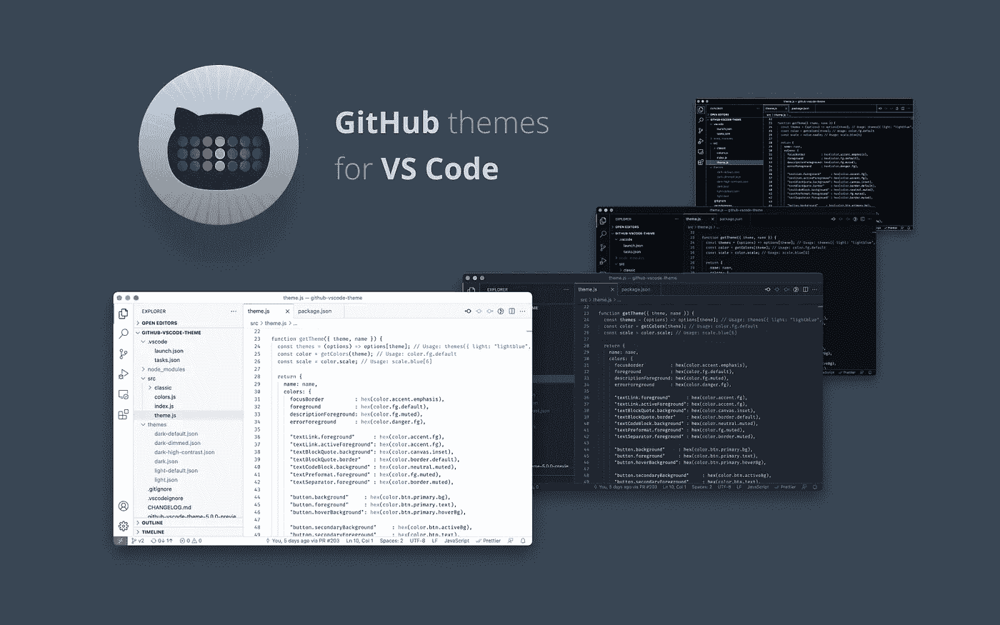

GitHub 主题

[链接](https://marketplace.visualstudio.com/items?itemName=GitHub.github-vscode-theme)

# 黑夜

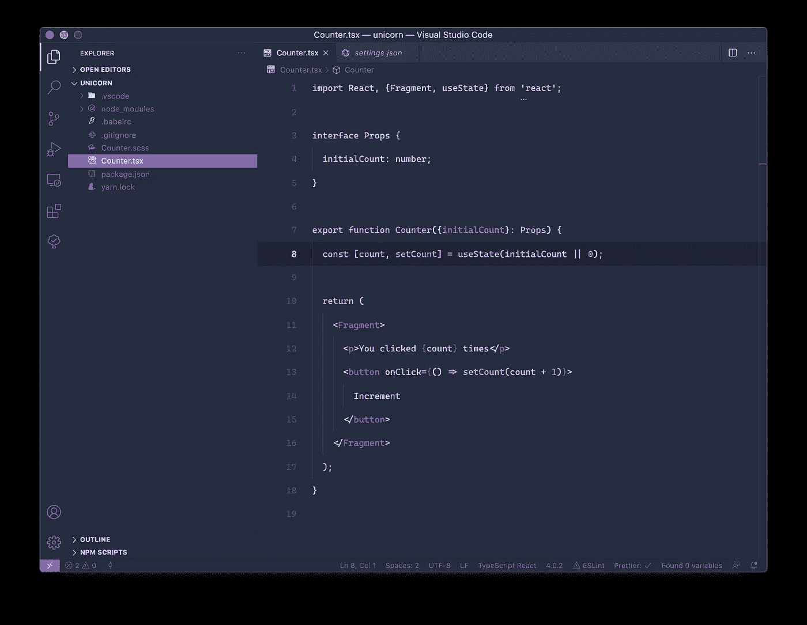

黑夜

[链接](https://marketplace.visualstudio.com/items?itemName=whizkydee.material-palenight-theme)

# 紫色的阴影

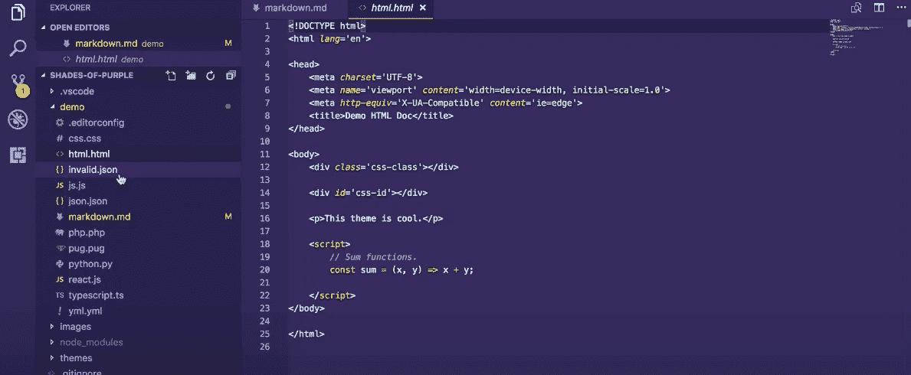

紫色的阴影

[链接](https://marketplace.visualstudio.com/items?itemName=ahmadawais.shades-of-purple)

# 一个黑暗职业

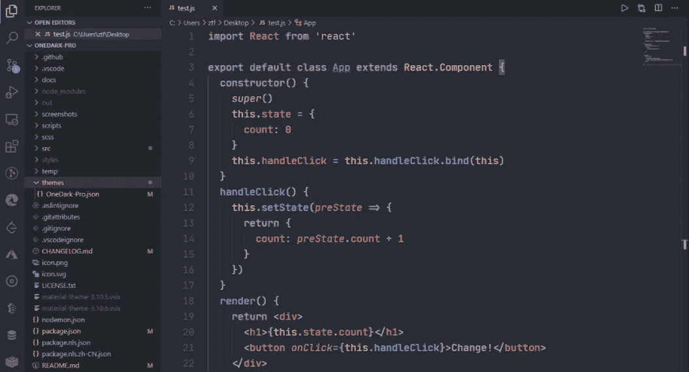

一个黑暗职业

[链接](https://marketplace.visualstudio.com/items?itemName=zhuangtongfa.Material-theme)

# 钴 2

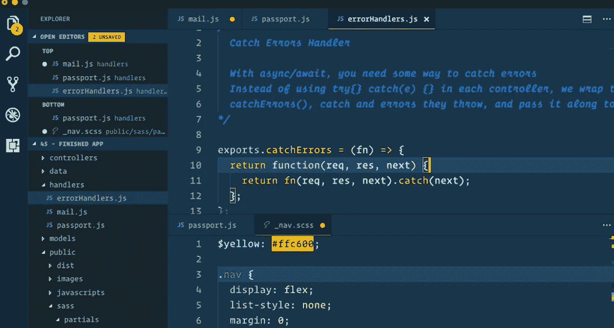

钴 2

[链接](https://marketplace.visualstudio.com/items?itemName=wesbos.theme-cobalt2)

# 夜盲症

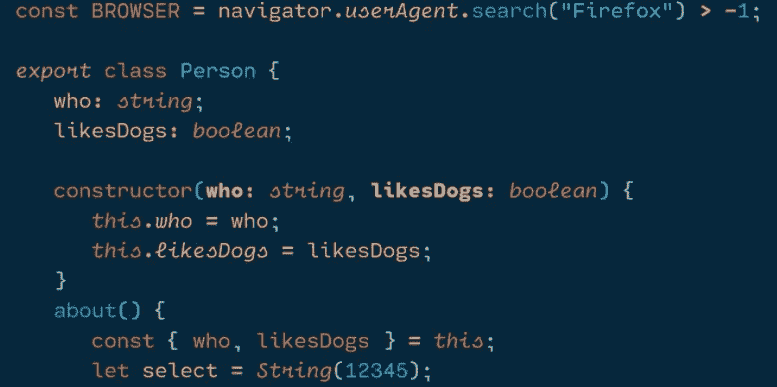

夜盲症

[链接](https://marketplace.visualstudio.com/items?itemName=liviuschera.noctis)

# 东京之夜

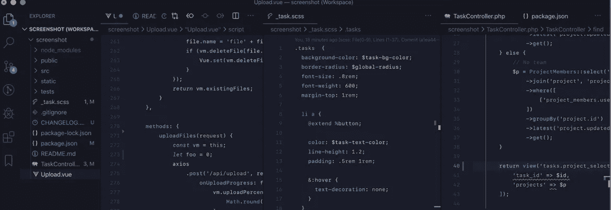

东京之夜

[链接](https://marketplace.visualstudio.com/items?itemName=enkia.tokyo-night)

# 跳房子

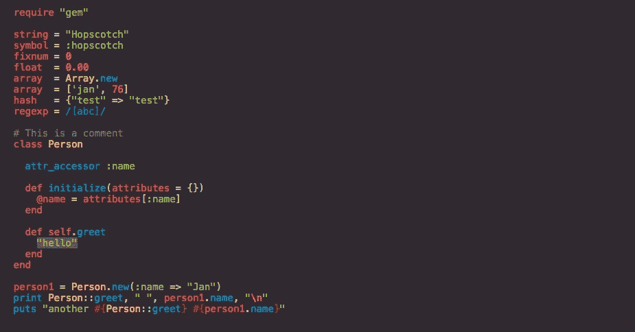

跳房子

[链接](https://marketplace.visualstudio.com/items?itemName=idleberg.hopscotch)

# 平面用户界面

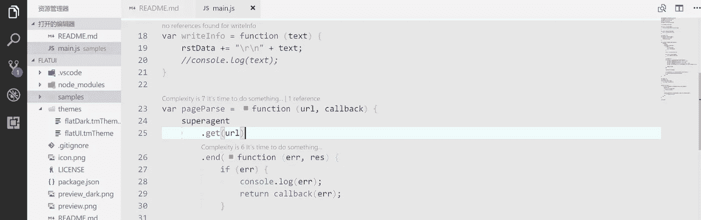

平面用户界面

[链接](https://marketplace.visualstudio.com/items?itemName=lkytal.FlatUI)

# 蓝色灯光

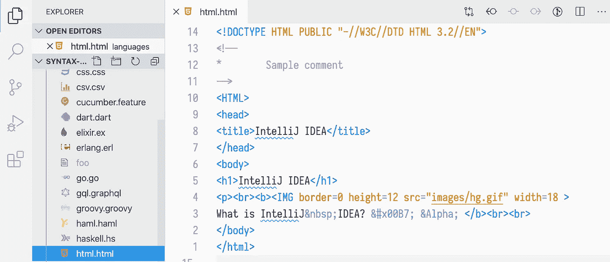

蓝色灯光

[链接](https://marketplace.visualstudio.com/items?itemName=uloco.theme-bluloco-light)

# 材料主题

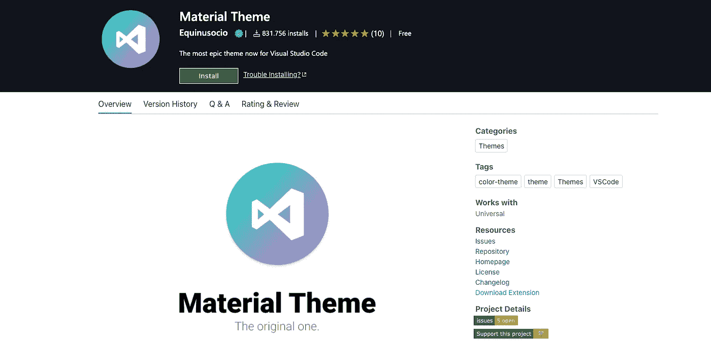

材料主题

[链接](https://marketplace.visualstudio.com/items?itemName=Equinusocio.vsc-material-theme&ssr=false#user-content-activate-theme)

# Vue 主题

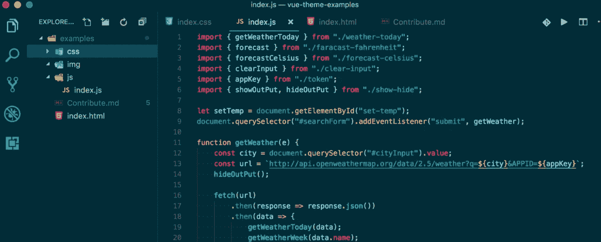

Vue 主题

[链接](https://marketplace.visualstudio.com/items?itemName=mariorodeghiero.vue-theme)

# 熊猫主题

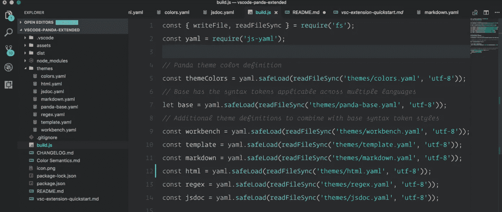

熊猫主题

[链接](https://marketplace.visualstudio.com/items?itemName=tinkertrain.theme-panda)

# 崇高的物质主题

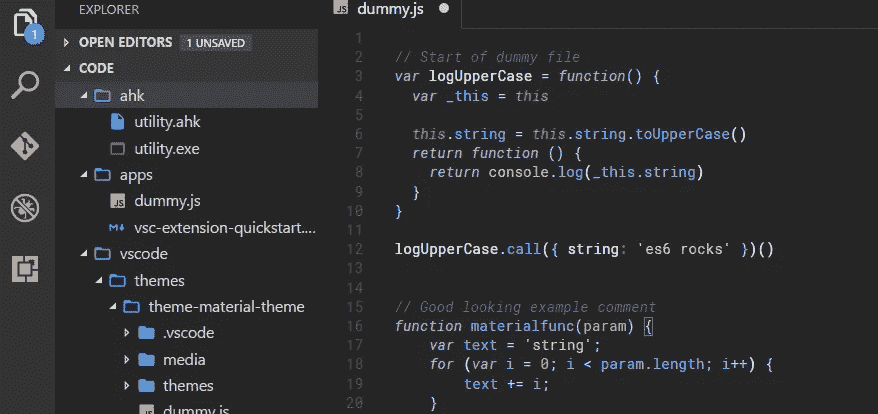

崇高的物质主题

[链接](https://marketplace.visualstudio.com/items?itemName=jprestidge.theme-material-theme)

# 一个 Monokai 主题

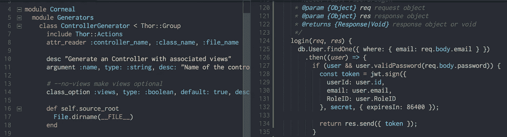

一个 Monokai 主题

[链接](https://marketplace.visualstudio.com/items?itemName=azemoh.one-monokai)

# Monokai Pro

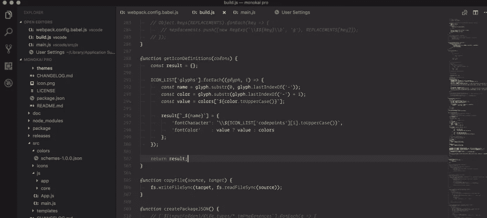

Monokai Pro

[链接](https://marketplace.visualstudio.com/items?itemName=monokai.theme-monokai-pro-vscode)

相关文章:

*   [面向 Web 开发人员的最佳 Visual Studio 代码扩展](https://us.niemvuilaptrinh.com/article/30-best-visual-studio-code-extensions)
*   [开发者最佳代码编辑器](https://us.niemvuilaptrinh.com/article/25-web-code-editors-for-developer)

# 总结:

我希望这篇文章能帮助你找到漂亮的 visual studio 代码主题，如果你有任何问题，请发送电子邮件，我会尽快回复。希望大家继续支持网站，让我能写出更多好文章。祝您愉快！