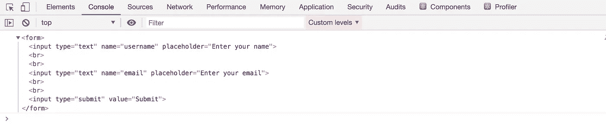
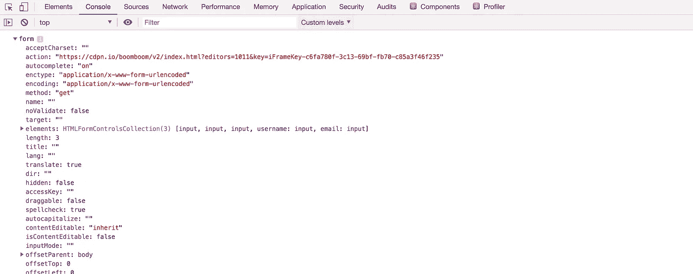
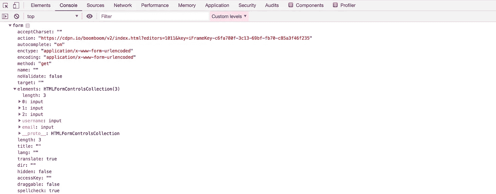
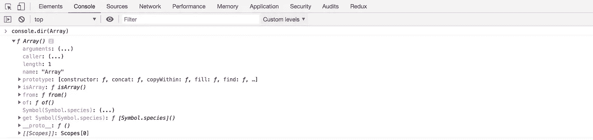
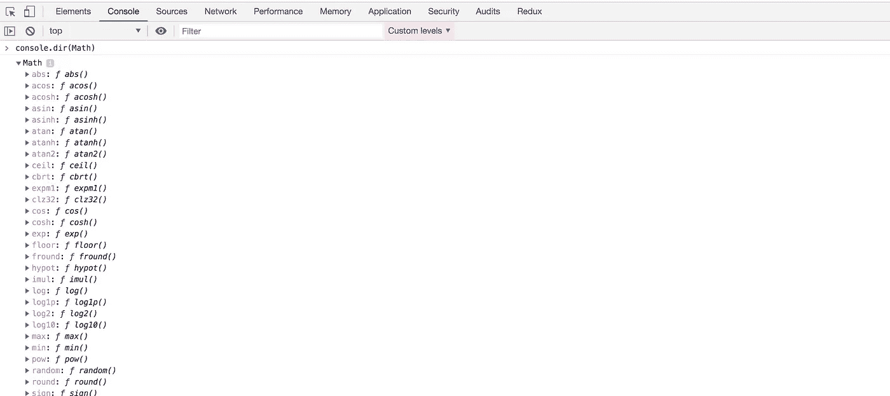
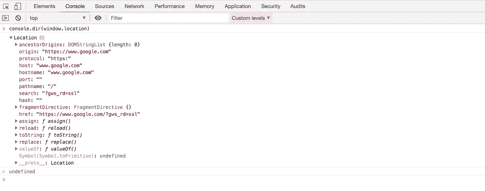

# 获取任何 Javascript 对象的所有属性的最佳技巧

> 原文：<https://levelup.gitconnected.com/best-trick-to-get-all-properties-of-any-javascript-object-2c68217a138a>

## 不再需要在文档中寻找任何元素的属性和方法


[二万·赫斯里](https://unsplash.com/@erwanhesry?utm_source=medium&utm_medium=referral)在 [Unsplash](https://unsplash.com?utm_source=medium&utm_medium=referral) 上拍照

您是否曾经想要检查特定 HTML 元素或 Javascript 对象的可用属性和方法？

如果答案是肯定的，那么在这篇文章中你将会发现检查一个物体的最简单的方法。

## `**console.dir**`

`**dir()**`方法显示指定 JavaScript 对象的属性和方法的交互式列表。

看看下面的表格:

```
<form>
  <input type="text" name="username" placeholder="Enter your name"/>
  <input type="text" name="email" placeholder="Enter your email" />
   <input type="submit" value="Submit" />
</form>
```

如果您想获得表单中的所有元素及其值，那么在提交表单时，您可以这样做:

```
document.querySelector('form').addEventListener('submit', function(event) {
 event.preventDefault();
  // some code based on event.target property
});
```

我们知道我们可以访问用户名

`event.target.**<something>**.username.value`

但是如果你不知道在`<something>` 的地方会出现什么，如果你使用`console.log(event.target)`，你会看到形式本身，而不是它的属性。



要获得`event.target`可用的所有属性和方法，可以用`console.dir`方法代替`console.log`。



如果您进一步展开其中的 elements 属性，您将能够看到表单中的所有输入元素



因此，在上面的示例中，您可以获得如下所示的所有元素值:

```
document.querySelector('form').addEventListener('submit', function(event) {
  event.preventDefault();
  const username = event.target.elements.username.value;
  const email = event.target.elements.email.value;

  console.log("username:", username);
  console.log("email:", email);
});
```

演示:[https://codepen.io/myogeshchavan97/pen/poJbbNB?editors=1010](https://codepen.io/myogeshchavan97/pen/poJbbNB?editors=1010)

获取`Array`对象的属性和方法:



获取`Math`对象的属性和方法:



获取`location`对象的属性和方法:



因此，使用`console.dir`方法，您可以检查元素的属性和方法，比如单选按钮、复选框或任何其他元素或 JavaScript 对象。

今天到此为止。希望你今天学到了新东西。

**别忘了订阅我的每周简讯，里面有惊人的技巧、诀窍和文章，直接在你的收件箱** [**这里**](https://yogeshchavan.dev) **。**