# 2019 年你需要的最佳 VS 代码扩展🚀

> 原文：<https://levelup.gitconnected.com/best-vs-code-extensions-that-you-must-try-in-2019-7add34e7b89d>

图片来源:Unsplash

# **更漂亮**

是一个固执己见的代码格式化程序，支持多种语言。它删除了所有原始样式，并确保所有输出的代码符合一致的样式。因此，当多人在一个项目上工作时，Prettier 会强制执行一致的代码风格。

# **括号对上色器**

[该](https://marketplace.visualstudio.com/items?itemName=CoenraadS.bracket-pair-colorizer)扩展允许用颜色识别匹配的支架。用户可以定义匹配哪些字符，以及使用哪些颜色。这在处理多行代码时非常有用。

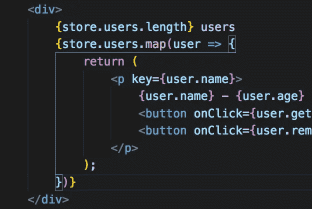

# **ES7 React/Redux/graph QL/React-Native 片段**

如果你是一个 React 开发者，这是一个必须拥有的扩展，因为通过几次击键就能生成代码片段，这让生活变得容易多了。您可以使用`ES7 snippet search`命令搜索代码片段，该命令可以使用`CMD + Shift + P`运行

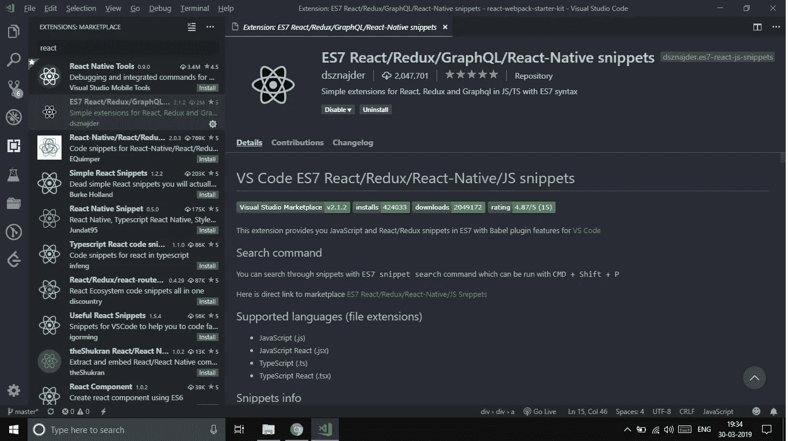

# **Git 镜头**

如果你和一个团队或者个人一起工作，Gitlens 必不可少。它帮助您**通过 Git 责备注释和代码透镜来直观显示代码作者身份**，**无缝导航和探索** Git 库，**通过强大的比较命令获得有价值的见解**，等等

Gif 图片来源:Gitlens

# **自动关闭标签&自动重命名标签**

自动添加 HTML / XML 结束标记，

*   当您键入开始标记的右括号时，自动添加结束标记
*   插入结束标记后，光标位于开始和结束标记之间
*   设置不会自动关闭的标签列表
*   自动关闭自闭标签

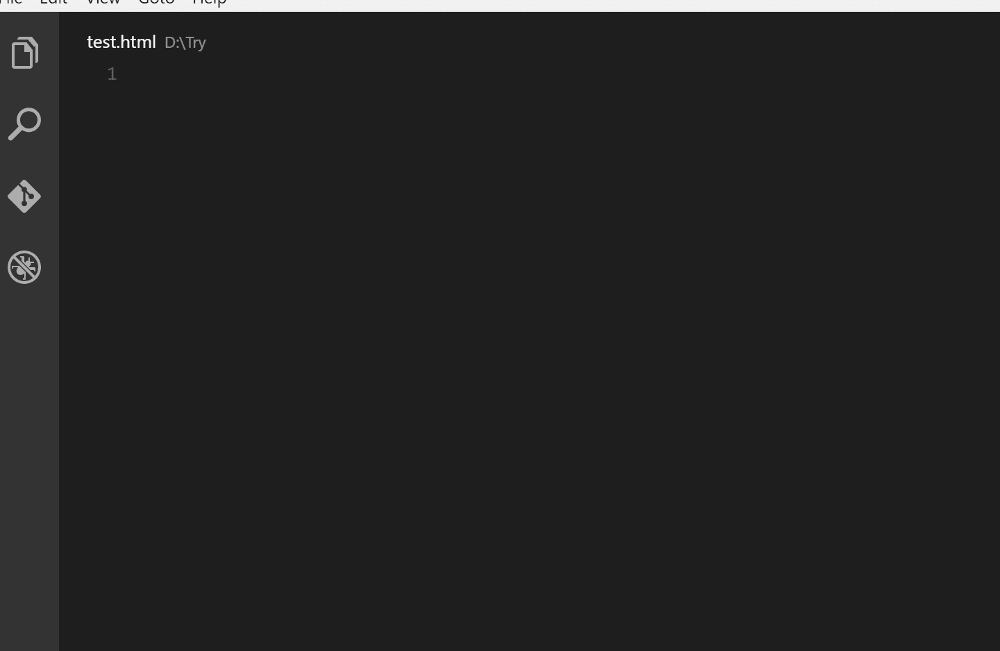

Gif 演职员表:自动角色标签

# **更好的评论**

这个扩展帮助您生成和分类注释，例如 TODO 或重要注释。在开发项目时，我经常在我的 todos 中使用这个扩展。

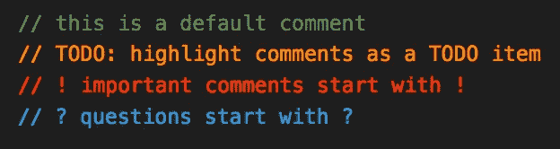

# **Leetcode**

如果你是一个有竞争力的程序员，你不想让 VS 代码来解决问题。那么这就是你要找的分机。这将 Leetcode 集成到您的编辑器中，您可以编译它并提交您的代码，而无需切换窗口。

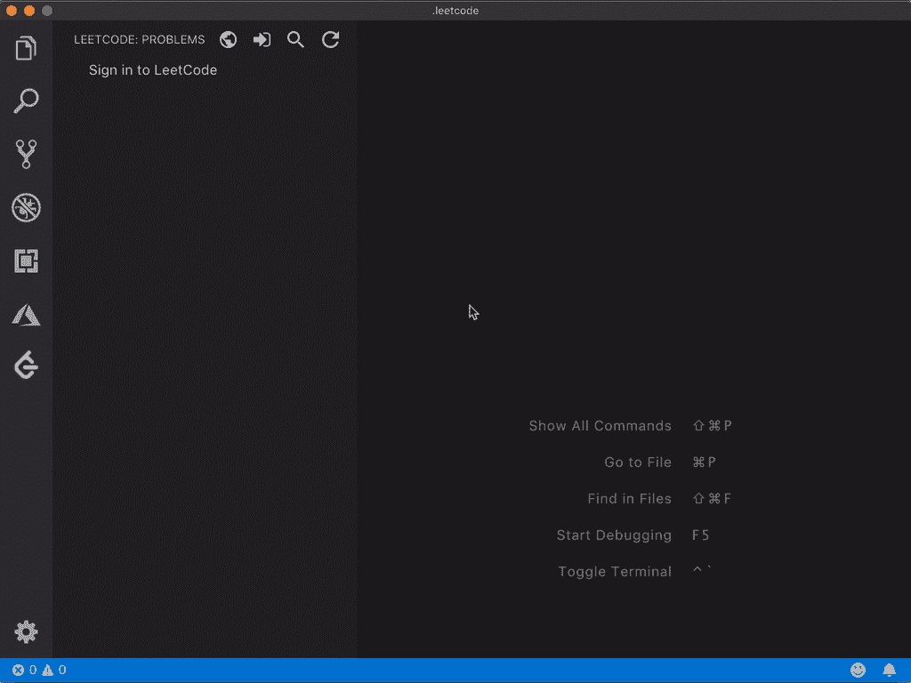

Gif 致谢名单:LeetCode

# **NPM**

这个扩展支持运行在`package.json`文件中定义的 npm 脚本，并根据在`package.json`中定义的依赖关系验证安装的模块。

# NPM 智能感知

而 npm 智能感知自动完成`import`语句中的 NPM 模块。

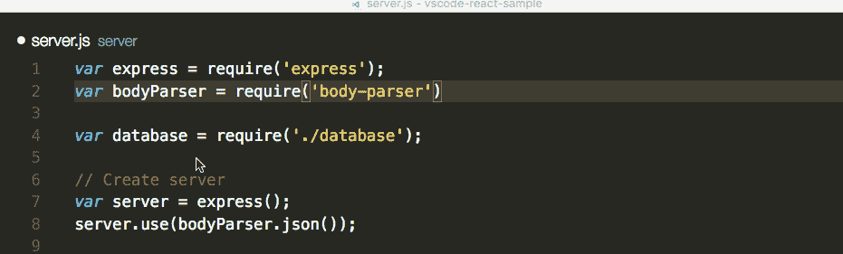

# **上色**

[着色](https://marketplace.visualstudio.com/items?itemName=kamikillerto.vscode-colorize)，如果你在进入 CSS 和在外部 CSS 文件中你想容易地区分不同的颜色。这个扩展可以让你的样式文件寻找颜色，并为每个颜色生成一个彩色背景。

# 埃斯林特

ESLint 是一个开源项目。它的目标是为 JavaScript 提供一个可插拔的林挺工具。如果你使用 JavaScript，这是必须的。

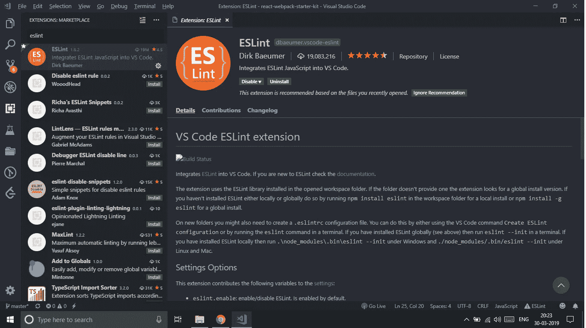

# Chrome 的调试器

**一个[扩展](https://marketplace.visualstudio.com/items?itemName=msjsdiag.debugger-for-chrome)，用于调试 Google Chrome 浏览器中的 JavaScript 代码，或者其他支持 Chrome DevTools 协议的目标。**

****

# **Red Hat 对 Java(TM)的语言支持**

**这可能是迫使你忘记崇高的文本编辑器的扩展&是完全值得称赞的。**

**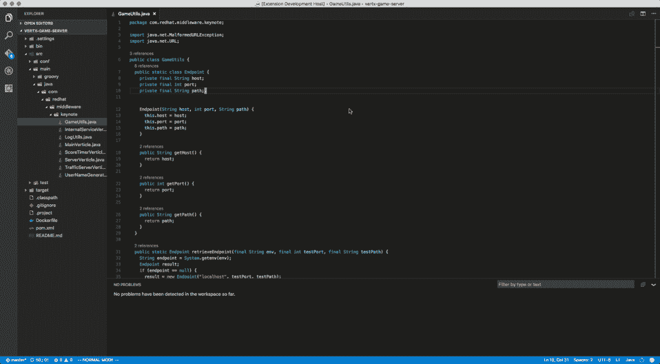**

# ****主题****

**我最喜欢的一些黑色主题**

# **平面用户界面深色**

**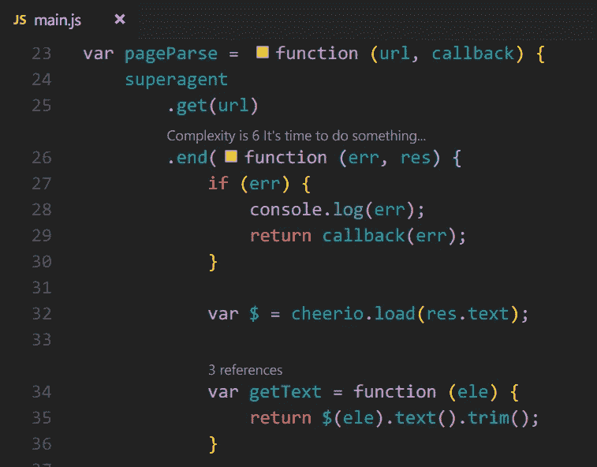**

# **一个黑暗职业**

**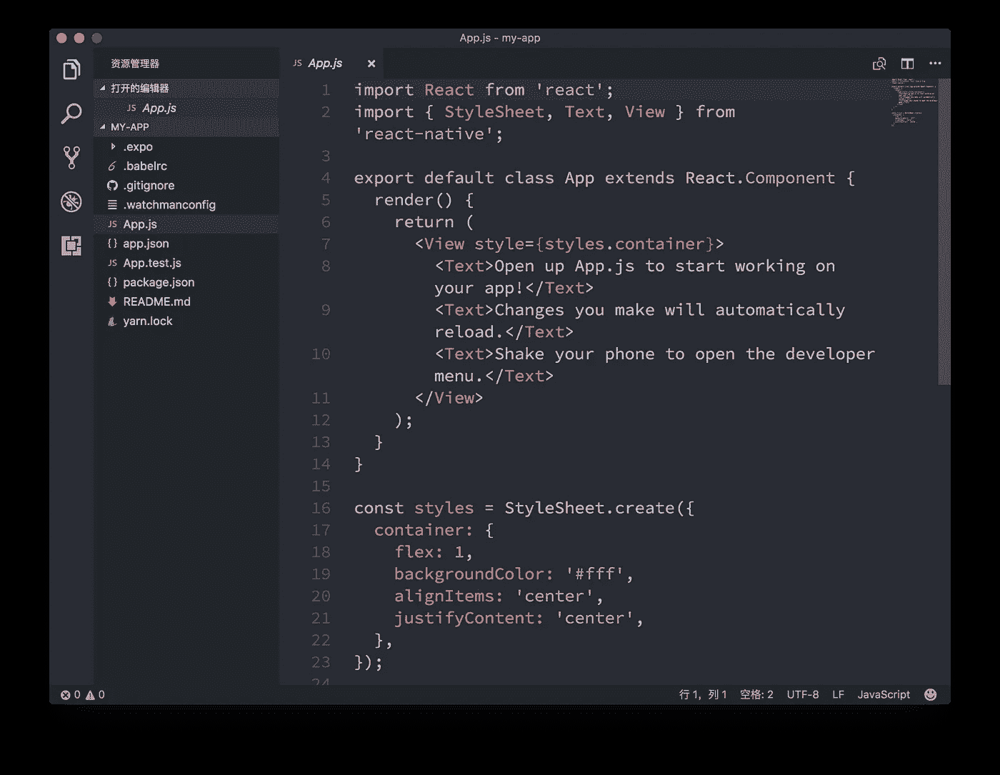**

# **德拉库拉**

**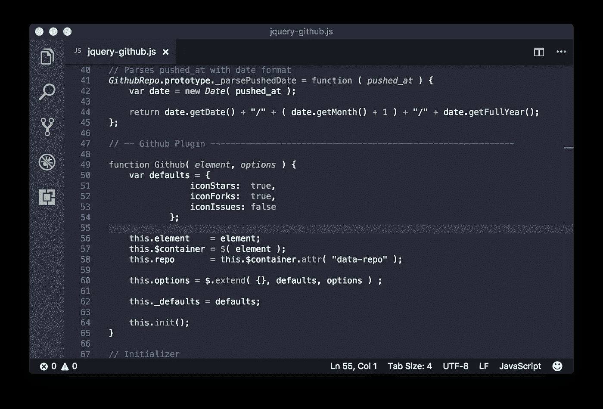**

# **海洋下一次变暗背景**

**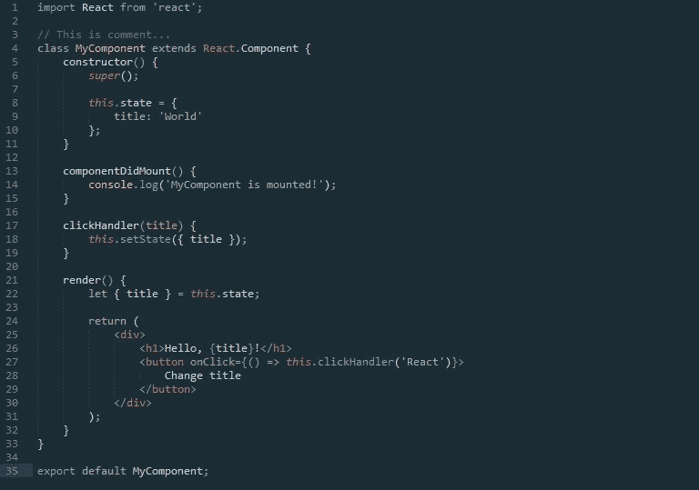**

****其他一些扩展****

*   **[Live Server](https://marketplace.visualstudio.com/items?itemName=ritwickdey.LiveServer) :开发本地服务器，具有静态&动态页面的实时重载功能。**
*   **[路径智能感知](https://marketplace.visualstudio.com/items?itemName=christian-kohler.path-intellisense):自动完成文件名的 Visual Studio 代码插件。**
*   **[设置同步](https://marketplace.visualstudio.com/items?itemName=Shan.code-settings-sync):允许您保存用户设置、扩展和按键绑定，这样您可以在几分钟内设置一个新的 VSCode。**

**给这篇文章几个高达 50 的掌声以示关爱👏 👏 👏 👏请随时在 LinkedIn 上与我联系—【https://linkedin.com/in/jatin-varlyani **

**快乐编码🎉 🎉**

** [## Jatin-8898 -概述

### 全栈 Web 开发人员|应用程序开发人员|热爱探索新技术✨ - Jatin-8898

github.com](https://github.com/Jatin-8898)** ** [## 了解如何编码-查找编码教程| gitconnected

### 使用我们完整的编码资源列表学习任何编程语言或框架。我们分享、汇总和排名…

gitconnected.com](https://gitconnected.com/learn)**