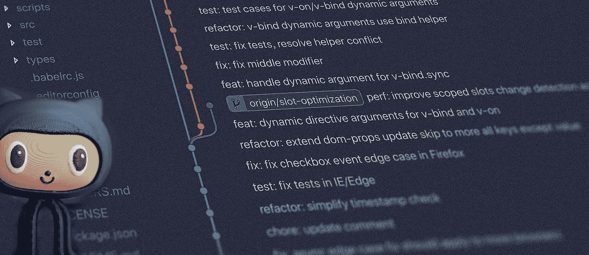

# 更好的 Git 分支战略——关注多应用、monorepos 和多个团队——sim Git 流程

> 原文：<https://levelup.gitconnected.com/better-git-branching-strategy-multi-apps-monorepos-and-multiple-teams-in-focus-cd17b56962f2>

# 一点历史…

早在 2016 年，我们引入了一种新的前端架构，并不得不转向更好、更有组织、更强大的分支战略(老实说，在此之前，这只是狂野西部，我们通常只是将东西推送到 master release)。我们的出发点不是 Git 流或其他众所周知或公认的分支策略。相反，我们决定尝试一些感觉有意义的事情，并随着时间的推移而发展，从我们的错误中学习，解决所有的问题和顾虑。我们的目标是开发一些对我们的组织很好的东西，在重要的细节上没有偏见或妥协。

我们最终采用了一种分支策略，这种策略被证明非常有效，并且与我们的八个前端应用程序完美地配合，这些应用程序由九个敏捷团队和总共超过十五个前端开发人员共享。所有应用程序都是从一个单一的 repo 中运行和部署的。我们解决了所有以前的问题，没有引入任何新的严重挑战。正如每一个解决方案一样，我们最终都做出了妥协和一些取舍，但所有这些都值得接受。

> “一种分支策略，允许多个团队在同一个存储库上工作，并以最少的努力和对他人编写的代码的高度信任来推出产品。”

# 结果呢...SimGit 流

多年来发展和完善的分支策略被证明在不同的公司、团队和技术栈中都有效。一开始是前端应用的流程，后来被 iOS、Android 和后端团队采用。每当一个新团队尝试这种方法时，经过一些小的调整后，它就成为了整个公司的标准。我发现有趣的是，几乎每个人都提出了类似的担忧，但最终，它们都没有在现实世界中成为现实。

这个解决方案完美吗？地狱号
好吃吗？很好。
还能更好吗？永远！

没有解决所有问题的灵丹妙药，但也许这种方法会对您的团队有所帮助。至少你可以放心，这不是一个理论，而是一个现实生活中的方法，经过了很长时间的演变，并在战场上被多次证明。

# 核心原则

*   **大师是真理的源泉。**
    那是每一个发展的起点，**主**分支是真理的终极源泉。您的新代码从这里开始，您可以确定您在那里已经找到的任何东西，因为它已经 100%测试过了，并且已经投入使用。没有惊喜，因为分支受到保护，人类不允许手动或通过公关合并任何东西。
*   **分支前缀。**
    它有助于更容易地找到分支，并从前缀中了解它们的用途。当你不需要一个一个的检查时，清理 GIT 也更容易。
*   **描述性分支名称。**
    这个前缀是一回事。一个描述性的名字对于帮助理解我们正在看的东西是必要的。避免名字只是你的董事会门票的 id。让它对人友好，可读性强。
*   **正确的版本控制。**
    版本控制影响发布分支名称，因此更容易找到并推出它们，而不会影响其他团队的工作流。
*   尽可能自动化。
    分支创建，版本控制，合并。这将需要一些工作，但是这并不比任何其他的发布自动化流程更不寻常或者更复杂。

# 关于前缀的更多信息。

*   主/主 —我们的“黄金拷贝”，它总是代表当前正在运行的内容，完全正常，没有任何意外。
*   **WIP/* name ***—这些将主要用于实验工作、POC 和其他不基于票证的任务。“WIP”意味着它不能独立运行，可能它是一个重要特性或工作流的一部分。它也可能是一个临时的集成分支。您可以将这些分支推送到开发服务器进行测试。
    **示例:** wip/newBuildProcess
*   **feature/#####-*name*** —这些分支将被要求开发和测试新的特性/任务/错误修复。在提交发布之前，您可以将它们推送到服务器进行测试。如果有助于将代码与任务联系起来，请使用#####作为票证编号。
    **示例:**特性 */W* EB1234-headerUpdate
*   **release*/*X . XX**—发布分支由构建过程自动创建，所有的代码都在这里合并，以便投入使用。分支名称是使用主要和次要编号的版本。永远不要为“更新”创建分支。
    **举例:**发布 */* 3.12
*   **hotfix/#####-*name*** —从我们希望应用 hotfix 的特定版本创建的分支。
    **示例:**hot fix*/*D*W*c 3342-datadogconselerrors

*注意:我们决定永远不删除发布分支，这是明智之举。每当我们需要浏览历史，在特定的时间检查代码，或者回顾更新，分支都是可用的并且容易找到。*

# 优点:

*   它在许多方面介于 GitFlow 和 GitHub Flow 之间，但澄清和简化了一些未解释的领域。
*   在由于额外的手动步骤、批准过程或时间问题而无法实施完整 CD 的情况下，这是一个很好的**选择。**
*   **非常适合 monorepos** 使用基于共享核心构建的多个应用程序，由具有不同交付时间表和优先级的不同团队开发。
*   您将能够轻松地创建一个独立的版本**，测试它，部署它，并且只有当它 100%好的时候，将它合并回主版本。这意味着如果你的代码因为没有被测试而失败，没有人会生气。**
*   **多个团队**可以从同一个 repo 中为不同的应用程序创建版本，并部署它们，而不会相互阻塞。
*   易于**同时管理多个版本**，并在发布代码之前同步它们。
*   不需要**发展**分支。忘了它吧。
*   **在发布分支命名**中没有冲突，因为版本控制由构建过程&管道控制。
*   **主/主要**分支对于新版本的使用总是安全的。您可以相信没有未经测试的代码或令人讨厌的意外。
*   **不需要依赖散列或标签**，使一切可读，但无论何时发布被实时推送并合并回 master，保留标签仍然是一个好主意。
*   (发布分支上的)特性可以在准备好 &测试时**上线。**
*   因为每个版本都是一个独立的分支，所以很简单**回滚**或者更新这个特定的分支并发布任何应用。
*   **由于未完成的代码或等待依赖项或其他团队，没有发布周期锁定**。
*   鼓励**在合并前测试**。
*   为开发人员创造了更少的认知开销，因为分支是由发布管道维护的(假设您有适当的自动化)。
*   拥抱进行中的公关，而不是结束时的怪物公关。
*   如果出于任何原因不再需要某个版本，那么很容易放弃它。
*   很有可能**将 CI** 和自动部署的流程扩展到开发环境，但是这需要一些调整。

# 缺点:

*   **发布分支名称将在每次发布时** **改变**，因此可能需要编写更多的智能管道，因为您不会从一个分支(通常是主分支)发布。
*   **更难自动化**连续交货，但并非不可能。
*   开发者需要**跟踪**正在进行的发布。
*   **在合并到发布分支**之前，您需要确保您正在处理来自主控的最新代码(将其合并进来)。
*   如果你的团队正在开发一个重要的特性，并且需要测试它，你可能(不一定)在把它全部推向一个发布之前，以**集成分支**结束。
*   由于在开发过程中母版中的内容可能会发生变化，您将不得不在以后合并它，并且它**可能会创建一些额外的冲突来解决**。
*   当所有团队成员都在某种隔离状态下工作时，**当他们都在发布分支中遇到**时，你会有冲突(这是我们最大的担忧，其实也没那么糟糕)。
*   如果你不考虑适当的版本控制和管道自动化，这一切**可能毫无意义**。

# App 版本很重要！

因为这是一个有点大的话题，我将在我未来的一篇文章中涉及，包括如何在构建过程中自动化它，以及基于我们的学习有哪些好的和坏的实践。

简而言之，我们总是用经典的 SEM ver 2.0([https://semver.org/](https://semver.org/))——大调，小调，更新。尽管如此，一些团队决定仅仅采用平面版本化，并且只使用主要版本。不管对你的团队起什么作用，但是有很好的理由说明为什么 SimVer 工作得很好，特别是对于 web 前端。

我也写了一篇关于这个话题的博文…

 [## 前端应用程序更好的版本控制(不仅仅是)就像工程师的交通灯。

### 理解我们能从代码中期待什么是至关重要的，而不是像在海滩上的猪一样挖掘回购…

andrewwinnicki.medium.com](https://andrewwinnicki.medium.com/better-versioning-for-frontend-applications-and-not-only-is-like-traffic-lights-for-engineers-380e9beb6a42) 

# 发布过程很重要！

管道控制每个版本的分支如何被创建、版本化，以及如何正确地更新相关的变更以避免错误。最重要的是，他们负责安全地将您的代码推送到现场，并将所有内容合并回 master。认真对待软件工程而没有发布自动化是不可能的。

因为这是另一个重要的主题，我不能在这里讨论，你可以期待将来的另一篇博文，它将分支和版本控制与发布过程巧妙地联系在一起。

# 例子，例子，例子…

一些现实生活中的例子解释了代码将如何在团队和开发人员之间流动，以安全地交付到一个真实的环境中。

## 1.简单的

两个开发者正在准备两个特性并一起发布。

## 2.典型的

一些特性，一个发布分支，和一个后期合并。

## 3.常规特征和一个很长的特征。两次发布。

一个特征需要很长时间的流程。基本上，在合并到发布版本之前，明智的做法是在主版本中再次合并，以便 100%保持最新。

## 4.放弃释放。

当一个版本开始时，另一个版本在之后被创建，但是在第一个版本之前就上线了(可能是快速修复)。这可以通过在您的管道中做一些额外的保护来避免，这将避免一次创建多个“进行中”的发布。此外，热修复程序可以用来代替小更新。

## 5.发布后的修补程序。

如果您对现有的实时代码有一个简单的错误修复，您可以使用一个热修复程序。这将有助于你不会陷入上述情况。热修复程序用于通过一个小而重要的补丁来更新现有版本。

## 6.还有更多的事情正在发生。

请注意，不同的人和团队可能会处理这样的例子。这可能看起来很复杂，但是如果你遵循两个简单的规则，它会变得很顺利。

*   始终确保您在 master 中合并到您的发布分支，并且版本是正确的。
*   与团队发布计划和正在进行的分支沟通(通常，团队一起工作来创建一个发布并推出它)。

# 快速小结

不可能在一篇博文中涵盖并解释所有的边缘场景，但是我不想这么做也是有原因的。人们很容易沉迷于挑战，将它们视为障碍，甚至不去尝试一些可能解决我们大多数问题的不同方法。上述分支策略交付了 99.9%的典型用例。正如我前面所说的，它在多个团队之间高效地工作，在一个 repo 中共享代码，并通过相同的发布管道进入 8 个不同的应用程序。只要你和其他团队沟通合作(而不是竞争)，一切应该都会很顺利。

试试看，让我知道你是如何做得更好的！

*ps。感谢 Alfredo Pinto 为这个流程提供的名称建议。我们在关于媒介的评论上有一点交流；)*