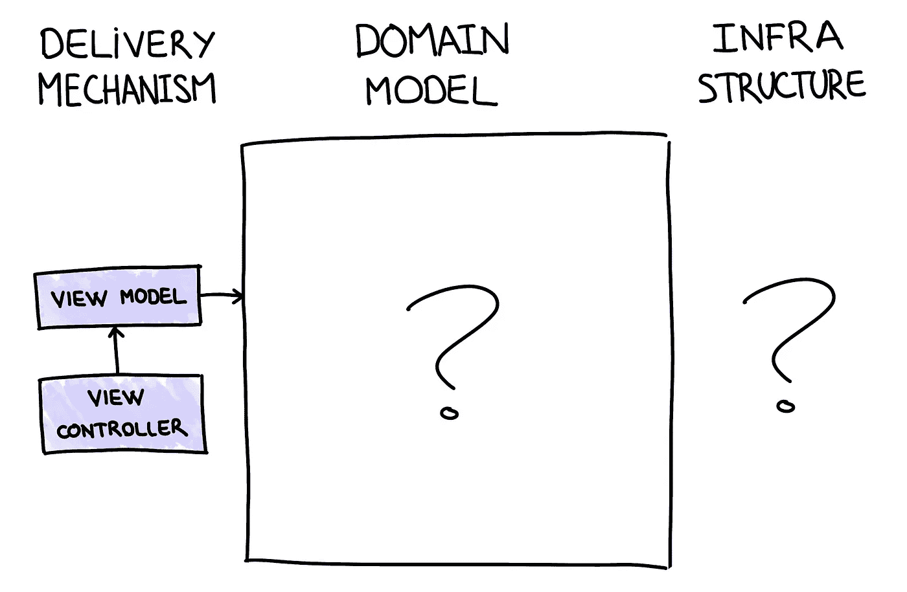
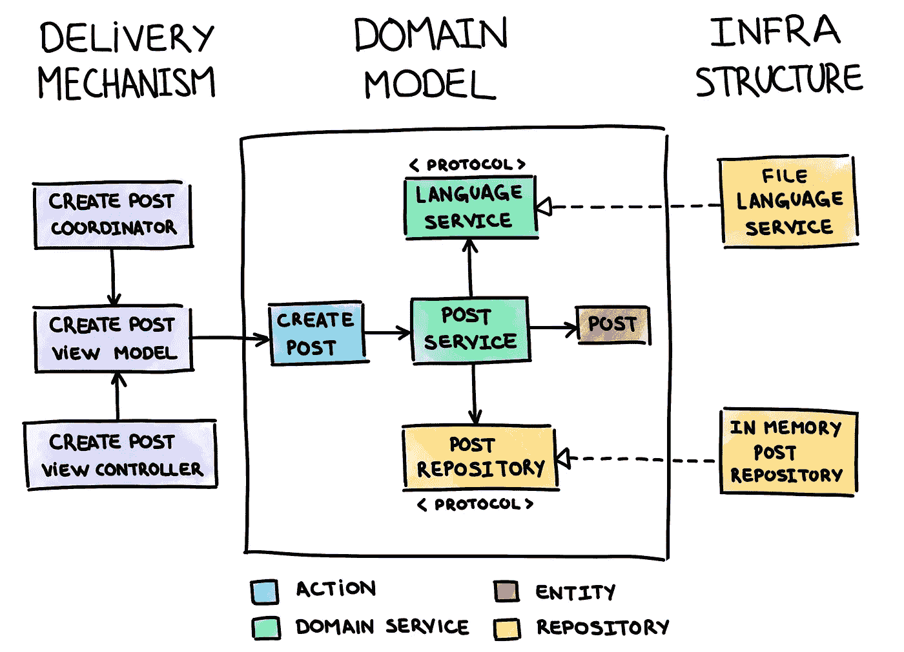

# 采用交互驱动设计的更好的 iOS 应用

> 原文：<https://levelup.gitconnected.com/better-ios-apps-with-interaction-driven-design-f9187e745641>

## 构建干净、有组织和可维护的应用程序

菲利普·斯温伯恩在 [Unsplash](https://unsplash.com/s/photos/wood-craft?utm_source=unsplash&utm_medium=referral&utm_content=creditCopyText) 上拍摄的照片

在我职业生涯的初期，我没有遵循任何真正的方法论来创建 iOS 应用程序。我非常擅长编写大规模视图控制器和创建[大泥球](https://en.wikipedia.org/wiki/Big_ball_of_mud)。

但是大约两年前，我开始在我的公司从事交互驱动设计。它改变了我构建软件的方式。它也会为你改变它。

# 什么是国际直拨电话？

桑德罗·曼库索在[这篇文章](https://codurance.com/2017/12/08/introducing-idd/)中介绍了交互驱动设计。下面的定义就是由此而来的:

> IDD 是一种基于由外向内开发的软件设计和开发的迭代方法，它关注于根据系统的外部使用对行为进行建模，同时维护内聚业务组件的内部表示。

IDD 是一种方法，在这种方法中，我们在构建系统时始终牢记如何使用它。我们采用由外向内的开发方式。什么是由外向内发展？我们稍后会谈到这一点。现在，让我们继续 IDD 的定义:

> IDD 的前提是应用程序的存在应该仅仅是为了满足用户或服务的外部需求——称为参与者。参与者和应用程序之间的每次交互都代表了应用程序必须满足的参与者的需求。IDD 的目标是迭代地设计和构建满足这些需求的应用程序。

一个系统应该满足不同行为者的需求。你可以说这种肯定是显而易见的。如果一个系统不能增加某种价值或满足某人的需求，它就没有意义。但是你会对我们写的代码数量感到惊讶，“因为我们会需要它”。通常那个时刻永远不会到来。

所有那些不必要的工作都不是免费的。它伴随着成本:开发和维护不能满足任何需求的东西的成本。我们必须避免这种情况。

IDD 还关注于以迭代和增量的方式创建系统。这意味着我们应该将功能划分到不同的幻灯片中，一次处理一张幻灯片。这样我们减少了过度工程化，因为我们在给定的时间集中和开发系统的一小部分。

# 由外向内发展还是由内向外发展？

有多少次你创建了一个类，一个模块甚至整个系统，试着使用它，却发现因为它不适合你的需求而需要修改？这在我身上发生了无数次。

当您首先专注于构建模型时，这可能会发生。您尽最大努力对每个细节进行建模，包括该领域中存在的所有概念和业务规则。你做到了。你做得对。

但是接下来就该用这个模型了。您会注意到它与用户界面、用例或持久性存储不太匹配。你需要改变一些东西或者到处添加一个方法。或者甚至模型的某些部分根本没有被使用。

这就是**由内向外发展**。您首先开发领域模型，它的使用方式是将来的事情。这种方法有其优点和缺点。通常这是我们开发软件的方式。

但是有一种不同的方式。这种方式叫做**由外向内发展**。使用这种方法，您只需编写足够的代码来满足任何外部需求(来自用户、不同的系统或另一段代码)。

您减少了推测性的工作，并避免使解决方案变得比需要的更复杂。开发是从用户界面(视图控制器或视图模型)向领域模型(动作、服务或实体)驱动的。

并且您应该将特性划分成一个个递增的片段，然后一个个地构建它们。

例如，您从 UI 中的一些用户交互开始。您创建满足这种交互所需的所有逻辑，仅此而已。这个逻辑包括视图控制器、视图模型、域模型、与外部服务的交互和持久性。当所有的逻辑都完成后，你可以继续下一个用户交互。

如果你想了解更多关于由外向内发展的信息，请查看[这篇文章](https://codurance.com/2017/10/23/outside-in-design/)。

# 领域模型

什么是领域模型？《领域驱动设计的模式、原则和实践》一书将领域模型定义如下:

> 领域模型是一个面向对象的模型，它结合了行为和数据。乍一看，它可能反映了数据持久性模型(如果使用关系数据库，则为数据模式)。尽管两者都包含数据，但是领域模型还包含业务流程和关联、规则以及丰富的领域逻辑。

重点应该放在行为上。我们是在建模行为，而不是数据。以一种完全不知道持久性的方式创建域模型，就像没有数据库一样。数据结构将在以后出现，以满足期望的行为。

应用程序可以分为三个不同的层，每个层都有自己的职责:

*   **交付机制**:一个系统如果不使用就没有意义。这一层表示用户如何呈现和消费系统。在 iOS 上，这一层依赖于`UIKit`或者`SwiftUI`。如果你使用 MVC 或 MVVM，所有的视图、控制器和视图模型都属于这一层。该模型不属于交付机制，因为它是领域模型。
*   **领域模型**:我们之前定义了什么是领域模型。关于这一点，我想强调两点。首先，领域模型对象不应该依赖于`UIKit`或`SwiftUI`。这是因为这些框架属于交付机制。第二，[域模型对象不应该实现](https://medium.com/better-programming/why-model-objects-shouldnt-implement-swift-s-decodable-or-encodable-protocols-1249cb44d4b3) `[Decodable](https://medium.com/better-programming/why-model-objects-shouldnt-implement-swift-s-decodable-or-encodable-protocols-1249cb44d4b3)` [或者](https://medium.com/better-programming/why-model-objects-shouldnt-implement-swift-s-decodable-or-encodable-protocols-1249cb44d4b3) `[Encodable](https://medium.com/better-programming/why-model-objects-shouldnt-implement-swift-s-decodable-or-encodable-protocols-1249cb44d4b3)` [协议](https://medium.com/better-programming/why-model-objects-shouldnt-implement-swift-s-decodable-or-encodable-protocols-1249cb44d4b3)。那些协议属于基础设施。
*   **基础设施**:这一层提供了支持领域模型和交付机制的技术能力。例如，持久性细节或发出 HTTP 请求。

但是域模型内部是什么呢？

# 领域模型构建块

[亚历克斯·琼斯](https://unsplash.com/@alexjones?utm_source=unsplash&utm_medium=referral&utm_content=creditCopyText)在 [Unsplash](https://unsplash.com/collections/1189854/carpentry?utm_source=unsplash&utm_medium=referral&utm_content=creditCopyText) 上拍照

IDD 使用不同的构建块来表示领域模型。这些模块基于领域驱动设计(DDD)的[战术模式](https://vaadin.com/learn/tutorials/ddd/tactical_domain_driven_design)。

为了解释构建模块，我们将使用一个示例。想象一下像 Twitter 这样的应用程序，用户可以创建帖子，关注其他用户，并在时间轴上查看他们的帖子。我们可以使用 IDD 来设计这个应用程序。为了展示构建模块，我们将重点关注创建新帖子的用例。如果你对整个项目感兴趣，你可以在这里找到它。

关于这个例子的一些说明:

*   该示例摘自[系列视频](https://cleancoders.com/video-details/comparativeDesign-episode-15)中创建的应用程序。在那里，桑德罗和鲍勃大叔对不同的 TDD 学校:伦敦和芝加哥学校做了一个比较案例研究。
*   我假设你有一些反应式编程的经验。具体用`RxSwift`。
*   几乎每个代码示例都包含一个具有单个类实现的协议。这是为了测试目的。这允许我在单元测试中模拟那个类。
*   每个类使用依赖注入接收每个构造函数的协作者。也是为了测试目的。这允许我在单元测试中模仿它的依赖性。

介绍够了。让我们深入了解构建模块。

# 行动

它们是领域模型的入口点。动作代表执行特定任务的外部请求。它们代表了系统的行为或用例。

他们控制某个操作的流程，但不做任何细节。它是不同领域概念的编排者，使它们执行完成操作所需的逻辑。

## 示例:创建帖子

为用户创建新帖子的操作的好名字是什么？`CreatePost`听起来不错:

操作:创建帖子

我喜欢我的动作只有一个名为`execute`的公共方法来触发行为。

这个动作是做什么的？显然，不多。它接收用户 id 和文章的文本，并将文章创建委托给`PostService`。

就这些吗？是的，就这些。至少在这种情况下。其他动作可能调用不同的服务，相互传递结果。动作应该编排领域概念。注意，这个动作不知道任何关于文章创建的事情。

但是为什么要有一个只包装了一个协作者而没有附加行为的类呢？我们能不能不上这门课？不。因为，尽管不包含任何额外的逻辑，这个类代表了系统能做什么。它为演员提供了什么。

这个动作还有一个额外的目的。它为消费领域模型提供了一种清晰明了的方式。与领域模型的每一次交互都必须通过一个动作来完成。

# 域服务

领域服务是领域模型的核心部分。它们代表行为。领域服务是领域概念的切入点。他们没有国籍，没有身份。

它们包含了怎样的逻辑？域服务包含跨给定实体的多个实例的行为。但是它们可以包含不适合任何特定实体或者使用外部服务的逻辑。

## 示例:邮政服务

`CreatePost`动作将帖子创建委托给了一个`PostService`。该服务是帖子领域概念的入口点，包含创建新帖子的业务规则:

域服务:邮政服务

创建一个新的职位，这不应该包含任何不适当的语言。如果是这种情况，则发出一个`InappropriateLanguageError`信号。否则，帖子被创建，保存在一个`PostRepository`中并被返回。

领域服务可以与其他领域服务协作来完成用例。帖子是否包含不适当语言的决定权被授予 a `LanguageService`。

# 实体

实体表示领域概念，在领域模型中具有唯一的身份和连续性。这种唯一的身份允许实体相互区分。只有当两个实体具有相同的标识时，它们才是相等的。

实体在域中通常有一个生命周期，并且在生命周期中可以发生变异。由于这种独特的身份，我们可以找到一个给定的实体，并改变它。

实体包含什么样的逻辑？实体将包含仅与其内部状态相关的逻辑。

## 示例:Post

`Post`类代表一个帖子。真是个惊喜，对吧？它包含其唯一的身份、其创建者的身份、文本和创建日期。

实体:帖子

由于`Post`是可以变异的实体，所以我用了一个`class`来表示。但是我默认不使用类来表示实体。通常情况下，我首先选择`struct`，因为它具有不可变的特性，只有在有必要改变实体时，我才会选择`class`。比起可变对象，我更喜欢不可变对象，但那是另一篇文章的主题。

注意，如果两个`Post`实例具有相同的`id`，则认为它们是相等的。

# 价值对象

值对象表示实体的状态。它描述了关于实体或它所拥有的事物的一些东西。值对象表示具有度量、大小或值的特定概念。

值对象没有标识，如果它们具有相同的值，则被视为相等。

使值对象不可变是一个好的实践。您应该用所需的值生成一个新的值对象，而不是改变值对象的值。

使用实体或值对象表示领域概念的决定取决于上下文。要知道你必须使用哪一个，你必须问下一个问题:*概念应该有自己的身份吗？*。如果答案是*是*，那么你可能需要一个实体。如果答案是*不，*那么就去找一个有价值的对象。但请记住，这个答案取决于上下文:同一个“东西”在某个域中可以有一个身份，但在其他域中没有。

## 示例:PostId

这个类代表一篇文章的 id。`PostId`仅包含使用`UUID`的原始表示。

值对象:PostId

对于值对象，我总是用一个`struct`来表示。值对象和结构一样是不可变的。

但是`PostId`只包装了一个值。为什么我们要有这样一个结构呢？我认为有两个原因:

*   首先，我们可能决定改变 id 的表示方式。例如，我们可以决定使用`Int`或`String`来表示 id，而不是`UUID`。如果是这种情况，那么变化只影响`PostId`类。如果我们直接使用`UUID`,我们必须搜索所有的引用并立刻改变它们。相信我，我也经历过。
*   第二，避免错误。作为人类，我们都会犯错。如果文章 id 和用户 id 都用`UUID`表示，那么当需要用户 id 时，我们可能会错误地使用文章 id，反之亦然。如果每个 id 类型都有自己的类，编译器可以为我们做这个检查。相信我，我也经历过。

# 仓库

存储库代表一个特定实体的集合，它用于保存和检索该实体的实例。

我们不应该在不同的域服务之间共享存储库。每个存储库只属于一个域服务。这是因为 IDD 将存储库视为域服务的助手。

给定的域服务不应该访问另一个域服务的存储库。这样，我们可以最小化不同领域概念之间的耦合。

持久性依赖于不能在域模型中使用的基础设施。因此，存储库接口属于领域模型，而它们的实现属于基础设施。

## 示例:发布存储库

帖子创建后，这个帖子需要在某个地方持久化。我们需要一个`PostRepository`。

存储库:后存储库

如前所述，只有存储库的接口属于域模型。注意`PostRepository`是那个接口。到目前为止，它只是提供了一个向存储库中添加`Post`的方法。

存储库的实现驻留在基础设施中。请注意，使用协议使我们能够使用任何类型的持久性存储。这可能是内存、用户默认值、文件、数据库或远程 API。

在这种情况下，选择的持久性存储是内存。所以这个实现叫做`InMemoryPostRepository`。

存储库:InMemoryPostRepository

# 基础设施服务

它们是一种特殊类型的服务。它们代表了对领域很重要的概念，比如领域服务。但是由于它们的实现，它们不能在域模型中。

像存储库一样，它们的接口属于领域模型，它们的实现属于基础设施。

## 示例:语言服务

我们需要知道我们是否试图用不恰当的词语来创建一个帖子。一个`LanguageService`可以为我们做这个检查。

基础设施服务:语言服务

对于这个例子，被认为不合适的单词被存储在一个名为`inappropriate_words.plist`的文件中。因此，我们需要将该文件的内容读入一个单词数组，并检查帖子中是否包含这些不合适的单词。

基础结构服务:文件语言服务

这个实现叫做`FileLanguageService`。由于对文件的访问是基础设施的事情，所以这种实现不能在域模型中。

# 交付机制呢？

IDD 没有为交付机制定义构件。

交付机制取决于您选择如何交付应用程序。它可能是使用`UIKit`或`SwiftUI`的 iOS 应用程序、Android 应用程序或通过 REST API 使用的服务器。在任何情况下，您都可以在整个应用程序和领域模型的构建块中应用 IDD 的概念。

对于 iOS 开发，我喜欢和 MVVM 一起工作。我使用的构建模块是**视图模型**、**视图控制器**、**视图、**和**协调器**。

我不会在这篇文章中解释这些构建模块。[我还有另外一个岗位在做](https://engineering.etermax.com/dealing-with-massive-view-models-using-mvvm-on-ios-74b2697557ce)。

# 最后的想法

我向你们展示了交互驱动设计的概念。这种方法关注系统的行为，关注它将如何被使用或消费。它提出了一种为应用程序的不同区域定义边界的方法。它还提供了一系列构建模块来创建我们的领域模型，每个模块都有自己的职责。

IDD 最适用于您有丰富的领域要建模的应用程序，有许多不同的业务概念和规则。

这是我通常用来开发软件的方法。我对结果很满意。现在我创造了更好的软件，更有条理，更干净，更容易维护。

试试看。

感谢您的阅读！😄

# 链接和参考

您可以在这里找到[所用示例的完整项目。](https://github.com/pmanuelli/social-networking)

 [## pmanuelli/社交网络

github.com](https://github.com/pmanuelli/social-networking) 

免责声明:项目中的代码可能与这里给出的不同。我还在研究，用它来练习不同的题目。

如果你对桑德罗·曼库索和鲍勃大叔创造的解决方案感兴趣，你可以在这里找到它。从服务器的角度来看，它是用 Java 实现的。

 [## sandromancuso/clean coders _ open chat

github.com](https://github.com/sandromancuso/cleancoders_openchat/tree/openchat-outside-in) 

最后，一些参考用来创建这个职位:

*   **引入交互驱动设计:**[https://codurance.com/2017/12/08/introducing-idd/](https://codurance.com/2017/12/08/introducing-idd/)
*   **由外向内发展的一个案例:【https://codurance.com/2017/10/23/outside-in-design/】T22**
*   **精心设计:**[https://jax enter . com/Crafted-Design-an-introduction-to-interaction-driven-Design-117563 . html](https://jaxenter.com/crafted-design-an-introduction-to-interaction-driven-design-117563.html)