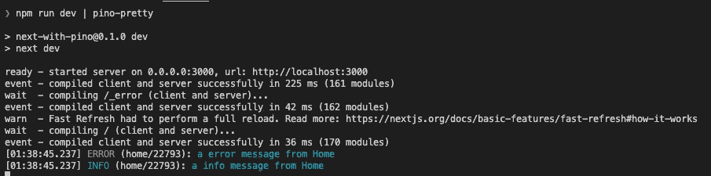
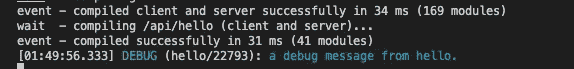

# 使用 Pino 更好地登录 Next.js 应用程序

> 原文：<https://levelup.gitconnected.com/better-logging-in-next-js-apps-with-pino-f973de4dd8dd>

随着 Next.js 越来越受欢迎，用它构建的应用程序的规模和复杂性也在增加。正如 season 开发人员可以证明的那样，日志对于在开发期间隔离问题和调试生产问题是一个非常有用的工具。Next.js 团队推荐 [Pino](https://github.com/pinojs/pino) 用于 Next.js 应用程序的日志记录。好的日志记录解决方案应该支持以下功能:

1.  应用程序的最小性能开销，
2.  能够设置每个日志语句的日志记录级别，
3.  能够将日志数据发送到各种传输目标，例如:控制台、文件等。,
4.  开发过程中支持 pretty format 和 JSON 格式，便于与其他日志解决方案集成，
5.  能够在不修改模块代码的情况下设置每个模块/组件的日志记录级别。

以上列表中的前 4 项可以通过 Pino 轻松实现。在本文中，我将介绍一种实现第 5 项的技术。

## **创建示例应用**

```
npx create-next-app next-with-pino --typescript
```

上面的命令为我们创建了一个新的 Next.js 应用程序来演示日志记录技术。

## **添加 Pino 依赖关系**

以下命令只安装本文中需要的依赖项:

```
npm install pino
```

## **日志级别配置**

`log-level.js`文件使开发人员能够指定每个模块的日志记录级别。该配置将与`logging/log-util.ts`中定义的功能协同工作。

log-level.js 指定每个模块的日志记录级别

第 4 行:`*`用作匹配所有模块
的通配符。第 5 行:指定`home`模块的日志记录级别为`info`

logging/log-util.ts 提供了两个日志记录实用程序函数

上面的文件中定义了两个日志记录实用程序函数:

1.  `getLogLevel(logger)` —将返回记录器设置的当前记录级别。
2.  `getLogger(name)` —为指定的`name`创建一个新的记录器。

第 3 行导入在`log-level.js`文件中定义的日志级别。该数据用于创建模块和相应日志级别之间的映射。

## **使用 Pages 中的日志记录实用程序**

定义了配置和效用函数后，我们现在可以看看如何利用它们。

第 4 行:导入`getLogger`函数来创建新的记录器
第 7 行:创建一个名为`app`
的新记录器第 9–11 行:调用记录器来创建一个错误、一个调试和一个信息日志条目

如果在`log-level.js`文件中没有指定`app`的日志级别，并且默认(*)日志级别设置为`silent`，则`app`模块不会打印任何日志条目。

类似地，`pages/index.tsx`中的第 4、#8 和# 10–12 行是日志相关的语句。当`home`的记录级别设置为`info`时，不打印`debug`级别日志条目:



来自 pages 模块的日志条目(无调试日志条目)

当页面被加载时，注意我们只看到来自`home`模块的日志条目，而没有来自`app`模块的日志条目，正如基于日志级配置所预期的那样。

**注意** : Pino 日志条目默认为 JSON 格式，日志条目已经通过管道传输到`pino-pretty`扩展模块。在开发过程中，我更喜欢 JSON 格式。

## **在 API 端点中使用日志记录实用程序**

除了在 pages 文件夹下的代码中使用我们的定制日志记录实用程序函数之外，它们还可以在 API 端点代码中使用。

向`log-level.js`配置添加一个条目并将`hello`模块记录级别设置为`debug`后，还会从`hello`模块打印一个日志条目。



## **总结**

日志记录在应用程序开发和生产过程中非常重要。使用几个简单的实用函数，创建记录器和按模块设置日志记录级别变得很简单。在具有许多组件的应用程序上工作，将日志划分到模块中，并且能够控制我们想要隐藏/显示日志的模块，这将帮助我们减少需要读取的日志条目的数量，并提高我们的生产力。

如果你想看看这篇文章中描述的代码，你可以从 [Github](https://github.com/tatleung/next-with-pino) 中克隆它。

我是 Medium 写作新手，我想加入“Medium 合作伙伴计划”。要获得资格，我需要 100+的追随者。如果你喜欢读这篇文章，请关注我，并与你的朋友和同事分享这篇文章。