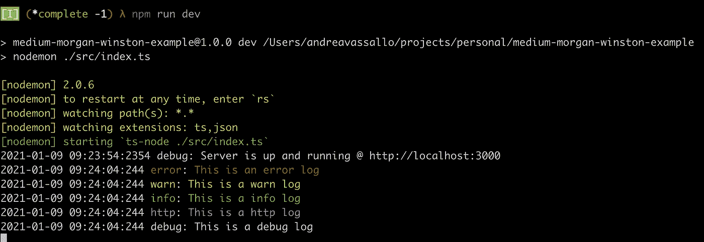
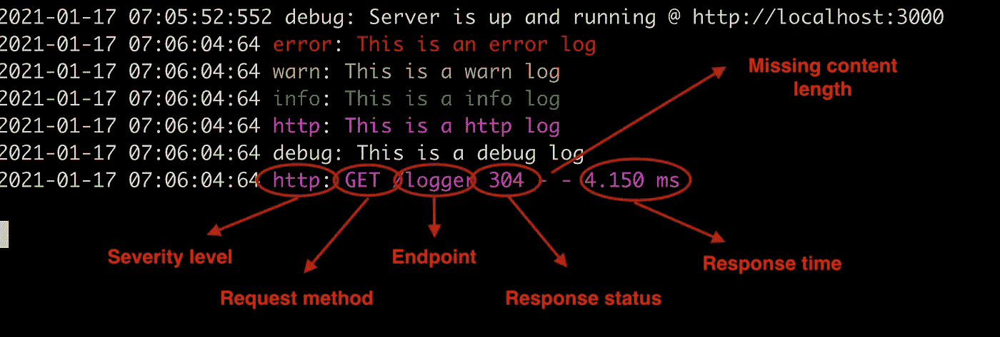
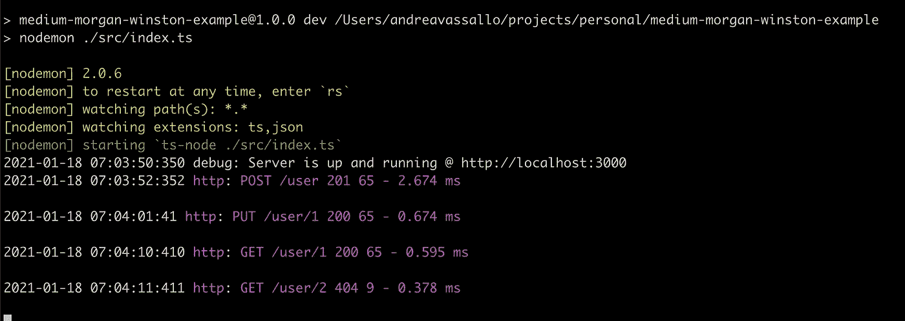

# 使用 Winston 和 Morgan 和 Typescript 实现更好的 ExpressJS 日志

> 原文：<https://levelup.gitconnected.com/better-logs-for-expressjs-using-winston-and-morgan-with-typescript-1c31c1ab9342>

## 如何使用 Typescript 通过 Winston 和 Morgan 记录器配置 ExpressJS 应用程序的分步指南


照片由[努贝尔森·费尔南德斯](https://unsplash.com/@nubelsondev?utm_source=unsplash&utm_medium=referral&utm_content=creditCopyText)在 [Unsplash](https://unsplash.com/s/photos/debugging?utm_source=unsplash&utm_medium=referral&utm_content=creditCopyText) 拍摄

> 一个好的日志系统是检查应用程序行为的最简单的方法之一，也是我们发现错误的第一个武器

如果您正在启动或者已经启动了一个 ExpressJS 应用程序，您可能想知道，我如何才能创建一个良好组织的日志系统？

问题是，很多应用程序没有一个全面的日志系统，甚至更糟糕的是，它们到处都使用简单的`console.log`。

在本文中，您将了解如何使用 Winston 和 Morgan 配置日志。

# TL；DR；

在这里您可以找到完全配置的[项目](https://github.com/vassalloandrea/medium-morgan-winston-example/tree/complete)(使用名为`complete`的分支)

我没有在本文中添加单元测试，但是下面的代码已经过全面测试。您可以在上面的存储库中找到所有的测试。

你需要一个好的模板来开始你的**express js graph QL API**吗？用我的:[https://github.com/vassalloandrea/express-template](https://github.com/vassalloandrea/express-template)

# 我们开始吧

首先，我们需要一个 ExpressJS 应用。您可以克隆此存储库。

```
git clone [https://github.com/vassalloandrea/medium-morgan-winston-example](https://github.com/vassalloandrea/medium-morgan-winston-example.git).git
```

# 启动服务器

该项目是使用从头开始的基本配置创建的。使用以下命令启动服务器:

```
cd medium-morgan-winston-example
npm install
npm run dev
```

# 安装温斯顿

[Winston](https://github.com/winstonjs/winston) 是一个有用的库，需要它来配置和定制访问许多有用特性的应用程序日志。

> 要在没有第三方库的情况下使用普通的`console.log`，我们需要编写大量代码，并重新发明轮子，了解这些年来 [Winston](https://github.com/winstonjs/winston) 抓住的所有边缘案例。

下面是我们应该在项目中实现的主要特性:

*   区分日志级别:错误、警告、信息、HTTP、调试
*   区分颜色，为每个日志级别添加一个颜色
*   根据应用程序环境显示或隐藏不同的日志级别；例如，当应用程序在生产环境中运行时，我们不会显示所有日志。
*   向每个日志行添加时间戳
*   将日志保存在文件中

```
npm install winston
```

# 配置温斯顿

在下面的代码行中，有一个简单的记录器配置。将它们复制并粘贴到您的项目中。可以用这个路径:`src/lib/logger.ts`或者类似的。

稍后我会解释每一行。

现在，您可以在导入应用程序的任何地方使用 ***Logger*** 函数。

转到定义了 [ExpressJS](https://expressjs.com/it/) 服务器的`index.ts`文件，用自定义的 ***Logger*** 方法替换所有的`console.log`。

查看结果启动服务器并通过`logger` [端点](http://localhost:3000/logger):



正如您所看到的，日志记录器根据日志的严重性使用不同的颜色显示日志，另一个重要的特性是所有这些日志都打印在`logs`目录下的`all.log`和`error.log`文件中。

# **了解有关配置的更多信息**

配置文件很简单。检查下面文件中的注释。

# 评估形势

现在，我们能够根据特性的复杂性添加日志来检测应用程序代码。

> 使用 Winston，您还可以使用 ENV 变量在运行时更改日志严重性。

因为 ExpressJS 是用来处理请求的，所以我们应该添加一个请求记录器，自动记录每个请求信息。应该使用一个可以很容易地与 Winston 配置集成的库来实现这个目标。

# 安装摩根

Morgan 是一个 NodeJS 中间件，用于定制请求日志。

与 Winston 的集成非常简单。您还记得我们添加到 Winston 配置中的`http`严重级别吗？它被设计成只能在摩根中间件上使用。

```
npm install morgan @types/morgan
```

# 配置摩根

在下面的代码行中，有一个简单的 Morgan 中间件配置。将它们复制并粘贴到您的项目中。可以用这个路径:`src/config/morganMiddleware.ts`或者类似的。

阅读评论以理解或扩展下面的配置。

将这个中间件添加到 ExpressJS 服务器的`index.ts`文件中:

```
import morganMiddleware from './config/morganMiddleware'...
...const PORT = 3000;app.use(morganMiddleware)app.get("/logger", (_, res) => {...
```

启动服务器，请求访问`logger` [端点](http://localhost:3000/logger):



以下是请求日志的其他示例:



# 享受配置

仅此而已！我希望这种配置能够帮助您测试您的代码，更容易地找到隐藏的错误。🐛

你喜欢这篇文章吗？用掌声和评论让我知道🙏

您的 ExpressJS 应用程序需要帮助吗？ [**雇佣我**](mailto:andrea.vassallo.94@gmail.com)

# GraphQL Morgan 配置的深化

本节只是对使用 GraphQL 的项目的深化。

默认情况下，GraphQL 只有一条路由，因此我们需要更改 Morgan 配置以使其有意义。