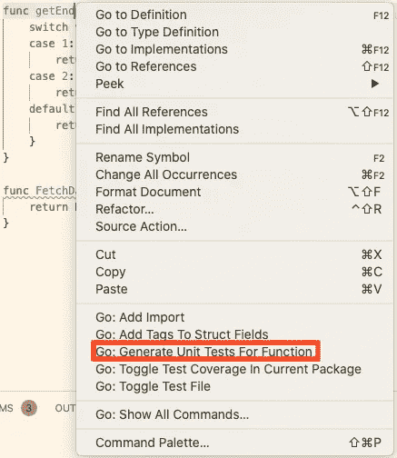

# 更好的 Golang 应用程序测试

> 原文：<https://levelup.gitconnected.com/better-tests-for-golang-apps-681ed2338677>

## 让我们写吧

## 在测试应用程序时，没有通用的标准


[斯科特·格雷厄姆](https://unsplash.com/@sctgrhm?utm_source=medium&utm_medium=referral)在 [Unsplash](https://unsplash.com?utm_source=medium&utm_medium=referral) 上拍照

大多数人认为测试软件是软件工程师执行的最重要的活动之一。如果一个软件速度很快或者写得很好，但是它没有完成预期的目标，那就没什么大不了的。测试是一门非常有趣的学科，如果你想成为一名更好的软件工程师，它绝对是一门需要掌握的重要学科。在本文中，我们将回顾一些非常好的模式来改进 Golang 应用程序的测试。我们将经历各种不同的场景，这些场景在性质、复杂性以及我们希望通过测试实现的目标方面都有所不同。

## 测试包

Golang 有一个测试包作为其标准库的一部分。[官方文档](https://golang.org/pkg/testing/)非常透彻，包含了很多例子。简而言之，它允许您编写可以用`go test`命令运行的自动化测试。创建测试时，你必须遵循将测试函数命名为`TestXxxxx`的惯例，其中`Xxxx`不是以小写字母开头。该包提供了运行、失败、跳过、日志等所需的所有基础设施。一个简单的测试可能看起来像(从[文档](https://golang.org/pkg/testing/)复制而来):

```
func TestAbs(t *testing.T) {
    got := Abs(-1)
    if got != 1 {
        t.Errorf("Abs(-1) = %d; want 1", got)
    }
}
```

如果没有遇到错误或失败，测试通过。非常简单。让我们开始逐渐增加复杂性，并检查不同的策略来解决这个问题。

## 使用参数化场景的单元测试(表格测试)

这是 Golang 中非常基本的测试策略。它包括创建一个参数化结构，其中包含给定函数的所有不同输入和预期输出。每个场景都有一个标识测试的名称。测试主体总是相同的，调用被测系统并断言与参数化期望相反的结果。有了这些模式，很容易理解一个函数的输入和预期输出是什么(当然，场景名称需要对此有所帮助)。让我们跳到一个例子。

这个函数返回给定 api 版本的正确端点。如果 api 版本无效，该函数将返回一个错误。

对它的测试可能是这样的。

对于这些测试，我们还使用了`[github.com/stretchr/testify/assert](https://github.com/stretchr/testify)`包来对我们期望为真的值进行更丰富的断言。

您可以使用 Visual Studio 代码为这种类型的测试生成样板文件，右键单击一个函数并选择“为函数生成单元测试”。这将读取函数的输入和输出，并生成`args`类型和`want`变量。



Visual Studio 代码上下文菜单

这种策略对于更简单的[纯函数](/immutability-in-golang-7a13199060bb)非常有效，在这种情况下，不需要模仿依赖关系，我们希望对于给定的输入，输出总是相同的。然而，参数化具有依赖性和其他复杂性的较长函数变得非常复杂。当一个函数没有处理大量不同的场景时，情况也是如此。参数化增加的复杂性破坏了简单性和易读性的目的。

如果您曾经使用过 **AAA** (安排、动作、断言)测试模式，那么在这一点上您可能已经理解了这里发生了什么。本质上，参数化零件是第一个 **A** (排列)。在我们将所有场景存储在一个数组中之后，我们开始在 for 循环中执行**A**acting 和 **A** sserting。每个测试都有一个用于识别场景的`name`，它实际上是由测试框架用指令`t.Run` ( `testing.*T.Run`)来执行的。

对于更复杂的场景，我个人觉得很难通读参数化的场景，当有很多参数化的场景，或者当你有非常不同的组成时(通常涉及模仿、存根或伪造)。另一个常见的问题是当我们的 **Act** 或 **Assert** 指令对于每个场景可能是不同的。有时候，我们并不真正关心特定场景的某个参数，或者某个返回值。没关系，试图使测试足够通用以适应所有差异可能是不值得的。因此，一种选择是手动创建并运行每个单独的场景。

让我们看看，当我们需要引入模仿、存根和假货时，事情何时开始变得复杂。

## 仿制品、存根、赝品

测试软件时一个非常常见的做法是模仿外部依赖，创建虚假的实现或存根。这是[依赖注入](/dependency-injection-in-go-using-receiver-functions-d76b7e541ecd)如今如此流行的一个重要原因。为了测试一个特定的场景，抽象出正确配置外部依赖项并按照您希望的方式运行的复杂性并不是一件容易的事情。然而，抽象通常会给代码带来复杂性，所以我们必须小心避免因为抽象而使代码变得难以理解。我想指出一个无需过多抽象就可以轻松嘲笑的特定场景(至少在 golang 中)。

一个非常常见的场景是通过 HTTP 消费某种外部服务。在这种情况下，处理依赖关系的另一个常见场景是为调用所述服务创建抽象。我的意思是，人们不是通过 HTTP 客户端直接调用服务，而是在一个接口后面抽象它，通常只有一个实现，即通过 HTTP 客户端调用它的实现，或者甚至为 HTTP 客户端创建一个抽象，这样他们就可以在测试中模拟它，而不是激发他们存储的请求，他们可以断言它，并返回一个预期的假响应。无论哪种方式，你总是在一些假设的基础上工作，因此会给产品代码库带来一些复杂性。

这里有一个例子，我们创建了一个名为`fetcher`的依赖项来隐藏 HTTP 客户端实现(为了测试)。下面是完整的实现:

我知道，那已经很多了。让我们试着分解一下。

*   `FetchData`——这是整个事情的切入点，它基于包含`baseURL`、`apiVersion`和我们新的`fetcher`的`Configuration`工作。这个函数从`getEndpointAndDecodeFunc`获取 URL 和解码函数。然后将 URL 传递给`fetcher.fetch`，并使用正确的函数对响应进行解码。
*   `getEndpointAndDecodeFunc` —这是对之前`getEndepoint`函数的重构。类似的行为。
*   `decodeAndMapv1` —这是将来自 API V1 的响应解码并映射到通用响应类型的特定函数。
*   `decodeAndMapv2` —同样的事情，但来自 API V2 的响应。

好了，让我们看看使用表格类型参数化场景的测试会是什么样子。

同样，这里发生了很多事情。总的来说，我们正在用多种场景进行测试，并针对不同的事情进行断言。然而，我们必须为每个测试配置所有可能的响应和参数，即使我们不使用它们。例如，前两个场景甚至没有检查来自`fetcher.fecth`的响应，但是我们必须用一个空的 person 指定`want`结构。这看起来有点浪费，因为我们正在配置我们不使用的东西。我们可以将测试重写如下:

完全相同的测试，但表达方式不同。在我看来，当场景和配置更复杂时，后者更容易阅读，尽管有一些代码重复。即使现在测试看起来更好，由于`fetcher`接口，我们的代码中仍然有抽象和复杂性。假设我们知道我们将只对那个呼叫使用 HTTP。我们可以放弃这个接口，直接依赖 HTTP 实现。为了测试，我们可以启动一个新的假服务器来服务这些请求，而不是模拟调用。这解决了我们在上一个场景中没有解决的一个问题，一个真正的 HTTP 请求。我们开始吧:

丢弃接口

用假服务器测试

这是一个相当简单的例子，但是这种技术非常强大。现在我们可以让服务器按照我们想要的那样严格，捕捉不同的场景。在这种情况下，我们唯一要检查的是`r.Method != “GET”`。这意味着，如果由于某种原因，客户端代码更改为使用`POST`而不是`GET`，测试将会失败。我们没有检查请求是否在嘲讽之前被正确地形成。现在这相当容易。我们可以检查认证头、接受头、内容类型等。任何事。这也适用于答复。在这种情况下，我们不会以任何特定的方式处理响应代码，但是我们可以。我们也可以在假服务器上为不同的场景返回不同的代码。

此外，我敢说测试看起来甚至比以前更简单，产品代码也是如此，没有接口抽象。

另一个重要的点是，我们实际上用那个测试覆盖了很多代码。这是一个简单的例子，用这样的测试覆盖代码并不总是那么容易。这就是为什么你必须考虑使用什么策略。尽管这些测试没有直接测试代码那么快，但仍然非常快(它们在我的笔记本电脑上的`0.255s`中运行)。这种技术并不总是正确的，有时添加模拟更适合你的情况，这也没关系。重要的是你要知道选择，并意识到你所做的权衡。

## 集成(API)测试

一个通常很难做好的测试是集成测试，或者 API 测试。当你在开发一个 API 时，有很多事情通常会超出你的直接处理函数，比如，通过[中间件](/middlewares-for-golang-web-apps-8742e28eef6e)来处理诸如认证和添加你需要的东西到[上下文](/context-in-golang-98908f042a57)中，或者通过通用方式序列化响应的函数。如果您只是孤立地测试您的处理程序，或者更糟糕的是，只测试您在处理程序内部调用的函数，您可能最终会遇到这样的问题，比如让端点可以公开访问(没有身份验证)或者响应没有按照它们应该的方式序列化。这种测试的编写和运行成本通常更高，因为它们迫使您将外部依赖项变得可配置和可模仿，但它们也带来了很多价值和信心，让您相信事情会按预期进行。

您可以使用我们在上一节中使用的类似技术，只是相反。您的被测系统将实际运行在服务器上，测试代码将是它的客户机。如果你有足够的配置，那应该不会太难。

## 结束语

测试并不容易。这需要时间、努力和大量的设计决策。有时，为了能够测试某些东西，你必须将复杂性引入生产代码库，以抽象事物。这没关系。然而，为代码级别的所有东西创建抽象和模仿并不总是答案。您必须使用您所拥有的工具来使代码尽可能简单，同时也使其易于测试。这不是一项简单的任务，需要深思熟虑。

我个人宁愿花更多的时间添加高级测试(如集成，甚至端到端测试)，而不是测试代码库中的每一个功能。通常，当您添加这些测试时，您间接地覆盖了功能(可以说很难覆盖所有场景)，并且您减轻了重构者的负担，因为您不需要为您更改的每个功能更改测试。不要误解我，单元测试是开发周期的基础，我看到的很多是对单元的误解。不叫功能测试或者方法测试是有原因的。就是因为一个单位可以比那个大，也没问题。尝试测试代码库中的每个功能比测试适当的单元和创建更高级别的测试要昂贵得多。有时，我在开发内部函数(属于另一个单元的一部分)时，会添加一些测试，以确保它按照我的预期工作，并且我的思路是正确的。当我实现完单元的其余部分并对其进行测试时，我实际上删除了那些测试，因为它们不再为代码库增加价值。这听起来像是一种浪费，但是在我看来，留下一段对整个代码库没有价值的代码更浪费。