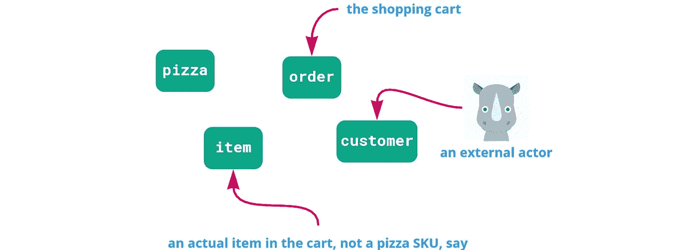
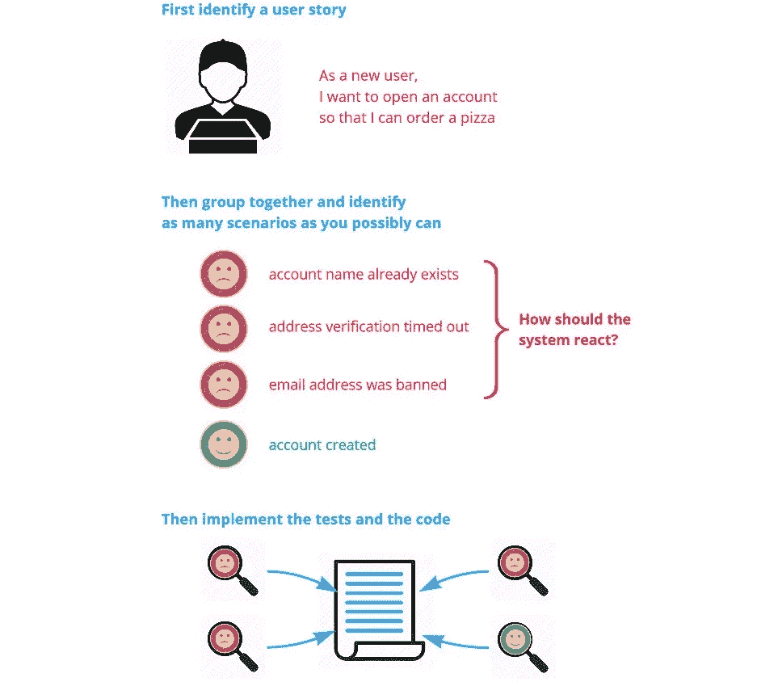

# 使用这三种成熟的技术来改进你的单元测试

> 原文：<https://levelup.gitconnected.com/better-unit-testing-practices-for-error-free-code-be7bdb56b86f>


当送货人踩下踏板时，披萨就送到了。[图片由[凯皮尔格](https://unsplash.com/@kaip?utm_source=medium&utm_medium=referral)[】](https://unsplash.com?utm_source=medium&utm_medium=referral)

当我们开发一个新的软件特性或故事时，错误处理往往是事后才想到的——或者更糟，当碰巧发现一个 bug 时。这会导致许多边缘情况和错误条件被忽略。结果？一款比奶酪刨丝器还多孔的发布产品。

> 但是，如果有一种方法可以从一开始就测试错误处理，并确保几乎所有的错误条件都被覆盖，那会怎么样呢？

在本文中，我将介绍三种实践，它们将使您的总体测试策略更加有效。

特别是，你会发现你的测试开始[强调需求覆盖](https://codeburst.io/code-coverage-vs-test-coverage-c9afb261e902)和错误处理，这将使你的代码变得更加严格——甚至防弹。

我最近在总部位于伦敦的 FinTech 先锋公司 [11:FS](https://11fs.com/) 尝试了这些和其他自动化测试技术，目前已经看到了很好的结果。我参与了他们核心银行服务的架构和开发，其中代码质量显然是最重要的。

不过，在我们开始之前，程序员联盟规定我们必须有一个基于比萨饼的例子，所以开始吧:

🍕您正在为一家披萨外卖初创公司创建订购系统，该公司由屡获殊荣的企业家 Pete 创立。为了简单起见，Pete 只提供一种三种尺寸的披萨(坏消息是，披萨里有凤尾鱼——这是我们可以改进的地方)。

这个例子也简单地使用了 awesome [ScalaTest](http://www.scalatest.org/) ，但是同样的原则也适用，不管你喜欢的语言和测试框架是什么。

所以，第一次练习…

# 1.将您的测试面向业务领域，而不是代码

这是一个很容易立即开始做的事情，它将对你的测试产生深远的影响。当我们编写单元测试时，我们倾向于完全沉浸在代码中；因此，测试应该在代码的上下文中编写，而不是在业务需求的上下文中。请这样想:

*   **需求** =你正在解决的问题
*   **代码** =解决方案

如果你的测试集中在代码上，很容易忽略真正的目标。所以…

> 相反，把你的测试集中在用户故事和业务领域上

因此，对于比萨饼交付功能的第一口，测试中的系统(或 SUT)最初看起来像这样:

这是第一个测试:

测试给`amounts`分配一系列`BigDecimal`值，将它们传递给`calculateTotal`，然后断言结果。在进行过程中，您还需要为每个额外的函数编写一个类似的测试。

乍一看，该测试似乎…好吧…当然，它是在测试`calculateTotal`函数，并断言给定一个累加的金额列表，它会返回正确的结果。我们还能从单元测试中得到什么呢？

事实证明，相当多！

问题是测试是从被测试的函数中诞生的；因此，它只能证明该功能在技术上是正确的，而不能证明它满足了特定的要求。如果您想要确保您的所有用户故事都在一系列场景中得到完全实现和测试——顺便说一下，这是一个好主意——需要几个跳跃才能将上面的测试追溯到它的原始故事。

😕所以(采用教师的口吻)如果你不知道哪些测试是针对哪个故事的——反过来说，哪些故事和场景是经过充分测试的——你怎么知道你已经写了足够多的测试呢？

那么，让我们从头开始，从一个[用户故事](https://medium.com/parallel-agile-blog/user-stories-are-requirements-described-from-the-business-perspective-feebe6d4d5c5)开始:

```
As a hungry customer, I want to know the total price given the pizza items in my order.
```

您已经可以从这一个需求中挑选出一些域对象:



我们可以进一步完善这些域对象名称，使它们更清晰，例如用`OrderItem`代替`item`，但是现在让我们用它们来运行。

在测试中直接使用这些名称，因此在应用程序代码中也是如此。

因为故事是在客户/BA/SME 在场的情况下形成的，所以它们将用业务语言编写；所以开发人员使用完全相同的术语是值得的。这有助于确保每个人都说同一种语言。

在这种情况下，询问鲍勃这位获奖的企业家，你会发现他不仅仅计划销售披萨，他很快会将热狗、薯条和碳酸饮料加入他受人尊敬的产品线。所以一个`Pizza`域对象是不够的——你需要一些更通用的东西，比如一个`LineItem`。

在编写测试时，您将开始将故事分解成场景，特别是考虑可能出错的地方。

测试现在看起来像这样:

您已经可以看到这是如何产生一个更有意义的测试的，并且我们已经确定了一个额外的场景。

然而，主要的变化是测试标题不再指特定的代码功能，而是指用户故事和场景。

遵循这个领域驱动的过程对代码也有积极的影响:

注意，`PizzaService`已经消失了，至少目前是这样。当您开始实现下订单等功能时，新的服务可能会出现，但是现在，新的`Order`类拥有计算总价所需的一切。

因此，遵循[领域驱动的](https://medium.com/modern-software-architecture/modern-software-architecture-1-domain-driven-design-f06fad8695f9)方法，同时[将您的测试面向业务领域](https://www.domainorientedtesting.com/)具有改善 SUT 设计的良好效果，同时使测试本身更加关注正在解决的实际问题。

但是如果您认为示例测试开始看起来有点不像单元测试，那么您是对的。这就把我们带到了第二个练习…

# 2.比起单元测试，更喜欢组件测试

组件测试类似于单元测试，但是它们覆盖了更多的代码。一个*组件*是一组紧密相关的类(在 [DOT](http://domainorientedtesting.com/) 世界中，它可以包含一个“实现被测试特性的封闭系统”，例如一个完整的微服务)。

组件测试比单元测试更容易操作，也更有效。他们是测试范围的[“金发女孩”级别。](https://medium.com/swlh/write-tests-at-three-levels-909561a9544b)

组件测试相对于单元测试的优势有很多，但这里有一个非常好的…

我读过很多文章，建议开发人员保持他们的测试尽可能的小和集中，这样程序执行就不会“泄漏”到每个测试的范围之外。考虑一下这个:


checkOrder 调用 checkItem…啊哦？

例如，这个针对`checkOrder()`的特定单元测试可以验证订单地址是否被检查，与检查项目无关。然而，指南是这样的，如果在测试过程中允许`checkOrder()`调用`checkItem()`，那么这就是一个不纯的单元测试，因为它执行的代码比预期的多。

为了防止这种情况，测试初始化一个[模拟对象](https://medium.com/swlh/test-automation-creating-mock-objects-using-mockito-simple-guide-d6c0e558472a)并将其注入到被测试的类中。那么函数调用将命中模拟而不是“真实的”`checkItem()`。

创建这些模拟可能很耗时，而且它们也使测试变得相当脆弱，因为测试必须了解 SUT 的内部工作方式。

> 但是——讽刺的是——所有这些额外的努力*使得测试***效果不佳*。*

*如果在代码的某个部分引入了一个 bug(比方说，`checkItem()`在被`checkOrder()`调用时抛出一个异常)，您可能会想知道它——不管它是如何被发现的。如果它碰巧被“错误的”单元测试发现，不要担心…只要庆幸你发现了这个 bug。*

*(但是一定要重温一下测试，即*应该*已经发现了 bug)…*

*👍**我们在这里谈论的是实用主义，而不是意识形态。***

*那么，组件测试在这里有什么帮助呢？*

*因为每个组件测试比一个单元测试覆盖更多的代码，你会发现你编写模拟的需求要少得多。所以你的测试变得不那么脆弱了——它们不会因为你改变了函数内部的某些东西而虚假地崩溃。*

*因为你没有花时间嘲笑 SUT 的内部结构，你的注意力并不主要在代码上；取而代之的是商业领域和故事。*

*您还需要编写更少的组件测试(尽管您会发现自己为每个测试编写了更多的场景——参见下一个指南)。*

*我写了更多关于组件测试的文章，因为它们确实是蜜蜂的膝盖:*

*[](https://codeburst.io/component-tests-vs-unit-tests-tdd-71b921d48907) [## 为什么你应该写组件测试而不是单元测试

### 你的测试将不再脆弱，你的代码将变得刀枪不入🔫

codeburst.io](https://codeburst.io/component-tests-vs-unit-tests-tdd-71b921d48907) 

第三个练习用一把整齐的防弹弓将前两个练习联系在一起:

# 3.先测试，但也要先识别

这个想法不仅仅是“测试第一”，而且——对于每一个故事——在你开始编写测试之前就确定测试场景:



将场景分为快乐的和不快乐的路径，真正关注“不快乐的”。你真的想深入了解 SUT 是如何处理意外事件的，特别是错误、消息到达顺序错误等等。当你想到每一个的时候，把它作为一个新的“待定”场景添加到你的测试套件中；然后在实现每个测试时实现代码。

简而言之，根据每个故事的多个场景来考虑您的测试。由于涵盖了所有的边缘情况和错误条件，您的代码将从一开始就具有内置的错误处理功能。

> 并且您将能够更有信心地部署到生产环境中，相信代码会如预期的那样运行。

本质上，这就是你如何编写更严谨、更集中和更有目的的单元测试！* 

**如果你想更深入地探索这些单元测试技术，请查看面向领域的测试:**

*[](https://www.domainorientedtesting.com/) [## 一种简洁高效的自动化软件测试方法

### 将您的测试导向业务领域面向领域的测试(DOT)是“面向领域的”,因为一切…

www.domainorientedtesting.com](https://www.domainorientedtesting.com/) 

*并且一定要加入 LinkedIn* *上的* [*讨论组。*](https://www.linkedin.com/groups/13804489/)*