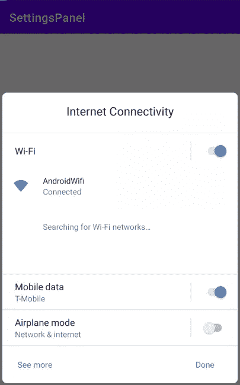
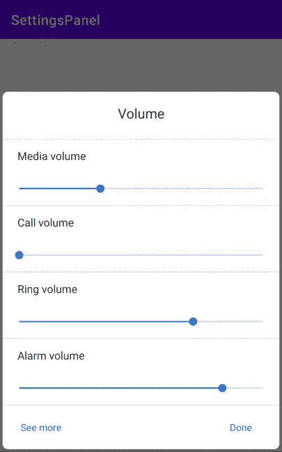
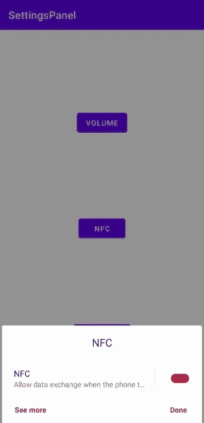
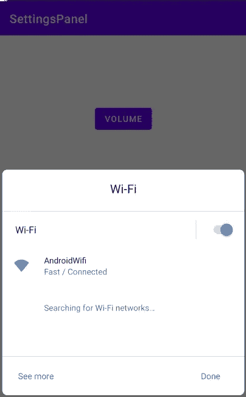

# 更好的 UX 与 Android 上的设置面板 API

> 原文：<https://levelup.gitconnected.com/better-ux-with-settings-panel-api-on-android-33588da35831>

## 应用参与度


由[斯登冲锋枪·里特菲尔德](https://unsplash.com/@stenslens?utm_source=unsplash&utm_medium=referral&utm_content=creditCopyText)在 [Unsplash](https://unsplash.com/s/photos/mobile-settings?utm_source=unsplash&utm_medium=referral&utm_content=creditCopyText) 拍摄的照片

应用程序参与度是一个重要的指标，可以洞察应用程序的成功，实现这一目标是一项具有挑战性的任务。解决这个问题的一个方法是让用户专注于应用程序，而不是应用程序需要什么。设置面板 API 是通过确保用户在与应用程序交互时不会失去焦点来确保用户参与的一种方式。

[设置面板](https://developer.android.com/reference/kotlin/android/provider/Settings.Panel)在 API level 29 (Android Q)中引入，它允许我们在应用程序顶部显示 UI 面板，而无需导航离开。浮动用户界面显示应用程序中常用的设置，这样用户就不必离开应用程序上下文来切换这些设置。因此，保持用户在同一个应用程序窗口，并减少应用程序最小化。

这使得应用程序具有更好的 UX 设计，允许用户快速有效地执行操作

根据使用情况，用户可以使用 4 种不同类型的设置

1.  互联网连接设置
2.  音量设置
3.  NFC 设置
4.  无线设置

让我们逐一查看它们，以了解如何实现它们

# 1.互联网连接设置



互联网连接设置面板

该面板使用户能够切换 Wifi、移动数据和飞行模式等互联网连接设置。

`Settings.Panel.*ACTION_INTERNET_CONNECTIVITY*` 在 Intent 中传递，以便在调用应用程序的顶部显示此面板。最后一段代码看起来像这样:

```
startActivity(Intent(Settings.Panel.*ACTION_INTERNET_CONNECTIVITY*))
```

通常，在数据连接不良或不活跃的情况下，会向用户显示警告，并提供重试网络呼叫的选项。这可能是一个警告对话框或一个单独的对话片段的形式，取决于正在使用的应用程序。在这里，启动设置面板的第二个选项可以允许用户切换到活动的数据连接，而不必离开应用程序，从而为良好的用户体验提供一致性

# 2.音量设置



音量设置面板

此面板使用户能够修改媒体、呼叫、警报和铃声的音量设置。如果你的应用程序负责处理任何形式的媒体播放的音频，那么这个面板应该非常方便。

```
startActivity(Intent(Settings.Panel.*ACTION_VOLUME*))
```

# 3.NFC 设置



NFC 设置面板

利用 NFC 的应用可以受益于这一特性，因为它提供了在设备中启用/禁用 NFC 的切换，只需一行代码。

“查看更多”按钮通过打开 NFC 设备设置来显示高级设置

```
startActivity(Intent(Settings.Panel.*ACTION_NFC*))
```

# 4.WiFi 设置



WiFi 设置面板

如果您的应用程序在您的设备连接到 Wi-Fi 信号之前阻止下载大文件和应用程序，此功能将非常有用。用户将能够连接到 Wi-Fi 信号，或者从应用程序本身的可用选项中切换。

请注意，应用程序没有回调来理解用户在设置面板中执行了什么操作

```
startActivity(Intent(Settings.Panel.*ACTION_WIFI*))
```

## 最后的想法

系统通知托盘已经为用户提供了大部分这些功能。然而，由于能够在大多数 Android 启动程序中定制通知图标，所以提供对应用程序想要使用的特性的简单访问总是一个好主意。这确保了流畅的用户导航和更好的 UX 设计。

本文到此为止。您可以在 GitHub 上找到示例应用程序的源代码。

[](https://github.com/KunalChaubal/SettingsPanelExample) [## KunalChaubal/设置面板示例

### 在 GitHub 上创建一个帐户，为 KunalChaubal/settings panel example 开发做出贡献。

github.com](https://github.com/KunalChaubal/SettingsPanelExample)