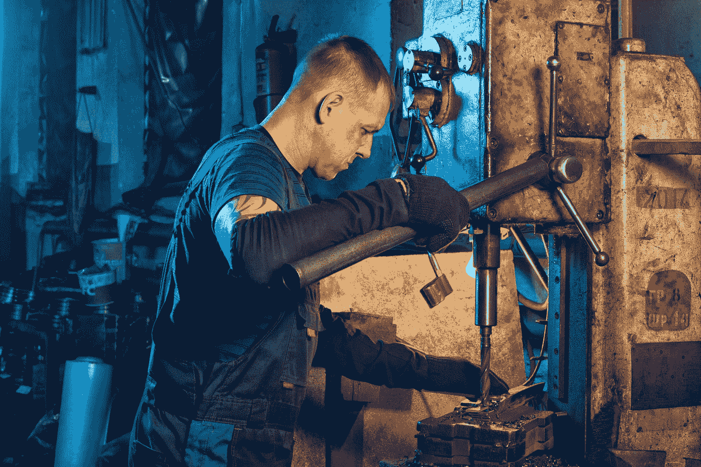

# 远程开发人员提高工作效率的更好方法

> 原文：<https://levelup.gitconnected.com/better-ways-to-be-productive-as-remote-developers-cbb59271fc97>

瓦列里·塞索耶夫在 [Unsplash](https://unsplash.com?utm_source=medium&utm_medium=referral) 上的照片

成为一名优秀的远程工作者需要很多训练。我们必须自己做每件事，没有人看着。

在本文中，我们将研究一些可以成为优秀远程开发者的习惯。

# 过度沟通

交流比呆在办公室里更重要，因为没有人能看到我们通常在做什么。

因此，我们需要让人们知道我们在做什么，这样我们就不会踩到对方的脚趾。

此外，我们应该努力在工作的时候回复信息，这样我们就不会让别人久等了。

我们可以随时回答，因为我们可以在电脑上进行多任务处理。所以我们应该经常检查我们的信息并回复它们。

# 投资可靠的技术

在当今世界，在家工作就是在电脑上工作。这对每个人都很重要，因为这是我们完成任何事情所需要的。

我们应该买一台速度快的电脑，这样我们就不用一直等着加载东西，我们就可以打开更多的窗口。

由于开发人员必须构建、重新加载代码并一直运行测试，我们必须确保我们的计算机尽可能快地完成所有这些工作。

此外，作为开发人员，我们总是要查看一百万个窗口，所以我们可能需要第二台显示器，这样我们就可以并排查看更多的内容。

还有，我们要有高质量的耳机来接电话会议。

如果我们需要举行视频会议，网络摄像头也可能是有用的。

舒适的键盘和鼠标也是需要的，因为我们会一直使用它们。

当然，最重要的是，快速可靠的互联网也非常重要，因为我们所有的工作都将通过互联网完成。

因此，我们应该把钱放在快速可靠的互联网上。

# 依靠我们的社区

远程工作时，我们仍然可以进行社交活动。我们还有通讯工具可以在线交流。所以我们可以用它们与人交往。

这样，我们就不必长久孤独，重新快乐起来。

此外，我们可以和邻居一起散步，这是我们在远程工作时保持清醒的另一种方式。

# 改善我们的工作空间

我们无法控制办公室里的工作空间，因为我们不拥有它。然而，我们可以在自己的地方这样做，因为我们可以控制它。

我们可以把一把烂椅子换成一把好椅子。此外，我们还能买到符合我们需求的书桌。

因此，与其有一个拥挤的隔间或者更糟的开放式办公室，我们可以把它们换成更好的东西，

如果我们想在没有噪音和干扰的情况下工作，现在是时候了。我们可以得到任何我们需要的东西，比如泡沫，降噪耳机和其他过滤噪音的东西。

我们也可以随时工作，只要把事情做完，这样我们可以更快地完成工作。

图片由 [Unsplash](https://unsplash.com?utm_source=medium&utm_medium=referral) 上的 [Arshad Pooloo](https://unsplash.com/@ar_shad?utm_source=medium&utm_medium=referral) 拍摄

# 花时间照顾自己

自我护理也很重要。我们应该确保休息，不要工作得太累。

这样做可能很诱人，因为所有的东西都在同一台电脑上，我们不必进出办公室工作。

我们应该制定一个健身计划，这样即使我们在室内工作也能得到锻炼。

散步，健康饮食，休息。

健康饮食应该更容易，因为我们不必吃不健康的、碳水化合物含量高的食物，如格兰诺拉麦片和一直存放在办公室食品室的谷类食品。

相反，我们可以吃像鸡蛋这样更健康的东西，因为它们含有更少的碳水化合物，不会让我们疲劳和肥胖。

这样，即使我们不得不坐下来工作一整天，我们也不会累或胖。

# 结论

为了让我们工作得更快，快速的计算机和互联网连接是必须的。

因为所有的事情都是通过互联网完成的，所以这些都是需要的。开发人员需要一台快速的计算机来快速构建和测试代码。此外，由于我们经常打开许多窗口，我们必须有多个显示器。没有比这更好的了，所以让我们一起来看看。

还有，我们要照顾好自己。通过获得更好的椅子、桌子和过滤噪音来改善我们的家庭办公空间。