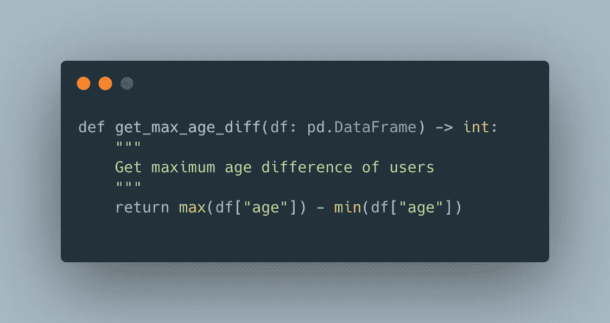
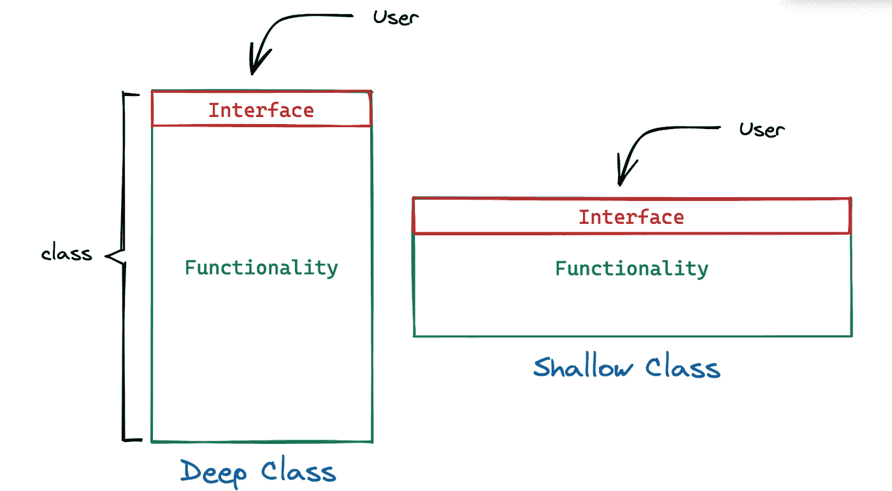
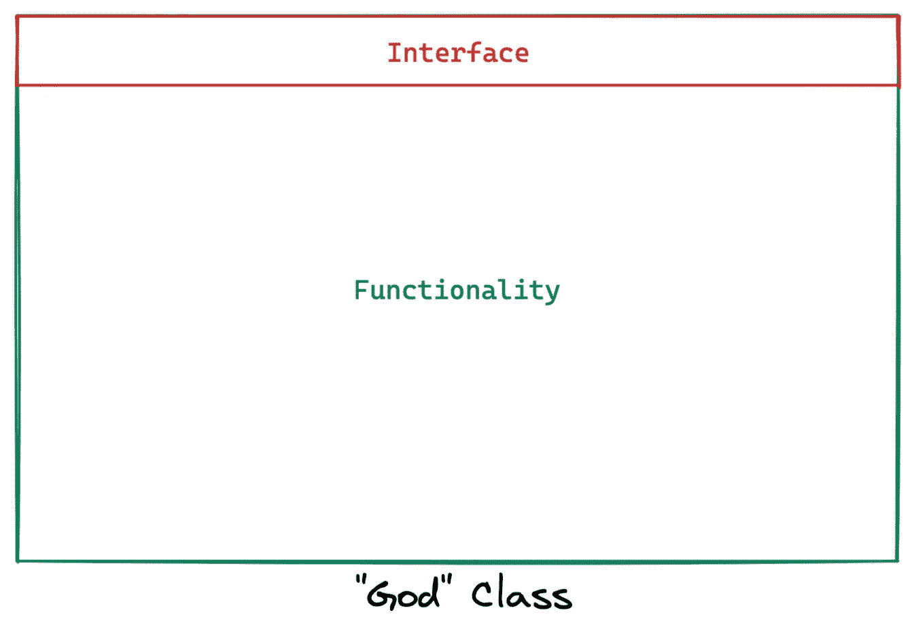
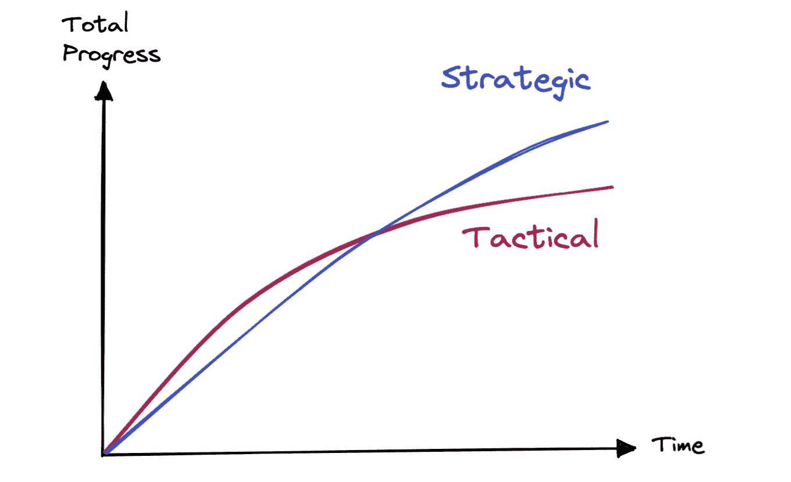

# 当心软件设计和工程中的这些常见误解

> 原文：<https://levelup.gitconnected.com/beware-of-these-common-misconceptions-in-software-design-and-engineering-29a3730fd5a3>

## 不要把建议看得太重

肖恩·林在 [Unsplash](https://unsplash.com?utm_source=medium&utm_medium=referral) 上的照片

## 误解 1:冗长是王道👑

在我编程的最初几年，我被教导要在任何地方留下注释——无论是定义一个模块、类、函数、方法还是在代码行中。我们的想法是尽可能的详细，这样其他开发人员就能准确地知道正在发生什么。

随着时间的推移，我意识到，即使这种教学背后的意图不是完全错误的，但也不是完全正确的。看看下面这个例子。

在这里，我们定义了一个函数来捕捉用户的最大年龄差异。显然，即使没有 docstring，这个函数也是非常清晰的。注释(在本例中是 docstrings)因此是不必要的，违反了“不要重复自己”( [DRY](https://en.wikipedia.org/wiki/Don%27t_repeat_yourself) )的原则。

示例(图片由作者提供)

相反，使用注释来描述思维过程，比如一个类如何与其他类交互，或者为什么某个数值被硬编码到代码库中。

**外卖**:注释要描述代码中不明显的东西，增加价值。

## 误解 2:方法不应该超过𝑥线

当我开始学习编程时，我被告知神奇的数字 *𝑥* 是 15-20 行。还有吗？

*写一个新方法。*

目的是好的——让你的代码模块化。然而，它的教学方式是错误的。保持小的方法或函数不是重点，也不应该是。

**外卖**:长度不是大问题，是 ***抽象*** 。让常见的情况变得简单。

## 误解 3:类应该很深

是的……但是深度不是重点。

你看，大多数时候我们创建类是因为我们接触到一些低级代码，想要抽象掉那些复杂性。因此，我们试图尽可能地抽象掉这种复杂性，创建更深层次的类。

浅层与深层课程(图片由作者提供)

正如你在上面的图片中看到的，类有它的**功能**(用绿色表示)和它的**接口**(用红色表示)，它们都是向用户公开的。也就是说，一个类的接口本质上是用户为了使用该类而必须知道的一切。

> 简单来说，要让你的类对用户有益，收益(功能)必须大于成本(界面)。

在上图中，这两个类是截然相反的。很明显越深的课越好。然而，我们大多数人所做的是最终拥有一个具有大接口的深类，或者具有极大接口的极深类(又名[上帝对象](https://en.wikipedia.org/wiki/God_object))。

一个对用户来说太多太复杂的神类

**外卖**:

*   界面应该尽可能小，而功能应该尽可能大
*   肤浅的类在对抗复杂性方面没有帮助
*   对实现的更改不应该改变接口(至少不会改变太多)

## 误解 4:“快速移动并打破东西”

直到 2014 年，这个开发口号一直由 Meta(之前的脸书)创造和采用，并被他们和其他许多旨在快速开发的公司采用。这个概念是，如果你不打破东西，那么你可能移动得不够快。

这种开发方法也被称为**战术编程**，其目标是让事情尽可能快地运转起来。使用这种方法，特性可以很快推出，而技术债务也会很快增加。功能通常优先于修复团队创建的“黑客”。结果:[意大利面代码](https://www.bmc.com/blogs/spaghetti-code/)。

相比之下，我们可以采用一种更慢的方法，也称为**战略规划**。在这种方法中，我们采取零容忍和投资心态。这里的目标是用一个伟大的设计产生好的代码——有效的代码是不够好的。一个良好的坚实基础可以最大限度地降低复杂性，并为未来的发展奠定基础。

> 花额外的时间去做一些小事，以获得长期的回报。

**哪种方法比较好？**

2014 年后，Meta 将其开发口号从“*快速移动并打破常规*”改为“ [*快速移动并拥有稳定的基础设施*](https://www.cnet.com/tech/mobile/zuckerberg-move-fast-and-break-things-isnt-how-we-operate-anymore/#:~:text=The%20new%20motto%3A%20%22Move%20fast,it's%20how%20we%20operate%20now.%22&text=%22As%20developers%2C%20moving%20quickly%20was,do%20it%2C%22%20Zuckerberg%20added.) ”，采用了战略性编程方法。随着 Meta 的发展，他们意识到他们的战术编程方法不再可持续。他们的技术债务堆积太多，以至于建造一个东西意味着修理十个其他东西。

战略规划赢得时间(图片由作者提供)

在某些情况下(例如，大多数初创企业)，战术编程是不可避免的。在投资者的持续压力下，总会有新的功能推出。走向市场是关键目标。在这些情况下，采用某种混合方法可能是明智的。

**要点**:复杂性不是一个单一的错误——它是许多人长期犯的错误的组合。如果可以的话，总是选择**战略规划**方法。

# 最后的话

***支持我！*** —如果你喜欢我的内容并且*没有*订阅 Medium，请考虑支持我并通过我的推荐链接[订阅这里](https://davidcjw.medium.com/membership) ( *注意:你的一部分会员费将作为推荐费*分摊给我)。否则，留下一个👏🏻鼓掌或💬注释也有助于算法！

# 参考

[1]: [软件设计的哲学](https://www.youtube.com/watch?v=bmSAYlu0NcY)
【2】:[上帝之物](https://en.wikipedia.org/wiki/God_object)
【3】:[扎克伯格:“快速行动，打破常规”不再是脸书的经营方式](https://www.cnet.com/tech/mobile/zuckerberg-move-fast-and-break-things-isnt-how-we-operate-anymore/)

# 分级编码

感谢您成为我们社区的一员！在你离开之前:

*   👏为故事鼓掌，跟着作者走👉
*   📰查看[升级编码出版物](https://levelup.gitconnected.com/?utm_source=pub&utm_medium=post)中的更多内容
*   🔔关注我们:[Twitter](https://twitter.com/gitconnected)|[LinkedIn](https://www.linkedin.com/company/gitconnected)|[时事通讯](https://newsletter.levelup.dev)

🚀👉 [**加入升级人才集体，找到一份惊艳的工作**](https://jobs.levelup.dev/talent/welcome?referral=true)