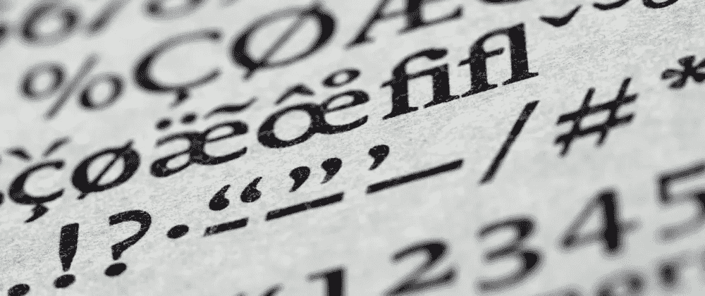

# 小心字体名称

> 原文：<https://levelup.gitconnected.com/beware-the-font-name-3c590721673c>



## 一个简单的命名错误可能会耗费精力、时间和金钱。

有一天在工作中，我们在审查一些 CSS 代码时，我们遇到了一些有趣的事情。这与我们如何导入从代理处获得的新字体文件有关。

代码看起来像这样:

```
@font-face {
  font-family: myFont;
  src: url(myFont.eot);
  src: url(myFont.woff) format("woff"), 
       url(myFont.ttf) format("truetype");
}@font-face {
  font-family: myFont-bold;
  src: url(myFont-Bold.otf);
}@font-face {
  font-family: myFont-bolditalic;
  src: url(myFont-BoldItalic.otf);
}@font-face {
  font-family: myFont-italic;
  src: url(myFont-Italic.otf);
}@font-face {
  font-family: myFont-medium;
  src: url(myFont-Medium.otf);
}@font-face {
  font-family: myFont-mediumitalic;
  src: url(myFont-MediumItalic.otf);
}
```

这是一个令人困惑的时刻，引出了一个更有趣的*对话:*

> DEV 1:
> 你为什么这样做？
> 
> *DEV 2:* 代理商就是这么提供字体的。
> 
> *DEV 1:* 但是这使得代码更难维护。
> 
> *DEV 2:* 没那么多。
> 
> *DEV 1:* 还有，你用的可能不是你以为自己在用的字体。为什么不为所有字体取一个相同的名字呢？
> 
> *DEV 2:* “同名”是什么意思？
> 
> *DEV 1:*

```
@font-face {
  font-family: myFont;
  src: url(myFont.eot);
  src: url(myFont.woff) format("woff"), 
       url(myFont.ttf) format("truetype");
}

@font-face {
  font-family: myFont;
  src: url(myFont-Bold.otf);
  font-weight: bold;
}

@font-face {
  font-family: myFont;
  src: url(myFont-BoldItalic.otf);
  font-style: italic;
  font-weight: bold;
}

@font-face {
  font-family: myFont;
  src: url(myFont-Italic.otf);
  font-style: italic;
}

@font-face {
  font-family: myFont;
  src: url(myFont-Medium.otf);
  font-weight: 500;
}

@font-face {
  font-family: myFont;
  src: url(myFont-MediumItalic.otf);
  font-style: italic;
  font-weight: 500;
}
```

> 等等，你不能这么做！…你能吗？！

我必须承认，在这一点上，我怀疑自己，不得不停下来验证建议的替代方案实际上是正确的。

# 测试

但即使在解释之后，另一个开发人员似乎也不太信服，所以我们创建了一个简单的示例:

```
<section>
  <h1>This is a title</title>
  <p>
    And this is a paragraph with <b>bold text</b> using
    the <strong>b and strong tags</strong>.
  </p>
</section>
```

CSS 看起来像第一个导入，加上这些规则:

```
body {
  font-family: myFont, sans-serif;
}h1, h2, h3, h4 {
  font-family: myFont-bold, sans-serif;
}
```

文本使用了新的字体，标题`<b>`和`<strong>`看起来是粗体的。一切似乎都是正确的...但真的不是。在我们用一种看起来完全不同的新字体取代粗体字体后，就更容易看到了，就像手写字体一样:

```
@font-face {
  font-family: myFont-bold;
  src: url(Handwriting-bold.otf);
}
```

在那之后，我们重新加载了页面，并且……标题看起来很粗体并且有了新的字体，并且`<b>`和`<strong>`元素看起来也很粗体...但是他们有旧字体！

实际上，浏览器已经综合加粗了常规字体，使其看起来更接近实际情况。但那不是粗体。W3C 字体模块定义上的一个例子详细解释了这个效果和过程。

现在，很明显问题出在哪里，我们需要做什么。如果我们为所有的字体保留不同的名称，我们将需要为每一个元素和情况重新定义字体。否则，我们将只是使用常规字体(由浏览器修改以正确显示)，而不是我们已有的自定义字体。

# 结论

我们的团队花钱请了一家代理公司来制作精美的字体，但我们并没有真正使用它们，因为我们没有将字体恰当地融入 CSS 中。

我们为一些特定的元素(例如，标题)指定了字体，但不是为所有的元素(例如，缺少`<b>`和`<strong>`)，这使得浏览器生成了*假的*粗体/斜体版本的字体，而不是我们正在导入的实际的粗体/斜体字体(并支付了费用！)

我们应该**让浏览器处理字体的复杂性**，而不是试图通过使用不同的名字来绕过它。从长远来看，拥有相同的名称(指定字体粗细和样式)会使事情更顺利，更容易维护。

# 文献学

*   [CSS 技巧:在@font-face 上声明字体属性是怎么回事？](https://css-tricks.com/whats-deal-declaring-font-properties-font-face/)
*   [Hacksoft:正确使用多种字体文件](https://www.hacksoft.io/blog/using-multiple-font-files-the-right-way)
*   [W3C: CSS 字体模块级别 4(编辑草稿)](https://drafts.csswg.org/css-fonts/#example-f67d9f89)

封面图片是 Brett Jordan 在 Unsplash 上的[照片。](https://unsplash.com/photos/O0OCxZf0fTk)