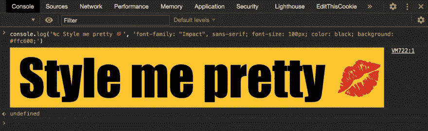
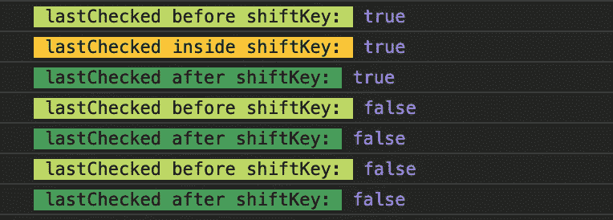

# 除了格式化您的控制台:样式化您的 console.log()

> 原文：<https://levelup.gitconnected.com/beyond-formatting-your-console-styling-your-console-log-74aacb623635>



把我打扮漂亮点，控制台！

上周，我分享了三个方便的开发工具，它们让我们能够格式化我们的控制台输出，而不仅仅是简单的`console.log()`。今天我学到了一个更巧妙的技巧来“美化”我们的控制台。

这个技巧非常简单，你所需要做的就是在你的`console.log()`里面添加一个特殊的指示器。

让我们看看它是如何处理纯字符串的:

1.  在字符串的开头添加这组字符，`%c`。
2.  传入一个附加参数，该参数包含字符串的样式。正如您在下面看到的，语法基本上是 HTML 元素的样式属性。

就是这样！在您的浏览器控制台上随意摆弄:

```
console.log('%c Style me pretty 💋', 'font-family: "Impact", sans-serif; font-size: 100px; color: black; background: #ffc600;')
```

现在来看更实际的用途。

假设您想测试一个变量`lastChecked`在一个函数中是如何被重新分配的。除了在您的`console.log()`中写出变量的当前输出，您还可以将样式作为参数插入，如下所示:

```
console.log('%c lastChecked before shiftKey: ', 'color: black; background: #BADA55;',lastChecked)console.log('%c lastChecked inside shiftKey: ', 'color: black; background: #FFC600;', lastChecked)console.log('%c lastChecked after shiftKey: ', 'color: black; background: #3EA055;', lastChecked)
```

就这样，您会看到一个彩色的控制台日志，不同阶段之间有着清晰的区别。这是组织你的控制台输出的一个很酷的选择，类似于我在[上一篇文章](/beyond-console-log-3-ways-to-format-console-outputs-in-javascript-a345918519aa)中提到的`console.group()`方法。



给我上色，控制台！

最后，你可能想知道我是怎么发现那些小把戏的。

除了精彩的搜索引擎之外，我一直在跟着 Wes Bos 的流行的免费 JavaScript30 教程[一起编写代码，他在这个过程中不断介绍迷人的开发工具，创造了有趣、愉快的 JavaScript 学习体验。](https://javascript30.com/)

如果你还没有看过，我强烈推荐你去看看。