# Python 中的二元、三元和多元文法

> 原文：<https://levelup.gitconnected.com/bi-tri-and-n-grams-with-python-a9717264e6f2>

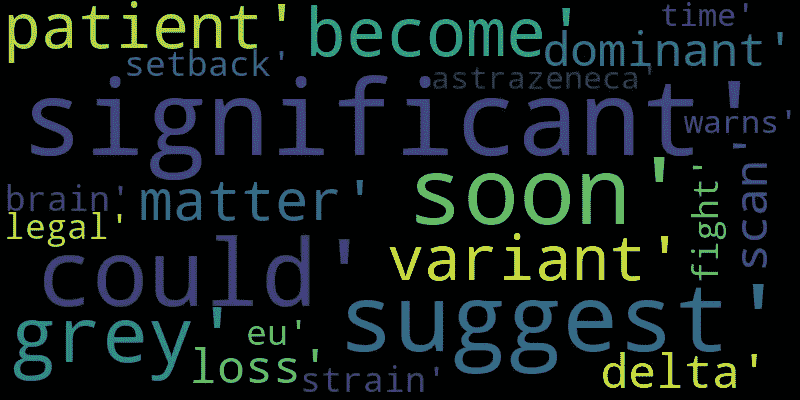

Ngram 为 5 的词云可视化

作为自然语言处理(NLP)中语言模型的一部分，Bi、Tri 和 N-Gram 模型有助于预测句子或短语中的下一个单词。这些模型基于统计语言模型，统计语言模型基于单词的概率分布生成输出。

简单来说，二元模型有助于提供给定过去**两个单词**的下一个单词的概率，三元模型使用过去**三个单词**，最后，N 元模型使用用户定义的 **N 个单词**。

N-Gram 模型可用于各种应用，如语音识别、DNA 测序、拼写错误检测等。

在这篇文章中，我将跳过理论计算，尽可能简单地分解概述。

我们将使用最近删除和清理的与关键词“冠状病毒”匹配的推文数据进行这项测试。下面是对我们将要使用的数据集的一个快速概述。

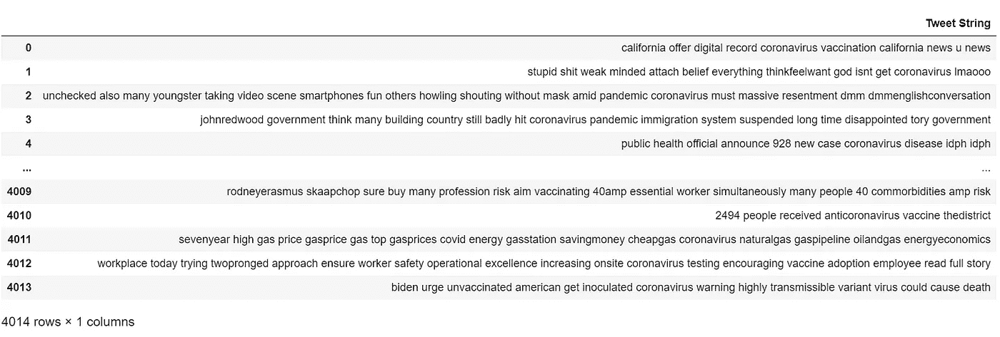

推文的样本数据框架

该数据集包含 4014 行干净的推文。在创建 N-gram 模型之前，我们将看看推文中最常见的 10 个单词。

*   使用您自己的数据框，用您自己的数据框和已清理列替换 df_polarity['句子已清理']部分。

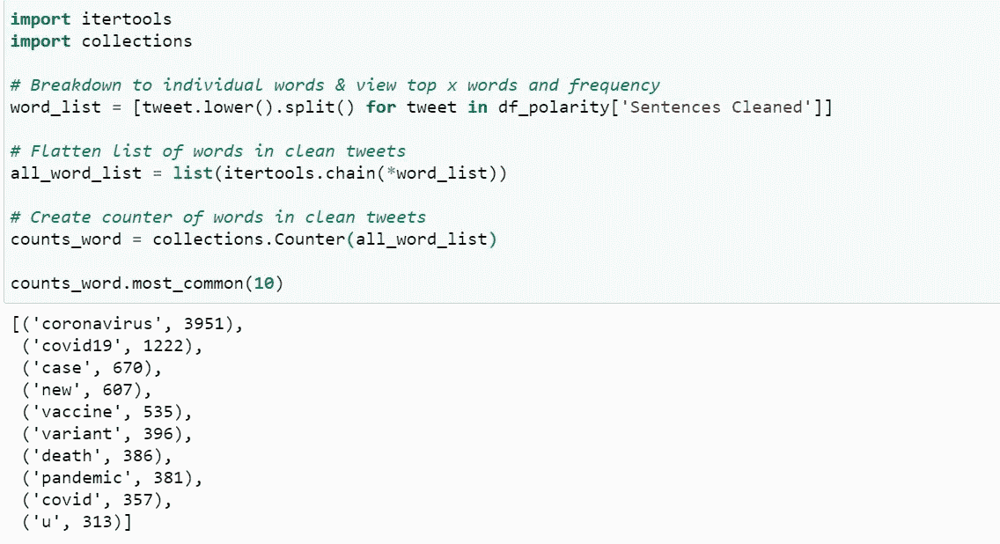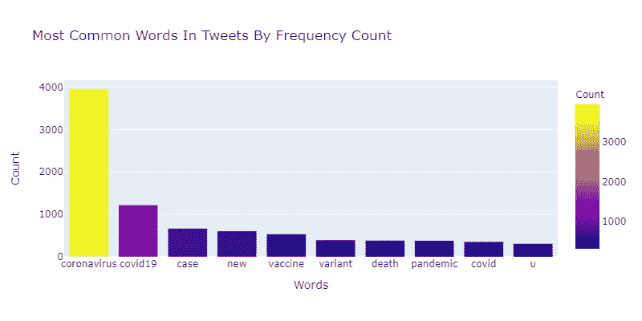

正如我们所看到的，在推文中找到的最常见的单词可能包含一些可能不会提供太多信息的单词。根据这些词的结果和影响，我们可以在推文中排除这些自定义词。

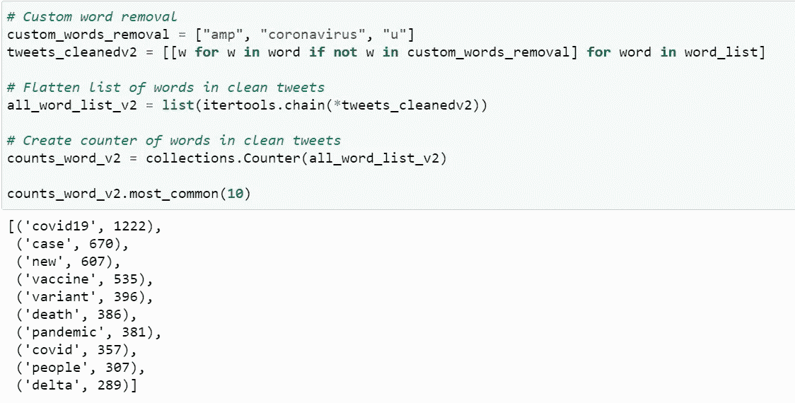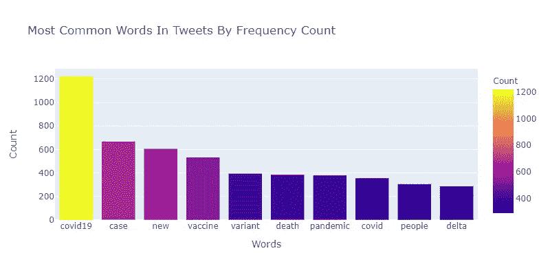

我们还可以使用单词云来显示自定义停用词删除后的前 10 个最常用的单词。

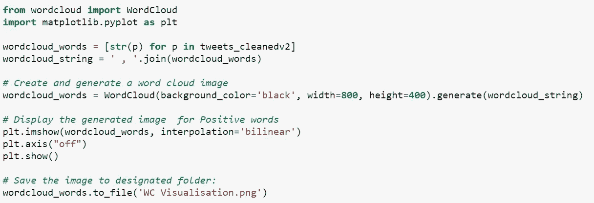

单词云可视化

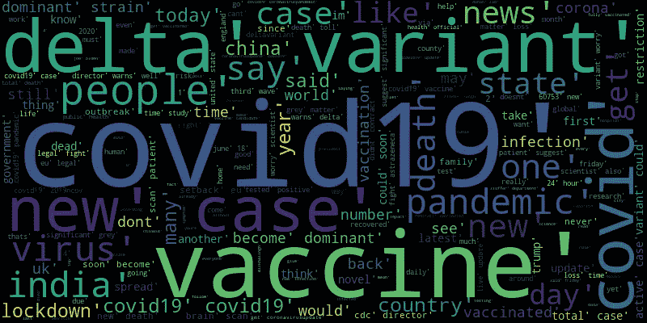

现在我们可以开始绘制 10 个最常见的二元、三元和 N 元单词序列。在这个练习中，我将 N 定义为值 5。

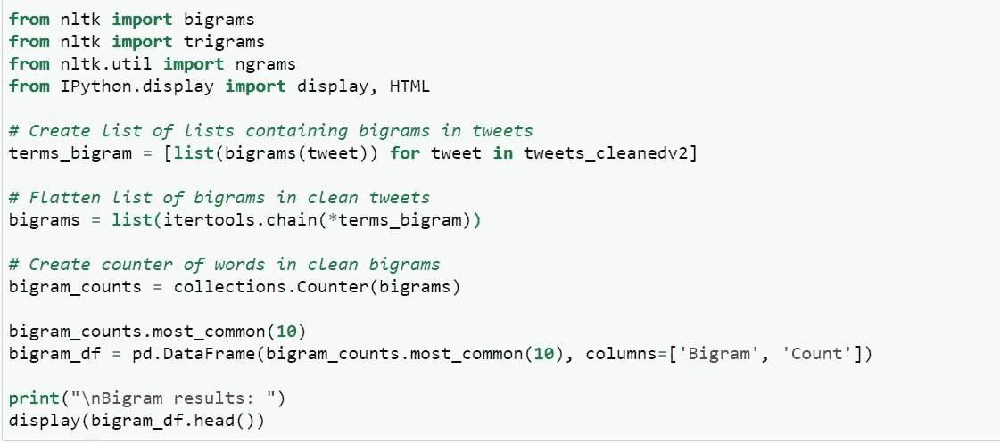

微博上 Bigram 的结果。

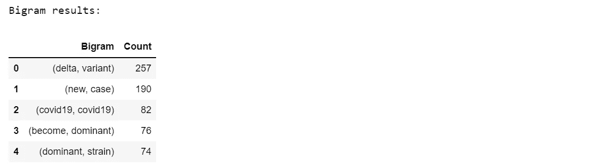

我们可以从 Bigram 结果中看到，单词(delta，variant)的共现频率最高，其次是(new，case)和 covid19。

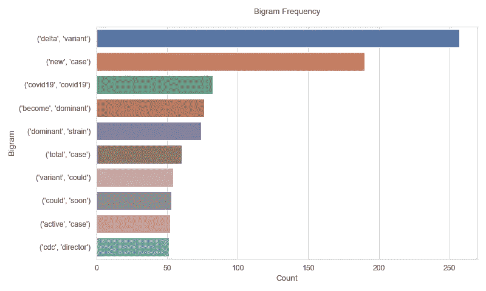

前 10 个二元模型序列

以及 tweets 中三元模型的结果。

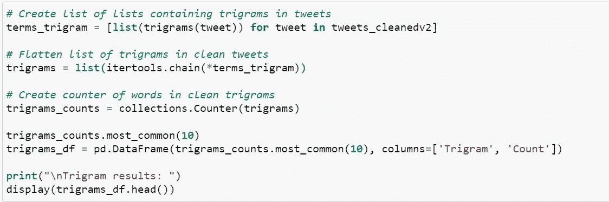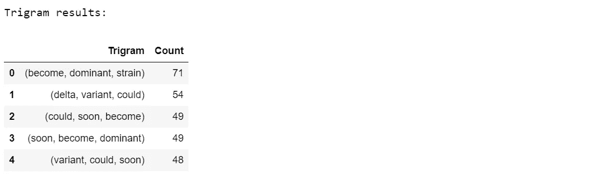

与二元模型结果相比，三元模型结果为我们提供了一个额外的世界，可以帮助我们可视化最常见类型的单词序列和上下文。

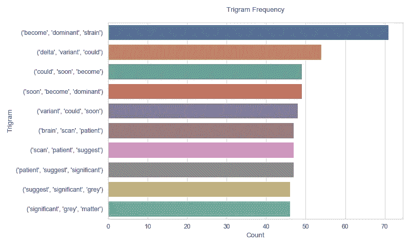

最后，我们将从 tweets 中查看我们的 N-Gram 模型结果。

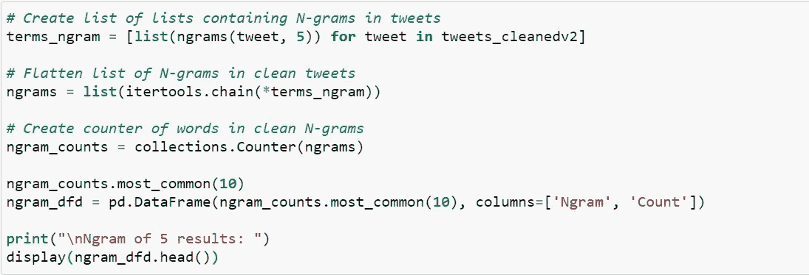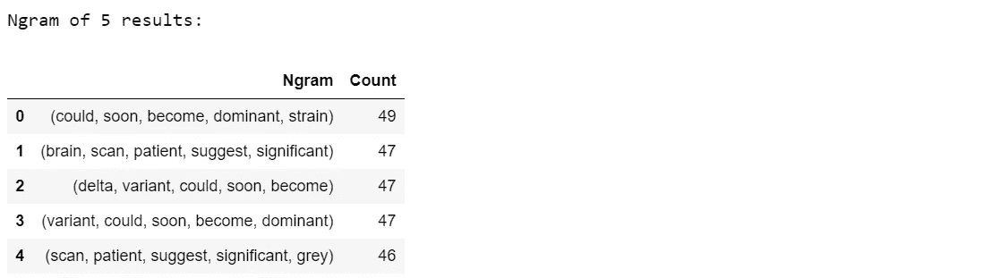

我们的 5 的 N 元语法为我们提供了一个由 5 个单词序列组成的输出，这让我们更好地理解了前 10 个最常见的推文。

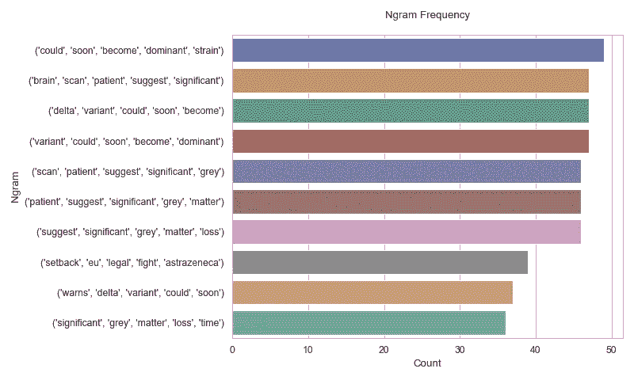

你怎么想呢?语言模型的应用，比如这篇文章中解释的那些，将如何帮助你的文本可视化和揭示单词序列？

好奇的学习者？释放你在媒体上学习的全部潜力，用不到一杯咖啡的钱支持像我这样的作家。

 [## 通过我的推荐链接加入媒体——杰森·LZP

### 作为一个媒体会员，你的会员费的一部分会给你阅读的作家，你可以完全接触到每一个故事…

lzpdatascience.medium.com](https://lzpdatascience.medium.com/membership)