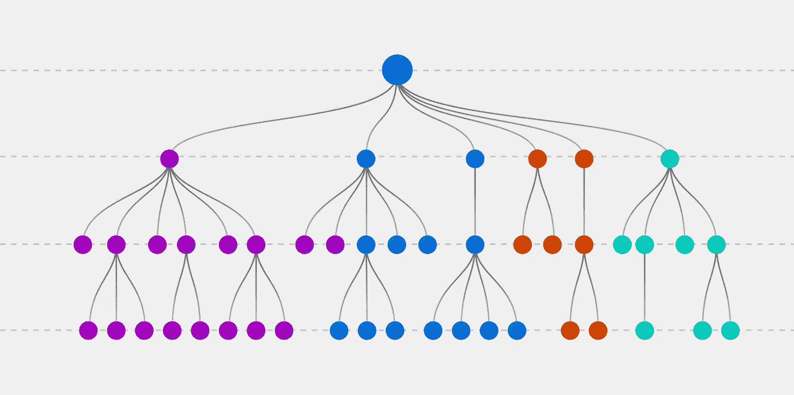

# 有偏见？以下是如何编写更好的软件

> 原文：<https://levelup.gitconnected.com/biased-here-is-how-to-write-better-software-13320edbc245>


照片由[维多利亚诺·伊斯基耶多](https://unsplash.com/@victoriano)在 [Unsplash](https://unsplash.com/photos/n52RFcd-4KU) 拍摄

我们的大脑在存储方面是有限的，并且已经发展出决定什么需要记住，什么可以忘记的策略。

有这么多丰富多彩的事物争夺我们的注意力，我们很自然地会陷入这些思维捷径:

*   我们将事件和列表简化为它们的关键元素
*   我们抛弃细节以形成一般性

这两种思维模式都会影响我们阅读软件的方式。

**我们花在阅读上的时间比写软件的时间多得多**——我想这个比例大约是 1:10，在某些地方要高得多，1:100 甚至更高。

让我们通过提高可读性来帮助我们软件的读者吧！

有哪些好的遵循我们自然思维模式的编码结构？我们怎样才能写出更容易理解的代码？

在这篇文章中，**我将向你展示一个简单的策略来提高你的软件**的可读性，这样你就可以向你的客户交付更高的价值。

# 人类偏见

我们人类充满了偏见，基本上是对一件事、一个人或一群人的偏见。这些偏见是我们认知局限性的结果，它们在很大程度上决定了我们的行为方式，尤其是在压力下。

考虑这个经典的例子**——风险规避:**

> 我们不喜欢不确定性，通常坚持我们所知道的。

由于软件开发总是有一些时间压力，我们自然倾向于将决策推迟到以后。如果我们已经实现了一个基本版本，为什么还要重新构建代码以使其可读性更好呢？

# 代码示例

让我们从下面的实现开始讨论:

代码看起来很好，但是当仔细观察时，我们注意到一些代码味道:

# **1)嵌套的 if-else 语句**

该函数包含三个嵌套的 if-else 语句。

```
if (...)
{
    ...
    if (...)
    {
        ...
        if (...)
        {
```

我们能不能用不同的编码风格把它拉平？

深度嵌套的代码结构产生了巨大的决策树，每一个新的代码分支都引入了可能出错的边缘情况。建立心智模型需要时间和精力，而且会增加认知负荷。



# **2)不同层次的抽象**

```
**Computer computer = GetComputer(...);
string serverAddress = GetServerAddress(...);**if (...)
{
   ...
}
else
{
    **job.Status = "Failed, site server not found.";**
}
```

`GetComputer()`和`GetServerAddress()`在更高的抽象层次上，交流更高的业务逻辑。

另一方面,`job.Status = "..."`在一个较低的抽象层次上，描述一些更详细的东西。它甚至在错误处理方面混合了一些技术方面。

这个星座违反了**单一抽象层次** — SLA。

我把它比作报纸结构:两个业务功能代表标题，`job.Status`代表段落级别的细节。

不同抽象层次的问题在于，它让我们的思维来回跳跃。将业务方面与技术细节混在一起会使阅读代码更加困难。

# **3)多关注点函数**

**单一责任原则**规定:

> 把因为同样的原因而改变的东西聚集在一起。把那些因为不同原因而改变的东西分开。罗伯特·马丁

注意函数名中的**和**关键字以及 **if-else** 结构:

```
List<JobAction> actions = await CheckForRelease**And**CreateAction(...);
if (!actions.Any())
{
    actions = await CheckForBundle**And**CreateActions(...);
}
if (!actions.Any())
{
    actions = await CheckForCollection**And**CreateActions(...);
}
if (!actions.Any())
{
    actions = await CheckForApplication**And**CreateActions(...);
}
foreach (JobAction action in actions)
{
    ...
}
```

所有四个函数遵循相同的模式——它们检查某些东西，**和**它们创建动作。还要注意这些函数是如何嵌入到控制顺序的不寻常的 if-else 结构中的。

多个方面混合在一起，由于不同的原因可能会发生代码更改——**人员 A** 可能想要更改顺序，而**人员 B** 可能要更改特定的操作。

当我们编写软件时，我们希望确保当请求更改时，这些更改只能来自一个人。

上面的代码片段违反了这个原则。

如果软件开发团队完全没有关于干净代码原则的意识，那么代码库迟早会受损。

> 大事始于小事，先生。—阿拉伯的劳伦斯

代码气味就像给即将成为又大又丑的怪物提供美味的食物。祝你好运驯服这个不断增长的复杂性野兽。


照片由[*备忘录矶*](https://www.shutterstock.com/g/memoangeles) *上*[*Shutterstock.com*](https://www.shutterstock.com/image-vector/flying-spaghetti-monster-vector-clip-art-188441972)

# 让我们做一些重构

但是我们可以做得更好。现在考虑以下实现:

你觉得怎么样？那更容易阅读吗？它是否更好地传达了业务领域？

以下是我们为提高代码可读性而应用的基本原则:

# **1)“您先请”**

通过让**业务领域**和**技术方面**同样成为你的软件结构的强大驱动力，来展示一种礼貌的姿态。

技术是一种强大的力量，经常支配着我们的软件实现。确保你尊重他们两个。

隐藏技术细节，尽可能突出业务领域。**读代码应该更像读故事。**

# **2)减少名单**

注意`CheckForReleaseAndCreateAction()`函数——它有多种功能。它将“检查”和“创建”某些东西(业务领域)，并且它与更广泛的 if-else 结构(技术)纠缠在一起。因此，业务领域方面和技术方面交织在一起。

当关注可读性时，最好是一次关注一个方面，突出相关信息，隐藏当前不重要的信息——减少信息并对信息进行优先排序。

# **3)形成共性**

我们的大脑擅长标记和假设，所以让我们利用这一点，创造一些抽象概念。

我们可以隐藏不重要的信息，把它们推到更低的抽象层次，在那里它们更相关。

将控制结构(if-else 语句)在函数的层次结构中向下推会导致一个更线性的故事线，并且需要记住的并行案例更少。

我们喜欢跟踪一个线性故事，跟踪多个平行的故事就像一次或以错误的顺序观看《星球大战》电影。这将导致对所发生的事情的混淆，并使人们难以判断它们的整体重要性。

# 集成操作隔离原则(IOSP)

为了更容易记住和思考潜在的认知偏见，有一个清晰的代码原则可以帮助你。

IOSP 清洁准则原则要求明确划分为两类职能:

> **集成:**一个函数只包含对**相同**代码库
> **操作中函数的调用:**一个函数只包含对**另一个**代码库函数的调用
> 
> 拉尔夫·韦斯特法尔(2012 年)。[作为编程模型的消息传递。](https://ralfwestphal.substack.com/p/integration-operation-segregation)

(操作符和控制流结构是另一个代码库中的函数，它的易访问性被认为是语法上的优势。)

**集成—** (基本上是一个调用其他函数的函数):

**操作**——(包含逻辑的功能):

*   IOSP 提倡单一层次的抽象
*   它沿着函数的层次结构向下推动分支逻辑
*   并且更容易阅读。

从原作者 **Ralf Westphal 处了解更多关于 **IOSP** 的。**

# 实践中的 IOSP

与 IOSP 一起工作时，代码分支会很有挑战性。以下是我用来保持代码结构扁平的一些便利策略:

*   [试抓](https://gist.github.com/fnbk/c4c6ca17536933109caa64a858e6e95d)
*   [if-else](https://gist.github.com/fnbk/0ee794e1dcf82e394e7abfae31ebe4e2)
*   [本地功能](https://gist.github.com/fnbk/2ea9b6253c11005fb88be10985c25719)
*   [单子](https://gist.github.com/fnbk/d993d3829827fe10d89ef0de7836deca)

# 我的干净代码备忘单

如果你想在你的团队中为干净代码实践建立一个好的基线，那么看看我的[干净代码备忘单](https://florianboehmak.com/)。

我把它简化为 13 条原则，这就是你在团队中进行专业代码讨论所需要的。你会更快达成协议，看到情绪化的讨论消失。

# 结论

我们的大脑在存储方面是有限的，并使用不同的策略来解决这一限制。我们将信息简化为关键事实，并很快贴上标签和做出假设，这使我们产生偏见。

这对我们阅读和理解软件有很大的影响。

因为我们花在阅读软件上的时间比写软件的时间多得多，所以让代码更容易阅读是一项不错的投资。

干净代码原则 **IOSP** 将帮助你做到这一点。

[](https://betterprogramming.pub/there-just-isnt-enough-time-f7bb069411f) [## 时间不够了

### 以及为什么写“脏代码”是一个好的开始

better 编程. pub](https://betterprogramming.pub/there-just-isnt-enough-time-f7bb069411f) 

## **参考文献**

[1]:巴斯特·本森(2016 年 9 月 1 日)。认知偏见备忘单[https://better humans . pub/cognitive-bias-cheat-sheet-35a 472476 b18](https://betterhumans.pub/cognitive-bias-cheat-sheet-55a472476b18)

罗伯特·马丁:单一责任原则
[https://blog . clean coder . com/uncle-bob/2014/05/08/singlerepointibility Principle . html](https://blog.cleancoder.com/uncle-bob/2014/05/08/SingleReponsibilityPrinciple.html)

拉尔夫·威斯特法尔:一体化运作隔离原则(IOSP)
[https://ralfwestphal . substack . com/p/Integration-Operation-Segregation](https://ralfwestphal.substack.com/p/integration-operation-segregation)