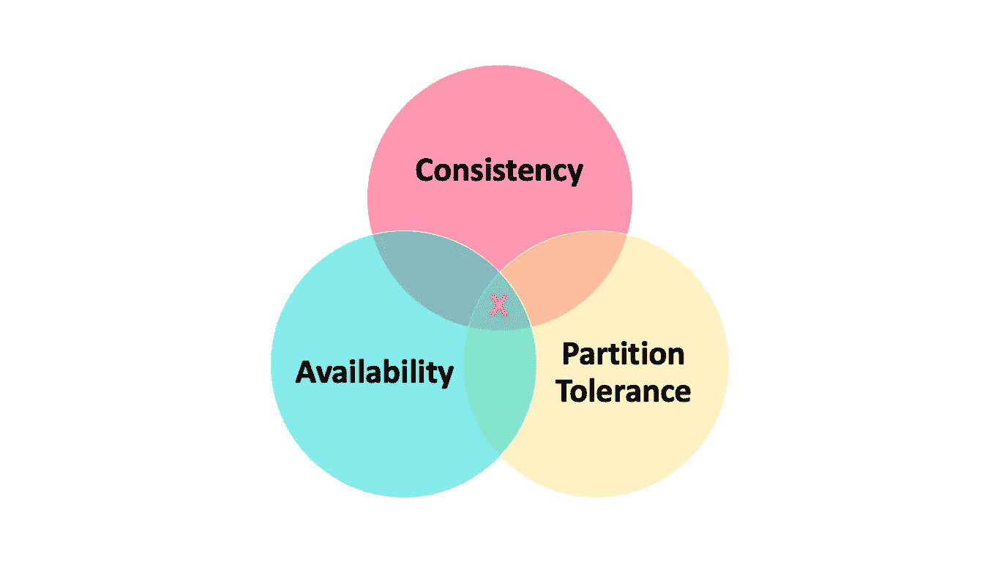
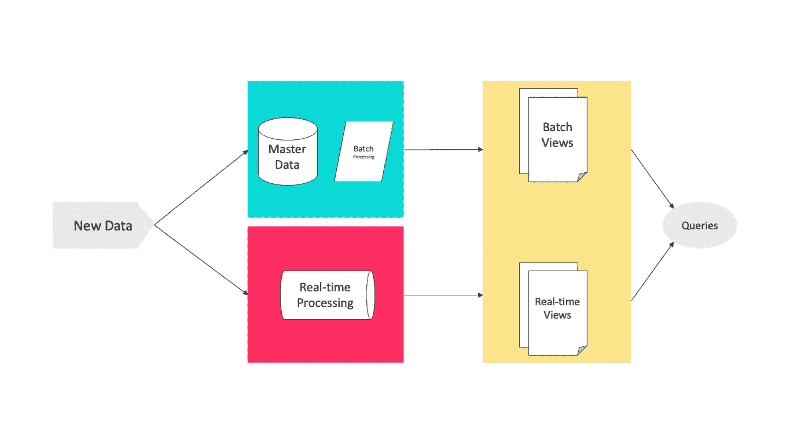
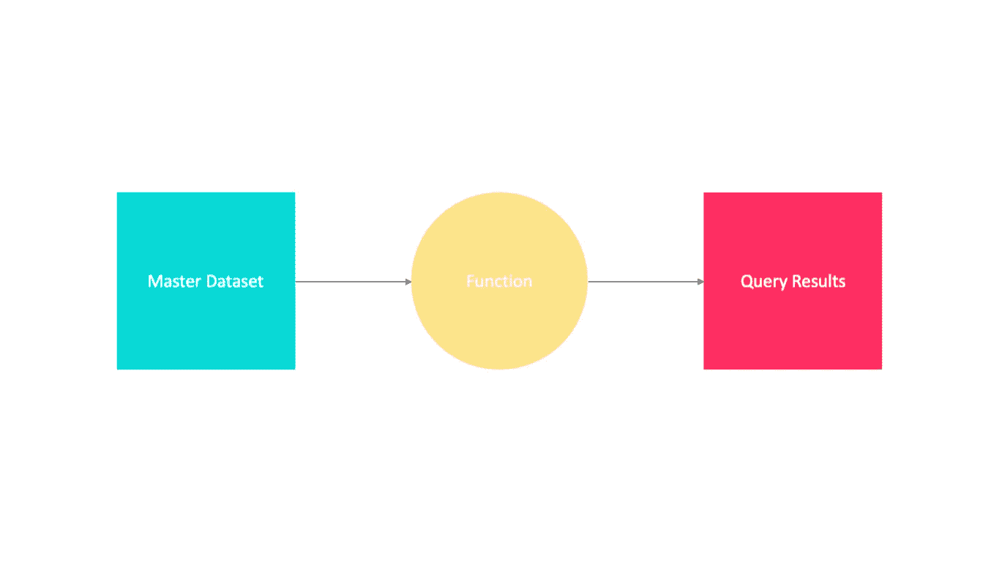
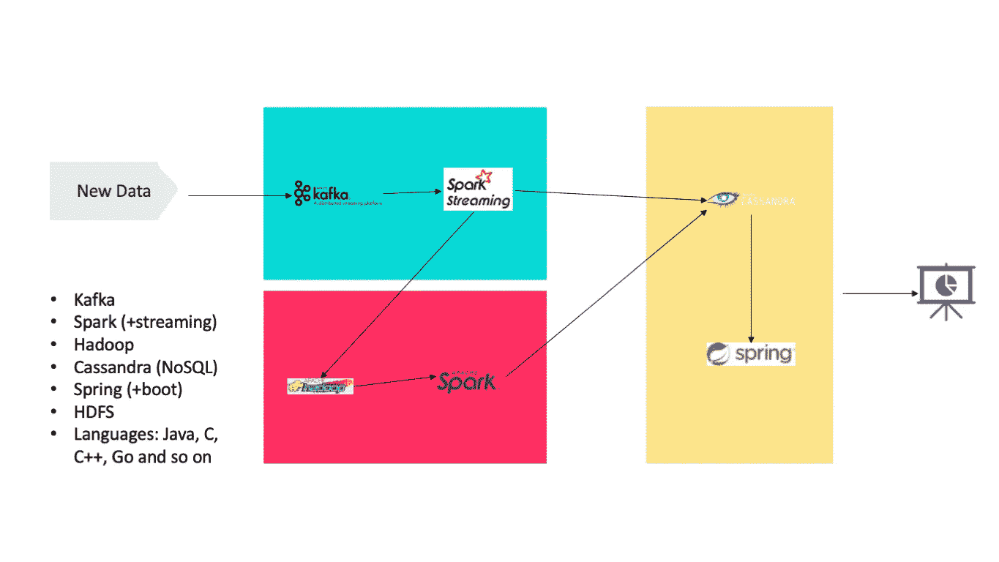

# 大数据:Lambda 架构概述

> 原文：<https://levelup.gitconnected.com/big-data-lambda-architecture-in-a-nutshell-fd5e04b12acc>

## [思维程序员](https://medium.com/tag/thought-programmer)

## 我们如何打败 CAP 定理？

CAP 定理

计算机科学中有一个定理叫做 CAP 定理，它指出分布式数据存储不可能同时提供以下三种保证中的两种以上。

*   ***一致性*** :每次读取都会收到最近一次写入或一个错误。
*   ***可用性*** :每个请求都会收到一个(无错误的)响应，但不能保证它包含最近的写操作。
*   ***分区容差*** :尽管网络在节点间丢弃(或延迟)了任意数量的消息，系统仍继续运行。

# 历史简介

2011 年，Nathan Marz 在其博客中提出了一种解决 CAP 定理局限性的重要方法，称为 Lambda 架构。

λ架构

# 它是如何工作的？

让我们仔细看看 Lambda 架构。Lambda 架构中有三层:批处理层、速度层和服务层。

> 它结合了相同数据的实时和批量处理。

***首先是*** ，输入的实时数据流存储在批处理层的主数据集中，同时保存在速度层的内存缓存中。批处理层中的数据被 ***然后*** 索引并通过批处理视图可用。而速度层中的实时数据通过实时视图显示。 ***最后*** ，批处理和实时视图都可以单独或一起查询，以回答任何历史或实时问题。

## 批量层

这一层负责管理主数据集。主数据集中的数据必须包含如下三个属性。

*   数据是原始的
*   数据是不可变的
*   数据永远是真实的

主数据集是真实的来源。即使丢失了所有的服务图层数据集和速度图层数据集，也可以从主数据集重新构建应用程序。

批处理层还将主数据集预先计算到批处理视图中，以便可以低延迟地解析查询。

批处理视图的预计算

因为我们的主数据集在持续增长，所以当新数据可用时，我们必须有一个策略来管理我们的批处理视图。

*   ***重新计算算法*** :丢弃旧的批处理视图，重新计算整个主数据集的函数。
*   ***增量算法*** :新数据到来时直接更新视图。

## 速度层

速度层为快速特殊查询的批处理视图编制索引。它存储实时视图并处理输入的数据流，以便更新这些视图。底层存储层必须满足以下条件。

*   ***随机读取*** :支持快速随机读取，快速回答查询。
*   ***随机写入*** :为了支持增量算法，还必须能够以低延迟修改实时视图。
*   ***可伸缩性*** :实时视图应该随着它们存储的数据量和应用程序所需的读/写速率而伸缩。
*   ***故障容忍*** :如果机器崩溃，实时视图应该继续正常工作。

## 服务层

该层提供对主数据集上执行的计算结果的低延迟访问。为了加快读取速度，可以通过对数据进行额外的索引来促进这一过程。与速度层类似，该层必须满足以下要求，如随机读取、批量写入、可伸缩性和容错。

# Lambda 架构满足几乎所有的属性

Lambda 架构基于几个假设:容错、支持特定查询、可伸缩性、可扩展性。

*   ***容错***:Lambda 架构为大数据系统提供了人工容错能力，因为当出现错误时，我们可以修复算法或从头开始重新计算视图。
*   ***临时查询:*** 批量层允许对任何数据进行临时查询。
*   ***可伸缩性:*** 所有的批处理层、速度层、服务层都很容易伸缩。由于它们都是完全分布式的系统，我们可以在添加新机器时轻松扩展它们。
*   ***扩展性*** *:* 添加一个新视图就像添加主数据集的一个新函数一样简单。

# 有些问题要问？

## 代码是如何在层之间同步的？

解决这个问题的方法之一是通过使用公共库或引入流之间共享的某种抽象，为各层提供一个公共的代码库。这种框架的例子有 Summingbird 或 Lambdoop。

## 我们能去掉速度层吗？

是的，速度层在许多应用中是不必要的。如果我们缩短批处理周期，就可以减少数据可用性的延迟。另一方面，用于访问存储在 Hadoop 上的数据的新的更快的工具，如 Impala、Drill 或新版本的 Tez 等。，使得在合理的时间内对数据采取一些行动成为可能。

## 能不能放弃批处理层，把一切都处理在速度层？

是的，这种架构的一个例子叫做 Kappa Kreps，它提出以流式方式处理传入的数据，每当需要更大的历史记录时，可以从 Kafka 缓冲区重新流式传输，或者如果我们必须返回更远，可以从历史数据群重新流式传输。

# 如何实现 Lambda 架构？

我们可以通过使用 Hadoop 数据湖在现实世界中实现这种架构，其中 HDFS 可以用于存储主数据集，Spark(或 Storm)可以形成速度层，HBase(或 Cassandra)可以是服务层，Hive 可以创建可查询的视图。

Lambda 架构的示例实现

# 使用 Lambda 架构

## 美国 Yahoo 公司(提供互联网的信息检索服务)

对于在其广告数据仓库上运行分析，雅虎采取了类似的方法，也使用了 Apache Storm、Apache Hadoop 和 Druid。

## 网飞

网飞·苏罗项目是网飞数据管道的主干，该管道有单独的数据处理路径，但并不严格遵循 lambda 架构，因为路径可能旨在服务于不同的目的，不一定提供相同类型的视图。

**领英**

用 Apache 方解石连接离线和近线计算。

# 结论

请记住:`batch view = function (all data)`、`realtime view = function (real-time view, new data)`和`query = function (batch view, real-time view)`。

很简单，对吧？

# 参考

[1][http://nathanmarz.com/blog/how-to-beat-the-cap-theorem.html](http://nathanmarz.com/blog/how-to-beat-the-cap-theorem.html)

[2][http://www . slide share . net/Hadoop _ Summit/interactive-analytics-in-human-time？next_slideshow=1](http://www.slideshare.net/Hadoop_Summit/interactive-analytics-in-human-time?next_slideshow=1)

[3][https://Netflix tech blog . com/announcing-suro-backbone-of-netflixs-data-pipeline-5c 660 ca 917 b 6](https://netflixtechblog.com/announcing-suro-backbone-of-netflixs-data-pipeline-5c660ca917b6)