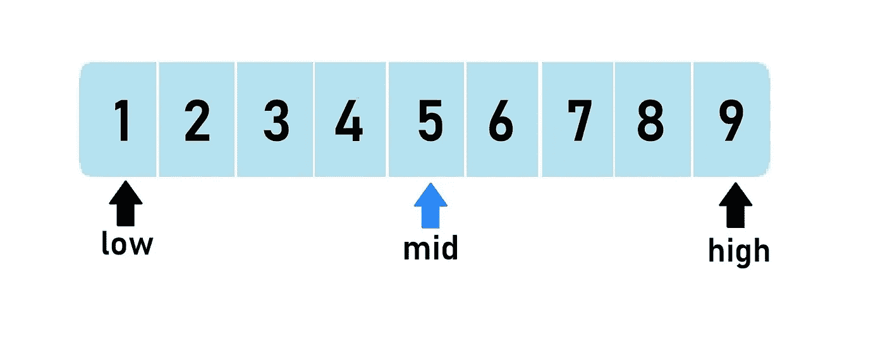
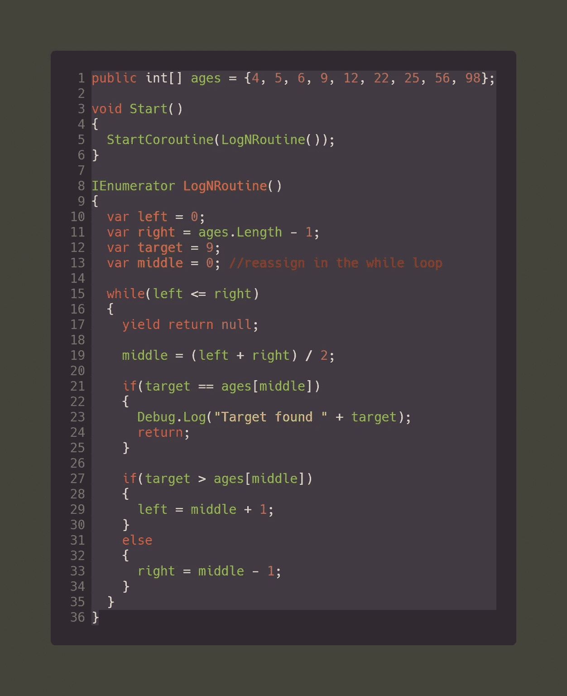

# 大 O:团结的二分搜索法

> 原文：<https://levelup.gitconnected.com/big-o-binary-search-in-unity-f607d0f0919d>

在上一篇文章( [Big O Unity Optimization](/big-o-unity-optimization-e5cb3f20ed1a) )中，我们开始了解 Big O 的思想以及二分搜索法在提高性能方面的重要性。



二进位检索

> 二分搜索法定义

正如你现在可能已经知道的，一个**二分搜索法**只对排序的数组有效，这个搜索是从数组的中间开始比较数组元素开始的。如果搜索找到目标值，那么这将是最好的情况，O 为 1。但是如果没有，那么它继续到 O/n，在这里它开始根据目标值的位置将数组分成两半。通过这样做，这个**算法**在每次迭代中消除了目标值不在的那一半。换句话说，该算法进行 O(log n)次比较，其中 n 是数组中元素的数量，O 是大 O 符号。只要数组不小，这种搜索通常比普通的线性搜索(C#中的循环)快得多。

> 履行

以下面的数组为例；一个年龄数组，已经排序，我们想找到年龄“7”。

```
public int[] ages = {4, 5, 6, 9, 12, 22, 25, 56, 98};
```

要启动二分搜索法，我们需要找到:

A.数组的左侧索引:0(数组索引)

B.数组的右侧索引:数组长度-1

C.中间索引:(左+右)/ 2

D.如果目标等于中间值，则搜索完成

E.如果目标大于中间值，那么我们将在下一次迭代中只使用数组的右侧索引，因此左侧将是中间索引+ 1

F.如果目标小于中间值，那么我们将在迭代中只使用数组的左侧，因此右侧索引将是中间索引-1

> 代码实现



二进位检索

在运行代码之前，不要忘记对数组进行排序。当数组不小时，这种二分搜索法算法将更有效地运行，并提高项目的性能。