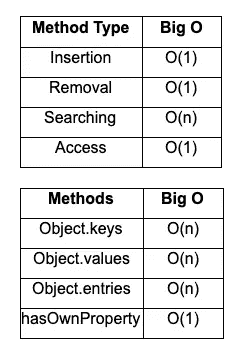

# 大 O 符号

> 原文：<https://levelup.gitconnected.com/big-o-notation-6b19d3f03f7f>

## 对象及其内置方法


迈克尔·泽兹奇在 [Unsplash](https://unsplash.com?utm_source=medium&utm_medium=referral) 上的照片

在我以前的大 O 符号博客中，我们讨论了[时间](https://medium.com/swlh/big-o-notation-128b7b8051c9)和[空间](https://medium.com/@sedlacek1991/big-o-notation-8a0a28f00813)复杂性，并从整体上看待算法。现在我们将更进一步，看看大 O 以及它如何与对象及其内置方法相关联。

对象是一种无序的键/值数据结构，用于存储任何类型的数据，同时还保留一种命名方案。下面是一个对象的简单例子，其中关键是命名方案，值是我们的实际数据。

```
**const** example = {
   key: value
};
```

就大 O 而言，对象有利于插入、移除和访问数据。这些类型的方法具有 O(1)；你可能记得在我以前的博客中，这意味着它们有一个恒定的运行时间，就大 o 而言，这是最理想的。对象有恒定运行时间的原因是由于它们是无序的数据结构。此外，当我们添加、删除或访问元素时，我们是基于它们的键，而不是它们的位置，因此我们可以在不影响其他键/值对的情况下进行更改。

**对象内置方法**

对象有许多不同的内置方法，但我们在这里要看的方法是 Object.keys、Object.values、Object.entries 和 hasOwnProperty。前三种方法要求我们访问对象中的每一项，并将它们推到一个数组中。正如您可能已经猜到的，这些方法有一个 O(n ),因为输出数组中的项数与对象中的项数一致。下面是这些方法在 tennisPlayer 对象上生成的输出。

```
**let** tennisPlayer = {
   firstName: "Matthew",
   playsTennis: true,
   numberOfRacquets: 5,
   favAthletes: ["Stefanos Tsitsipas","Andre Agassi"]
};**Object.keys**(tennisPlayer);output: 
[ 'firstName', 'playsTennis', 'numberOfRacquets', 'favAthletes' ]**Object.values**(tennisPlayer);output: 
[ 'Matthew', true, 5, [ 'Stefanos Tsitsipas', 'Andre Agassi' ] ]**Object.entries**(tennisPlayer);output:
[
  [ 'firstName', 'Matthew' ],
  [ 'playsTennis', true ],
  [ 'numberOfRacquets', 5 ],
  [ 'favoriteAthletes', [ 'Stefanos Tsitsipas', 'Andre Agassi' ] ]
]
```

我们将讨论的对象的最后一个内置方法是 hasOwnProperty。这个方法有一个 O(1)或常数时间，根据对象中是否存在键来返回 true 或 false。这个方法有一个 O(1 ),因为这个方法试图访问这个键而不是搜索它，正如我们前面讨论的，访问对象中的方法有一个 O(1)。再次使用我们的 tennisPlayer 对象，我们可以看到当我们试图访问 numberOfRacquets 键时，hasOwnProperty 方法如何返回 true。

```
tennisPlayer.**hasOwnProperty**("numberOfRacquets");output: true 
```

下面是这篇博客中讨论的方法类型和内置方法的总结，以及它们与大 O 符号的关系。



基于柯尔特·斯蒂尔的 Udemy 课程中的授课材料的汇总表

感谢您花时间通过大 O 符号的镜头了解更多关于对象的信息。请关注下一篇博客，在那里我们将讨论数组的[大 O 和它们的方法](https://medium.com/datadriveninvestor/big-o-notation-14fa1e4538a1)。

**资源**

斯蒂尔，加州(未注明)。 *JavaScript 算法和数据结构大师班*。在线课程。

JS 基础:对象。(未注明)。检索于 2020 年 10 月 21 日，来自[https://learn.co](https://learn.co/lessons/big-o-approximation)/