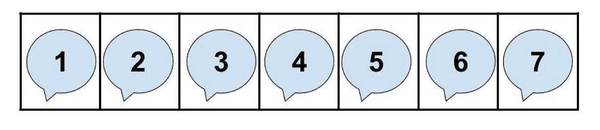
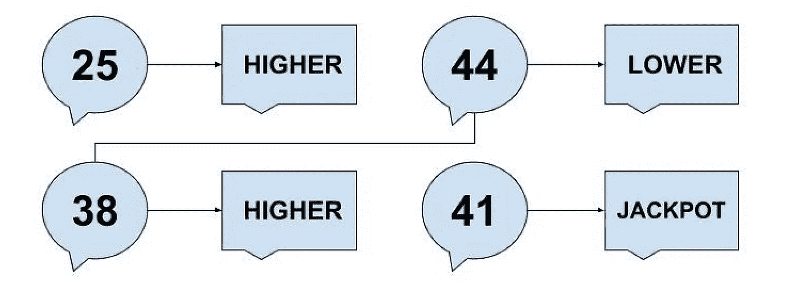
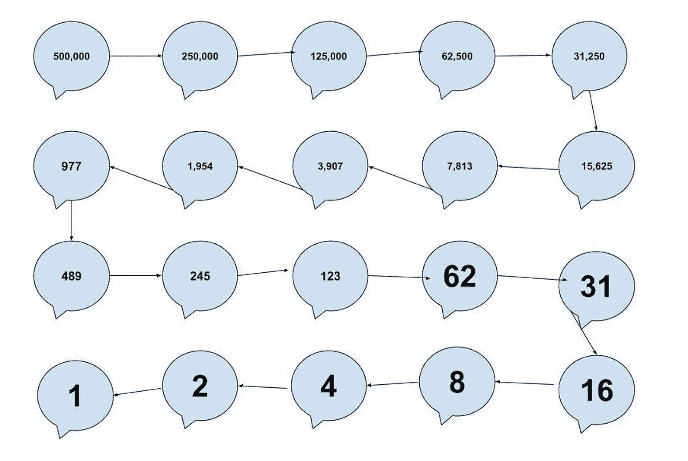
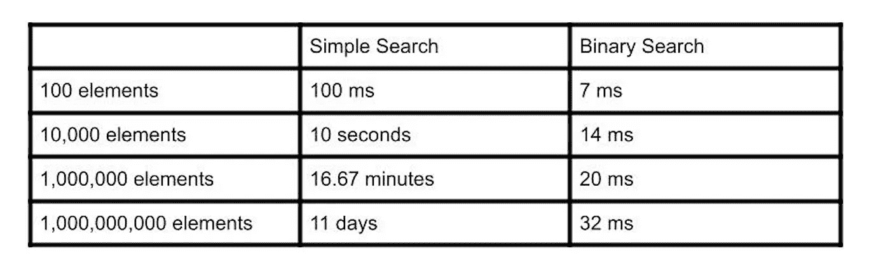

# 大 O 符号和二分搜索法——作为开发人员为什么要关心它们

> 原文：<https://levelup.gitconnected.com/big-o-notation-and-binary-search-why-should-you-care-about-them-as-a-developer-8da90778988b>

## 算法简介

马库斯·斯皮斯克在 [Unsplash](https://unsplash.com/photos/FXFz-sW0uwo) 上的照片

大 O 符号是开发人员理解的基础，因为它分析算法的成本和速度。由于你可能会使用其他人的算法，你可能会想知道他们有多有效。另一方面，二分搜索法算法将帮助我们更好地理解大 O 符号，而不会让我们的大脑从一开始就爆炸。

## 什么是二分搜索法

假设我们正在浏览我们的电话联系人，寻找一个名字以字母“K”开头的人。逻辑上，我们从联系人列表的中间开始寻找那个人，因为这比从字母“A”开始要快，因为我们清楚地知道这个名字不会在那里。

因此，如果事实确实如此，我们希望在搜索数据集时也能有同样的效率，不是吗？这就是二分搜索法算法发挥作用的地方。

然而，重要的是要记住，为了使用二分搜索法，我们需要从元素的排序列表开始。

## 它是如何工作的

想象一下，有人告诉你他们脑子里有一个 1 到 50 之间的数字，你需要猜猜他们。假设你从数字 1 开始向上，你可能要猜 50 次才能找到正确的数字。这就是所谓的简单搜索，它是非常低效的，我们一会儿会说为什么。

另一方面，二分搜索法从列表的中间开始，检索元素并检查值是大于还是小于我们要找的值。

例如，假设我们想到的数字是 41。

这里我们从 25 开始，因为数字 41 更高，我们选择 38，因为它在 25 和 50 之间。然后我们再重复两次，仅用 4 次运算就找到了这个数字，而使用简单的搜索我们需要 41 次运算。很棒吧。越来越好了！

想象一下，你正在登录一个拥有 500，000 活跃用户的网站，软件需要找到你的用户名，这样你才能登录这个网站。最坏的情况是 500，000 次操作，但是如果我们使用二分搜索法会发生什么呢？让我想想。

因此，在最坏的情况下，在 500，000 个元素中，我们需要 19 次操作来找到我们要找的东西，而不是最多 500，000 次操作。

## 对数

使用对数，我们可以帮助确定找到我们要寻找的元素所需的最大运算次数。对于普通搜索，该数字等于列表中元素的数量。但是对于二分搜索法，它等于 log(n)(其中基数总是 2，因为我们除以 2 以消除每个操作的一半元素)。例如，16 个元素可能需要我们进行 16 次尝试，或者 log (16)等于 4，因为 2 的 4 次方是 16。

## 执行时间

运行时间对性能很重要，因为您希望选择最佳算法，优化系统中的时间或空间。

> **线性时间—** 如果一个算法的时间复杂度为 *O* ( *n* )，则称该算法需要**线性时间**，或者 *O* ( *n* 时间。通俗地说，这意味着运行时间最多随着输入的大小线性增加。
> 
> [维基百科上对线性时间的描述](https://en.wikipedia.org/wiki/Time_complexity#Linear_time)
> 
> **对数时间-** 一个算法据说取**对数时间**当*T*(*n*)=***O*(log*n*)**。由于 log*a*n 和 log*b*n 通过一个常数乘数相关联，并且该乘数与 big-O 分类无关，因此对数时间算法的标准用法是 *O* (log *n* )而不考虑出现在 *T* 表达式中的对数的底数。
> 
> 需要对数时间的算法通常出现在二叉树的运算中或使用二分搜索法时。
> 
> [维基百科上对对数时间的描述](https://en.wikipedia.org/wiki/Time_complexity#Logarithmic_time)

## 什么是大 O 符号

我们已经说过，大 O 符号帮助我们确定算法的速度，所以让我们看看这是如何发生的。

假设你给自己买了一辆漂亮的新特斯拉，并且很高兴使用自动驾驶仪。对于这个例子，让我们假设有 100 个变量需要考虑，如果一棵树跟在我们 200 米之外，挡住了道路。

让我们假设我们的汽车在撞上树之前有 10 秒钟的反应时间，每个操作是 1 毫秒，现在我们可以有下面的思维过程。

普通搜索的最坏情况是 100 次操作或 100 毫秒，而二分搜索法只需要 7 毫秒。因为两者都低于 10 秒，我们可以选择普通搜索，因为它更容易，对不对？

但是如果变量是，比如说，100 万，会发生什么呢？在这种情况下，二分搜索法大约需要 20 毫秒。如果我们使用前一个例子中的比例，我们可以假设正常的搜索需要 20 x (100/7 ),相当于大约 280 毫秒，这仍然比我们需要反应的 10 秒少得多。现在，你可能会认为这种逻辑有极大的缺陷，你是对的。对于 1，000，000 个元素，正常搜索的最坏情况是 1，000，000 毫秒，这使得二分搜索法快了 50，000 毫秒，这表明当输入的大小增加时，差异有多大。

大 O 符号向您显示算法的速度，不是以秒为单位，而是比较操作的数量，并分析算法在增长/扩展到巨大数量时的速度。

上表向我们展示了当数据变得更大时，二分搜索法有多好。印象深刻吧。

## 结论

大 O 符号和二分搜索法算法是软件开发人员必须知道的。大 O 符号关注算法的速度，除非你想看到世界燃烧，你应该希望你的应用程序很快！另一方面，二分搜索法算法是进入算法的一个简单步骤，它准确地展示了我们如何从大 O 符号中获益。