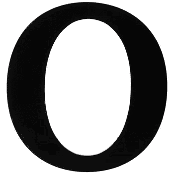
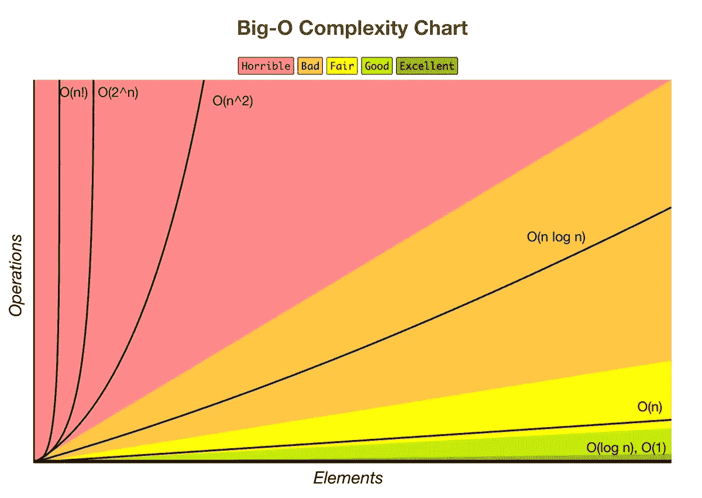
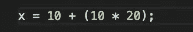
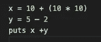
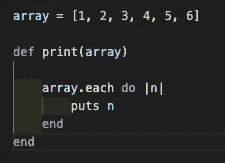
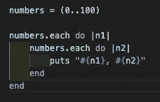
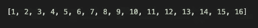
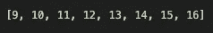
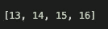

# 大 O 符号和时间复杂性

> 原文：<https://levelup.gitconnected.com/big-o-notation-and-time-complexity-22743c188364>

大 O 符号是对算法效率的简化分析。大 O 符号以输入大小 n 的形式给出了算法的复杂度，它提供了一种从运行算法或代码的机器/计算机中提取算法或代码效率的方法。我们不关心我们的机器有多强大，而是关心代码的基本步骤。我们可以用大 O 来分析时间和空间。我将以 Ruby 为例，介绍如何使用 Big O 来度量时间复杂度。

**测量类型**

有几种方法可以考察算法的效率。我们可以检查最坏情况、最好情况和一般情况。当我们研究大 O 符号时，我们通常着眼于最差的情况。这并不是说其他案件不重要。

*一般规则*

1.  忽略常数

5n ->O(n)

大 O 符号忽略常量。例如，如果你有一个运行时间为 5n 的函数，我们说这个函数运行在 N 的大 O 的数量级上，这是因为随着 N 变大，5 不再重要。

2.与 N 增长的方式相同，某些术语“支配”其他术语

这里有一个列表:

**o(1)<o(logn)<o(n)<o(nlogn)<o(n)<o(2^n)<o(n！)**

当低阶项受高阶项支配时，我们忽略低阶项。

**常数时间:O(1)**

这个基本语句计算 x，并且不以任何方式依赖于输入大小。这与输入大小 n 无关，我们说这是一个“1 的大 O”或常数时间。

总时间= O(1) + O(1) + O(1) = **O(1)**

当我们有一系列语句时会发生什么？请注意，所有这些都是常数时间。我们如何计算这个代码块的大 O？我们简单地将他们的时间相加，得到 3 * O(1)。但是记住我们去掉了常数，所以这仍然是 1 的大 O。

**线性时间:O(n)**

该方法的运行时间是线性的或 O(n)。我们在这个方法中有一个循环，它遍历数组并输出元素。该循环执行的操作数量将根据数组的大小而变化。例如，大小为 6 的数组将只需要 6 次迭代，而 18 个元素的数组将需要 3 倍的时间。随着输入大小的增加，运行时也会增加。

**指数(二次)时间:O(n )**

当我们有嵌套循环时，通常我们的运行时间是指数级的，即 O(n)。当我们在嵌套循环中时，外部循环将进行第一次迭代，然后内部循环将在返回外部循环的第二次迭代之前进行完全迭代。当您处理大型数组时，这将变得非常低效，因为这些程序的运行时变得越来越长。该循环将根据输入大小计算迭代次数的平方。数组大小为 10 将需要 100 次迭代。

**对数时间:O(log n)**

对数运行时间是一个非常有效的符号。与其解释对数函数是如何工作的(因为我数学很差)，举个例子可能更容易。一直使用对数时间的例子有 ***二分搜索法*** 。假设我们有一个已排序的数字数组:

如果我们被告知搜索数字 14，我们可以遍历整个数组，直到找到 14(线性时间)。二分搜索法从集合的中间开始，比较它旁边的两个值，使这变得更容易。假设我们从 9 点开始。我们会考虑数字 14 是在数字 9 的右边还是左边。然后我们忽略 9 的左边，因为 14 比 9 高。

我们需要做的就是继续同样的模式，直到我们达到目标。

根据您开始值搜索的位置，我们可以在这里结束操作！我们只需要进行 3-4 次搜索，而不是 14 次迭代。

**结论**

在处理算法时，知道我们为什么使用大 O 符号是很重要的。我们可以开发高效的算法，从而减少代码(空间复杂度)并提高程序速度。我没有检查任何高于二次时间的东西，但是我知道这些运行时间非常慢。实际上，要注意你的算法需要多长时间。根据您正在使用的应用程序，可伸缩且干净的代码通常会带来更好的程序。始终留意最佳情况和最坏情况的运行时间！