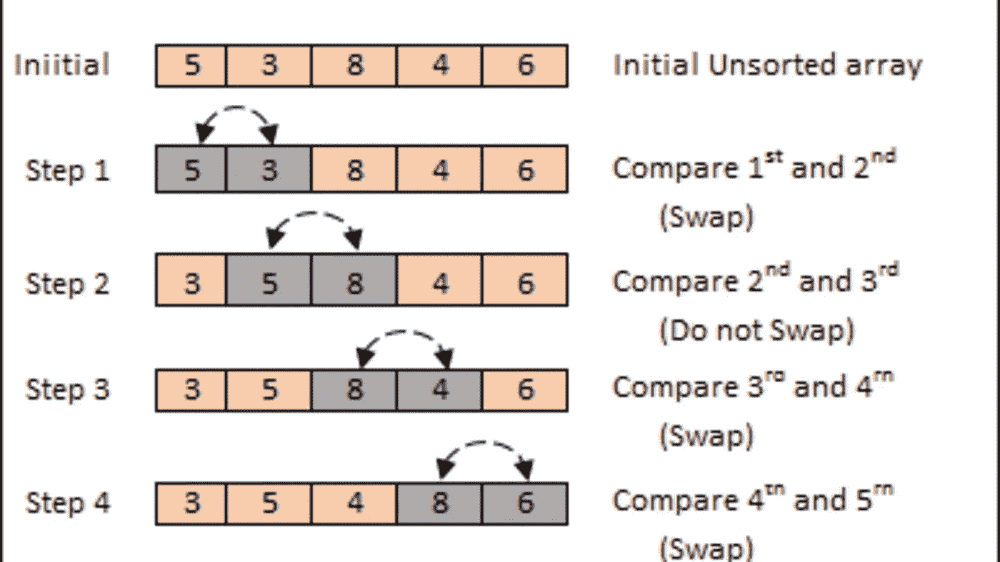
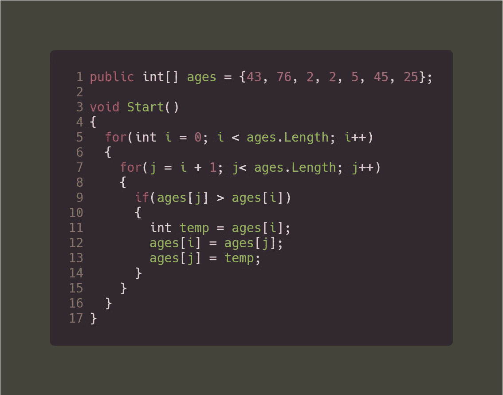
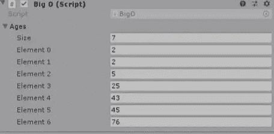

# 大 O 符号:Unity 中的冒泡搜索

> 原文：<https://levelup.gitconnected.com/big-o-notation-bubble-search-in-unity-c90ca1f608d0>

之前在我们的 *Unity 优化*系列([Big O:Unity](/big-o-binary-search-in-unity-f607d0f0919d)中的二分搜索法)中，我们理解了*二进制算法*搜索背后的概念，在这个搜索中，你在一个数组中找到一个目标值。提醒一下，这个搜索是 **BIG O** 符号的一部分，在这个符号中，你划分一个数组以找到你的目标值。但是要做到这一点，数组**必须**被排序，在本文中我们将看到如何使用新的**大 O** 符号对数组进行排序。



冒泡排序

> 大 O 快速回顾

以下是我们目前看到的三个大 O 符号:

**a . O(1)**= O/1 这是最好的情况，其中目标值是数组中的第一个值

**B. O(n)** = O of n 这是一个线性搜索(对于循环是正常的),其中 n 是循环找到目标值的迭代次数

**C. O(Log n)** = O log of n，这是你划分数组并在新划分的数组中搜索目标的二分搜索法。

帮助我们对数组排序的新符号是:

*   **O(n )** 它基本上是一个嵌套的 for 循环；循环中的循环。它也被称为冒泡排序。

> 冒泡排序

冒泡排序或 O(n)正在使用嵌套循环。不建议使用这种方法，因为它增加了搜索的时间复杂度，并可能导致一些性能问题，但知道这一点是有好处的。

让我们以下面的数组为例:

```
public int[] ages = {57, 90, 2, 15, 6, 35, 25, 3};
```

为了使用冒泡排序对数组进行排序，该算法将查看每个数组索引，并与其他所有索引进行比较，然后进行排序，并在必要时进行交换。

例如，以 57 岁为例。冒泡排序算法将取 57，并将其与 90 进行比较。它是否小于 90，如果是，那么它将 57 与 2 进行比较。57 是否小于 2，如果是，那么它将 57 与 2 交换。然后，它再次将 57 与 15 进行比较，以此类推，直到它最终将 57 与数组中的最后一个索引 3 进行比较，并在必要时进行交换。当它以 57 结束时，该算法将取数组中的第二个索引 90，然后将其与它之后的每一个索引进行比较。

## 那么如何实现呢？

冒泡排序的实现不像它的时间复杂度那么复杂。



冒泡排序算法

如您所见，我们首先获取索引 ages[ **i** ]，然后在继续下一个 **i** 索引之前，我们将 **i** ，与所有其他索引( **j** )进行比较。如果年龄[ **j** 处的值大于年龄[ **i** 处的值，那么我们将 **i** 与 **j** 互换。为了交换数字，我们必须创建一个临时变量来保存索引 **i** 处的值。

如果编写正确，冒泡排序算法将对年龄数组进行排序。



运行算法后的排序列表

如上所述，不推荐使用这种算法(冒泡排序或嵌套 for 循环)-O(n )-因为它增加了时间复杂度。在下一篇文章中，我们将学习一种新的排序算法，它比这种算法快得多，它被称为合并排序或 O(n Log n)。