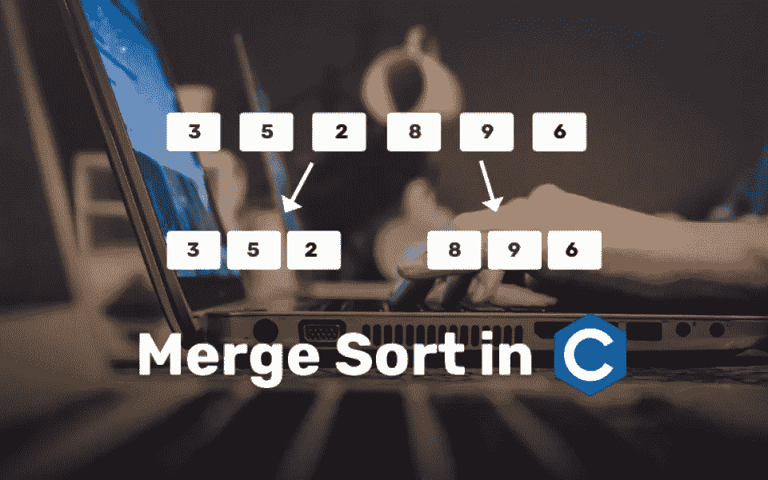
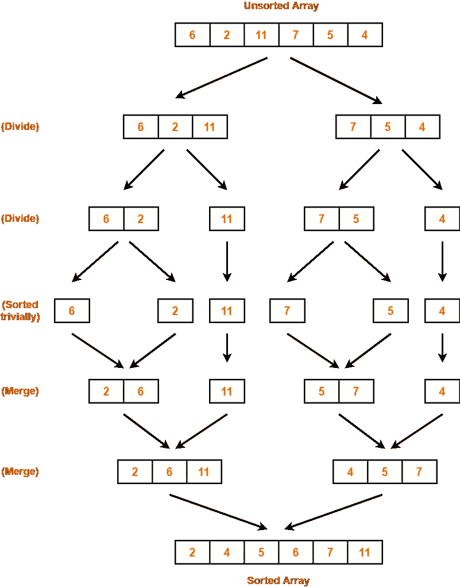
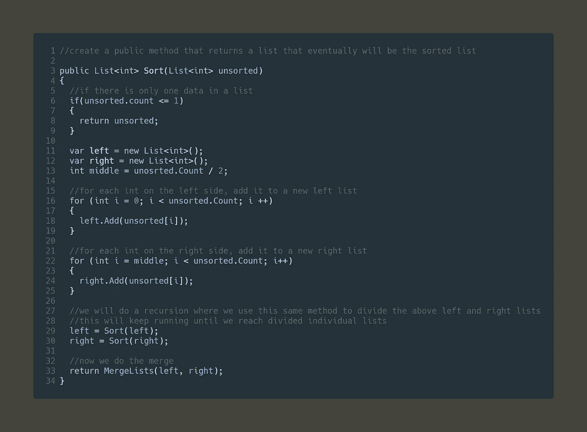
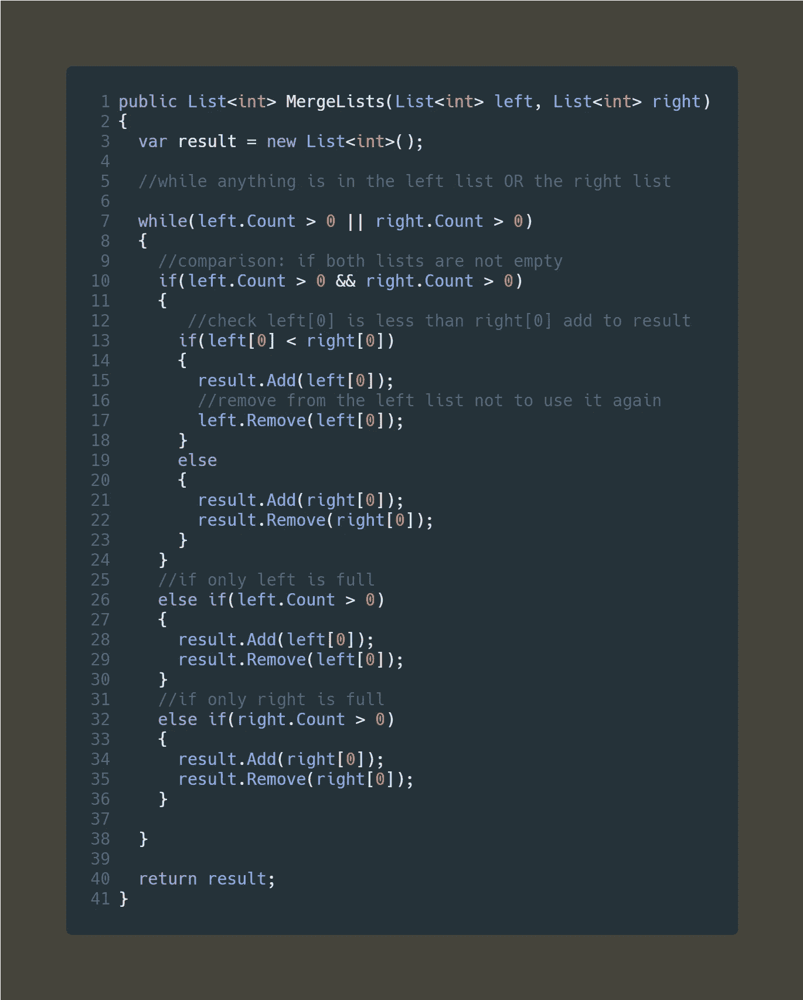

# 大 O 符号:Unity 中的合并排序

> 原文：<https://levelup.gitconnected.com/big-o-notation-merge-sort-in-unity-9dda253c6b13>

之前，我们看到了大 O 符号家族中性能最低的算法:冒泡排序([大 O 符号:Unity 中的冒泡搜索](/big-o-notation-bubble-search-in-unity-c90ca1f608d0))。在本文中，我们将深入研究一种更有效的排序类型和一种新的大 O 符号，即合并排序。



合并排序

> 了解合并排序

合并排序算法基本上是将一个大数据数组划分为单独的数组(每个数组一个索引)，因此每个数组将保存一个值。从那里，合并将开始排序和合并每个单独的数组，直到它将所有的数据合并到一个排序的数组中。



合并排序

根据大 O 符号，合并排序被称为:O(n log n)，这是划分和征服，所以它是线性搜索 O(n)和二分搜索法 O (log n)的混合。

> 履行

我们以下面的 int 列表为例:

```
List<int> ages = new List<int>{43, 76, 2, 2, 5, 45, 25};
```

该过程将分为两种方法，一种方法将数组分成每个数组一个索引的单个列表，第二种方法将开始排序和合并。

## 分割部分

就像在二分搜索法([大 O:团结](/big-o-binary-search-in-unity-f607d0f0919d)里的二分搜索法)，我们会把名单分为左名单和右名单。然后我们会把新的列表，分成新的左列表和右列表，这样一直分下去，直到列表中只剩下一个索引。听起来够简单吧？让我们实现它吧…



划分列表

正如你所看到的，这个方法将获取一个列表，并开始把它分成左列表和右列表，并一直这样做，直到它到达单个列表。在这个方法的最后，我们创建了一个名为 MergeLists 的新方法，它将两个列表作为参数。

## 合并零件



合并方法

这个方法所做的是获取左右两个列表，检查它们是否不为空，然后对列表进行加法比较，并将它们添加到一个排序列表中。

> 冒泡排序与合并排序

现在我们知道了如何进行这两种排序，让我们快速测试一下这两种算法的效率差异。

假设我们有一个包含 1000 个条目的列表，我们检查每个算法运行了多少次，以便对列表进行排序。我们通过在每次迭代中增加一个计数来做到这一点。


性能差异

如您所见，冒泡排序需要 500，500 次迭代才能对 1000 个数字的列表进行排序，而合并排序只需要 22，950 次迭代才能对同一列表进行排序。