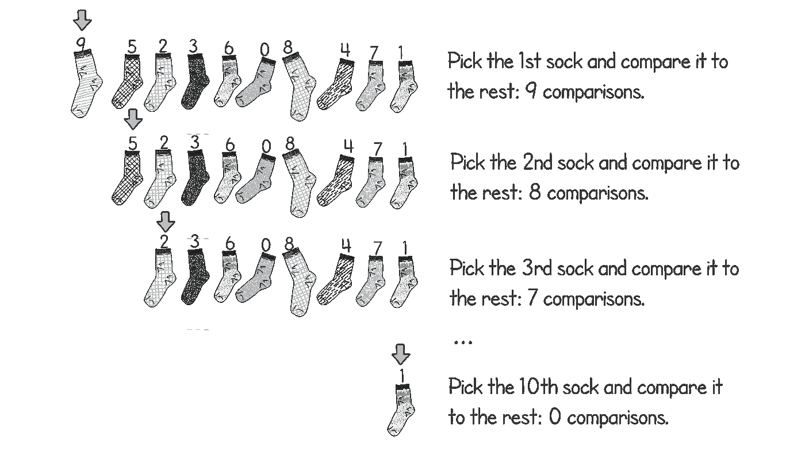
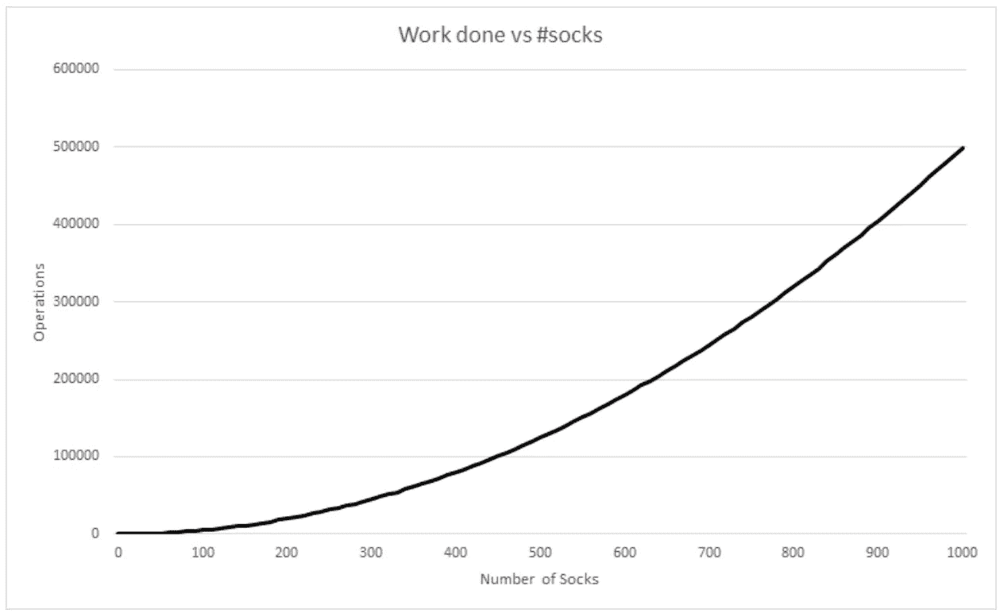

# 大 O 符号袜子

> 原文：<https://levelup.gitconnected.com/big-o-notation-socks-b1ca9b75d39c>

几周前，我发了以下微博:

“对我来说，早上找双相配的袜子总是一件很麻烦的事情。有人有更好的算法吗？”

我收到了一些回复，这些回复让我有了用袜子匹配来解释大 O 符号的想法。

没错。先从定义问题开始。

假设我们有*只袜子，每双配对的袜子都标有一个数字 ***i*** 。我们将一双袜子定义为相配的一双:*

**

*下面是一个例子的图片，它说明了我对袜子上的值 if ***i*** 的理解:*

**

*上面的示例图片中有几件事需要提及:*

1.  *有些袜子没有相配的一双。上面是 2，3，6 和 7。在某些日子里，我发誓有一个一条腿的小偷在做这件事…*
2.  *有些袜子可以搭配多只袜子，比如标签为 5 的袜子。当你买了一捆相同类型和颜色的袜子时，就会发生这种情况。*

*这里的目标是找到任何一个匹配对。想想当你早上醒来，打开你的袜子抽屉，需要在上班前找到一双相配的。*

*如果我们必须编写一些代码来表示这个问题，我们可以将袜子标签放在一个集合中，并将其提供给一个函数，该函数返回找到的任何匹配的标签，如果没有找到匹配，则返回-1。返回-1 意味着您将使用人字拖。*

```
*def find_matching_pair(socks):
    return -1*
```

*我们可以采取各种方法来解决我们的问题。但是我们怎么知道哪一个是最好的呢？“最好”是什么意思？如果你像我一样，早上总是有点后勤方面的挑战，那么“最好”意味着我可以最快地走出家门。*

*问题是，速度对于算法来说是一个模糊的概念。一种算法在一种类型输入下可能很快，但在另一种类型的输入下性能很差。所以单用速度并不是一个好的指示。绕过这个问题，在计算机科学中，我们不衡量速度而是规模。我们问这样一个问题:当我增加输入的大小时，程序的性能会下降到什么程度？降级越低，算法将更好地扩展到更大的输入。为了描述这一点，我们使用大 O 符号。接下来的部分试图通过各种例子给你一个我们如何测量的直觉。*

# *二次算法*

*我们解决袜子搭配问题的第一个尝试将是我们大多数人在匆忙时的做法(尽管这也是最慢的！):*

1.  *从一堆中挑出第一个，放在你的左手里。*
2.  *用你的右手仔细检查每一只袜子，看看它是否与我们左手拿着的那只相配。*
3.  *如果没有找到匹配的，把左手的袜子放好，从 1 开始，直到我们找到每一只袜子。*

*在 python 中，这可以写成:*

```
*def find_matching_pair(socks):
    for left_hand in range(len(socks) - 1):
        for right_hand in range(left_hand + 1, len(socks)):
            if socks[left_hand] == socks[right_hand]:
                return socks[left_hand]
    return -1*
```

*假设我们有 10 只袜子。在这种情况下，我们需要做多少袜子比较？*

*当然，这取决于堆的内容和组织方式。如果幸运的话，我们会在袜子堆的顶部找到两只相配的袜子，在这种情况下，我们只需要做一次比较(比较前两只袜子)。这被称为算法的最佳情况。我们最好的情况不会改变我们是否有 1000 万或 100 万只袜子。如果前两只袜子匹配，我们总是会做一个比较。虽然 100 万只袜子出现最好情况的概率低于 10 只袜子。*

*问题是，最好的情况并不能真正告诉我们我们的技术有多好。我们可能会幸运几次，但从长远来看，我们不太可能每天都遇到最好的情况，尤其是如果我们有很多袜子的话。所以我们需要另一种方法来比较我们的解决方案有多好。*

*每当我们引用算法的大 O 符号时，通常我们指的是算法的最坏情况(尽管有时也使用平均情况)。最坏情况是用来比较不同方法的更有用的度量。如果我们知道，在最坏的情况下，算法 A 比算法 B 更好，它会给我们一个更好的想法，A 会比 B 表现得更好。*

*当你用大 O 符号来比较算法时，这是第一条规则。使用最坏的情况。有时你也想比较一般的情况，但是为了本文的目的，我们坚持使用最差的情况，因为它更容易理解，通常也足够了。*

*好的，你能想到我们上面列出的解决方案的最坏情况吗？最糟糕的情况是一堆中没有一个匹配的配对。这是当你穿着不相配的袜子去上班迟到的时候。现在，对于这种最坏的情况，如果我们一开始有 10 只袜子，试着算出我们需要进行的袜子比较的数量。*

**

*所以总共我们会做 9 + 8 + 7 + 6 + 5 + 4 + 3 + 2 + 1 + 0 个比较操作。如果你把这个加起来，会是 45。*

*如果我们有 100 双袜子而不是 10 双呢？这将导致 99 + 98 + 97… + 0 袜子比较。有一个简单的公式可以给出这个和的结果，而不必进行整个计算:*

**

*如果我们不得不归纳为当我们有任意数量的袜子*时，我们有:**

****

**如果你对我如何得到上面的表达式感兴趣，可以通读一下维基页面:[en . Wikipedia . org/wiki/1 _ % 2B _ 2 _ % 2B _ 3 _ % 2B _ 4 _ % 2B _ % E2 % 8B % AF # Partial _ sums](https://en.wikipedia.org/wiki/1_%2B_2_%2B_3_%2B_4_%2B_%E2%8B%AF#Partial_sums)。**

**有趣的事实:上面的等式还会给你在与 ***n*** 人的会议中握手的总数。**

**这告诉我们我们的算法有多好？请注意，当我们将投入(袜子数量)增加 10 倍，从 10 增加到 100 时，我们的努力并没有成比例地增加。对于 10 只袜子，我们必须进行 45 次操作，然而对于 100 只袜子，这个数字是 4950，而不是 450。不如我们用输入尺寸和我们必须做的袜子比较操作的数量来绘制一个图表？**

****

**上面的图表显示了当我们增加投入时，我们需要做多少额外的工作。如果我们花一秒钟来比较一双袜子，那么在最坏的情况下，我们花 1 小时 20 分钟来比较 100 双袜子。如果我们将数量再增加 10 倍(1000 双袜子)，我们将花费近 6 天的时间来找到一双相配的。**

**那么我们算法的大 O 符号是什么？我们已经看到了给出最坏情况的表达式。我们可以扩展该公式，得到:**

****

**将任何表达式转换成大 O 符号只有两条规则。首先去掉所有常数，然后只考虑最高阶的部分。在我们的例子中，表达式的最高阶是平方部分。因此，上述情况将导致:**

****

**用极客的话来说，我们说我们的袜子匹配算法具有二次最坏情况时间运行时间复杂度，或者简单地说是 n 的平方的大 O。我们以这种方式简化表达式的原因是，随着 n 变得越来越大，表达式中阶数较低的部分计数越来越少。在实践中，我们的算法比 n 稍快，但是对于大的 n 值，这种优势不太明显。**

# **线性算法**

**怎样才能提高自己的袜子搭配？我的一个朋友建议把袜子按某种顺序摆放，这样搭配起来更容易。这从来没有为我工作过，因为洗衣机在随机洗牌方面做得非常好。现在让我们假设你找到了一种方法来将它们分类，或者你一洗完袜子就订购它们，我们的袜子匹配算法会有什么变化呢？**

****

**我们可以利用袜子已经分类的事实，我们只需要将每只袜子与它旁边的一只相匹配。算法大概是这样的:**

```
**1\. Pick the first sock in your left hand
2\. Pick the next sock in your right
3\. If the socks in your left and right match then you have a match
4\. Otherwise, If there are more socks 
   a. Get rid of the sock on the left hand
   b. Move the right hand sock to the left
   c. Repeat from step 2**
```

**在 python 中，这可以写成:**

```
**def find_matching_pair(socks):
    if len(socks) < 2:
        return -1
    left_hand = socks[0]
    for right_hand in range(1, len(socks)):
        if socks[left_hand] == socks[right_hand]:
            return socks[left_hand]
        left_hand = right_hand
    return -1**
```

**这如何影响我们的运行时性能？让我们再次考虑我们的最坏情况性能，即我们做最多工作的时候。同样，在这种情况下，这是当我们无法找到一个匹配，并通过所有的袜子。我们要走多少步？让我们试着更精确一点。对于几乎每只袜子，我们都用右手捡起来，进行比较，然后传递给左手，即每只袜子 3 步。这意味着，如果我们有 n 双袜子，我们要走的步数是:**

****

**现在记住，要将上面的转换成大 O 符号，我们需要去掉常数，取最高阶。在这种情况下，我们最终得到:**

****

**注意，为了推导算法的复杂度，我们不需要精确计算算法的每一次运算。如果我们只计算袜子的对比，而不是拿起你手中的袜子，我们会得出同样的结果。重要的是我们要始终如一，我们选择要计算的东西并坚持下去。**

**这就是所谓的具有线性运行时复杂性的算法，并且通常是我们的大脑在考虑比例时默认的。简而言之，如果您将输入大小(袜子的数量)增加一倍，那么操作的总数也会增加一倍。如果我们花 1 秒钟来比较一双袜子，那么我们花 1000 秒来比较 1000 双袜子，而二次解需要 6 天。相当大的进步！**

# **常数算法**

**我们还能进一步提高吗？另一个朋友建议我扔掉所有的袜子，买许多相同类型、颜色和尺寸的袜子。天才和无聊我以为…**

****

**我们的算法现在非常简单。基本上我们只需要选择任意两只袜子:**

1.  **挑选左手的第一只袜子**
2.  **挑选右手的第二只袜子**

**在 python 中，这将是:**

```
**def find_matching_pair(socks):
    if len(socks) < 2:
        return -1
    return socks[0]**
```

**当我们增加投入时，我们的绩效会有怎样的变化？首先注意，在这种情况下，算法的最差情况与最佳情况相同。同样，不管我们有几双袜子还是一百万双都没关系。我们将总是执行相同的几个操作，算法将花费完全相同的时间。这就是我们所说的恒定复杂性，写为:**

****

**恒定的运行时复杂度是最可伸缩的类型，并且通常是最需要的算法类型。请再次注意，只要输入大小不变，我们在算法中做多少运算都没关系。**

**值得一提的是，计算复杂度并没有告诉我们一种算法对于特定输入的工作速度有多快。对于某个小的输入，常数算法可能比二次算法工作得慢。如果我们只有两只匹配的袜子，我们所有的匹配方法都会表现得很好。大 O 符号只比较不同方法与输入大小的伸缩性。**

**在我们的文章中，我们只探讨了三种类型的复杂性，但是还有许多其他类型的复杂性。看看这篇维基文章，了解所有不同类型的复杂性:**

**[https://en.wikipedia.org/wiki/Time_complexity](https://en.wikipedia.org/wiki/Time_complexity)**