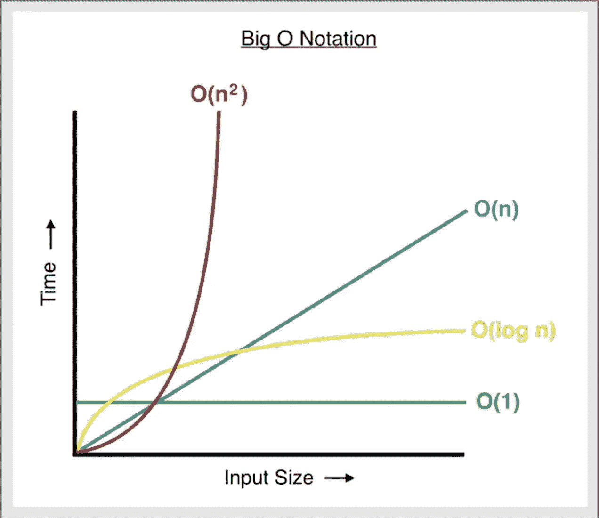
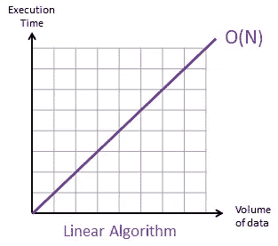
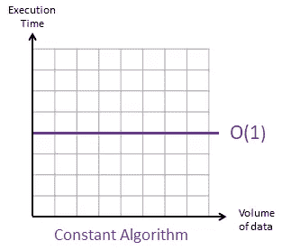
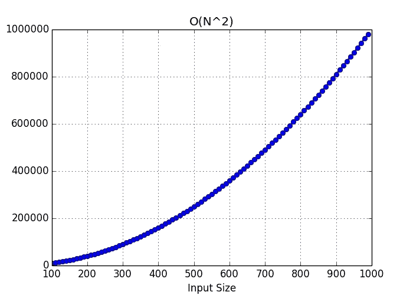
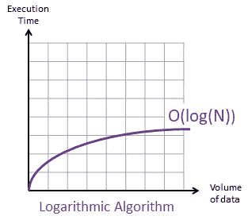

# 大时间复杂度:它是什么，为什么它对你的代码很重要

> 原文：<https://levelup.gitconnected.com/big-o-time-complexity-what-it-is-and-why-it-matters-for-your-code-6c08dd97ad59>

图 1:大 O 时间复杂度图。鸣谢:黄 d(2018 年 1 月 1 日)。Javascript —算法

警告:这里面有一些数学。但是不要被吓跑了！没有听起来那么痛苦。

如果你几年前告诉我，有一天我会写一篇涉及任何数学的文章，我会告诉你你绝对是疯了。许多阅读这篇文章的人可能会有同样的感觉。但是事情是这样的，**我们需要特定的方式来将我们在职业中处理的事情具体化**。也就是说，无论我们在做什么，我们都应该有某种方式来说:“这正是使这个(在这里插入你需要测量的任何东西)比这个(在这里插入其他不太有效的东西)更好的东西。”

我在体育界工作的时间教会了我这第一手知识。一个简单的例子:如果一名运动员比另一名运动员跑得更快，那么在特定的环境下，这名运动员比另一名运动员更快。即使只差 0.1 秒，那个运动员在这种情况下还是更快。

**我们编写的代码需要有某种客观的方法来衡量它的性能，或者效率**。我们需要某种方法来衡量:“这一行或这一块代码比这一行好，这就是原因。”但这提出了一个显而易见的问题:到底是什么让一段代码比另一段好？难道是代码更短了？更容易让别人读懂？重构得好？运行时是最重要的吗？它消耗的内存量呢？不用说，就像两个运动员在炎热或寒冷的天气里跑 10 米短跑和 20 米短跑一样，环境很重要。简单来说，**这正是大 O 符号为我们做的。它允许我们在给定某些参数的情况下测量代码的效率，这些参数对于当前的情况是最重要的。**

> 我们编写的代码需要某种客观的方法来衡量其效率。

**在本文中，我们将探索如何通过大 O 符号来评估“时间复杂度”。**别担心，我们也会讨论这意味着什么。

在深入研究之前，我想对[柯尔特·斯蒂尔的算法和数据结构课程](https://www.udemy.com/course/js-algorithms-and-data-structures-masterclass)中的许多例子和概念给予一点肯定。

# **时间复杂度的大 O 符号**

我们来谈谈速度。

首先，我们很多人都知道可以使用计时器来测试代码的速度。但这引发了一些问题。一个是记录的时间会因机器而异。事实上，同一台机器内的时间甚至会有所不同。另一个主要问题是，这仍然没有给我们一个客观的方法来讨论两个代码块之间的区别。我们如何传达这一点，我们从较慢的时间中减去较快的时间吗？我们接受百分比差异吗？换句话说，这里的界限会变得有点模糊。

这正是大 O 符号发挥作用的地方。它为我们提供了一种以一致和清晰的方式交流代码效率的方法。

> 大 O 符号为我们提供了一种以一致和清晰的方式交流代码效率的方法。

那么，如果不是时间，我们还能用什么呢？简单的答案是**计数操作。**让我们看一些例子来说明这意味着什么。

标题中的图表引用了最常见的“大 O 表达式”类型。因为它们是你会遇到的最常见的表达方式，所以这些是我们将在本文中讨论的。

# **大 O 表情的主要类型:**

大 O 表达式都涉及到算法 O(f(n))。简而言之，这意味着随着计算机通过 **n** 进一步工作，计算机必须做的简单操作的数量会减少(这一点稍后会更有意义)。

## **常见的** **大 O 表情#1: O(n)**

图 2: O(n)图，信用:101computing.net(2018 年 1 月 21 日)。大 O 符号线性算法。

O(n)和 O(1)是最容易理解的表达式(我们接下来会讨论后者)。如果一个操作有一个 O(n)(读作‘O of N’)，这意味着，**随着‘N’的增加，完成问题所需的操作量也增加。**这很容易理解，因为这是一个完全线性的关系。

> **如果一个算法有一个 O(n ),随着‘n’的增加，完成问题所需的运算量也会增加**

让我们探索一个例子，我们将在下一点中使用 O(n)和 O(1)。

## **编写一个函数，计算从 1 到 n(包括 1 和 n)的所有数字的和**

**例子:如果 n = 3，那么函数应该运行 1 + 2 + 3，返回和:6。**

解决这个问题的第一个(也是最明显的)方法是使用“for”循环。

在这种情况下，这里的大 O 应该是 O(n)。这是因为，随着 n 的增加，迭代“for”循环所需的操作量也会增加。计算机每次经过‘for’循环，都需要赋值多个变量，进行比较，并添加多个变量。它必须一遍又一遍地重复这个过程 n 次。简单来说，这相当慢。

假设 n 是 5。这意味着计算机需要循环 5 次函数才能得出答案。假设 n 是 1000。在这种情况下，计算机将需要通过函数循环 1000 次来计算我们的解。

从技术上讲，在第一种情况下，我们将处理 O(5n)(或者，如果你想得到技术上的，O(5n +2)，因为在' for '循环之外有两个赋值)，在第二种情况下，我们将处理 O(1000n)(或者，如果你想再次得到技术上的，O(1000n + 2))。但是请记住，大 O 符号的目标是尽可能地简化事情，以便我们与其他程序员交流。因此，就术语而言，n 前面是什么并不重要。**这两个表达式都将简化为 O(n)。因为无论如何，随着 n 的增加，运算量大致与 n 成正比增长。**

还和我在一起吗？好吧，我们继续。

## **常见的大 O 表情#2: O(1)**

图 3: O(1)图，信用:101computing.net(2018 年 1 月 21 日)。大 O 符号。

一个有 O(1)的算法更容易理解。**如果一个算法有一个 O(1)，这意味着无论 n 的值是多少，解决问题所需的运算量保持不变。**

> **如果一个算法有 O(1)，那么它的时间复杂度将保持不变，不管 n 的值是多少，它是最有效的算法类型。**

让我们来看一个例子，通过解决与上面**(写一个计算从 1 到(包括)n 的所有数字之和的函数)**相同的问题，但是通过使用一个更有效的解决方案。O(1)的解。

这个解决方案是可行的，会给我们同样的结果。**在这种情况下，总是有 3 个操作被调用。**无论 n = 1 或 n = 1，000，无论 n 的大小如何，都只会有 3 次运算(此处为加法、乘法和除法)。因此，从技术上讲，我们会有一个 O(3)。但是请记住，作为程序员，我们喜欢让事情尽可能简单。因此，无论我们有 O(3)还是 O(10)，我们都会说**这是 O(1)，因为无论 n** 的值是多少，运算都保持一致。这不同于我们上面的“for”循环，在那里操作的数量继续与 n 大致成比例地增加。

您可能注意到的第一件事是这段代码比上一段代码短，但这并不一定会使一行代码比另一行代码好，这也不是本文的重点。此外，这个解决方案是如何工作的以及它来自哪里现在并不重要，所以如果你不明白它是如何工作的，那也没关系。

要理解的一点是为什么这比前面列出的 O(n)函数更有效。原因是，不管 n 等于多少，完成函数所需的运算量保持不变。因此，如果我们在谈论时间复杂度，这个函数优于先验。

总之，**一个 O(1)的算法是最可取的，并且总是比 O(n)的算法更有效。**

哇哦。已经很多了，但我们还没完。让我们继续前进！

## **常见的大 O 表情#3: O(n**

图 4: O(n)图，信用:Arzzen。(2019 年 2 月 10 日)。大 O 符号简单指南。

**O(n)运算中的 O(n)运算是 O(n * n)运算。换句话说，O(n)。**这是最慢和效率最低的，因此在考虑时间复杂度时是最不理想的大 O 表达式。

> **具有 O(n)的算法随 n 呈指数增长，它是最慢、效率最低的算法类型。**

让我们探索一个具有 O(n)的函数的例子

## **编写一个函数，返回成对的数字，从 0，0 开始，一直到 n，n 之前**

**例:如果 n=2，函数应该返回“0，0 0，1 1，0 1，1”(每次在 2 之前停止)。**

这是可行的，并且有一个 O(n)。**如果 n 等于 3，我们将得到 9 对，如果 n 等于 4，我们将得到 16 对。所以这里的运算量随着 n 呈指数增长**

重要的是要注意:这个函数是 O(n)的原因不是因为有两个“for”循环。事实上，你可以有多个“for”循环，只要它们没有嵌套，仍然以 O(n)结束。**结果为 O(n)的原因是，由于函数中有一个嵌套循环，解决问题所需的运算量将随 n 呈指数增长。**

## **常见的大 O 表达式#4: O(log n)**

图 5: O(log n)图，信用:101computing.net(2018 年 1 月 21 日)。大 O 符号。

在我们开始之前，**让我们快速定义一下什么是“日志”**(请耐心听我说，我会让它变得快速而没有痛苦！).就像加法有逆运算(减法)和乘法有逆运算(除法)一样，指数运算也是如此。**取幂的倒数是对数(log)。**

一个例子:对数₂(8) = 3。我们可以简单地理解为，“2 的 8 次方等于多少？”。嗯，2 * 2 * 2 = 8。所以我们的答案是 3。

你会看到的最常见的“对数”是对数₂(读作“以二为底的对数”)和对数₁₀.但是根据我们通常的简化目的，我们将把它简化为“log”。这是因为不管我们处理的是什么样的“日志”,我们图表的总体趋势最终看起来总是一样的。好了，现在够了！编码上。

这是一个经典的 O 对数的例子(log *n* ):

另一个具有 O(log *n)* 的算法的常见例子是搜索算法，其中答案空间不断分裂。这可能是一个[二分搜索法](https://en.wikipedia.org/wiki/Binary_search_algorithm)，你一次又一次地将一个有序数组分成两半，直到你找到答案。

> **一个 O(log *n)* 算法的时间复杂度随着 n 的增加而增加，但最终趋于平稳。O(log *n)是仅次于 O(1)的*。**

**具有 O(log *n)* 的算法在时间复杂度上随着 n 而上升，但最终趋于平稳。**如果你的代码有一个 O(log *n)，*这太棒了！ **O(log *n)是仅次于 O(1)的*。**

**数组与对象**

我们长话短说吧。**由于时间复杂性，处理对象(键:值对)几乎总是比数组(有序列表)更有效**，因为它们没有特定的顺序。

> 从时间复杂性来看，使用对象几乎总是比数组更有效。

**物体的大 O**

*   **插入—** O(1)
*   **清除-** O(1)
*   **搜索—** O(n)注意:搜索不同于访问。在这种情况下，搜索意味着以任何方式遍历对象。一个例子是迭代查找对象中是否存在某个值。
*   **访问—** O(1)

对象非常快，因为它们通常不用于排序！

**对象方法的大 O**

*   **Object.keys —** O(n)
*   **Object.values —** O(n)
*   **Object.entries —** O(n)
*   **hasOwnProperty —** O(1)

为什么前三点等于 O(n)是有道理的。这些方法用于创建数组。例如:对于 Object.keys，对象中的键越多，创建数组的时间就越长。

**数组的大 O**

*   **插入—** 变化
*   **移除—** 各不相同
*   **搜索—** O(n)
*   **访问—** O(1)

数组中有不同的插入和移除方法，当涉及到它们给表带来的时间复杂度时，它们会产生很大的不同。让我们来探讨一下这意味着什么。

**大魔神阵的阵法**

*   **推送—** O(1)
*   **流行—** O(1)
*   **shift —** O(n)
*   **未移位—** O(n)
*   **concat —** O(n)
*   **切片—** O(n)
*   **拼接—** O(n)
*   **地图—** O(n)

不用担心背这个单子！**关键的一点是，任何需要改变/移动数组中的索引的方法都有一个很大的 O(n)。想想看，如果我在一个有 1000 个元素的数组上使用“unshift”(在数组的开头添加一个元素)，计算机现在需要遍历整个数组，并将每个元素的索引移动 1。**

另一方面，使用“pop”(从数组中移除最后一个元素)根本不需要计算机修改任何东西的索引，因为我们所做的只是移除最后一个索引。

总结:如果你不在乎顺序，使用对象通常是明智的选择。

总之，**大的时间复杂度允许我们分析解决问题所需的操作数量，并以简单、一致和可理解的方式向其他开发人员传达其效率**。它是理解算法和数据结构的基础，因此熟悉它非常重要。

 [## 编码面试的大 O 时间和空间复杂度

### 我们将完全理解大 O，但在我们深入之前，让我们先不用所有的数学来定义它。我们测量…

技术开发](https://skilled.dev/course/big-o-time-and-space-complexity)