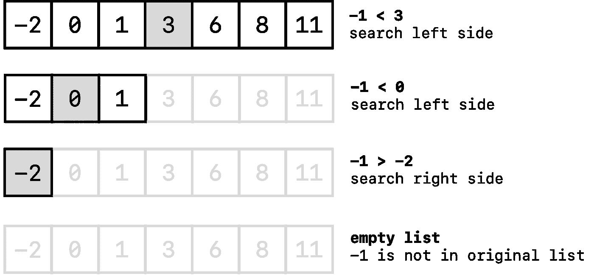

# 大 O 单位优化

> 原文：<https://levelup.gitconnected.com/big-o-unity-optimization-e5cb3f20ed1a>

Unity 中任何项目开发的重要部分是项目分析，以检查性能问题和优化。优化的核心是大 o。

大 O 表示法是一种表达算法所需的许多步骤之间的关系的方法，这些步骤与输入数据的大小有关，换句话说，就是算法有多复杂。


> 理解 Unity 中的大 O 符号

大 O 符号是衡量算法效率的一种方式。它允许我们理解我们代码的时空复杂性。

理解大 O 最好的例子是当你有一个很大的项目列表，你想在列表中找到一个项目。对于非常小的列表，使用 for /foreach 循环很快，但是当列表增长时，您的性能将开始受到影响。

***O of N***

这被称为 O/N，其中 N 是您必须过滤的数据量。最好的情况是 O/1，其中 1 是列表中的第一个项目。最坏的情况是 N 是列表中的最后一项。因此，如果您有 100 个项目，并且您需要的项目在第 90 个槽中，使用 for 循环将花费您 90 次迭代，直到您找到您需要的项目，这是非常低效的。这被称为线性搜索。

> 大二分搜索法

二分搜索法是大列表的解决方案，它是在大列表中找到你的项目的有效算法。它也被称为半间隔搜索或二进制斩波。

简而言之，算法会将你的列表减半，并继续减半，直到它使用 O/1(最好的情况)而不是 O/n 找到你需要的项目。

一个非常重要的步骤是首先对你的列表进行排序。

> 例子

```
int[] ages = { 1, 2, 3, 4, 5, 6, 7, 8, 9, 10};
```

如你所见，列表已经排序，假设我们需要找到 int 4。

使用二分搜索法，首先我们半数组:

```
//length of array (10) / 2 = 5
```

所以数组的中间是 5，所以我们检查 4 是否大于 5，不，所以 5 右边的一半将不再使用，我们将使用 5 的左边。

所以新名单是:

```
1, 2, 3, 4, 5
```

我们再来一遍，再对半新列表，我们检查 4 在哪边。在这里，它位于右侧，因此我们再次将列表减半，我们将保留一个新数组:

```
4, 5
```

在这个最终列表中，4 是列表中的第一项，也就是 1 的 O。



当我们的列表很大时，使用这种算法比使用普通的 for 循环来查找条目更有效。所以二分搜索法的时间复杂度，每次我们把数组减半，比普通的循环要简单得多。分而治之。

这个算法也被称为 O(Log n):将一个列表减半。

在下一篇文章中，我们将更深入地探讨大 o。