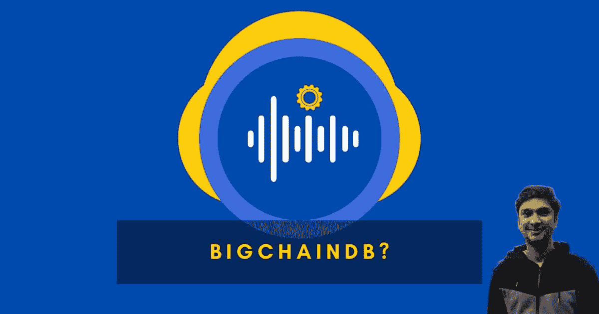

# BigchainDB——新区块链数据库？

> 原文：<https://levelup.gitconnected.com/bigchaindb-the-new-blockchain-database-1a23088e717d>

随着二十世纪数据技术新时代的到来，扩展数据库存储技术的需求变得比以往任何时候都更加明显和迫切。IDC 预测，到 2020 年，数据量将达到 40Z(Wang 等人，2020 年)，这就越来越要求我们在全球范围内改进数据存储和分发方式。从那时起，各种数据库管理解决方案出现了，它们在性能、可伸缩性和分布方面促进并战胜了其他传统技术。我们将 BigchainDB 视为对以 MongoDB 为核心的数据库组的新介绍，并在支持基于区块链的应用程序的分布方面采用真正的去中心化。

BigchainDB 试图解决传统数据库以及一些高性能和容错数据库(如 HiveDB 和 HadoopDB)面临的挑战。快速浏览 BigchainDB 的架构如下。BigchainDB 遵循基于节点的体系结构，其中每个节点包括 MongoDB 节点、BigchainDB 服务器和 Tendermint 服务器，tender mint 服务器在与其他节点通信时用于共识协议方法。在 Hive 和 HadoopDB 遵循主从架构的情况下，系统遵循集中式方法，其中新出现的查询必须通过中央主节点，然后中央主节点将查询的执行转化为系统内部的步骤。另一方面，BigchainDB 不需要一个集中式节点来处理请求。启发式算法优化要接近的最近节点，然后使用该节点来处理查询。正如(Wang et al .，2020)总结的那样，性能是这些分布式非结构化数据库的三倍。可以从这些分散式解决方案中获益的最大用例之一是在游戏领域。最近多人游戏的出现(Wohn & Freeman，2019)为人们在玩这些游戏时如何在线消费带来了巨大的潜力。具有分散细分和加密货币形式的游戏改进模型将打开更直接的买方，面对工程师、创作者、表演者和游戏生命周期中不受断开世界限制的每个人之间的连接和适应。目前区块链上游戏的生物系统对整体的高级体验和执行有限制，无论如何，与 BigchainDB 的共同努力将增强区块链级别的多功能性，现在它将能够帮助一个向所有人开放的创新游戏的全新时代。

致力于实现可扩展的区块链社交游戏网络的业务问题(Phan，2019)。相对较新的解决方案的可靠性受到质疑，尽管事实和性能数据证明，当涉及到在这些传统解决方案当前运行的级别上处理交易时，它将表现相同。游戏业务充满了对独一无二的计算机化资源的可能应用，我们无疑在这一领域看到了更多的立足点(Phan，2019)。与企业共同努力，能够对更新的数据库管理解决方案给予更多信任，这是一个令人难以置信的初步举措，旨在利用完全分散的游戏网络开发未来游戏业务的能力，不仅可以帮助用户更快地连接，还可以以最大的安全性和可靠性处理网络上的相关实体和基于货币的交易。

**参考文献:**

1.  王燕，谢春海，李，陈(2020)。区块链和非区块链分布式数据库的研究与分析。2020 年 IEEE 第五届云计算和大数据分析国际会议(ICCCBDA)。已发布。doi.org/10.1109/icccbda49378.2020.9095589
2.  沃恩、迪耶和弗里曼(2019 年)。电竞中的直播、玩法、花钱行为。游戏与文化，15(1)，73–88。【doi.org/10.1177/1555412019859184 
3.  Phan，Q. A. (2019)。越南网络游戏产业的挑战与机遇:一项关于相关方思想的定性研究。创意产业杂志，12(3)，248–271 页。[doi.org/10.1080/17510694.2019.1610933](https://doi.org/10.1080/17510694.2019.1610933)

*原发布于*[*https://blog . adityakarnam . me*](https://blog.adityakarnam.me/bigchaindb-the-new-blockchain-database)*。*