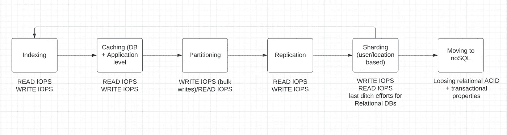
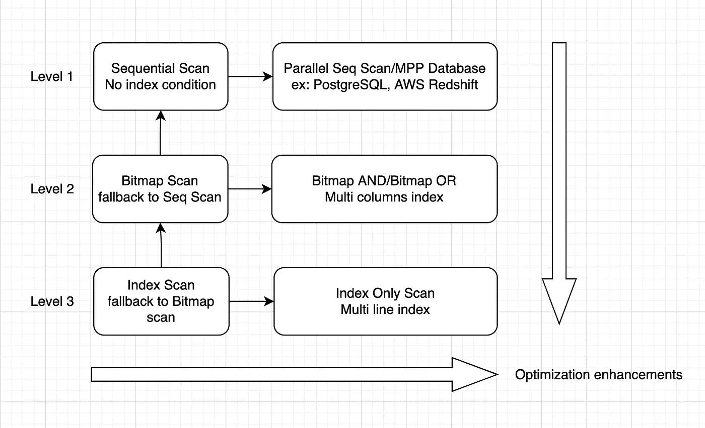

# BigData/DBA:查询超过 10 亿行的数据库表

> 原文：<https://levelup.gitconnected.com/bigdata-dba-querying-a-database-table-with-over-a-billion-rows-2278f17d3e69>

## 查询大小为 TB 和 PBs 的关系数据库，也称为超大型数据库(VLDB)


图片来源:rkimball.com

嘿伙计们！在这篇简短的文章中，我记下了特定于 VLDBs 的各种事实上的数据库(DB)优化技术。最重要的是，在应用或跳回到一个特定的技术之前，我已经总结了围绕构建这些优化技术的心智模型。

> 写这篇文章的灵感:在我过去从事 VLDBs 工作的几个项目中，我意识到为了解决 DB 的读/写延迟问题，我们经常在确保基本而强大的简单优化技术处于受控状态之前，过快地采用非常先进的技术，如分片或 NoSQL 迁移。这篇文章是我过去解决这类问题的经验的反映。

让我从 DB world 的一句名言开始，它是这样的:

> 查询有十亿行的表的最好方法是避免查询有十亿行的表。

# 目录

1.  **事实上的数据库优化技术&围绕实现它们的心智模型**
2.  **索引文摘！—详细介绍索引、索引扫描的类型以及与此相关的示例**
3.  其他技术的要点:简单来说就是分区、复制和分片。

# 1.简单的数据库优化技术

对于关系数据库，有各种简单有效的策略可以用来优化读/写 IOPS 或延迟。下面是要按顺序检查的所有技术的总结。



数据库实践

从上图可以理解，要优化 VLDBs 的读/写延迟，应该先考虑 ***索引******缓存*** & ***复制*** 技术，然后再投入精力开发高级技术，如*或 ***迁移到 NoSQL*** 数据库，这些数据库已经*

# *2.索引文摘*

*由于索引是一种比上面提到的其他实践更受欢迎的实践，在这一节中，我将演示如何充分利用索引。因此，它可以从这种 VLDB 的表中查询记录，而无需对源表进行一次扫描。*

*让我们从下面附加的快照开始，它提到了所有的索引级别，并在每个级别使用右箭头将其增强扩展到右侧。**级别 1** 默认为顺序扫描(无步进)，而**级别 3** 为步进扫描。*

*从**级 x** 到**级 x-1** 的向上箭头显示回退扫描。如果索引扫描失败，则退回到位图扫描，如果位图扫描失败，则退回到顺序扫描。*

**因此请注意，如果索引配置不正确，底层扫描将总是回退到基于数据库功能的顺序扫描或并行顺序扫描。**

**

*利用数据库索引优化查询延迟*

*在解释上面的快照之前，考虑一个表的方案:
**public . vehicle _ histories:(vehicle _ no，timestamp，lat，long，speed，distance，state)。**让我像这样定义一个目标查询，以理解上面提到的 3 个级别:*

```
*EXPLAIN ANALYZE
SELECT  
    UPPER(vehicle_no),  
    CAST(pst_timestamp AS DATETIME),  
    latitude :: NUMERIC,  
    longitude :: NUMERIC
FROM  vehicle_histories
WHERE  CASE1 | CASE2 | CASE3
ORDER BY  pst_timestamp DESC
LIMIT  10;*
```

## *情况 1/级别 1:无索引顺序扫描*

***其中:vehicle_no = "XYZ"** 这将是一次顺序扫描，可以使用 MPP 数据库进一步优化为并行顺序扫描。*

*M 这通常是数据仓库 DB 的主要特征。*

## *情况 2/级别 2:位图扫描*

***索引在:**vehicle _ no _ and _ vehicle _ timestamp _ idx+PST _ timestamp _ idx
**其中:** vehicle_no = "XYZ" **或** pst_timestamp 在(T1，T2)之间*

> **vehicle _ no _ vehicle _ timestamp _ idx =>这是一个* ***多列*** *索引的例子，因为 2 个或更多的列/属性构成了索引。**

*在这种情况下，我们以**位图索引扫描**结束。你可以把它看作是两个或多个索引的交集。这比并行/顺序扫描好得多，但仍不如**索引扫描或仅索引扫描**(我们将在后面的案例中看到这一点)*

*还要注意，由于这个索引扫描是两个索引的交集，所以我们在 pst_timestamp 上有第二个索引。使用位图扫描执行此类**或查询**非常重要。*

## *案例 3:索引扫描*

***索引 on:**vehicle _ no _ PST _ timestamp _ idx
**其中:v** ehicle_no = "XYZ" **和** pst_timestamp 之间(T1，T2)*

*这是一个令人高兴的情况。数据库会使用索引堆文件找到源表 的 ***行 ID &页号然后跳转到源表堆文件获取数据。但是跳转到源堆文件并查找行仍然是开销，并最终导致降低查询&索引的性能。****

> **如上所述，索引扫描仍然比位图索引扫描更有效。**

## *情况 3/子情况:仅索引扫描(最有效)*

***索引于:**vehicle _ no _ pst_timestamp _ idx**与**纬度&经度
其中: vehicle_no = "XYZ "与 PST _ timestamp 之间(T1，T2)*

> **vehicle _ no _ vehicle _ PST _ timestamp _ idx**

*需要注意的是**多栏索引和多行索引**是有区别的。在多行索引中，我们存储额外的行作为信息，不像在多列索引中，我们只有一个索引，没有额外的属性/列。*

*在任何数据库中，总有大约 20%的查询在 80%的时间里运行。在这里，我们可以通过对少数查询进行索引扫描来充分利用索引的功能。*

*我希望所有 3 个案例和它们的子案例现在看起来都很简单。感谢你阅读这篇文章，我想分享一些索引后可以进一步使用的技巧。*

# *3.其他技术的要点*

*除了索引之外，让我们依次讨论一下其他技术**可以用来提高读/写延迟。根据以下快照:***

**

*数据库性能增强*

*   ***缓存:**缓存可用于减少每个缓存 TTL 的查询次数。这将间接地减少数据库 CPU 和内存的使用。这可以在应用程序级别完成，通常使用像 REDIS 这样的内存缓存。*

*但是，值得注意的是，缓存也可以在数据库级别完成和配置。PostgreSQL 主要使用缓存来存储数据、索引数据，甚至查询成本/计划者。*

> *您可以通过更改 **shared_buffer** 来配置 PostgreSQL 缓存，并且可以将其从 128MB(默认)增加到系统 RAM 的 30%<。*

*   ***分区:**顾名思义，我们可以按区域或时间戳进行分区。例如，在上述示例中，分区如下所示:*

***父表:**事件历史记录*

*分区字段:pst_timestamp @月频率
**子表 1:**event _ histories _ Jan _ 2022 _ feb _ 2022
**子表 2:**event _ histories _ feb _ 2022 _ mar _ 2022
**子表 3:**event _ histories _ mar _ 2022 _ apr _ 2022*

> **通常，作为清理服务，每月运行一次作业来删除超过 3-6 个月的分区，并进行清理等。分区技术对于读取非常有用，但同时对于批量写入也非常有益。**

*   ***复制**:在这种方法中，我们有一个主从架构/arc，其中主用户写，从用户读。*
*   ***分片**:分片应该始终是优化 DB &查询性能的最后努力。在应用程序级别，复杂性和维护开销可能会很麻烦。但是有工具可以形式化不同数据库的分片过程。比如 MySQL:[https://vitess.io/](https://vitess.io/)*

*关于关系数据库的性能增强，我们在本文中已经讨论了很多。我希望你喜欢这篇文章。*

**感谢阅读！**

****连接*** 🤝***:****

*   ****邮箱***:*bbhopalw @ Gmail**
*   ****Linkedin***:[*www.linkedin.com/in/bbhoaplw*](http://www.linkedin.com/in/bbhoaplw)*

****供进一步阅读***✍️***:****

****大数据&云工程博客:****

*   ****走向数据科学出版:***[*https://medium.com/@burhanuddinbhopalwala*](https://medium.com/@burhanuddinbhopalwala)*

****后端工程&软件工程博客:****

*   ****DEV 社区:*** [*https://dev.to/burhanuddinbhopalwala*](https://dev.to/burhanuddinbhopalwala)*