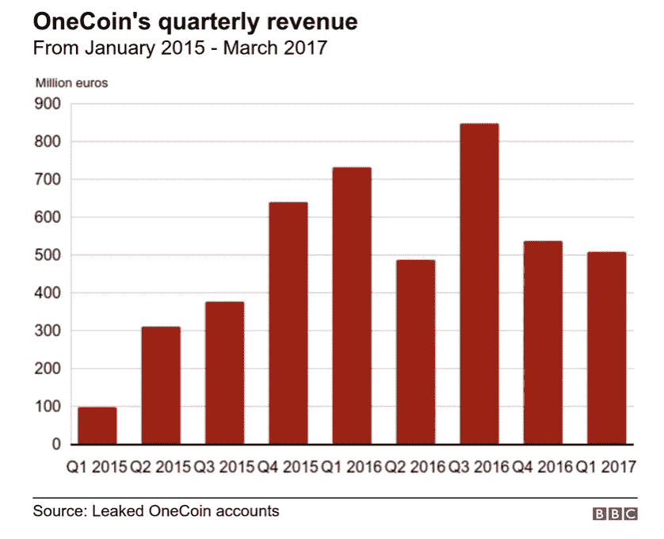
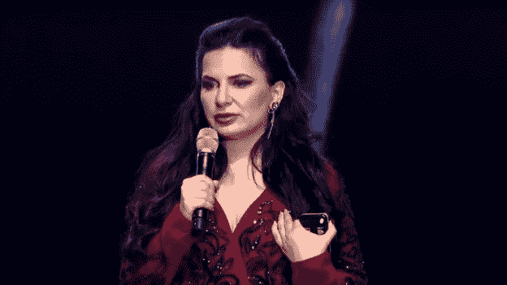

# 价值 150 亿美元的加密骗局震动了整个行业

> 原文：<https://levelup.gitconnected.com/biggest-crypto-scam-in-history-worth-15-billion-381e97cf2c0f>

## 一个博士如何愚弄整个世界

[Bermix 工作室](https://unsplash.com/@bermixstudio?utm_source=medium&utm_medium=referral)在 [Unsplash](https://unsplash.com?utm_source=medium&utm_medium=referral) 拍摄的照片

挑战比特币的加密货币。一位着手重写加密货币哲学的创始人。这是一个女人的故事，她欺骗了世界，然后逃跑了。

> 历史上最大的骗局之一——泰晤士报

在 2017 年前所未有的加密热潮之前，只有少数人知道加密货币和区块链。过去是、现在仍然是最大、最知名的加密货币的比特币每天都在升值。每枚硬币从几美分涨到了几千美元。

来自世界各地的投资者都想分一杯羹，没有人愿意错过这个千载难逢的机会。在那段时间里，替代币主要是在比特币的基础上开发的。世界上很少有人从技术角度了解区块链，即加密货币背后的底层技术。其他人都认为这是一个“快速致富”的计划。

> 又回到了 90 年代。没人知道发生了什么，他们投资了什么，也不知道这是不是真的。

大多数代用币都是假的。他们只是有一个看起来很酷的网站和摧毁比特币的座右铭。这些硬币依赖于比特币的成功，没有区块链这样的底层技术。他们的创造者想快速筹集资金，并且“假装直到你赚到为止”是标准。

一枚硬币就是这样一种备受关注的另类硬币。

这里有一篇由 [Renee Yang](https://medium.com/u/e4c027be31cf?source=post_page-----381e97cf2c0f--------------------------------) 写的好文章，用简单的语言来理解区块链-

 [## 深入浅出地解释区块链技术

### +它与比特币的关系。完全从非技术角度写的。

medium.com](https://medium.com/swlh/a-simple-guide-to-blockchain-technology-4589971e6d03) 

关于区块链的一点技术介绍，这里有一个由[吴俊](https://medium.com/u/330285ecbc54?source=post_page-----381e97cf2c0f--------------------------------)写的好帖子

 [## 区块链简单解释

### 正在改变世界的区块链的简单而美丽的属性。

medium.com](https://medium.com/swlh/blockchain-explained-simply-385dad966ce6) 

# 维卡币

一枚硬币由 Ruja Ignatova 博士于 2015 年创立。Ruja 博士声称一枚硬币比比特币更好。在她的一次会议上，她喊道，“两年后，没人会再谈论比特币了！”。因为她的高姿态，聪明，知识和网络，人们相信一枚硬币。

现在你一定已经意识到所有这些都是在公开会议上编造的谎言。事实上，一枚硬币没有潜在的技术，没有区块链。

2016 年 10 月初，在 One Coin 发布近两年后，Bjorn Bjercke 获得了 One Coin 的 CTO 职位。他震惊地得知，一家所谓的加密货币公司已经在没有区块链的情况下运营了两年。

现在，我们来谈谈数字。

来源: [BBC](https://www.bbc.com/news/stories-50435014)

正如我前面所说的，大多数投资者不知道他们在投资什么，他们只关心他们屏幕上的数字上升。

购买一枚硬币的投资者可以在一枚硬币的网站上看到它的价值随着时间的推移而增长。简·麦克亚当就是这样一位投资者，她自己给€投资了 1 万英镑，并说服她的朋友和家人给€总共投资了 25 万英镑。她很兴奋地看到她的€10，000 英镑马上变成了€100，000 英镑。

许多像她一样的投资者，更准确地说是 300 万，投资于一枚硬币，希望看到良好的回报。根据上面的图表，在三年内，来自世界各国的投资超过了 40 亿€。有人说，实际上，那是€的 150 亿。

# 创始人

来源: [BBC](https://www.bbc.com/news/technology-50417908)

> 对于每个告诉我，我是否违反了加密货币理念的人，伙计们，我们是最大的加密货币社区。我们决定加密货币的哲学。Ruja Ignatova 博士。

Ruja Ignatova 博士出生于保加利亚索非亚。她 10 岁时随家人移民到德国。2005 年，她获得了康斯坦茨大学的欧洲私法博士学位。她还声称曾在牛津大学学习。她之前在麦肯锡集团工作，这是一个非常排外的全球咨询集团。

2012 年，鲁亚博士在德国被判欺诈罪，罪名与她父亲普拉门·伊格纳托夫收购一家公司有关，该公司后来在可疑的情况下宣布破产。

Ruja 博士被认为非常博学和聪明。她认为银行和政府在控制货币方面权力过大。她将 2008 年的金融危机归咎于大银行，顺便说一下，这是正确的。因此，人们相信她，愿意跟随她。Ruja 博士宣称，旧的系统和机构已经过时，一枚硬币将成为未来。

2017 年 10 月，在一枚硬币积累了大约 150 亿€后，Ruja 博士失踪了。她应该在里斯本的一个会议上发言，但是她没有出现。一些人认为大银行绑架或杀害了她，或者她在躲避他们。

她失踪后，她的哥哥接管了一个硬币帝国。2019 年，联邦调查局以洗钱和欺诈罪逮捕了他。

# €150 亿是如何产生的

一枚硬币不是加密货币，没有区块链。那么它是如何产生这么多钱的呢？

一枚硬币是一个多层次的营销计划。

这里有一个由[呼唤](https://medium.com/u/f71218295387?source=post_page-----381e97cf2c0f--------------------------------)在传销上写的好帖子-

 [## 传销背后的邪教心理

### 他们用来引诱和诱捕热情的年轻母亲和有希望的自由职业者的策略…

medium.com](https://medium.com/@pricelindy/the-cult-psychology-behind-mlms-f9426e8601e7) 

一枚硬币利用 MLM 来发展它的网络。他们出售包含代币的教育包，允许你挖掘一枚硬币。这些教育套餐会教你如何变得财务自由。有与 IPO、投资等相关的课程，但显然是抄袭的。

[一币产品](https://www.onelife.eu/en/)

人们被招募加入网络使用 MLM 营销。上层的人会招募他们的亲戚或朋友，然后他们会招募其他人，等等。对于每一次招聘，每个人都会得到一份采购提成。问题是，这种营销没有创造价值。正如我们所知，一枚硬币使用教育包来吸引人们，所以如果你说服你的朋友购买一个包，你将获得佣金，这就是人们如何赚钱。

用于购买这些教育产品的钱会被转换成一枚硬币，然后加密货币会被转换成欧元。

但是没有交换。一枚硬币总是推迟他们交易所的发布，投资者越来越担心。这个问题本来要在里斯本的一次会议上解决，但是 Ruja 博士没有出现。

一些人卖掉了他们的房子，因为一枚硬币似乎很有前途。他们不想再失去一次因比特币而失去的机会。

一枚硬币已经成为一种崇拜。人们对此非常乐观，他们不会听取任何人的意见。它给了他们一个更好的、财政自由的、民主化的未来的承诺。

Ruja 博士的人格魅力和资历使她毋庸置疑。人们拒绝相信任何其他观点，他们认为这是政府和大银行玩的把戏。

比特币爱好者和加密货币倡导者蒂莫西·库里(Timothy Curry)试图警告人们警惕一种硬币。他告诉珍·麦克亚当这是个骗局。她起初拒绝相信，以至于她开始对他大喊大叫，因为他干涉了她的决定。三个月后，当麦克亚当检查了所有的事实，并以一枚硬币询问领导人时，事情就清楚了。这是个骗局。

下面是珍·麦克亚当和蒂莫西·库里的视频

 [## Cryptoqueen:这个女人如何欺骗世界，然后消失——BBC 新闻

### Ruja Ignatova 是如何通过向全世界出售她的假加密货币赚到 40 亿美元的——她去了哪里？

www.bbc.com](https://www.bbc.com/news/av/embed/p07vv8b7/50435014) 

# 参考

 [## Cryptoqueen:这个女人如何欺骗世界，然后逃跑

### 鲁佳·伊格纳托娃称自己为密码女王。她告诉人们她发明了一种加密货币来对抗比特币，而且…

www.bbc.com](https://www.bbc.com/news/stories-50435014)  [## 失踪的密码女王:寻找数十亿美元的诈骗艺术家

### 乔治亚·卡特记得她第一次听到一枚硬币这个名字。一个朋友刚刚在一个比特币风格的项目上全押了…

www.theguardian.com](https://www.theguardian.com/tv-and-radio/2019/nov/04/the-missing-cryptoqueen-the-hunt-for-a-multi-billion-dollar-scam-artist)  [## 保加利亚

### (;保加利亚语:българия，巴尔加里亚)，正式保加利亚共和国(保加利亚语:републикабългария，罗马化…

en.wikipedia.org](https://en.wikipedia.org/wiki/Bulgaria) 

[YouTube 上的冷融合视频](https://youtu.be/64xcgvEJ3Ys)