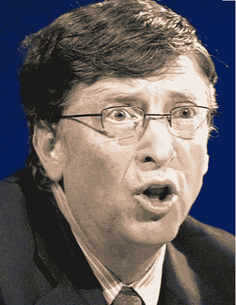
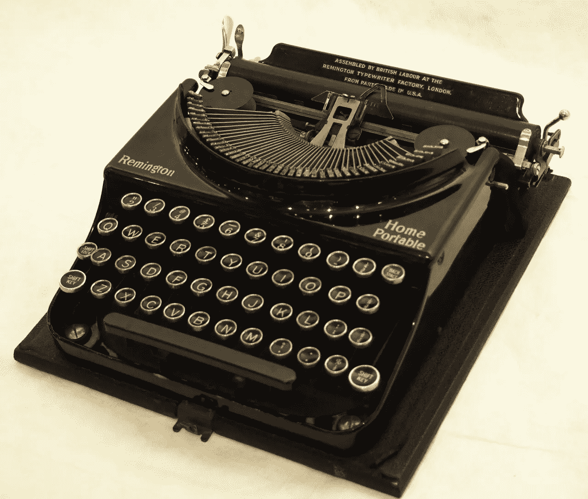
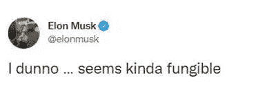
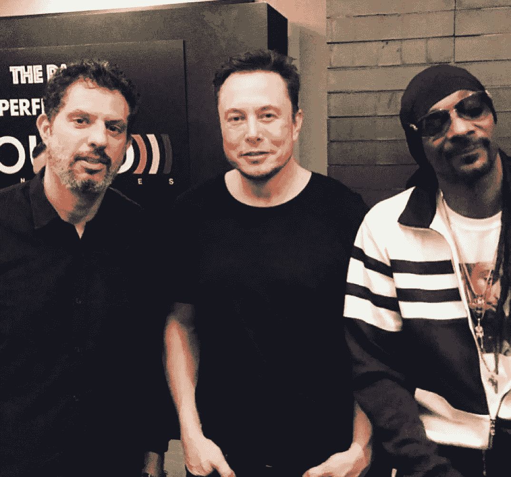
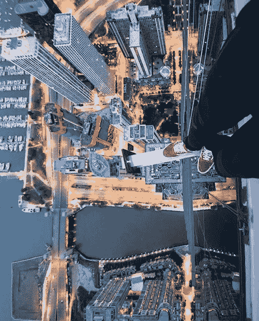
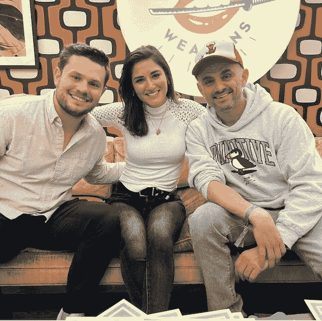
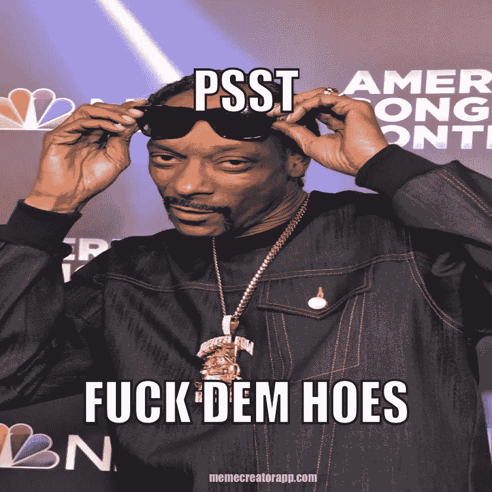

# 比尔·盖茨可能是“最大的傻瓜”，这不是一个理论。

> 原文：<https://levelup.gitconnected.com/bill-gates-might-be-the-greatest-fool-and-its-not-a-theory-d79195505b04>

Askideas.com

世界上最富有的人之一是否认为 NFTs 只是一种时尚？

当被问及 NFTs 时，他在一次气候变化活动中引用了“更大的傻瓜”理论，该理论的前提是，你需要的只是找到一个更大的傻瓜来购买你定价过高的资产。

人口控制运动者比尔希望每个人都像“信使皮金”一样植入微芯片，并认为购买带有提供效用的合同层的数字资产是不理性的。

好吧，让我侧身看看。我没想到会这样。

声明，尽管互联网希望你相信，但他实际上并没有做所有这些事情。但这是我唯一的弹药。

让我们澄清一些事情。我是一个出生在英国家庭的南非人，在英国布里斯托尔的一个市政住宅区(住宅项目)里度过了我成长的大部分时光。

我的学校，将保持匿名，在大厅里有社区支持人员来管理学生的行为。对我的美国朋友来说，CSO 就像警察。但是他们做不到。

相信我。我们在一些场合测试了这一点。

作为一所学校，我们对教育评估标准办公室(OFSTED)毫无用处。

当评估日到来时，我们会积极尝试和评估官在房间里讨论老师。

> “先生，你通常不会在这些课上写在黑板上。”“小姐，你说话这么好听是有原因的吗？通常，你是在对我们大喊大叫。”

在评估员听得见的时候。成熟，我知道。

简而言之，我的背景表明我不配给这个哈佛法学院的学生系鞋带。但我有一个键盘，无线网络和一个巨大的意见。

还有一大袋流动性差的 Jpegs 要辩护。

10 万美元买一辆 NFT，外加免费帽衫和当地酒吧的聚会。不值钱？

可能价格有点高。不值钱，绝对不行。

老实说，我不知道这些技术亿万富翁是在取笑我们，还是他们只是在报道最新的新闻头条。

肯定不会。这些富有的白人男性原型可以接触到世界上一些最有技能、最有洞察力的人。

现在想象一下，当打字机工作正常时，人们在谈论微软的电脑软件。

看着它。绝对雄伟。

[https://bailiffgatemuseum . co . uk/product/adopt-our-Remington-portable-typewriter/](https://bailiffgatemuseum.co.uk/product/adopt-our-remington-portable-typewriter/)

大概类似于 2007 年黑莓机组人员的对话。

> “不，我有免费短信，喜欢感受键盘按键。想象一下 iPhone 屏幕会变得多脏”

凯伦，你的键盘按钮边上有半根法式长棍面包。

我的同胞埃隆·马斯克在他的推特上说，

[埃隆·马斯克——推特](https://twitter.com/elonmusk)

尝试了一下 NFTs 不可替代的标志，然后把他的 Twitter 个人资料图片改成了无聊的 Ape 游艇俱乐部 NFTs 的拼贴画。

也许这些科技领袖有责任关心那些靠他们的每一句话生活的大众，而不是发布关于一个高度投机的资产类别的信息。

那对我来说更有意义。

埃隆。没有报酬的 DOGE 影响者和一个希望我们都住在火星上的人认为 NFT 是愚蠢的。

还是他。

这是他和 Web3 巨头盖伊·奥塞里和探听狗的合影。

我的真实想法是他在故意刁难我们。

[https://Twitter . com/jaydenlevitt/status/1522525134132760576？s = 21&t = H5 hy 0cg 5 trfwtjh7 CAH xa](https://twitter.com/jaydenlevitt/status/1522525134132760576?s=21&t=h5Hy0CG5TRfwTJjh7CAHxA)

我不打算发表这篇博客的标题。这不是关于这些人用他们的远见和执行他们的想法积极地改变了世界。

我钦佩这些先驱者。我知道。

我钦佩饥饿的艺术家，他们现在有一个出口和对他们一生工作的需求。多得多。

像 Drifter Shoots 这样的艺术家，因为追求他对摄影的热情而被不公正地监禁，现在利用他的逆境出售他价值数百万美元的艺术作品。

[漂流者拍摄——insta gram](https://www.instagram.com/p/Cc1gxIfpQIN/?igshid=YmMyMTA2M2Y=)

伊朗裔美国艺术家、职业治疗师萨拉·鲍曼将实现她毕生的梦想，成为一名全职艺术家。你猜对了，通过 NFTs。

[女人和武器——insta gram](https://www.instagram.com/p/Cd3dHg1uTgE/?igshid=YmMyMTA2M2Y=)

我可以列举数百个这样的例子来说明这项技术是如何改变创造者经济的。曾经饥饿的艺术家们现在得到了他们的“打击”，而我在这里就是为了这一切。

对于没有创造力的人来说，也有其他选择。

NFT 给了像我这样的普通人一个分享某人的音乐、艺术或创业成功的经济价值的机会。

可以肯定地说，我也没想到会有这一天。

给金融家们的最后一个信息，右击储蓄者和技术亿万富翁。

[memecreatorapp.com](http://memecreatorapp.com)

***以上都不是理财建议。我不是一个合格的财务顾问，尽管我尽了最大努力，我也无法预测未来。***

***NFT 空间有风险。***

***专家说，目前 99%的项目都在走向 0。***

在推特上关注我