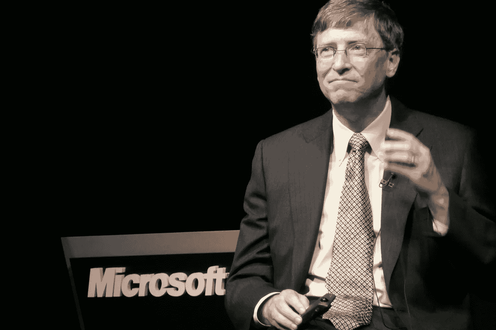
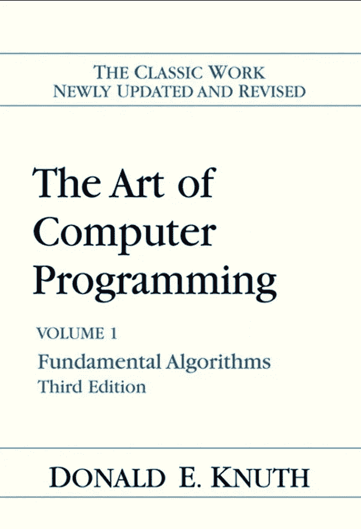
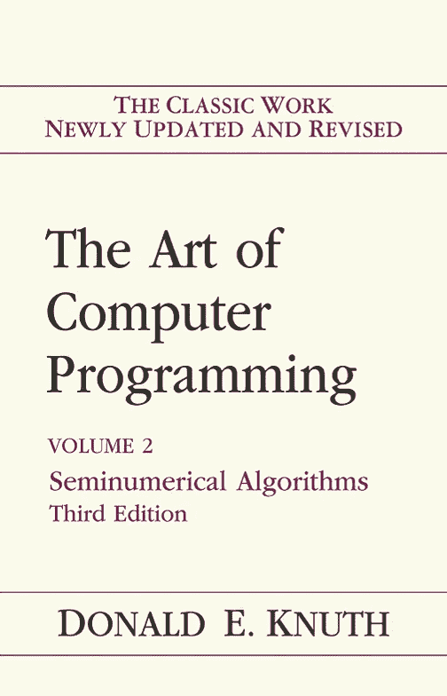
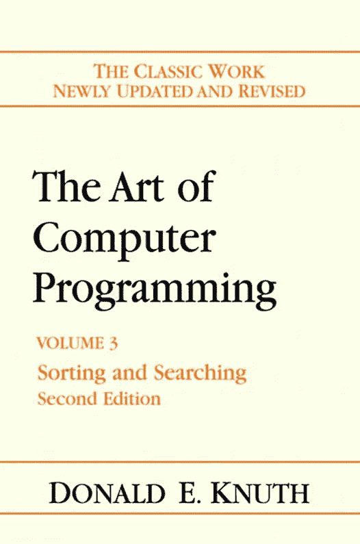

# 比尔·盖茨:如果你看到这篇文章，你一定要把你的简历发给我

> 原文：<https://levelup.gitconnected.com/bill-gates-you-should-definitely-send-me-your-cv-if-you-read-this-3102c131e78c>

## 编程|教育

## 一本统治所有人的书

来源:[维基共享资源](https://commons.wikimedia.org/wiki/File:Microsoft_Bill_Gates_(2472910099).jpg)

> “我花了难以置信的毅力，花了几个月的时间来阅读它。我研究了 20 页，放了一个星期，回来又看了 20 页。”—比尔·盖茨

比尔·盖茨是一个专注的藏书家。

他不仅每周读一本[书](https://eab.com/insights/daily-briefing/academic-affairs/how-bill-gates-reads-50-books-per-year-and-remembers-what-he-learns/)，还确保他掌握了他所读的内容。

盖茨的智商[估计](https://drdianehamilton.com/tag/bill-gates-iq/)在 160 左右。尽管这个数字从未从他口中说出，但他曾承认自己非常擅长*“愚蠢的智商问题”*

然而，尽管他很聪明，但命运注定这位微软创始人会碰壁。

这面墙不是别人，正是唐纳德·克努特的宝贝:*计算机编程的艺术*。这本书给了比尔·盖茨一个难题。

在回复他的报纸专栏的读者时，盖茨说:

> “如果你认为你是一个真正优秀的程序员……读读《计算机编程的艺术》……如果你能读完整本书，你绝对应该给我发一份简历”

那么谁是唐纳德·克努特呢？

一本书最终是其作者的一面镜子。

# 唐纳德·克努特

Donald Knuth 是一个忠诚的程序员，一个关心他人的人，一个安静的实干家。

他是一个干净的代码极大主义者。给他看写的很差，优化的很差的代码，他平时活泼的笑容都会晕过去。

Knuth 对代码的热爱决定了他的一生。

在从事计算机编程艺术之前，Knuth 先生的任务是写一本关于编译器的书。

他中途中止了。

Don Knuth 对缺乏合适的编程资源感到非常沮丧，因此他决定自己做得更好。他开始了 50 多年的旅程，撰写了后来成为编程圣经的东西。

当被问及他的动机时，他说:

> “许多发表的(编程)论文完全是错误的……所以我的动机之一是把一个讲得非常糟糕的故事讲清楚。”

在编辑的中途，他停了下来。又来了。

这是因为他的出版商[放弃了](https://web.archive.org/web/20180127194502/http://www.kyotoprize.org/wp/wp-content/uploads/2016/02/12kA_lct_EN.pdf)的 monotype，转而采用了 phototype。这种转变使得 Knuth 的手稿看起来与他们写的方式略有不同。

> “如果它们(手稿)看起来很糟糕，我就不想再写了。我怎么会为这样的产品感到骄傲呢？”

所以他创造了一个新的排版系统，TeX。

谁能打败这样的细致？

# 这是你的杰作吗？

计算机编程的*艺术*正在进行中。

到目前为止，手稿是一个四卷系列:

*   第 1 卷—基本算法
*   第 2 卷—半数值算法
*   第 3 卷—排序和搜索
*   体积 4A——组合算法

我将跳过最后一卷(4A ),只是因为我没有拿到它。不过，我听说这是唐纳德·克努特的最爱。他曾经引用[的话说](https://www.youtube.com/watch?v=2BdBfsXbST8&ab_channel=LexFridman):

> 组合算法是我的技能得到回报的地方…

也就是说，我将对每一卷做一个简要的概述，希望能让你兴奋起来，给他们一个机会。

但是首先，让我们检查一下先决条件。

**先决条件:**

*   软件和硬件的基本知识以及两者如何协同工作。
*   如何用计算机化的方式解决问题？
*   基本编程概念—循环、分支和索引。
*   以前接触过计算机术语——“内存”、“位”、“溢出”。

# 第 1 卷—基本算法

作者截图

在这本书中，唐纳德·克努特以下面的陈述开始:

> 为数字计算机准备程序的过程特别有吸引力，不仅因为它在经济上和科学上有回报，而且因为它是一种很像作曲的审美体验

鼓舞人心。不是吗？

第 1 卷分为两章:

*   基本概念
*   信息结构(比如数据结构)

在第一章中，Knuth 带领读者深入探究是什么让一个计算机程序成为一个计算机程序。这包括:

*   数学公式(主要是代数)
*   算法和算法复杂性(Big-O 符号)
*   MMIX(Knuth 设计的一种机器语言)
*   子程序和输入输出

转到第二章(我最喜欢的一章)，Knuth 转到数据结构的核心主题。从链表到树到垃圾收集器，Knuth 博士涵盖了所有 DS。

所以，如果 DS 不是你最好的朋友，这一章将帮助你消除之前的误解，填补知识空白。

或者如果你有足够的勇气声称你是一个 DS 大师，我们的数学家和计算机科学家，会让你重新考虑这一点。

# 第 2 卷—半数值算法

作者截图

第二卷是一本数字书。

这本书深入讨论了计算机如何处理数字。

它分为:

*   随机数
*   算术

由于“随机”一词不存在于计算机的词汇中，这本书教读者如何定义一套可以模拟随机性的规则。这包括使用模数运算符、指数函数和其他随机量，如采样和洗牌。

然而，当你写下这些规则并得到一个看似随机的序列时，你能确定你得到的是 100%随机的吗？

简单的回答是没有。

你对一个序列的随机程度的信心取决于它通过的统计测试的数量。

作者继续为随机数据的评价提供不同的统计方法的快速回顾。这些方法包括从经验测试到光谱测试。

另一方面，最后一章讨论了算术以及算术是如何在计算机中实现的。具体来说，它涵盖了浮点运算、精度运算和有理运算等等。

我想一个统计学家会爱上这本书的。

# 第 3 卷—排序和搜索

作者截图

我第一次拿着这本精装本时，年轻时的自己想:两个简单的操作(排序和搜索)怎么可能占据 800 页的内容？

我把书放回书架上。

只有当我开始处理大量数据时，我才明白搜索的重要性。

搜索算法无处不在。搜索引擎、词典和编译器都基于搜索算法。

然而，有趣的是，如果不进行排序，你就无法有效地进行搜索。

如果一个单词不是按字母顺序排列的，你要花多长时间才能在字典里找到它..？

也就是说，这本书的结构和书名一样。

*   第 1 章:排序
*   第 2 章:搜索

注意顺序是有原因的。排序应该总是在搜索之前。

总的来说，在这本书里，我们的计算机专家带领读者踏上了不同搜索和排序算法的探索之旅。有些你可能已经很熟悉了。

# 讨论和总结

如果你已经注意到，我还没有触及这个系列的一个重要点。这就是困难所在。

比尔·盖茨有着较高的理解能力，他自己也在为这部作品而奋斗。

从我的经验来看,《计算机编程艺术》不是一本容易读懂的书。

这是因为作者不仅介绍了算法，还提供了完整的性能分析，这有时需要复杂的数学。

然而，这应该让你放弃尝试 Knuth 的手册吗？

哦，不！

人们经常抱怨它的困难。但他们也应该称赞它的质量。记住，那不是几个月或几年的工作，而是一个人一生的遗产。

对于计算机编程的*艺术来说，*你吸收的每一点知识都很重要。

此外，这部作品不是写给周末阅读，而是一个可靠的计算机科学参考。

> “当一个问题很难，你不得不把它从书架上拿下来时，这总是一件令人愉快的事情。我发现仅仅打开一个就能对电脑产生非常有用的恐怖效果。”——比尔·盖茨。

也就是说，现在是*好消息时间！*

备受期待的缺失部分——组合算法，第 4B 卷——预计将于今年晚些时候出版。

在那之前，准备好你的大脑和钱包。

*如果你欣赏这种努力，可以考虑通过 Medium 的小费(如下)或通过以下* [*链接*](https://ayarmohammed96.medium.com/membership) *订阅 Medium 来支持作者。虽然作者从推荐链接中获得一小笔佣金，但这是免费的。*

 [## 通过我的推荐链接加入媒体-穆罕默德·阿亚尔

### 阅读默罕默德·阿亚尔(以及媒体上成千上万的其他作家)的每一个故事。您的会员费直接支持…

ayarmohammed96.medium.com](https://ayarmohammed96.medium.com/membership)