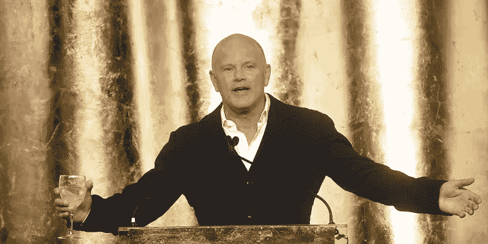
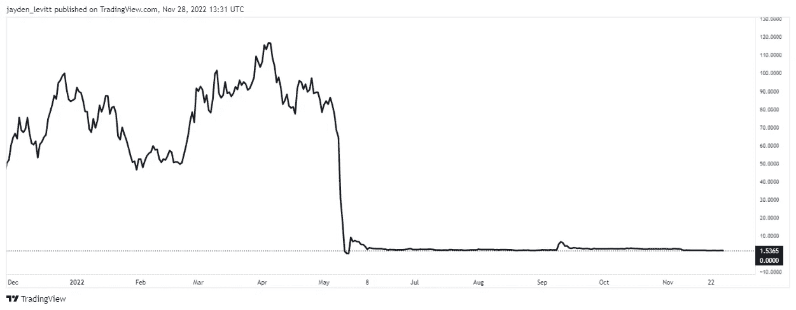

# 亿万富翁比特币公牛说比特币不会消失(迈克·诺沃格拉茨)

> 原文：<https://levelup.gitconnected.com/billionaire-bitcoin-bull-says-in-no-world-is-bitcoin-going-away-mike-novogratz-ab31493b3507>

我们还没有脱离险境，但现在可能是买入的绝佳时机。

照片由 Flikr 上的 Wilkenson Knaggs 拍摄

迈克·诺沃格拉茨宣称现在是购买比特币的最佳时机。

他说，将部分净资产投资于比特币的 1.5 亿人不会匆忙离开。

这位前高盛(Goldman Sachs)雇员和前派对动物此前预测，加密市场已经触底。

诺沃格拉茨发表声明后不久，美国 FTX 加密交易所崩溃，在一篇在线文章显示他们杠杆过高后，经历了加密版的银行挤兑。

FTX 申请破产保护后，审计人员发现该公司对客户资金处理不当。

FTX 的身价一夜之间从 320 亿美元跌到了 0 美元，他们的紧急着陆让整个加密货币市场暴跌。

Novogratz 是专注于加密货币投资的 Galaxy Investment Partners 的首席执行官。它也是少数几家被要求公布财务业绩的加密货币公司之一。

虽然诺沃格拉茨不可能预测到 FTX 的崩溃，但这并不是他第一次预测失误。

卢娜是诺沃格拉茨多年来拥护的一个稳定的偶像，以至于他决定纹上它。

为诺沃格拉茨说句公道话，他没有无耻地删除这条推文，我猜他还留着那个纹身。

Luna 的加密网络崩溃了，600 亿美元从数字货币领域消失了。大量的 Luna 被抛售，导致了抛售的死亡螺旋。

对联合创始人 Do Kwon 发出了逮捕令。

Novogratz 的公司 Galaxy Investment 持有超过 4 亿美元的 LUNA，这是一个曾经售价超过 115 美元的象征，现在价值 1.5 美元。

来源— [交易视图](https://www.tradingview.com/symbols/LUNAUSDT/)

Mike Novogratz 打破了他对崩溃的沉默，他说，“Luna 是一个失败的伟大想法”，但尽管市场存在问题，他相信比特币会继续存在。

这一次，他乐观地认为比特币和以太坊已经触底，但对他的声明提出了警告，称加密市场需要一段时间才能重新获得乐观情绪和信心。

他确信，尽管价格下降，但采用率已经上升，正如他所说，1.5 亿人仍然将比特币视为投资部分净资产的可行价值储存手段。

# 根据诺沃格拉茨的说法，这是你可以期待事情有所改善的时候。

诺沃格拉茨认为，一旦美联储停止加息，金融市场将会复苏。

当这种情况发生时，比特币以及市场上的其他资产将开始其上升轨迹。

他表示，许多投资者正在观望，准备投资比特币，全球对冲基金将成为推动下一轮上涨的第一批买家。

当这种情况发生时，银河投资也希望增加其比特币头寸。

> 迈克·诺沃格拉茨:
> 
> “我 100%认为，有人在观望，等待建仓，但传统意义上的首批买家将是重要的全球宏观对冲基金。
> 
> 当美联储退缩的时候，你会看到许多传统的宏观基金购买比特币，这些基金今年表现出色。
> 
> 我们将在那一点上增加我们的位置。"

世界著名商业作家和教育家 Rob Kiyosaki 赞同 Novogratz 对美联储加息的观点。

清崎认为，一旦美联储转向，比特币、黄金和白银将大幅增加。他还建议，你应该在美联储转向之前购买比特币。

诺沃格拉茨说，许多新兴技术的价格都是超前的。

尽管价格波动，他相信比特币会继续存在，现在购买可能是一个很好的机会。

> 迈克·诺沃格拉茨:
> 
> “我们仍处于困境，但从长远来看，这是一个买入机会。
> 
> 比特币不会消失。
> 
> 已经有 1.5 亿人决定了它的价值，将他们的一些净值保留在比特币中。"

诺沃格拉茨认为，由于最近反复出现的不利事件，加密市场受到的影响最大。

这份名单包括那些要么过度举债，要么未能管理好风险的大公司。

诺沃格拉茨提到:

*   摄氏零度
*   三支箭
*   卢娜
*   FTX

# 最后的想法。

把握市场时机是不可能的。

有这么多因素在起作用，没有人能准确地说出未来会发生什么。

即使是所谓的专家也会搞错时机。

明确的是，对比特币的监管将吸引机构投资，降息将改变市场情绪，增加流动性。

诺沃格拉茨认为我们仍处于困境，情况可能会恶化。

虽然我们永远不会知道市场的底部是什么时候，但美联储降息可能是事情可能发生转折的一个强有力的指标。

> *如果你想在 Web3 上读到更多我的观点，请考虑成为会员。你的会员费直接支持你读的作家。如果你用我的链接* [*注册，我会赚一小笔佣金。点击这里*](https://medium.com/@jayden_levitt/membership) *。*

*本文仅供参考；不应将其视为财务、税务或法律建议。在做出任何重大的财务决定之前，你可以咨询财务专家。*