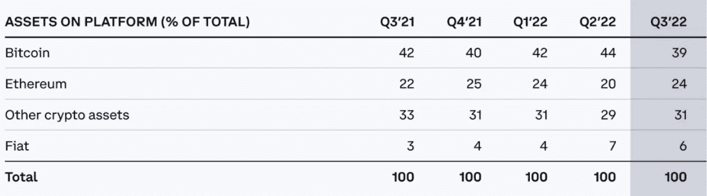

# 亿万富翁布莱恩·阿姆斯特朗说你应该信任他。他有 200 万比特币(390 亿美元)

> 原文：<https://levelup.gitconnected.com/billionaire-brian-armstrong-says-you-should-trust-him-hes-got-2-million-bitcoin-39-billion-12b20751728e>

您将了解为什么信任他人是 Crypto 中的一个问题。

史蒂夫·杰维特森的照片

亿万富翁布莱恩·阿姆斯壮因是比特币基地的首席执行官和创始人而闻名。

比特币基地是最大的加密货币交易所之一，价值约 200 亿美元。低于其首次上市时的 850 亿美元。

阿姆斯特朗是比特币本地人，在 Airbnb 工作时熟悉支付系统，他因积极让比特币基地的工作场所摆脱政治激进主义并在工作中讨论社会问题而受到媒体关注。

Armstrong 说他想避免伤害脸书和谷歌员工生产力的“内部冲突”。他说，员工在内部聊天室表达社会和政治关切，偶尔会走上街头抗议。

这是一项大胆的举措，尤其是对于文化中流行的东西来说。

Armstrong 为对这一政策感到不舒服的比特币基地员工提供了遣散费，结果，公司 5%的员工离开了，相当于 60 名员工。

在此之前，黑人的命也是命运动在乔治·弗洛伊德被谋杀后获得了支持，阿姆斯壮在推特上写道。

> 布莱恩·阿姆斯特朗:
> 
> “我已经决定说出来。
> 
> 遗憾的是，在这个时代，这一点甚至需要说出来，但种族主义、警察暴行和不平等的司法绝对是错误的，我们都必须努力将它们从社会中消除。"

当他提出这项政策时，他遭到了公众和内部员工的强烈反对。

> 布莱恩·阿姆斯特朗回应道:
> 
> “硅谷公司参与各种各样的社会活动已经变得很常见，甚至是那些与公司业务无关的活动。”
> 
> “尽管这些努力是善意的，但它们会分散注意力，造成内部分裂，从而破坏大多数公司的很多价值。”

# **给我们看看你的钱，布莱恩。**

FTX 是一个加密货币交易所，使用客户的存款进行交易并获得贷款。

当有消息称 FTX 正在用借来的资金支撑他们的本土代币 FTT 时，这导致他们的客户试图撤回资金。

Crypto 版本的“银行挤兑”导致 FTX 一夜之间损失 160 亿美元并破产。

随之而来的是，整个市场的崩溃。

如果你有一些密码，你会感觉到市场调整的压力。

在崩盘时，如果你持有一些 FTT 或将资金留在 FTX 交易所，你很可能会血本无归。

它现在鼓励加密货币交易所的创始人站出来，提供更多关于他们如何处理客户资金的透明度，并披露他们的储备证明。

为了消除恐惧，阿姆斯特朗展示了他的公司比特币基地截至 2022 年 9 月 30 日持有约 200 万比特币，价值 399 亿美元。

公开报告还显示了其他储备。

*   以太坊 240 亿美元
*   310 亿美元的其他加密货币
*   菲亚特 60 亿美元

> 下图显示了每种资产的百分比，但它们在平台上的总余额为 1000 亿美元。

来源— [布莱恩·阿姆斯特朗推特](https://twitter.com/brian_armstrong/status/1595126425371414528/photo/2)

阿姆斯壮发出了这条推文，并附上了比特币基地财务状况的链接。

> 布莱恩·阿姆斯特朗:
> 
> “如果你在外面看到 FUD，记住我们的财务是公开的(我们是一家上市公司)
> 
> 我们支持 2M·BTC。截至 9 月 30 日，价值约 399 亿美元([见我们的 10Q](https://t.co/ayzN0zaqgT) )
> 
> 从现在开始，我们都需要团结起来，负责任地建设这个行业。
> 
> 警惕虚假信息。"

Armstrong 还分享了公司的股东信，强调了比特币基地资产的合并清单。

一个奇怪的转折是，Armstrong 安慰了市场，但也不得不向他的竞争对手 CEO 赵昌鹏做出澄清，后者质疑持有比特币。

> 币安首席执行官赵昌鹏:
> 
> “布莱恩·阿姆斯特朗刚刚告诉我，文章中的数字是错误的。我把之前的推文删了。
> 
> 让我们一起努力提高行业的透明度。"

FTX 崩盘后，应该会不断有人谈论加密交易平台的储备证明和财务审计。

随着这一趋势得到交易所的青睐，一些交易所宣布对自己进行准备金审计证明。

尽管传统金融界可能正拿着一碗微波爆米花坐在扶手椅上，说着“我早就告诉过你了”，但银行家们有着完全不同的准备金规则。

根据欧洲央行网站，最低准备金要求是持有 6 至 7 周的资金，这是维持期。

银行必须在其国家中央银行持有至少 1%的客户存款。

# **最后的想法。**

比特币基地易于使用，而且是一家在股票市场上市的美国公司，所以它的财务状况是公开的，接受公众监督。

这就是我使用它们的原因。

我信任他们，但不信任我的生活。

坦白地说，最近 FTX 股市的崩盘让我吓得魂不附体。自我监管是解决这一问题的唯一办法，尽管萨姆·班克曼-弗里德窃取了客户存款，但我仍然相信某种程度的集中化。

我这样说可能会受到批评，但这是真的。更多的人因为自我保管而丢失了他们的私钥，而不是被黑客攻击。

拥有一个值得信任的托管伙伴也将有助于大众采用 crypto，它需要安全并且易于像我奶奶这样的人使用。

如果没有一些实质性的指导，任何不是远程加密的人都不可能操作硬件钱包。

某种程度上的集中是好的。

我的资产在账本上，但在它像建立一个脸书账户一样简单之前，自我保管将是少数加密用户的事。

如果你想在 Web3 上阅读更多我的观点，请考虑成为会员。你的会员费直接支持你读的作家。如果你用我的链接 [*注册，我会赚一小笔佣金。点击这里*](https://medium.com/@jayden_levitt/membership) *。*

*本文仅供参考；不应将其视为财务、税务或法律建议。在做出任何重大的财务决定之前，你可以咨询财务专家。*