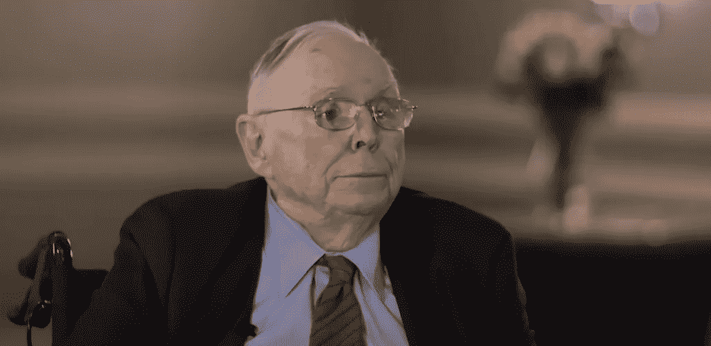

# 亿万富翁投资者——查理·芒格说，你必须采纳他从扑克牌中学来的投资心态

> 原文：<https://levelup.gitconnected.com/billionaire-investor-charlie-monger-says-you-must-adopt-his-investing-mindset-he-learned-playing-62f75207ce6>

如果你在投资时不使用心智模型，你就会变成一个拿着锤子的人，认为一切都是钉子。

来源— [查理·芒格](https://www.youtube.com/watch?v=RFxXl9eAWV4) YouTube

查理·芒格是美国亿万富翁、投资家和商人，最出名的是他是沃伦·巴菲特的商业伙伴。

巴菲特以 889 亿美元的净资产排名世界第三，曾称芒格是他最亲密的伙伴和得力助手。

查理·芒格和沃伦·巴菲特在商业和投资领域有着长期而成功的合作历史。

他们的合作帮助伯克希尔哈撒韦公司成为世界上最成功和最有影响力的公司之一。

芒格说，他的大部分投资技巧都是从玩牌中学来的，在商业中也使用了同样的方法。

> 查理·芒格:
> 
> “当形势对你不利时，你必须学会尽早弃牌，或者如果你有明显优势，就大举下注，因为你不会经常获得相当大的优势。
> 
> 机会来了但不会经常来，所以当它来的时候要抓住它。"

芒格还用卡片类比来解释日内交易，这是他和巴菲特避免的。

他表示，像对待棒球卡一样对待一家公司的股票是一种失败的策略，因为它要求你预测非理性和情绪化人类的行为。

他在军队中学到了打牌的本领，并表示打牌可以教会一个人各种技能，包括战略思维、模式识别和风险管理。

这些技能在许多不同的领域都有帮助，包括投资。

例如，战略思维可以帮助一个人做出更好的投资决策，而模式识别可以帮助他们识别市场趋势。

与此同时，风险管理可以帮助一个人避免在投资上犯代价高昂的错误。

# **心智模式**

芒格是“心智模型”这一心理学概念的支持者，这一概念涉及使用各种框架来帮助做出更好的决策。

心智模型是我们理解世界的方式。它们塑造了我们的想法，以及我们如何理解我们看到的联系和机会。

心理模型是我们如何简化复杂性，为什么我们认为一些事情比其他事情更相关，以及我们如何推理。

心智模型仅仅是对事物如何工作的一种描述。我们不能把世界的所有细节都记在脑子里，所以我们用模型把复杂的东西简化成可理解和可组织的块。

> 查理·芒格:
> 
> “我们拥有的模型越多，我们就能更好地解决问题。但是如果我们没有模型，我们就成了谚语所说的拿着锤子的人。
> 
> 对拿着锤子的人来说，任何东西看起来都像钉子。
> 
> 如果你只有一个模型，你会把你所面临的任何问题都用你现有的模型来拟合。
> 
> 然而，如果你有一个以上的模型，你可以从不同的角度看问题，增加你得到更好的解决方案的机会。"

查理·蒙格说的是我们大多数人都是专家。

我们不关注心智模型的网状结构(相互缠绕),而是关注我们学科的心智模型。

每个专家都有不同的看法。

例如，默认情况下，一个典型的工程师会在系统中思考。

心理学家会从激励的角度来思考。

生物学家会从进化的角度来思考。

芒格说，通过把这些学科放在一起，我们可以三维地解决一个问题。

如果我们只从一个方面看问题，我们就有一个盲点。芒格说，投资中的盲点会让你血本无归。

# **价值投资**

查理·芒格是价值投资的著名倡导者，价值投资是一种投资策略，包括购买被低估的股票并长期持有。

他像躲避瘟疫一样避免日内交易。

芒格认为，价值投资优于其他投资形式，是在股市中取得长期成功的关键。

价值投资的原则是，股票价格的价值没有反映在它的价格上。

芒格认为，分析一家公司当前的财务健康状况和前景，是你识别市场中被低估股票的方法。

通过折价购买这些股票，只要市场调整，投资者可以获得更高的长期回报。

芒格补充说，在价值投资中，耐心和自律是至关重要的。

他认为，价值投资者需要愿意长期持有他们的股票，即使市场波动或股价在短期内下跌。

价值投资者可以通过坚持他们的投资计划和避免在恐慌中抛售的诱惑来获得长期的高回报。

芒格鼓励投资者仔细分析公司，识别被低估的股票，并长期持有。

# 如果你采用芒格思维，那将是最好的。

查理·芒格(Charlie Munger)开发的心智模型通常被称为“芒格思维模式”，它基于这样一种观点，即拥有广泛的知识和理解来自不同学科的多种心智模型有助于为决策和解决问题提供信息。

要应用这种芒格思维，你可以扩展你在各种学科的知识，包括心理学、经济学、物理学和生物学，并寻找整合这些不同领域的概念和想法的方法，以更好地了解你周围的世界。

此外，你可以定期反思你的决策过程，看看是否有任何心智模型可以帮助你提高思维和推理能力。

这种方法基于这样一种信念，即世界是复杂的，试图用单一的思维模式或视角来理解它往往是不够的。

芒格说，相反，通过利用多种心理模型，我们可以对我们周围的世界有更细致、更准确的了解，这将在投资时对我们有不可估量的帮助。

# **最终想法**

查理·芒格是一个才华横溢、成就卓著的人，作为一名世界级的选股人，他做出了重大贡献。

虽然你永远不能怀疑他，但有一种相反的观点认为，价值投资有时可能只在有限的市场条件下有效。

它基于这样的假设:市场是有效的，价格最终会反映公司的内在价值。

价值投资在不确定性或市场波动时可能不成立。

一些批评者认为，价值投资方法需要更加灵活，允许在不断变化的市场条件下保持灵活性。

缺乏灵活性会导致错失机会或无法适应市场的变化。

主要是日益增长的加密运动，芒格说，这是“令人厌恶的，违背了人类文明的利益。”

沃伦·巴菲特和查理·芒格说，心智模型可能只适用于某些投资者或情况。

每个人都有独特的视角和思维方式，对一个人有效的不一定对另一个人有效。

> *如果你想在 Web3 上读到更多我的观点，可以考虑成为会员。你的会员费直接支持你读的作家。如果你用我的链接* [*注册，我会赚一小笔佣金。点击这里*](https://medium.com/@jayden_levitt/membership) *。*

*本文仅供参考；不应将其视为财务、税务或法律建议。在做出任何重大的财务决定之前，你可以咨询财务专家。*