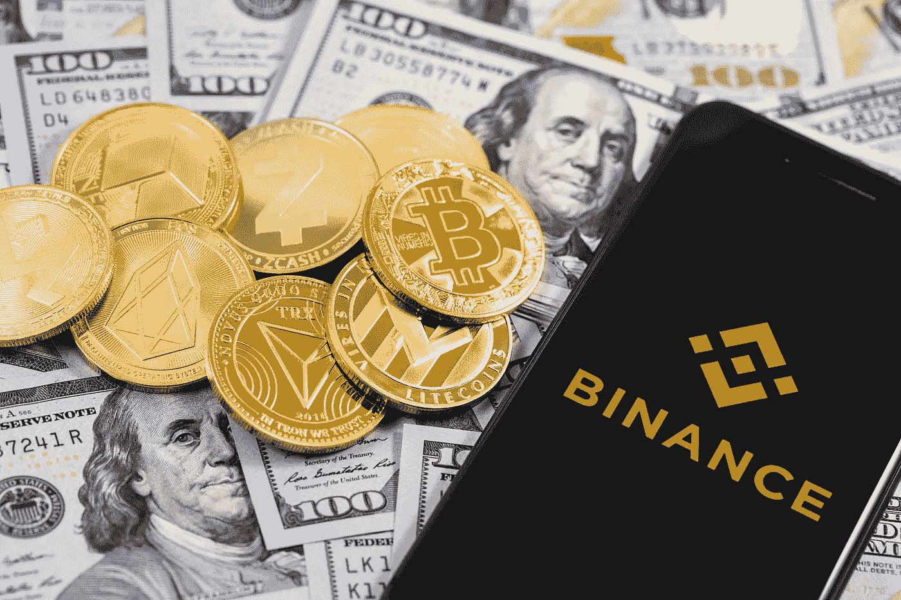
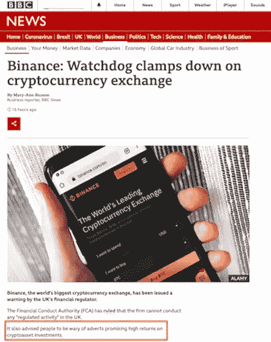
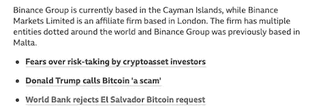

# 币安并没有在英国被禁——只是媒体又一次误导了我们

> 原文：<https://levelup.gitconnected.com/binance-hasnt-been-banned-in-the-uk-it-s-just-the-media-misinforming-us-once-again-e5def93da12f>

## 企业媒体助长的扭曲观点

作者从 [Shutterstock](https://www.shutterstock.com/image-photo/apple-iphone-binance-logo-dollars-cryptocurrency-1183270174) 购买的图片

新闻媒体充斥着英国最大的加密交易所币安被禁止的消息。

不深究其本质，你可能会认为这是加密货币棺材上的又一颗钉子——类似于最近中国禁止境内所有加密事物的新闻，或者[埃隆在自恋的愤怒中出售他持有的比特币](/wait-so-elon-musk-sold-his-bitcoin-29be65b3c6f8)的谣言。

除非你深究标题之下的内容，否则你会突然发现事情根本不是这样。这是主流媒体再次做他们的事情——传播同样的不完整和误导性的半真半假的事实来推进一个议程，并在这个过程中促进恐惧和错误信息。

*这是一个及时的提示，让我开始思考为什么这种情况会一直发生。如果我想生活得稍微舒适和安心，我就更加需要厚脸皮。
这提醒了我，主流新闻总是呈现一种扭曲和有偏见的观点，不仅仅是在加密货币方面。*

# 影响者和误导者

在我的生活中，有很多次，我在播客上发现了一个人的作品，并对他们所说的话印象深刻，然后就深入研究了这个人的作品。

当我发现蒂姆·费里斯有数百个播客访谈的备份目录时，我贪婪地一个接一个地阅读——被他的风格和他对嘉宾的选择所吸引。

在听到费里斯采访彼得·阿提亚医学博士后，我也喜欢他说的东西，他的声音既平静又让人放心——我也开始跟着他。

我不记得我第一次听说马尔科姆·格拉德威尔是在哪里，但在发现他的几个月后，我阅读和收听了他所有的书籍和播客。

如今，媒体的普及程度如此之高，以至于当你遇到说话有道理或观点与你一致的人时，很容易就能找到并阅读他们的作品。

所以这种情况又发生了，这次是和无政府主义者、播客和作家迈克尔·马里斯。我第一次听到他[与 Jordan B. Peterson](https://podcasts.apple.com/gb/podcast/the-jordan-b-peterson-podcast/id1184022695?i=1000525456414) 的讨论，并且刚刚听了[他与英国比特币爱好者 Peter McCormack](https://podcasts.apple.com/gb/podcast/what-bitcoin-did/id1317356120)关于“比特币做了什么”的讨论。

# 企业新闻和错误信息

我仍然在探索无政府主义的兔子洞，并且仍然不相信它是对世界弊病的大规模解决方案。但它肯定与我的一些观点有一些协同作用，特别是它与比特币和加密货币的去中心化方面有交集。

最引人注目的是恶意将主流媒体称为“企业媒体”的倾向。这个标签是基于这样一个前提，即今天的主流媒体是由政府、公司或别有用心的政治人物资助的。因此，他们的产出应该被怀疑和不信任。从一般意义上来说，它们作为公司的目标是盈利，无论是为它们的所有者创造财富，还是为它们的雇主带来有利的影响。不管怎样，他们有一个摧毁所有公正机会的议程。

从这个角度来看，它解释了绝大多数主要新闻媒体对比特币(以及其他事物)的描述。最明显和最新的例子是，他们报道了全球最大的加密货币交易所币安将对其在英国的业务进行严厉打击的消息。

快速浏览一下标题和由此产生的歇斯底里会让大多数人相信这是英国加密的丧钟。然而，透过表面现象可以发现，这不过是企业媒体的一个借口，用来回放通常的一系列虚张声势、炒作和错误信息，以塑造和动摇公众的看法。

# 英国对币安的限制

金融行为监管局(Financial Conduct Authority)宣布了将对币安实施的限制——但这并不意味着它在英国的客户不再能够买卖比特币或其他使用比特币的密码。透过表面，正如[BBC](https://www.bbc.co.uk/news/business-57632831)、金融时报、[美国消费者新闻与商业频道](https://www.cnbc.com/2021/06/28/cryptocurrency-exchange-binance-banned-by-uk-regulator.html)和路透社等媒体不情愿地报道的那样，FCA 打算对币安拥有的一家小子公司施加更大的限制[。该子公司在英国没有活跃的业务，也不提供任何服务。](https://cryptopotato.com/binance-markets-limited-banned-uk/)

币安通过推特澄清了他们的立场:

来源:[推特](https://twitter.com/binance/status/1409229415846981634?s=20)

[FCA 进一步澄清，他们提议的干预](https://www.fca.org.uk/news/news-stories/consumer-warning-binance-markets-limited-and-binance-group)专门适用于受*监管的*衍生产品，根据他们在英国的现有许可条款，币安不得提供这些产品。这类产品包括基于加密货币的期货合约和加密货币的杠杆交易——币安向全球其他市场提供这些产品。

这就是我们所看到的——对于普通的英国加密货币投资者(甚至是最鲁莽的投机者)来说，实际的公告没有什么值得担心的。如果币安的一家不在英国运营的子公司想要提供这些服务，它将受到可能已经存在的限制？

这算新闻吗？

这个小小的重磅炸弹让我想到了我真正的观点——企业媒体报道这类故事的价值，以及这类报道实际上是为了什么目的。

# 新闻背后有什么(一般)

冒着变得过于“阴谋论者”的风险，企业媒体报道此类故事的议程似乎是推出同样陈腐的反对意见，煽动恐惧，并在民众心中植入更多对加密货币的怀疑。

以 BBC 新闻报道为例(故意选择，因为我支付了在英国的电视许可费，因此我有责任提供部分资金):

作者[从 BBC](https://www.bbc.co.uk/news/business-57632831) 截取(并加注释)的截图

正如我在前三句话中强调的(与故事完全无关)，BBC 设法在通常的公共服务公告中强调投资者应该如何警惕与加密货币投资相关的风险和广告回报。

有多原创？一点也不。

有多相关？一点也不。

# 有议程的新闻

在文章的后面，它提供了一些更有用的相关故事的链接，选择这些链接大概是为了尽可能向读者提供更多信息:

作者[截图来自 BBC](https://www.bbc.co.uk/news/business-57632831)

这是一个不错的、公正的和积极的选择——包括另一篇关注恐惧和风险的文章，以及一篇分享金融大师和前总统唐纳德·特朗普对比特币的尊重观点的文章。

这三者的最后一个环节也以一种让人产生误解的方式呈现出来。那些关注比特币新闻的人可能对萨尔瓦多政府很熟悉，该国政府最近投票决定将比特币作为法定货币。这一举措受到了广泛的欢迎，被认为是给这个国家的公民带来金融权力的一种手段，在这个国家，大多数人没有银行账户，无法获得传统的金融服务。他们自己的货币很久以前就贬值了，从那以后，他们的体系一直依赖于美元。

英国广播公司提供的链接实际上引起了我的关注——似乎描绘了世界银行拒绝或以某种方式取消了萨尔瓦多政府的裁决。相反，[它报道](https://www.bbc.co.uk/news/business-57507386)世界银行*拒绝帮助*萨尔瓦多将比特币作为法定货币。它没有权力推翻这一决定——只是表面上愿意拒绝可能威胁其维持美元霸权能力的求助。

正是这些新闻报道的例子让我想到，像迈克尔·马里斯这样的无政府主义者可能对企业媒体的议程有一定的看法——以自己的目的和出资者的目的传达新闻。

# 媒体公正报道的问题

恶意和我都不是第一个指出媒体偏见的人。见鬼，就连前面提到的特朗普也足够兴奋，意识到在与他自己的观点不一致的媒体上称之为“假新闻”的力量。当我们从不同的来源中听到相同的核心概念时，它促使我们去想，也许，只是也许那里有什么东西。

几乎不可能在企业报纸上读到一篇关于比特币的新闻文章，其中不包含一个或多个 FUD 的典型项目(恐惧、不确定性和怀疑)。它们以令人讨厌的规律被推出:

*   比特币是罪犯的[工具](/a-ransom-of-75-bitcoin-has-been-paid-to-open-up-the-colonial-pipeline-aca69fc3717f)
*   它对能源有着贪婪的渴望
*   这是一个封闭、神秘和排外的比特币兄弟社会的领地，由埃隆·马斯克等人领导
*   这是一个庞氏骗局或金融泡沫，已经到了破裂的时候了
*   它的波动性使得它不能作为货币使用，作为投资资产也很危险

有足够的证据让每个人自己做出决定，从各种来源都有支持和反对的证据。读者会相信它或抛弃它，这取决于他们的倾向。

我回顾了其中的许多，并把我自己的观点融入其中。

我真正的问题是，当企业媒体和负责的[政府继续推出同样令人厌倦的、往往不正确或不完整的论点时，这些会混淆和误导公众。](/why-are-governments-choosing-to-remain-ignorant-and-short-sighted-about-bitcoin-e2e62bfcb71e)

这实际上只不过是宣传和误导，旨在滋生不信任和恐惧。

# 有哪些影响？谁真的在乎？

有些人可能会问，这当然重要吗？我们说的毕竟是投资加密货币的人的命运，不是生死攸关的事情。

请记住，无论是处理加密、人权还是最新的政府基础设施项目，企业媒体都使用相同的操作模式。它呈现了一种扭曲的视角，旨在唤起读者的特定情感反应。

我们应该过滤对事实的报道，来猜测我们所读到和听到的有多少是真实的、准确的或完整的，这是对的吗？我们是否应该质疑我们在阅读新闻时产生的情绪，质疑我们是否被操纵了这种感觉？

在这两个问题上，我的回答至少都是坚决的*不*。

具体就加密而言，我对现状有几个具体问题:

*   对同样令人厌倦的事实的陈述表明，那些真正应该更好地了解(或者至少应该有更好和更广泛的理解)的人缺乏真正的教育和理解。
*   **他们的观点通常是直接和透明的，试图破坏公众对新闻媒体(以及资助它们的政府和私人机构)保持这种状态的信心。**
*   它忽略了一个事实，即许多与我处境相似的个人可能会在 crypto 上做至少一小笔投资(或者小规模投机，如果你更愿意这样称呼的话)，希望获得比我们从传统储蓄中获得的回报略高的回报。许多小投资者厌倦了传统投资的微薄回报，以及政府和央行不断印钞导致我们微薄的储蓄持续贬值。错误的信息通常会让负责任的聪明人放弃他们原本可能会做的事情。这是一种控制形式，也是媒体职责或权限的过度延伸。
*   **它掩盖了本应被视为积极消息的好消息——在萨尔瓦多，采用比特币作为法定货币已经被证明对本币贬值的人口有积极和有益的影响，其中大多数人没有银行账户。**这可以作为一种模式，让类似的世界经济体出于同样的有利原因采取同样的行动。然而英国广播公司和其他企业媒体对此的描述却将其描绘成一种激进的、颠覆性的举动，而这正是世界银行已经根除的！
*   **正如最近几周反复证明的那样，加密货币的波动性通常会随着新闻的播出以及某些人物在社交媒体上的帖子而增加。**虽然加密爱好者预计会出现这种波动，但这并不能改变许多(尽管不明智地)将未来押在加密上并在市场上持有大量杠杆头寸的人已经被最近迫使其杠杆头寸平仓的极端价格波动所淘汰。更简单地说，受害的不是亿万富翁和富有的投机者，而是那些过度扩张并指望加密来帮助他们摆脱财务困境的人，他们遭受的损失最严重。

企业媒体及其行为的影响不仅仅是对媒体报道的轻微不满甚至愤怒。它们是关于错误信息的扩散和恐惧、恐慌和混乱的传播。它们是关于坏消息带来的混乱和伤害，不管它是否准确或基于事实。

# 接下来呢？

在英国发布关于币安的声明后，一个不合时宜的技术问题出现了。其客户一直在努力将英镑运进运出币安——这个问题是由一种名为“更快支付”的服务引起的(整个零售银行部门都依赖这种服务)。这与《公平竞争法》的举措无关，但许多企业媒体热衷于将这两个问题混为一谈。事实上，对该问题的报道使得表面上看起来好像币安因更快的支付而暂停，而实际上这是一个被受影响的公司描述为[“例行维护”的问题](https://www.pymnts.com/news/international/2021/binance-users-shut-off-from-united-kingdom-faster-payments-network/)。

在此之后，将会有散户加密投资者和币安客户抛弃该交易所，转而青睐另一家交易所。希望大多数人会避免不时出现的围绕 crypto 的规模较小、管理更差的交易所。

一些潜在的加密投资者可能会根本不愿意投资。一些已经持有加密货币的人将出售他们的股份，如果他们在 2021 年购买，可能会意识到他们的投资亏损。他们会感到痛苦，或者把它归因于经历。无论哪种方式，如果他们被赶出 crypto，他们将失去未来收益的可能性。

也许，*只是也许*有人会阅读企业媒体上的公告，但会将它们放在更广泛的关于加密的许多可靠和真实媒体的背景下考虑。这些人会倾向于挑战媒体提供的信息，而不允许自己被他们读到或听到的信息误导或情绪化地操纵。最终，他们会变得更加见多识广，也许会意识到这是[开始投资](/why-this-is-still-a-good-time-to-buy-bitcoin-if-you-believe-in-it-df9c2b77805d)加密技术的好时机，如果他们是新手的话——或者如果他们已经投资了，增加他们的持股而不是在恐慌中卖出。

亲爱的读者，我希望你属于最后一类。

拒绝企业媒体。至少，质疑你从他们那里读到了什么(就此而言，也从我这里读到了什么)——考虑作者试图说服你去思考和感受什么。自己做研究。

注意:*本文仅供参考。不应将其视为财务或法律建议。在做任何重大财务决定之前，先咨询财务专家。*

# 如果你喜欢这篇文章，我希望你能加入我的电子邮件列表。