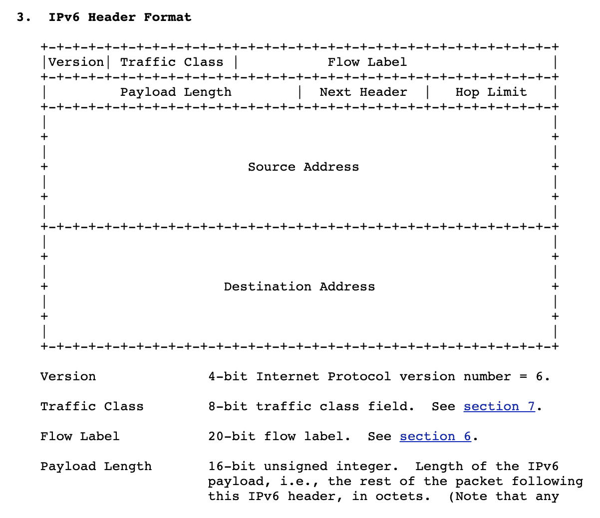

# 用 Golang 对可变长度选项进行二进制编码

> 原文：<https://levelup.gitconnected.com/binary-encoding-of-variable-length-options-with-golang-4481ff59e767>

用 Go 读写 TLV 编码的消息

最近，我在工作中实现了一个高吞吐量的网络组件。为了节省 CPU 时间和减少负载大小，该服务使用二进制编码作为网络格式。我们实现的协议的一个属性是消息*可以*包括可变长度的可选字段。我了解到，这并不像听起来那么简单。

在基于文本的编码(如 CSV 或 JSON)中，向消息添加额外的字段是非常简单的。以 JSON 为例，如果我们想在消息中添加一个额外的字段，比如:

```
{
  "hello": "world"
}
```

我们只需要在第一行数据之后和终止的花括号`}`之前添加`,"favorite_number": 42`。

当在二进制协议中工作时，我们通常不会选择一些字符作为字段或消息之间的分隔符。这是因为当传输任意数据流时，您选择的任何分隔符都可能包含在数据流中。您不能保留一个字节中可能出现的八个 0 和 1 的 256 种排列中的任何一种作为分隔符，因为它们可能出现在数据中。

当然，如果我们决定使用一个转义字符，也可以选择一个分隔符(同样，如果我们在 JSON 字符串中添加一个反斜杠，我们可以在字符串中使用引号，例如:`"giant \"laser\""`)。


但是，这样做的话，我们现在必须付出实际逐字节读取消息的代价，寻找这些分隔符并考虑转义字符。在我看来，使用二进制协议的一个主要原因是能够将字节从网络接口直接复制到内存中，而根本不需要使用 CPU 来解析。

因此，二进制协议通常跳过使用定界符来确定字段边界的放纵，而求助于固定长度的字段消息结构，用一个特殊的字段来表示有效载荷长度。例如，IPv6 报头总是 40 字节长，第 5–6 字节保留给有效负载长度的 16 位无符号整数。

这允许包的解析器从读取头的 40 字节开始，然后查看第 5-6 字节，并确切地知道在包的末尾要读取多少。



IPv6 报头结构，来源: [IETF RFC 2460](https://tools.ietf.org/html/rfc2460#section-3)

手头的问题需要一些更复杂的东西。在我们的例子中，我们有*可选的*字段，并且数量众多。我们可以有可选的、可变长度的字段而不使用分隔符吗？

常见的解决方案是一种称为 TLV 的编码，是[类型-长度-值](https://en.wikipedia.org/wiki/Type-length-value)的简写，它在网络协议中非常常见，实际上是在 [IPv6 扩展报头](https://tools.ietf.org/html/rfc2460#section-4.2)中指定选项的方式。

TLV 编码的消息由 3 部分组成:表示其类型的字节，表示有效载荷长度的字节，以及零个或多个有效载荷字节。类型字段和长度字段的长度必须在解析消息之前预先确定，以允许读者知道每个字段的边界是什么。

让我们看看如何用 Golang 实现这样的东西。

```
**package** tlv// ByteSize is the size of a field in bytes. Used to define the size of the type and length field in a message.
**type** ByteSize int

**const** (
   *OneByte* ByteSize = 1
   *TwoBytes* ByteSize = 2
   *FourBytes* ByteSize = 4
   *EightBytes* ByteSize = 8
)
```

我们首先定义一个自定义的`ByteSize`类型，这个类型将在我们的配置对象`Codec`中使用，以指示我们的*类型*和*长度*有多大。选择这些字段的正确大小是未来兼容性和总有效载荷大小之间的权衡。例如，如果您选择`OneByte`作为您的长度字段大小，您将被限制为有效载荷最大为 256 字节。如果您为类型字段选择一个`EightByte`大小，对于一个您只希望有少量不同类型的协议，您将最终总是在每个消息中发送七个零的浪费带宽。因此，选择适合您的协议。

```
// Record represents a record of data encoded in the TLV message.
**type** Record **struct** {
   Payload []byte
   Type    uint
}

// Codec is the configuration for a specific TLV encoding/decoding tasks.
**type** Codec **struct** {

   // TypeBytes defines the size in bytes of the message type field.
   TypeBytes ByteSize

   // LenBytes defines the size in bytes of the message length field.
   LenBytes  ByteSize
}
```

我们的数据容器叫做`Record`，有一个无符号整型字段`Type`(`TLV`中的`T`)和一个用于`Payload`的字节片。

让我们看看如何对一些消息进行编码:

```
// Writer encodes records into TLV format using a Codec and writes them into a provided io.Writer
**type** Writer **struct** {
   writer io.Writer
   codec  *Codec
}

**func** NewWriter(w io.Writer, codec *Codec) *Writer {
   **return** &Writer{
      codec:  codec,
      writer: w,
   }
}

// Write encodes records into TLV format using a Codec and writes them into a provided io.Writer
**func** (w *Writer) Write(rec *Record) (error) {
   err := writeUint(w.writer, w.codec.TypeBytes, rec.Type)
   **if** err != nil {
      **return** err
   }

   ulen := uint(len(rec.Payload))
   err = writeUint(w.writer, w.codec.LenBytes, ulen)
   **if** err != nil {
      **return** err
   }

   _, err = w.writer.Write(rec.Payload)
   **return** err
}

**func** writeUint(w io.Writer, b ByteSize, i uint) error {
   **var** num **interface**{}
   **switch** b {
   **case** *OneByte*:
      num = uint8(i)
   **case** *TwoBytes*:
      num = uint16(i)
   **case** *FourBytes*:
      num = uint32(i)
   **case** *EightBytes*:
      num = uint64(i)
   }
   **return** binary.Write(w, binary.BigEndian, num)
}
```

让我们运行一些测试代码来看看它是如何工作的:

```
**package** main

**import** (
   "bytes"
   "encoding/hex"
   "fmt"
   "tlv"
)

**func** main() {
   buf := new(bytes.Buffer)
   codec := &tlv.Codec{TypeBytes: tlv.*TwoBytes*, LenBytes: tlv.*TwoBytes*}
   wr := tlv.NewWriter(buf, codec)

   record := &tlv.Record{
      Payload: []byte("hello, go!"),
      Type: 8,
   }

   wr.Write(record)

   fmt.Println(hex.Dump(buf.Bytes()))
}
```

它打印:

```
00000000 00 08 00 0a 68 65 6c 6c 6f 2c 20 67 6f 21 |....hello, go!|
```

我们来分析一下输出。根据我们的编解码器定义，前两个字节将指示消息的类型，十六进制的`00 08`是十进制的`8`，这就是我们想要的。接下来的两个字节表示有效载荷的长度，六进制的`00 0a`是十进制的`10`，是`hello, go!`的字符长度。最后，接下来的字节是我们的有效载荷，`68 65 6c 6c 6f 2c 20 67 6f 21`是 ASCII 码中`hello, go!`的六进制值(0x68 = 104 = `h`)。

我们的下一步是编写代码，将 TLV 编码的消息解析回`Record`结构:

```
// Reader decodes records from TLV format using a Codec from provided io.Reader
**type** Reader **struct** {
   codec  *Codec
   reader io.Reader
}

**func** NewReader(reader io.Reader, codec *Codec) *Reader {
   **return** &Reader{codec: codec, reader: reader}
}

// Next tries to read a single Record from the io.Reader
**func** (r *Reader) Next() (*Record, error) {
   // get type
   typeBytes := make([]byte, r.codec.TypeBytes)
   _, err := r.reader.Read(typeBytes)
   **if** err != nil {
      **return** nil, err
   }
   typ := readUint(typeBytes, r.codec.TypeBytes)

   // get len
   payloadLenBytes := make([]byte, r.codec.LenBytes)
   _, err = r.reader.Read(payloadLenBytes)
   **if** err != nil && err != io.EOF {
      **return** nil, err
   }
   payloadLen := readUint(payloadLenBytes, r.codec.LenBytes)

   **if** err == io.EOF && payloadLen != 0 {
      **return** nil, err
   }

   // get value
   v := make([]byte, payloadLen)
   _, err = r.reader.Read(v)
   **if** err != nil && err != io.EOF {
      **return** nil, err
   }

   **return** &Record{
      Type: typ,
      Payload: v,
   }, nil

}

**func** readUint(b []byte, sz ByteSize) uint {
   reader := bytes.NewReader(b)
   **switch** sz {
   **case** *OneByte*:
      **var** i uint8
      binary.Read(reader, binary.BigEndian, &i)
      **return** uint(i)
   **case** *TwoBytes*:
      **var** i uint16
      binary.Read(reader, binary.BigEndian, &i)
      **return** uint(i)
   **case** *FourBytes*:
      **var** i uint32
      binary.Read(reader, binary.BigEndian, &i)
      **return** uint(i)
   **case** *EightBytes*:
      **var** i uint64
      binary.Read(reader, binary.BigEndian, &i)
      **return** uint(i)
   **default**:
      **return** 0
   }
}
```

`Next()`，我们的函数将尝试在`io.Reader`上向前移动以读取一个完整的`Record,`，首先将第一个字节读入`typ`变量，接着将有效载荷长度读入`payloadLenBytes`，最后，一旦我们知道了有效载荷长度，我们就读取那么多字节并放入`Record`对象并返回。

让我们试着解析我们的 TLV 编码信息:

```
func main() {
  // continuing from previous main(), redacted for brevity
  // ...
  reader := bytes.NewReader(buf.Bytes())
  tlvReader := tlv.NewReader(reader, codec)
  next, _ := tlvReader.Next()
  fmt.Println("type:", next.Type)
  fmt.Println("payload: ", string(next.Payload))}
```

它打印出:

```
type: 8
payload:  hello, go!
```

万岁！我们设法将我们的 TLV 编码信息读回我们的`Record`！

让我们以波拉特的传统祝贺作为结束: