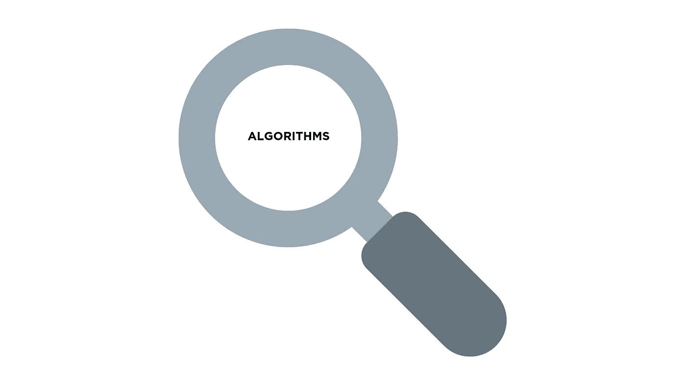
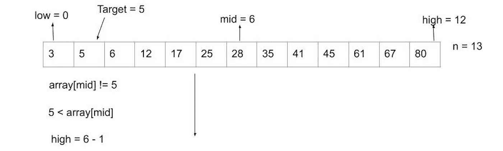
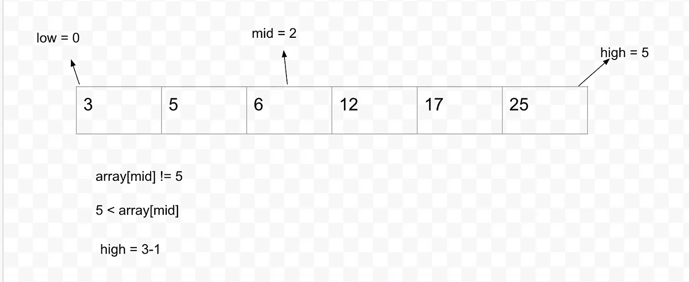
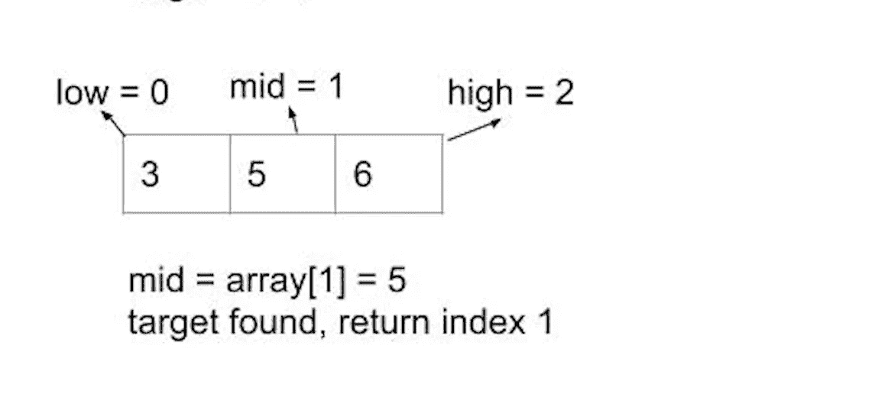
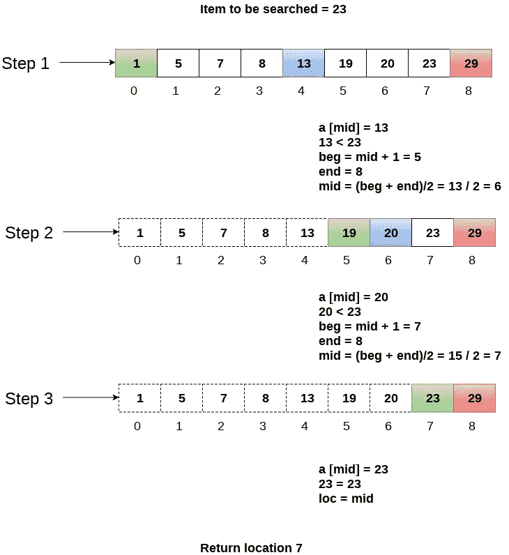

# Javascript 中的二分搜索法算法

> 原文：<https://levelup.gitconnected.com/binary-search-algorithm-in-javascript-5227bba08e62>



我们经常需要在数百、数千、数百万甚至更多的数据中找到一个特定的数据项。例如，我们可能希望在手机中找到某人的电话号码或某个国家的特定地址。这就是搜索算法派上用场的原因。

如果没有搜索算法，您将需要查看每个单独的数据，以便找到您正在寻找的数据。当数据变大时，为了找到目标而查看每个数据是低效的。

有趣的事实:

“如果世界上所有的名字都按顺序写在一起，而你想搜索一个特定名字的位置，二分搜索法最多可以重复 35 次。”(Hackerearth.com)

搜索算法有很多种，如线性搜索、指数搜索等。今天，我们将探索在处理大量数据时更有效的搜索算法，即二分搜索法。

二分搜索法常用于数组，但是为了使用二分搜索法，必须对数组进行排序。它的工作原理是将包含数据集中值的数组的中值与我们要搜索的目标进行比较。

定义专注于一个目标的功能也是一个很好的实践。为排序定义一个函数，然后调用二分搜索法函数进行搜索会更有意义。

在深入研究代码之前，让我们先来看看二分搜索法的步骤。

1.找到数组的起点和终点，通常称为低点和高点。低将是索引 0，高将是数组的大小减 1。在计算机科学中，我们从 0 开始计算索引，从 1 开始计算元素，所以数组的最后一个索引通常是 n 减 1，n 是数组的大小。

2.求数组的中间值。这可以通过做(低+高)/ 2 来实现。

3.将搜索目标与中值进行比较，如果它们匹配，我们就找到了目标，并返回索引。这也被认为是最好的情况。

4.如果目标小于中值，这意味着任何大于中值的东西也将大于目标，所以我们可以忽略这些。我们通过降低上限指数来做到这一点，将其更新为中位数减 1，因为中位数也进行了比较，可以忽略不计。

5.类似地，如果目标大于中值，我们将增加下限，将其更新为中值+ 1。

6.重复上述步骤，直到找到目标，或者所有数字都已检查完毕。

现在让我们看看下面的例子:

我们正在尝试搜索 5，如果找到它，就获取它的索引位置:

第一次迭代:

数组的大小= 13

低= 0

高= 13–1 = 12

mid = (0 + 13) / 2 = 6

目标= 5



中位数与我们的目标不符。中间值大于目标值，因此后半部分以及中间值将被忽略。将上限索引更新为中 1。

现在对于第二次迭代，将更新高值，因为我们忽略了等于或大于中值的数据。

第二次迭代:

高= 6–1 = 5

低= 0

mid = (0+5) /2 = 2



目标小于中值，忽略后半部分，更新高值。

第三次迭代:

低= 0

高= 3–1 = 2

mid = (0 + 2 ) / 2 = 1



array[mid] = 5，这是我们的目标，因此将返回索引 1。

这是另一个例子:



现在让我们深入研究代码:

```
function BinarySearch(array, low, high, target){ //base condition // To exit the recursion, if array is empty or n = 1 if(low > high) {
    return -1;
  } //calculate the midpoint of array let mid=Math.floor( (low+ high)/2) ; if (target == array[mid]) { console.log('Target is found at index: ', mid) return mid; } else if (target < array[mid]) { //if the target is less the number at the midpoint of array
  //Search the 2nd half.    return BinarySearch(array, low, mid-1, target); } else { //if the target is larger number at the midpoint of array
  //Search the 1st half. return BinarySearch(array, mid+1, high, target); }
} // To test:
BinarySearch([1,5,7,8,9,10,15], 0, 6, 5)// Console:'Target is found at index:  1'
```

二分搜索法的运行时间复杂度是 O(logn ),因为每次迭代的数据量减半。

在迭代 1 中，数组长度= n，

迭代 2，n = n/2

迭代 3，n = (n/2)/2

迭代 k 次后，数组长度将变为 n/2^k.

如果您对时间复杂性感兴趣，请查看以下链接:

[https://www . geeks forgeeks . org/complexity-analysis-of-binary-search/](https://www.geeksforgeeks.org/complexity-analysis-of-binary-search/)

你可能也想知道二分搜索法在现实生活中是如何使用的。看看这个视频，这是二分搜索法变得实用的一个很好的例子。

感谢您的阅读！