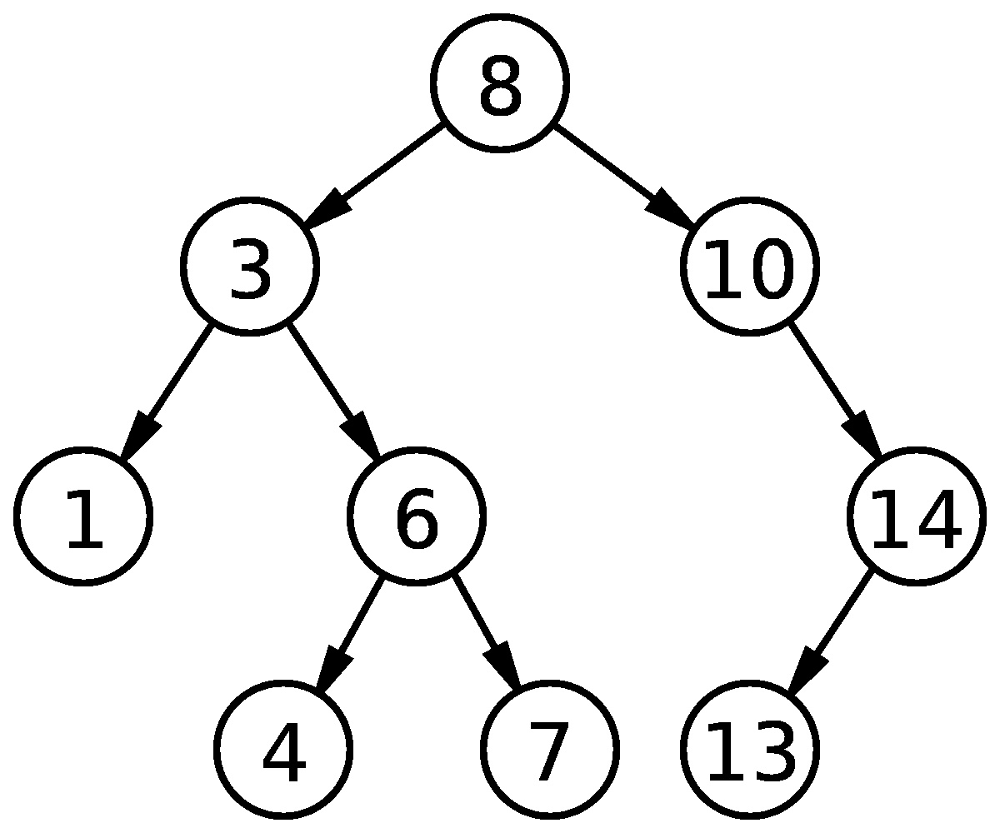
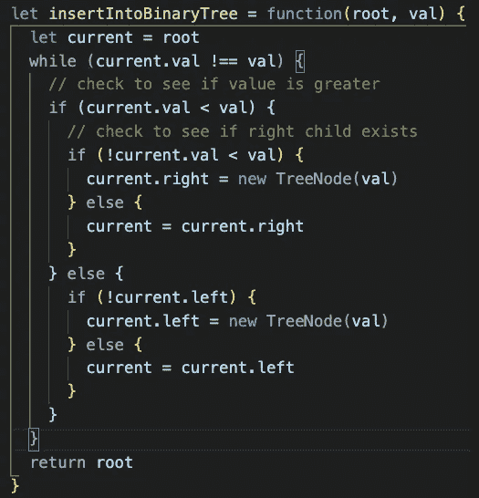
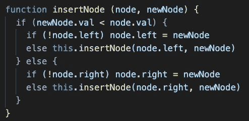

# 二叉查找树:使用 JavaScript 插入值

> 原文：<https://levelup.gitconnected.com/binary-search-tree-inserting-a-value-using-javascript-501f44c6a1e4>

**二叉树**数据结构是一种树形数据结构，其中每个元素最多有 2 个子元素。该数据结构将由三个主要元素组成:

1.  数据
2.  指向左边子节点的指针
3.  指向正确子节点的指针

一个**二叉查找树**是一个基于节点的二叉树数据结构，它具有特定的属性，允许以更有效的方式进行搜索和寻找最大值或最小值等操作。这些属性如下所示:

*   节点的左子树和左子树只包含键小于该节点键的节点
*   一个节点的右子节点以及随后的右子树只包含键大于该节点键的节点
*   子树也必须是二分搜索法树
*   没有重复的节点

通俗地说，从树的顶端(**根**)开始，左子就会小于根，右子就会大于根。因此，一个节点的右边子树将只包含比该节点更少的键，反之亦然。

假设二叉树节点是这样定义的:

给定二叉树和一个值，要插入该值，我们必须从树的根开始。我们获取根的值，并将其保存到一个变量中，以便用给定的值进行检查。

使用一个 *while 循环*，我们将遍历树，检查当前节点的值。如果值大于节点，我们检查节点的右子节点是否存在。如果它不存在，我们创建一个新节点，它是当前节点的右子节点。如果存在一个右子节点，我们将' *current* '值设置为当前节点的值，并继续遍历树。如果值小于节点，同样的过程也是正确的，只是现在我们将检查左边的子节点。

一旦创建了新节点，while 循环*将中断，当前值将与给定值相同。下面是完整的函数:*

涉及递归的不同实现也是可能的:

逻辑是相同的，但是我们不是将当前节点保存到变量中，而是简单地再次调用函数并传递节点和我们想要插入的值。