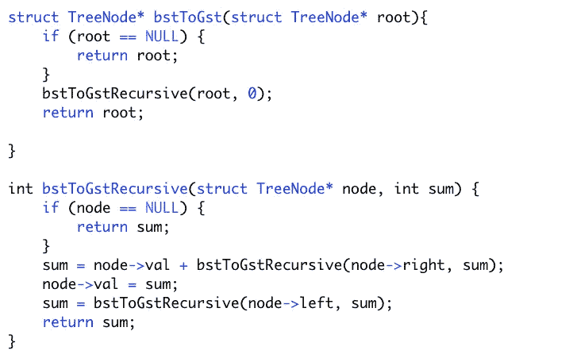
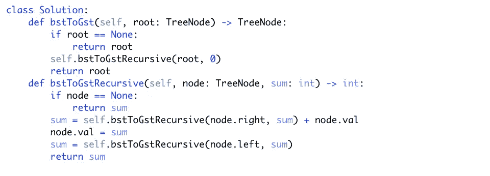

# 二叉查找树向大和树解释道

> 原文：<https://levelup.gitconnected.com/binary-search-tree-to-greater-sum-tree-explained-f82a4f8f90bc>

埃弗里·埃文斯在 [Unsplash](https://unsplash.com?utm_source=medium&utm_medium=referral) 上拍摄的照片

作为一名计算机科学专业的学生，在你学习的某个阶段，你会遇到解决复杂问题的非常基本和健壮的方法。整个行业都在研究和实践通过设计形式化的数据结构和高效的算法来解决计算问题。这甚至是今天引领我们时代的一些最有影响力的软件公司的公式背后的原因。为了理解这些术语以及为什么它们一起如此强大，我们应该理解抽象数据类型的概念。

根据我的算法/数据结构教授 Forney 博士的说法，抽象数据类型“描述了从用户的角度来看，关于如何存储数据以及可以对存储的数据执行什么操作的期望。”抽象数据类型提供了蓝图，而设计的实际实现被称为数据结构。这些实现可以用来创建算法，或者设计用来执行目标的一系列过程。对核心数据结构的设计和应用的深刻理解，以及对程序性解决方案的推理能力，是世界顶级软件公司大多数技术面试问题的基础。

在这篇文章中，我将解释一个问题的解决方案，强调前面提到的事实。这个问题被称为“二叉查找树到大和树”，可以在 LeetCode 平台上找到。给定的问题描述如下:“给定具有不同值的二叉查找树的根，修改它，使得每个节点具有等于大于或等于 node.val 的原始树的值的总和的新值。”在这种情况下，“node”是 struct(数据结构)“TreeNode”的实例，包含字段“val”(整数)、“left”(指向 TreeNode 的指针)和“right”(指向 TreeNode 的指针)。为了解决这个问题，我们需要研究二叉查找树的设计和应用，这是一种可以帮助我们开发算法来解决给定问题的数据结构。

照片由[卢克·理查森](https://unsplash.com/@lukealrich?utm_source=medium&utm_medium=referral)在 [Unsplash](https://unsplash.com?utm_source=medium&utm_medium=referral) 上拍摄

二叉查找树是抽象数据类型“树”的实现“树”提供了包含根节点和分支或边的分层结构的蓝图，将一组链接的子节点与父节点连接起来以形成子树。二叉查找树的不同之处不仅在于它是“树”的实现，还在于它包含独特的约束条件，这些约束条件相对于操作(如搜索)的渐进计算复杂性以及相对于数据结构(如链表)具有优势。来自 LeetCode 问题的约束如下:

1.节点的左子树只包含键(值)小于该节点的键(值)的节点。

2.节点的右边子树只包含键(值)大于该节点的键(值)的节点。

3.左右子树也必须是二分搜索法树。

理解了下面的约束，我们可以实现一个树遍历算法的替代方案，称为“后序遍历”,来导出我们的算法来解决这个问题。在“后序遍历”算法中，执行以下指令:

1.通过将当前节点的左子树作为参数传递给已定义的遍历方法并递归调用该方法来遍历左子树。

2.通过将当前节点的右子树作为参数传递给已定义的遍历方法并递归调用该方法来遍历右子树。

3.访根。

约书亚·阿拉贡在 [Unsplash](https://unsplash.com?utm_source=medium&utm_medium=referral) 上拍摄的照片

知道我们只能通过聚集大于或等于当前节点值的原始树的值来更新当前节点的值，我们可以应用我们已知的二叉查找树约束的知识，即节点的右子树只包含值大于当前节点值的节点。下面是我用 C 编程语言和 Python 编程语言实现的有效算法，成功地解决了这个问题。

C

计算机编程语言

好，让我们来看一下计算机必须执行的每一条指令，以生成我们的新二叉查找树。我将引用我在 Python 中的实现。

照片由[大卫·克洛德](https://unsplash.com/@davidclode?utm_source=medium&utm_medium=referral)在 [Unsplash](https://unsplash.com?utm_source=medium&utm_medium=referral) 上拍摄

**参考“bstToGst”方法的范围**

> **如果 root == None:**
> 
> **返回根目录**

如果给定的根树节点参数“root”的值为“None”，则没有二叉查找树需要计算。因此，我们可以通过立即返回给定值来实现算法执行的恒定时间操作的最佳情况。此外，我们可以通过不调用递归函数来优化内存分配。通过调用我们的递归函数，我们将为方法的返回地址、参数和实参在调用堆栈上分配内存，如果我们知道没有给我们一个二叉查找树，就不需要这样做。

> **self . bsttogstrethulosculate(root，0)**

如果给我们一个至少有一个根节点的树，我们通过调用递归的“bstToGet”方法“bsttogstrethulosculate”并传入我们的根节点作为我们的第一个参数，传入我们的初始 sum 作为我们的第二个参数，开始我们的替代遍历实现。

**指“bsttogstrethulosculate”方法的范围**

> **如果 root == None:**
> 
> **返回总和**

摘自维基百科，“递归定义的函数和集合的性质通常可以通过遵循递归定义的归纳原则来证明。在数学和计算机科学中，递归定义或归纳定义用于根据集合中的其他元素来定义集合中的元素参加数学证明的课程，递归和归纳的数学定义应该是熟悉的，在本文中我不会深入探讨。这里，我们定义了我们的基本情况，以脱离我们的递归操作。一旦我们到达一个叶节点，或者一个不包含子节点的节点，它的左右子树将是“None ”,我们将返回当前的总和。

> **sum = self . bsttogstrerush(node . right，sum) + node.val**

这里，我们定义了两种递归情况中的一种。此指令检查当前节点的所有右子树节点，这些节点可能包含左右子树的子节点，在这两种情况下都会考虑到这些子节点，聚合它们的值，并在更新当前节点的值之前，通过将当前节点的值和聚合结果相加来计算当前总和。

> **node.val = sum**

接下来，我们赋予新的值，该值等于大于或等于当前节点值的原始树的值之和。

> **sum = self . bsttogstrethulosculate(node . left，sum)**

这里，我们定义了第二种递归情况，遍历当前节点的左子树。我们在更新 sum 之后执行这条指令，因为为了满足聚合所有父节点的右子树节点，我们还需要考虑任何包含左子树的子节点。将为该调用呈现正确的总和，因为当前节点的所有右子树子节点都大于当前节点的左子树中的子节点，参考关于二叉查找树约束的已知事实；因此，正确的聚合作为参数传递。

> **返回总和**

这里我们返回，或者说“冒泡”，遍历当前节点的左右子树得到的更新总和。

**返回到“bstToGst”方法的作用域**

> **返根**

这里，如果发生了任何更新，我们将返回更新后的树和备用节点值。

约书亚·厄尔在 [Unsplash](https://unsplash.com?utm_source=medium&utm_medium=referral) 上的照片

希望，这不是太有压力！我计划利用手头的空闲时间，开发并发布某些问题的解决方案。此外，我计划发表关于每天充斥我脑海的一系列想法的文章，例如历史、旅行、软件架构、企业家精神、从书籍/文章中提取的内容，以及任何我目前感兴趣的东西。