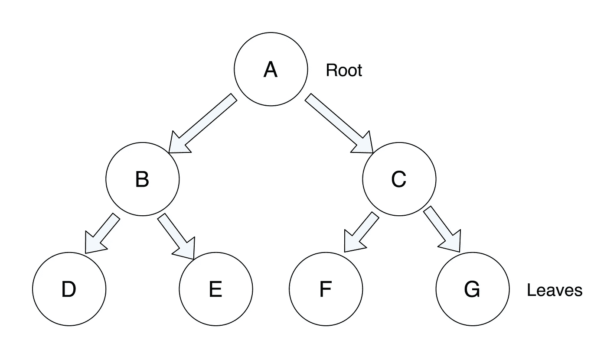
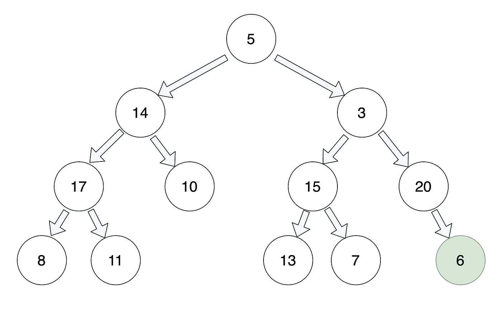
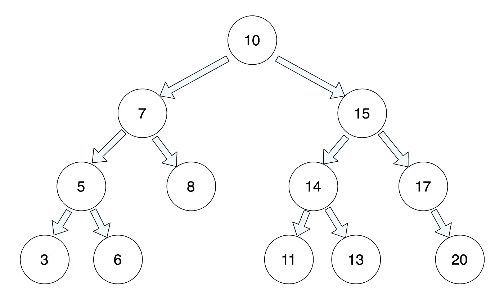
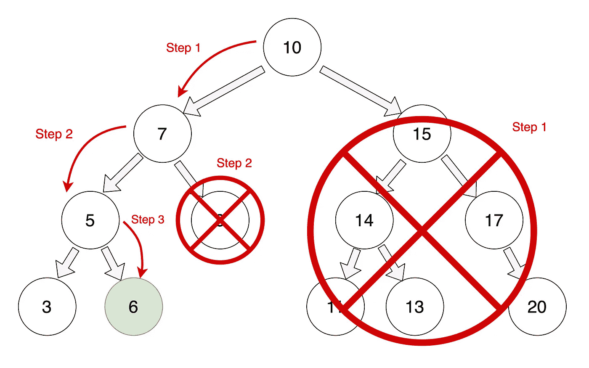
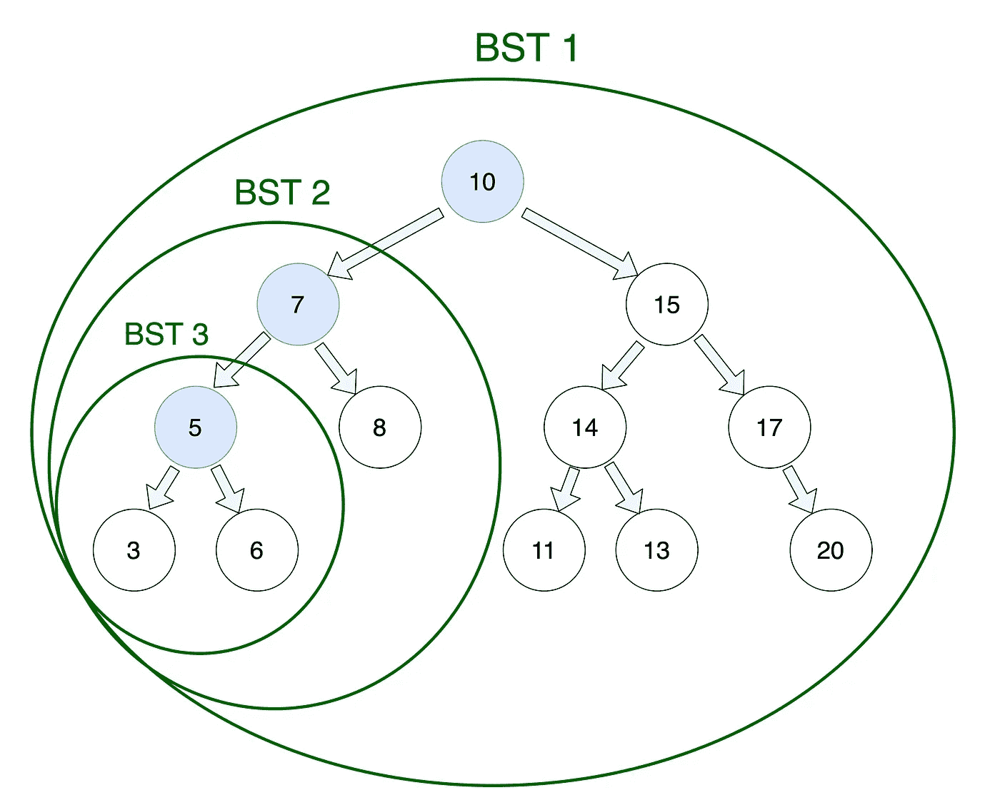

# 二分搜索法树和递归

> 原文：<https://levelup.gitconnected.com/binary-search-trees-and-recursion-f99ce7eb647b>

来源:[[libre shot . com/WP-content/uploads/2018/03/snow-tree-branches . jpg](https://libreshot.com/wp-content/uploads/2018/03/snowy-tree-branches.jpg)]

在这篇文章中，我将解释二分搜索法树的基础知识，并在这个过程中揭开开发工具包中最令人费解但超级有用的概念之一:递归。

二叉查找树是一种特殊的数据结构，由一些简单的规则定义，可以产生一些非常有用和高效的功能。但是在我们开始研究树之前，我们必须了解它们是由什么组成的——节点。

## **节点里有什么？**

节点只是一个小对象，它有一个值——比如一个数字——并指向一个或多个其他节点。

你可以把这想象成一个寻宝游戏——每次你到达一个节点，你可以访问它的值，它也给你一个指向下一个节点位置的线索。这样，您可以沿着链移动，直到到达最后一个节点(它指向一个空值而不是另一个节点)。

这些类型的结构可能非常有效，但也是不稳定的——就像寻宝游戏一样，如果你失去了下一个节点的线索，你就再也找不到它了！

## **二分搜索法树:**

现在我们可以继续讨论树，这只是组织节点的许多方法之一。树有点像公司的组织结构图。顶部是老板(在树的情况下，这是“根”)。老板手下有很多人，每个人下面又有很多人。在最底层，你有没有报酬的实习生(或者在树的情况下，是“树叶”)。

这是一个二叉查找树的例子。来源:[自己]

二叉查找树是一种特殊的树，有两个主要特征。

1.  每个节点最多有两个子节点，一个左子节点和一个右子节点。(这就是为什么它被称为“二进制”。)
2.  左子代(及其所有子代)必须小于或等于父代。(记住“左为少。”)
3.  并且正确的子代(及其所有子代)必须大于父代。

## 有什么选择？

二叉查找树结构使得在树中搜索以及查找、插入或删除特定节点变得非常高效。让我们将它与一棵未排序的树进行比较——想象一下，例如，我们试图在下图的树中找到一个值为 6 的节点。

试图在一棵没有排序的树上找到一个节点就像大海捞针。来源:[自己]

由于树没有任何顺序，我们可能需要在找到它之前逐个搜索每个节点。那样效率会很低！现在让我们看看如何在二叉查找树上进行同样的搜索。

二叉查找树将使查找特定节点变得容易得多。来源:[自己]

我们可以从根源开始寻找。因为我们的目标值(5)小于根值(10)，而且因为我们知道根右边的所有值都大于 10，所以我们可以立即从我们的搜索中消除整个半棵树！接下来，我们可以向下移动一步到根的左子节点(5)并运行相同的检查。这一次，我们的目标大于我们正在检查的节点，所以我们可以消除左边的所有内容。依此类推，直到我们找到目标值，或者到达其中一片叶子，在这一点上，我们可以断定我们的目标值不在树中。

使用这种二叉查找树，最多需要 3 个步骤来找到目标节点。来源:[自己]

这提供了一个非常直观和有效的搜索算法。但是我们如何用代码实现它呢？一种方法是通过一个看似简单的过程，称为递归，这可能感觉有点像脑筋急转弯，但实际上是一个非常重要的计算机科学概念，需要熟悉！

## **那么什么是递归呢？**

简单来说，递归描述了一个调用自身的函数。让我们从一个简单的例子开始。想象一下，你坐在一辆校车的后座上，而你的朋友戴夫一直坐在最前面。

在这里忍耐一下…来源:[【stylemagazine.com/news/2019/aug/09/back-school-bus-safety/】T2

你想知道戴夫放学后是否有空阅读关于搜索树的内容，于是你写了一张纸条，上面写着:

*放学后研究二分搜索法树？
[ ]真[ ]假*

你把它折起来，在正面写上戴夫的名字。然后你把它传给你前面的人，等它带着答案回来。他们看着前面，发现这封信不是写给他们的，所以他们把它递给前面的人，然后等着它回到他们身边。最后，戴夫收到了这张纸条。他看到信是寄给他的，打开信，写下他的答案(正确)，然后把信还给给他的人。他们反过来把它还给给他们的人。依此类推，直到最后它返回给你一个返回值，完成整个过程。

## 这本质上是一个递归过程。

您可以想象一个名为 passNote 的函数，您首先在总线的后端调用它。每个收到纸条的人都会检查是否是给他们的，如果不是，他们就会依次激活*完全相同的*过程。然而，为了使这个函数成功，它必须有一个停止条件。

在这种情况下，如果便条的收件人是收件人，他们不会把便条转发出去，而是回答问题，然后把便条发送回去。另一方面，如果这个人是这一行中的最后一个人，并且没有人可以把它传递给其他人，他们会把它空着寄回去(表明还没有找到 Dave)。在递归函数的语言中，这些被称为“基本情况”，如果没有它们，函数可能会一直运行下去。

## **现在，回到二叉查找树。**

虽然同样可以使用递归或迭代来搜索二叉树，但树的形状使其成为递归的完美候选。原因是，如果你取树的任何一个节点，它实际上作为自己的迷你树的根，它遵循与原始树完全相同的规则。因此，完全相同的函数可以从树的任何节点开始运行，它将搜索该节点下的所有内容。

每个节点都是它自己的迷你二叉树的根！来源:[自己]

那么这在实践中是如何运作的呢？让我们设置一个基本的函数，在二叉树中搜索一个特定的目标值。我们希望将起始节点和目标值传递给函数。

## **基本情况:**

任何递归函数的第一步都是确定基本情况，即函数返回具体结果而不是再次调用自身的情况。在这种情况下，我们有两种基本情况:

1.  节点等于我们的目标值——所以我们返回 true。这相当于我们的校车通知到达名字在前面的人手中——他们不向前传递，而是带着一个值发回。
2.  该节点没有子节点，所以我们返回 false。这就像纸条到了巴士前面却找不到收件人一样。没有人留下来传递纸条，所以他们把纸条空着寄回来，可以断定收件人不在车上。(我们将在最后一步讲述如何在代码中实现这一点。)

**递归案例:**

如果根不等于目标，我们需要继续沿着树向下。由于每个节点都是自己树的根，您可以看到我们的原始根导致了两个独立的树，一个左树和一个右树。如果目标值小于或等于我们的根值，我们知道它一定位于左树，如果它更大，它一定位于右树。

一旦我们确定了要搜索的正确的树，我们只需在那棵树上运行这个完全相同的函数，并返回我们得到的结果！如果根等于我们正在寻找的值，函数将返回 true。如果没有，它将使用*它的*两个子节点继续搜索，并返回*那个*结果。

## **添加点睛之笔:**

现在我们可以处理第二种基本情况，在这种情况下，我们一直到行尾，仍然没有找到目标值。在这种情况下，我们到达了一个节点，它在 node.left 或 node.right 位置具有一个空值，这是我们下一步要搜索的位置。处理这个问题的一个简单方法是让函数返回 false，如果它运行在一个空节点上，当我们的最终节点试图搜索它不存在的子节点时就会触发这个函数。

## 就是这样！

如果你的头已经痛了，不要担心。众所周知，递归是一个难以理解和令人困惑的概念。但希望这能让我们更容易理解二叉树，递归，以及为什么它们是如此好的匹配。