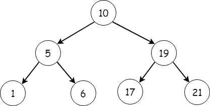

# 围棋中的二分搜索法树

> 原文：<https://levelup.gitconnected.com/binary-search-trees-in-go-58f9126eb36b>

# 介绍

在这篇文章中，我们将关注二分搜索法树如何在 Golang 中实现，以及为什么它们比线性数据结构如数组或链表更受欢迎。

当我们还在思考为什么树比数组和列表更重要的时候，让我们对本文中将要实现的主要功能有一个基本的概述

1.  节点插入。
2.  树遍历。
3.  获取最小值。
4.  去找麦克斯。

# 什么是树？

树是用来表示层次结构的数据结构。它们通常由多个较小的树组成。它们表示用边连接的节点的集合，每个节点保存某种类型的数据。
二叉树是一种最多可以有 2 个子节点的树。

一个二叉查找树

注意:
二叉树可以有任意顺序的节点，但是二叉查找树在排列节点时遵循特定的顺序，如下一节所述。

# 为什么需要它们？

想象一下，在一个数组中寻找一个元素，用一个像数组这样的线性结构来完成这个任务的时间复杂度是 O(n ), n 随着要搜索的元素数量的增加而增加。

假设数据以树形结构表示，求值所需的步骤数将减少一半以上(对数时间复杂度 O(log N))。发生这种情况是因为每当值被插入到二叉查找树中时，节点(数据)的添加以有序的方式发生，其中左边子节点的**值小于父节点的值，而右边节点的值大于父节点的值**。

所以，当我们搜索一个值，如果它小于根，我们可以忽略树的整个右边部分，在树的左边部分递归地重复搜索过程。

## 快速术语

1.  节点—每个节点都包含指向该节点的子节点的左指针和右指针，以及与该节点相关联的一些数据。
2.  叶节点—没有子节点的节点
3.  根节点—二叉树的最顶层节点。
4.  边-将两个节点链接在一起。

# 围棋中的二叉查找树

本文的重点是在 Golang 中实现二叉树结构，以及一些添加额外节点、删除节点等功能。

一个节点(称为 treenode)可以表示为 Go:

这个节点结构存储 int 值，但是也可以修改它来存储其他数据类型。结构中的左右字段指向其他树节点。

## 将节点插入树中

这相当简单，我们不断地比较要插入的节点的值和二叉树中的节点。如果要插入的数据的值小于要比较的节点，如果左子节点为零，我们可以插入新节点作为左节点，否则我们将其与左子树进行比较，并重复该过程。

这些功能中的每一个都被实现为接收器功能。

## 获取最小值

这将从树中获取最小元素。这种方法是递归的。

我们不断检查左边子元素的值，直到它达到零值。

## 获取最大值

这将从树中获取最大元素。这种方法和 min 一样是递归的。

我们不断检查右子代的值，直到它达到零值。

## 二叉查找树中的遍历

对于有效的二叉查找树，inorder 遍历将总是以升序进行。

有序遍历是遍历二叉树的一种方式，首先访问左边的子节点，然后是父节点，最后是右边的子节点。下面的代码显示了遍历的递归方法。

# 结论

二叉树在数据检索方面令人惊叹，因为它们的性能比线性搜索操作好得多。

一个有效的二叉树的左子树的值小于根，右子树的值大于根。

包含许多其他功能的完整代码可在-[https://github.com/puneeth8994/binary-tree-go-impl](https://github.com/puneeth8994/binary-tree-go-impl)获得