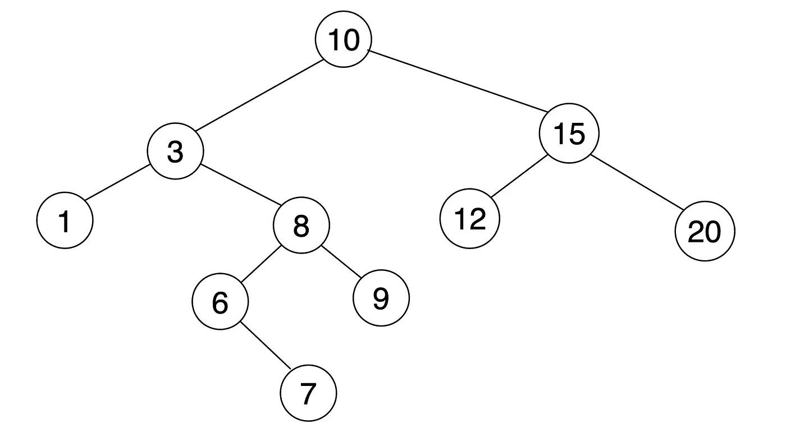
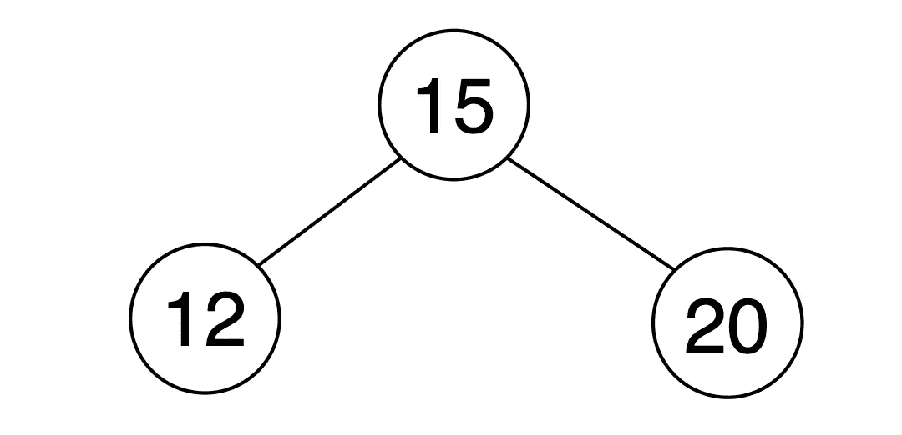

# 二分搜索法树:在平衡中？

> 原文：<https://levelup.gitconnected.com/binary-search-trees-in-the-balance-40073c9e82c>

这篇文章旨在探究一个平衡的 **A** 德尔森- **V** 埃尔斯基- **L** 和(AVL)二叉查找树的好处。在我们开始之前，让我们回顾一下树数据结构的基础。

## 树形数据结构

在最基本的层面上，树代表了数据的层次结构。一个常见的例子是组织结构图。在组织结构图中，节点中的每个职位可能有也可能没有任何数量的下属。我们将使用这个图表来解释关键树数据结构术语。

# 术语

*   **节点:**树内的一个元素。
*   **根:**最顶层的节点。
*   **边:**两个节点之间的链接。
*   **子节点:**连接(有边)到“父”节点的节点。除了“根节点”之外的每个节点都是“子节点”。
*   **父节点:**连接到子节点的节点。除叶节点之外的每个节点。
*   **叶:**没有子节点的节点，或底层节点。
*   **深度:**单个节点到“根”的长度。
*   **高度:**从“叶”到“根”的最长路径的长度
*   **广度:**“叶节点”的数量

# 树的类型

## 通用树

数据树结构的最基本形式。树上的每个节点都可以有无限数量的子节点。这在我们的组织结构图中有所描述。

## 二叉树

二叉树是一种特定的数据结构，其中每个父节点最多只能有两个子节点，一个左节点和一个右节点。

## 二叉查找树

二叉查找树或 BST 是一个二叉树，具有附加的约束，即左边子节点的值小于父节点的值，反之右边子节点的值大于父节点的值。

在上面例子的子树中，我们可以看到父母的值是 15，左边孩子的值是 12 ( < 15 ) and the right child’s value is 20 ( > 15)。

顾名思义，二叉查找树适合于搜索。假设我们想知道值 9 是否存在于 BST 中。

我们从根节点开始搜索。

1.  当 **9 < 10** 时，我们遍历**左**并检查左子。
2.  随着 **9 > 3** ，我们遍历到**右侧**并检查右侧节点。
3.  随着 **9 > 8** ，我们遍历到**右侧**并检查右侧节点。
4.  找到了！！！

在没有二叉查找树的情况下，必须检查每个节点的值，直到找到目标(9)，但是如上所述，只检查了黑色节点的值。这将时间复杂度从 O(n)降低到 O(Logn)。听起来很棒，对吧？

然而，在最坏的情况下，这是不正确的。如果我们添加的节点的值已经排序到我们的树中，例如，[23，25，30，50，80，100]，会发生什么？

在这些插入之后，我们想要检查值 100 是否存在于我们的树中。

和以前一样，使用二分搜索法，我们从根节点开始搜索。

1.  100 > 10 ，我们遍历**右边**检查左边的孩子。
2.  **100 > 15** ，我们遍历到**右侧**检查右侧节点。
3.  1 **00 > 23** ，我们遍历到**右侧**检查右侧节点。
4.  **100 > 25** ，我们遍历到**右侧**检查右侧节点。
5.  **100 > 30** ，我们遍历到**右侧**检查右侧节点。
6.  **100 > 80** ，我们遍历到**右**检查右节点。
7.  找到了…但那需要一段时间，不是吗？

在最坏的情况下，排序的值(升序或降序)被插入到我们的树中，我们的搜索将开始变成线性的，时间复杂度将变成 O(n)，否定了我们的二叉查找树的最初好处。这是因为我们的二叉查找树不平衡。

## 平衡 AVL 树

AVL 树等同于常规的二叉查找树，只是多了一个约束。

*   左右之差必须始终≤ 1。

在我们上面的“最坏情况”例子中，左边的高度是 2，而右边的高度是 6。由于这种高度上的差异，搜索时间复杂度现在大于 O(logn)并向 O(n)移动。在平衡二叉查找树中，搜索节点的时间复杂度将总是为 O(logn)。如果上面的树被重构为 AVL 树，它看起来会像这样:

与非平衡 BST 相反，在 AVL 树中，左子树(3)和右子树(4)的深度之差≤ 1。

如果我们再次搜索树中是否存在值 100。我们继续遍历到正确的孩子，直到我们达到我们的目标，100。这在 AVL 树中只需要 4 个步骤，而在非平衡 BST 中需要 7 个步骤。

这是因为 AVL 树是**自平衡的，**所以为了找到一个值而遍历的层级数永远不会长于任何叶节点的最短深度+ 1。

现在我们已经展示了 AVL 树的好处，问题是如何通过自平衡以保持主约束(左子树高度=右子树高度+- 1)的方式插入新节点。

在排序插入之前，我们将从 AVL 树开始:

我们可以看到左边的子树高度是 3，右边的子树长度是 2。我们的约束满足了。

接下来，我们将使用值 23 和 25 进行前两次插入。

我们每棵树的高度仍然满足我们的约束，因为左边是 3，右边是 4，但是下一次插入 30 会发生什么呢？

我们现在打破了约束，左边和右边的高度差现在是 2。为了保持平衡，我们必须进行第一次旋转。

向左旋转将 23 节点移动到 25 节点的左侧子节点。将右子树深度的高度减少到 4，并重新设置我们的约束。

随着我们下一次插入 50，将发生另一个旋转。

这一次，旋转发生在我们树的更高处，15 节点移动到 25 节点的左侧子节点，因此我们保持了我们的约束。

每当新插入打破高度差约束时，该过程将重复，结果，AVL 树将总是保持平衡，并且搜索时间复杂度将总是为 O(logn)。通过这些旋转，AVL 树自平衡到用于搜索的最佳结构。

这是 AVL 树的主要优点，然而，应该注意的是，节点的插入和移除(包括旋转)所增加的复杂性在某些情况下可能使得 AVL 不是最佳的。

## TLDR

二分搜索法树(BST)是具有以下约束的分层数据结构:

1.  一个父节点最多可以有两个子节点。
2.  左边的子节点总是小于父节点，右边的子节点总是大于父节点。

*   理想情况下，搜索时间复杂度为 O(logn)。
*   在最坏的情况下(插入排序数据)，BST 的搜索时间复杂度是线性的，O(n)。

AVL 树是 BST 的平衡子集，增加了一个约束条件:

1.  树的左侧和右侧之间的高度差必须始终≤ 1。

*   该约束确保 AVL 树的搜索时间复杂度永远不会大于 O(logn)。

参考资料:

*   [RobEdwardsSDS](https://www.youtube.com/channel/UC6Aa5t0vHN8uj_BCbgrRZcQ) U — AVL 1 号简介
*   [GeeksForGeeks](https://www.geeksforgeeks.org/applications-of-tree-data-structure/) —树形数据结构的应用
*   [geeks forgeeks](https://www.geeksforgeeks.org/applications-of-bst/)—BST 的应用
*   [FreeCodeCamp](https://www.freecodecamp.org/news/all-you-need-to-know-about-tree-data-structures-bceacb85490c/)——关于树形数据结构你需要知道的一切