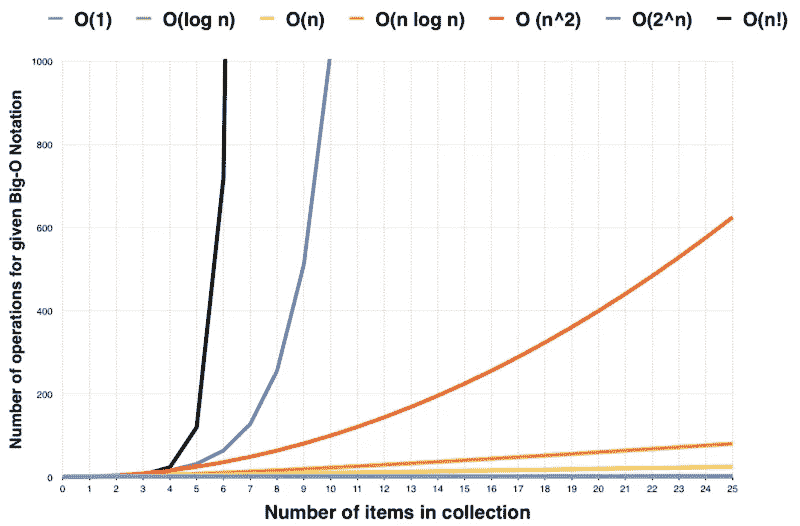
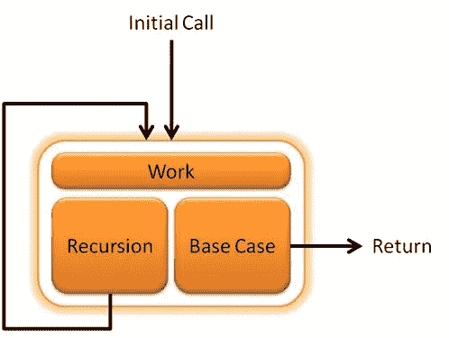
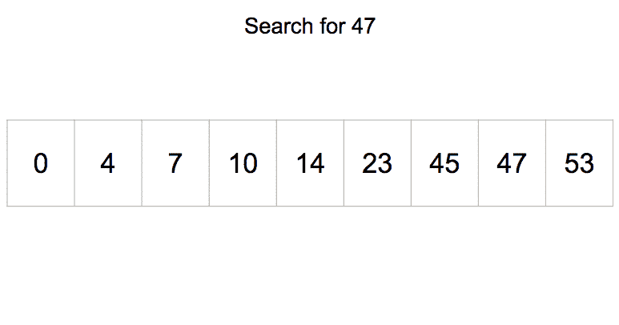

# 二分搜索法与围棋

> 原文：<https://levelup.gitconnected.com/binary-search-with-go-727b1943fd64>

## 算法和数据结构

用 Go 编写高效搜索函数的快速简单指南


简而言之二分搜索法

搜索算法被认为是软件工程师多年来的热门趋势之一。这些算法从计算机时代开始就已经被讨论过了，它们是计算机科学的基础。在这篇文章中，我试图描述一个最有效和最简单的搜索算法，*，*，并展示我们如何在不到 5 分钟的时间内制作自己的版本。

# 算法复杂性

在我开始描述算法之前，有必要熟悉一下*算法复杂度*的概念。变得*快*和*高效*大概是学习算法的主要目的。*算法复杂度*是描述一个算法如何针对不同的输入集执行的度量，如[卡内基梅隆大学](https://www.cs.cmu.edu/~adamchik/15-121/lectures/Algorithmic%20Complexity/complexity.html) : ***算法复杂度关注的是特定算法执行*** *的快慢。*

算法的复杂性可以用不同的符号来表示，但最常用的是*大 O，*，它描述了算法在最差输入下的性能。换句话说，如果一个算法面对最差的可能输入集，它不会花费比*大 O* 步更长的时间来完成。由于性能取决于输入，因此用***O(n)***表示，其中 *n* 是输入大小。

话虽如此，算法按性能分为不同的类别:



[freecodecamp.org](https://www.freecodecamp.org/news/my-first-foray-into-technology-c5b6e83fe8f1/)

# 什么是二分搜索法

*二分搜索法*是最有效的搜索实现之一，它处理一系列**排序的整数。** It 具有 ***O(n log n)*** 的复杂度，这在处理大型数据集时是很牛逼的，然而，它只有在数据事先排序的情况下才起作用。由于算法的性质，它也只对整数列表有效。

## 递归算法

*二分搜索法*是使用*递归*方法实现的，其中搜索函数是自己调用的。编写递归算法并不总是容易的，但它肯定不是一项可怕的任务。你需要记住的唯一一点是关于*基本情况*，它使算法在某一点停止，否则，函数将永远继续。



递归算法

# 代码时间

现在，是时候写下你的二分搜索法了。虽然在这篇文章中我用的是 Go，但是你可以得到这个想法，然后用你喜欢的语言写出来。此外，GitHub 上有大量可用的实现，您可以从中受益。

让我们首先定义一个接受输入数组、目标数以及给定数组的第一个和最后一个索引的函数。它返回一个布尔值，该值指示是否找到了目标数字及其索引。如果没有找到该号码，则返回*假，-1*

```
func search(number int, arr []int, start, end int) (bool, int) {}
```

我们首先编写第一个检查案例，根据给定的索引检查给定的数组是否有效

```
if end < 0 || start < 0 {
  return false, -1
}
```

如果索引是好的，我们继续检查数组本身是否是有效的输入。如果数组只有一个元素，我们只需检查这个元素是否是我们要找的。**这是*基础案例*，它永远阻止函数被调用。**

```
if end — start == 0 {
   if number == arr[end] { 
        return true, end 
   }
   return false, -1
}
```

如果上面的检查都不正确，我们必须开始搜索输入。关键是，因为输入数组已经排序，所以可以通过一种简单而巧妙的方法找到目标数字。

在这种方法中，我们首先从找到输入的中间开始，并将其命名为 *pivot* 。其次，我们检查目标数字是等于、大于还是小于中枢。pivot 将输入数组分成 2 个子数组，左边的数组包含所有小于 pivot 的输入，右边的数组是所有大于 pivot 的输入的子数组。

现在，我们必须简单地做以下检查。

*   如果目标数**等于**枢轴；只需返回*真*
*   如果目标数比支点大**或**;则开始在右子阵列中搜索
*   如果目标数比枢轴数小**;则开始在左侧子阵列中搜索**

```
pivot := (end + start) / 2
if number == arr[pivot] {
   return true, pivot
} else if number > arr[middle] {
   return search(number, arr, pivot+1, end)
}
return search(number, arr, start, pivot)
```

## 一个例子

现在让我们看看下面的例子中的[，我们被要求在给定的数组中找到 47。](https://brilliant.org/wiki/binary-search/)



它是如何工作的

## 最终代码

最终代码如下所示

```
func search(number int, arr []int, start, end int) (bool, int) {
   if end < 0 || start < 0 {
     return false, -1
   } if end — start == 0 {
      if number == arr[end] { 
           return true, end 
      }
      return false, -1
   } pivot := (end + start) / 2
   if number == arr[pivot] {
      return true, pivot
   } else if number > arr[pivot] {
      return search(number, arr, pivot+1, end)
   }
   return search(number, arr, start, pivot)
}
```