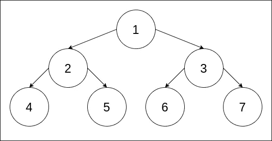

# Java 中二叉树的实现

> 原文：<https://levelup.gitconnected.com/binary-tree-implementation-in-java-7d7b0b0f090b>

> 最初发表于 2020 年 1 月 27 日我的[个人博客](https://blog.contactsunny.com/tech/binary-tree-implementation-in-java)。


更多在 [**《数据结构系列》**](https://blog.contactsunny.com/tag/data-structure-implementation-in-java) 。

在学习了如何用 Java 实现一个[栈](https://blog.contactsunny.com/tech/stack-implementation-in-java-using-linked-lists)，各种类型的[链表](https://blog.contactsunny.com/tag/linked-list-in-java)，甚至一个[哈希映射](https://blog.contactsunny.com/tech/hashmap-implementation-in-java)之后，今天我们就来看看如何用 Java 构建自己的二叉树。类似于我们讨论过的其他数据结构，这里也有一个节点。它非常类似于[双向链表](https://blog.contactsunny.com/tech/double-linked-list-implementation-in-java) (DLL)中的节点，但是在 DLL 中没有前一个和下一个指针，我们在二叉树中有一个左指针和一个右指针。这是因为二叉树最多有两个子节点，一个在节点的左边，另一个在节点的右边。同样，与我写过的其他数据结构文章类似，我不打算解释什么是二叉树以及它是如何工作的。我们将直接进入实施阶段。所以让我们开始吧。

# 二叉树

在开始编写代码之前，我们需要有一个参考树，以理解代码并验证代码的输出。如果我们有一个例子，理解树的功能也容易得多。所以，这就是我们要做的。我做了一项痛苦的工作，为这篇文章设计了一个图解，如下所示:



到目前为止，这是我能为这个示例代码想到的最简单的二叉树。我们的根节点是 1，它的左子节点是 2，右子节点是 3。然后，这两个节点都有几个子节点。在这篇文章中，我们将看看如何在代码中构建这棵树，然后进行三个流行的遍历:

1.  前序遍历
2.  按顺序遍历
3.  后置顺序遍历

# 前序遍历

在前序遍历中，我们在访问其子节点之前先“访问”节点。所以顺序应该是这样的:

*节点- >左子节点- >右子节点*

在我们的例子中，前序遍历的结果如下:

```
1 2 4 5 3 6 7
```

# 按顺序遍历

顾名思义，顺序遍历就是我们保持自然的遍历顺序，从左到右。所以顺序是这样的:

*左子- >节点- >右子*

在我们的例子中，有序遍历的结果是这样的:

```
4 2 5 1 6 3 7
```

# 后置顺序遍历

在后序遍历中，节点在子节点之后。因此，我们首先访问左边的子节点，然后是右边的子节点，如下所示:

*左子- >右子* - > *节点*

在我们的例子中，后序遍历的结果是这样的:

```
4 5 2 6 7 3 1
```

在我们的代码中，我们将尝试实现这三种类型的遍历。

# 代码

像往常一样，我们先看*节点*类。

```
public class Node<T> {

    private T data;
    private Node<T> left;
    private Node<T> right;

    public Node() {}

    public Node(T value) { this.data = value; }

    public T getData() {
        return data;
    }

    public void setData(T data) {
        this.data = data;
    }

    public Node<T> getLeft() {
        return left;
    }

    public void setLeft(Node<T> left) {
        this.left = left;
    }

    public Node<T> getRight() {
        return right;
    }

    public void setRight(Node<T> right) {
        this.right = right;
    }
}
```

正如我前面提到的，这里有左右指针，分别指向左边和右边的孩子。我们使用这个节点类作为我们的 *BinaryTree* 类的基础。二叉树类的定义如下:

```
public class BinaryTree<T> {

    private Node<T> rootNode;

    public Node<T> getRootNode() {
        return rootNode;
    }

    public void setRootNode(Node<T> rootNode) {
        this.rootNode = rootNode;
    }

}
```

我们现在添加遍历方法。确保您记住了每个遍历是如何工作的。对于这些遍历方法，我们将使用递归，也就是说，我们将从方法本身内部调用一个方法。我们这样做是因为我们必须按照树的表示顺序遍历树的底部。首先，让我们来看看前序遍历。

# 前序遍历

```
public static void traversePreOrder(Node node) {

    System.out.print(node.getData() + " ");

    if (node.getLeft() != null) {
        traversePreOrder(node.getLeft());
    }

    if (node.getRight() != null) {
        traversePreOrder(node.getRight());
    }
}
```

如你所见，我们首先打印节点的值，然后到左边的节点，最后到右边。这样，当前节点排在第一位，因此在前置顺序遍历中是*前置*。在这个函数调用的第一次迭代中，我们将把根节点作为参数传递。所以根节点首先被“访问”,然后根节点的所有左子节点按前序被访问。该函数的输出如下:

```
1 2 4 5 3 6 7
```

# 按顺序遍历

按照顺序遍历，正如我已经解释过的，将按照自然的从左到右的顺序。以下是这方面的代码:

```
public static void traverseInOrder(Node node) {

    if (node.getLeft() != null) {
        traverseInOrder(node.getLeft());
    }

    System.out.print(node.getData() + " ");

    if (node.getRight() != null) {
        traverseInOrder(node.getRight());
    }
}
```

从代码片段中可以看出，首先访问左边的子节点，然后是右边的子节点。其输出如下所示:

```
4 2 5 1 6 3 7
```

# 后置顺序遍历

最后，我们有后期订单遍历。在这种情况下，首先访问左边的子节点，然后是右边的子节点，最后是节点。所以名字*贴*顺序。下面是相应的代码片段:

```
public static void traversePostOrder(Node node) {

    if (node.getLeft() != null) {
        traversePostOrder(node.getLeft());
    }

    if (node.getRight() != null) {
        traversePostOrder(node.getRight());
    }

    System.out.print(node.getData() + " ");
}
```

对于后期订单遍历，我们将获得以下输出:

```
4 5 2 6 7 3 1
```

完整的 BinaryTree 类如下所示:

```
public class BinaryTree<T> {

    private Node<T> rootNode;

    public Node<T> getRootNode() {
        return rootNode;
    }

    public void setRootNode(Node<T> rootNode) {
        this.rootNode = rootNode;
    }

    public static void traverseInOrder(Node node) {

        if (node.getLeft() != null) {
            traverseInOrder(node.getLeft());
        }

        System.out.print(node.getData() + " ");

        if (node.getRight() != null) {
            traverseInOrder(node.getRight());
        }
    }

    public static void traversePreOrder(Node node) {

        System.out.print(node.getData() + " ");

        if (node.getLeft() != null) {
            traversePreOrder(node.getLeft());
        }

        if (node.getRight() != null) {
            traversePreOrder(node.getRight());
        }
    }

    public static void traversePostOrder(Node node) {

        if (node.getLeft() != null) {
            traversePostOrder(node.getLeft());
        }

        if (node.getRight() != null) {
            traversePostOrder(node.getRight());
        }

        System.out.print(node.getData() + " ");
    }
}
```

这是一个相当简单的二叉树例子。随着我们向树中添加更多级别，这变得更加有趣。你可以自己试试。但是我们如何测试我们刚刚写的代码呢？我们将在下一节看到这一点。

# 测试

在我们的主类中，我们将创建一个 Integer 类型的二叉树，并用下面给出的代码片段添加根节点:

```
BinaryTree<Integer> binaryTree = new BinaryTree<>();
Node<Integer> rootNode = new Node<>(1);
binaryTree.setRootNode(rootNode);
```

一旦我们设置了根节点，我们就可以开始向根节点添加子节点，如下所示:

```
binaryTree.getRootNode().setLeft(new Node<>(2)); binaryTree.getRootNode().setRight(new Node<>(3));
```

接下来，我们将开始向这两个节点添加更多节点，如下所示:

```
binaryTree.getRootNode().getLeft().setLeft(new Node<>(4));
binaryTree.getRootNode().getLeft().setRight(new Node<>(5));

binaryTree.getRootNode().getRight().setLeft(new Node<>(6));
binaryTree.getRootNode().getRight().setRight(new Node<>(7));
```

这是创建二叉树的完整代码，我已经在本文开始的插图中展示过了。现在，让我们看看如何遍历这棵树:

```
System.out.println("Pre order traversing:");
BinaryTree.traversePreOrder(binaryTree.getRootNode());
System.out.println();

System.out.println("In order traversing:");
BinaryTree.traverseInOrder(binaryTree.getRootNode());
System.out.println();

System.out.println("Post order traversing:");
BinaryTree.traversePostOrder(binaryTree.getRootNode());
System.out.println();
```

那是非常直接的。这段代码的输出如下:

```
Pre order traversing:
1 2 4 5 3 6 7 
In order traversing:
4 2 5 1 6 3 7 
Post order traversing:
4 5 2 6 7 3 1
```

遍历如我们预期的那样工作。所以我们到此为止。

像往常一样，我已经为这个实现设置了一个完整的 maven 项目。你可以从[我的 Github repo](https://github.com/contactsunny/binarytree_implementation_java_poc) 中查看或获取。