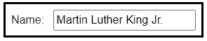
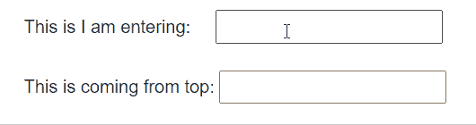
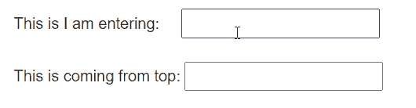
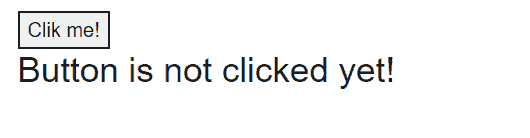
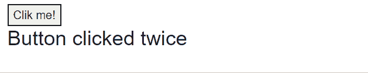
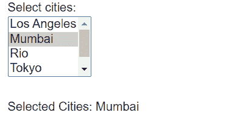
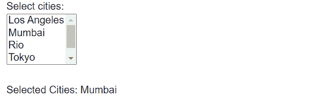
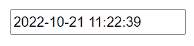

# 绑定 Blazor 中的所有内容

> 原文：<https://levelup.gitconnected.com/binding-everything-in-blazor-27594b32e20b>

这是我们学习 Blazor 之旅的第 11 章，[这里](https://github.com/RikamPalkar/Blazing-Blazor)是我的公开资源库，里面有所有可用的源代码。BlazingBlazor。

[D 锦鲤](https://unsplash.com/@dkoi?utm_source=medium&utm_medium=referral)在 [Unsplash](https://unsplash.com?utm_source=medium&utm_medium=referral) 上的照片

# 1.单向绑定

单向的方向是从源头到目的地。源是 C#属性或变量，目的是 HTML 元素。

怎么用？很直白。在 HTML 中使用 **@** 引用 C#属性或变量即可。

清单 1:单向绑定

图 1:清单 1 的输出

# 2:双向绑定

这意味着流动可以是从源头到目的地和从目的地到源头的双向流动。

**场景:**为了理解这一点，我们将使用 2 个输入标签，我们将在第一个输入框中输入一些内容，这些内容将存储在 c#属性中，然后我们将同一个 C#属性绑定到第二个输入标签。为了测试双向绑定模式，我们将更改第二个输入标签中的文本，这将最终更改第一个输入标签中的文本。

razor 组件中的双向数据绑定是通过 **@bind** 属性完成的。

清单 2:双向绑定

现在观察当我失去焦点时，这两个输入标签如何对数据做出反应。

Gif 1:清单 2 的输出

让我们更上一层楼。当控件离开焦点时，UI 正在更新。如果我想在另一个输入标记中输入内容后立即更新输入标记，该怎么办？

为了实现这一点，我们必须对代码进行细微的修改。用 **@bind** 属性我们需要定义触发事件，可以用 **@bind-value:event** 属性来实现。该委托将触发组件的 **ValueChanged** 事件。在下面的清单中，我做了相应的修改。

清单 3:用事件触发器绑定

Gif 2:清单 3 的输出

给你一个有趣的提示。也可以用！

代替

使用这两个属性没有明显的区别。

既然我们在讨论事件，就让我们从 blazor 中的第三种绑定开始吧

# 3.事件绑定

事件绑定和数据绑定一样简单。我们只需要传递方法，而不是属性或变量。

让我创建一个带有按钮和状态的简单页面。我将暴露 2 个事件，**按钮点击**和**双击**，基于这个事件我正在改变状态消息。

清单 4:事件绑定

Gif 3:清单 4 的输出

# 带参数的事件绑定

让我们在 **ButtonClicked** 事件中传递一个布尔参数，在 **ButtonDoubleClicked** 事件中传递一个字符串参数。

注意:在用 ondblclick 事件传递字符串时，我使用了单引号，因为 HTML 在解析字符串文字时会遇到问题。

下面是事件处理方法，两者都接受各自的参数。

让我们来看看实际情况

Gif 4:带有参数的事件输出

# 4.绑定多个选项

假设我们有一个多选选项，比如 HTML 中的 **<选择>** 标签。我们可以绑定保存选择的数据，也可以绑定触发**选择事件**的事件。

# 4.1 数据绑定

在下面的代码片段中，我循环了一个城市列表，并打印了在 **< select >** 下的每个城市，正如你在第 4 行注意到的，我有一个名为 **SelectedCities** 的字符串数组，它们是绑定的。

清单 5:多重数据绑定

在下面的 gif 中，你会注意到我是如何存储来自 **< select >** 标签的多重选择的

Gif 5:清单 5 的输出

# 4.2 事件绑定

您可以直接使用 **@onchange** 事件来代替 **@bind** ，该事件将提供 **ChangeEventArgs** ，其中包含一个选定的城市数组。

清单 6:带有事件绑定的多个数据

清单 6 的输出

# 奖金:@bind:format

图 2 :@ bind:format 的输出

# 结论

这就是你如何在 Blazor 中实现绑定，有数百个选项来绑定各种事件，不同类型的数据结构。几乎所有东西都遵循这些基本概念单向绑定、双向绑定、多选项绑定和事件绑定。我希望这篇文章是有帮助的。

在 LinkedIn 上联系我！